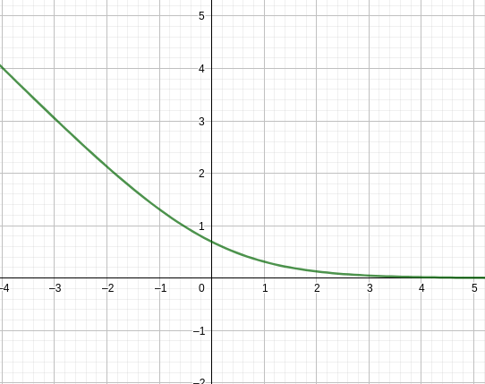

    

        <b style="float: left;">Optimization Methods</b>
        <b style="float: right;">Fall 2021</b>
    

    <h1 style="text-align: center;">Homework 2</h1>
    

        <i>Instructor:</i> Lijun Zhang
        <i>Name:</i> 方盛俊, <i>StudentId:</i> 201300035
    

## Notice

- The submission email is: **zhangzhenyao@lamda.nju.edu.cn**.
- Please use the provided Latex file as a template.
- If you are not familiar with LaTeX, you can also use Word to generate a **PDF** file.

## Problem 1: Convex functions

**(a)**

令 $g(x)=-\log x$, 求导可得 $\displaystyle g'(x)=-\frac{1}{x}, g''(x)=\frac{1}{x^{2}}>0$

所以 $g(x)=-\log x$ 是严格凸的.

而 $f_{i}(x)=-\log x_{i}=-\log A_{i}^{T}x=g(A_{i}^{T}x)$, 其中 $A_{i}$ 第 $i$ 分量为 $1$, 其他分量为 $0$, 可以看出 $f_{i}(x)$ 是凸函数的仿射映射函数, 也是严格凸函数.

因此 $\displaystyle f(x)=\sum_{i=1}^{n}f_{i}(x)$ 为严格凸函数的和, 结果也是严格凸的.

**(b)**

**$\Rightarrow$:**

因为 $f$ 是一个二阶可微的凸函数, 因此 $\forall x, y$ 有

$\displaystyle f(y) \geqslant f(x)+\nabla f(x)^{T}(y-x)$

$\displaystyle f(x) \geqslant f(y)+\nabla f(y)^{T}(x-y)$

两式相加可得

$\displaystyle \nabla f(x)^{T}(x-y)\geqslant \nabla f(y)^{T}(x-y)$

最后有 $\displaystyle (\nabla f(x)-\nabla f(y))^{T}(x-y)\geqslant 0$ 成立

**$\Leftarrow$:**

因为我们有 $\displaystyle (\nabla f(x)-\nabla f(y))^{T}(x-y)\geqslant 0$

令 $g(t)=f(tx+(1-t)y)$, 则 $g'(t)=\nabla f(tx+(1-t)y)^{T}(x-y)$

即证 $g'(t)\geqslant g'(0)$, 即 $[\nabla f(tx+(1-t)y)^{T}-\nabla f(y)](x-y)\geqslant 0$

经过观察, 计算 $tx+(1-t)y-y=tx-ty=t(x-y)$, 那么我们只需将 $tx+(1-t)y$ 带入 $x$ 的位置, 根据 $\displaystyle (\nabla f(x)-\nabla f(y))^{T}(x-y)\geqslant 0$ 有

$\displaystyle (\nabla f(tx+(1-t)y)-\nabla f(y))^{T}t(x-y)\geqslant 0$ 成立, 因为 $t\geqslant 0$, 可知 $g'(t)\geqslant g'(0)$

最后有 $\displaystyle f(x)=g(1)=g(0)+\int_{0}^{1}g'(t)\mathrm{d}t\geqslant g(0)+g'(0)=g(y)+\nabla f(y)(x-y)$

**(c)**

$
\begin{aligned}
&\quad\ g(\theta x_1+(1-\theta)x_2, \theta t_1+(1-\theta)t_2) \\
&= (\theta t_1+(1-\theta)t_2)f(\frac{\theta x_1+(1-\theta)x_2}{\theta t_1+(1-\theta)t_2}) \\
&= (\theta t_1+(1-\theta)t_2)f(\frac{\theta t_1}{\theta t_1+(1-\theta)t_2}\cdot \frac{x_1}{t_1}+\frac{(1-\theta) t_2}{\theta t_1+(1-\theta)t_2}\cdot \frac{x_2}{t_2}) \\
&\leqslant (\theta t_1+(1-\theta)t_2)(\frac{\theta t_1}{\theta t_1+(1-\theta)t_2}\cdot f(\frac{x_1}{t_1})+\frac{(1-\theta) t_2}{\theta t_1+(1-\theta)t_2}\cdot f(\frac{x_2}{t_2})) \\
&=\theta t_1 f(\frac{x_1}{t_1})+(1-\theta) t_2 f(\frac{x_2}{t_2}) \\
&=\theta g(x_1, t_1)+(1-\theta)g(x_2, t_2)
\end{aligned}
$

因此 $g$ 也是凸函数.

## Problem 2: Concave function

先证明不等式 $\displaystyle \left( \sum_{i=1}^{n}(x_{i}+y_{i})^{p} \right)^{\frac{1}{p}}\geqslant \left( \sum_{i=1}^{n}x_{i}^{p} \right)^{\frac{1}{p}}+\left( \sum_{i=1}^{n}y_{i}^{p} \right)^{\frac{1}{p}}$

令 $a_{i}=x_{i}^{p}, b_{i}=y_{i}^{p}$, 则 $x_{i}=a_{i}^{\frac{1}{p}}, y_{i}=b_{i}^{\frac{1}{p}}$, 且 $x_{i}, y_{i}\geqslant 0$

原式两边乘 $p$ 次方可转化为

$\displaystyle \sum_{i=1}^{n}(a_{i}^{\frac{1}{p}}+b_{i}^{\frac{1}{p}})^{p}\geqslant \left(\left( \sum_{i=1}^{n}a_{i} \right)^{\frac{1}{p}}+\left( \sum_{i=1}^{n}b_{i} \right)^{\frac{1}{p}}\right)^{p}$

用 $\displaystyle \frac{1}{p}$ - Norm 范数表示该不等式即为

$\displaystyle \sum_{i=1}^{n}\left\|\begin{pmatrix} a_{i} \\ b_{i} \\\end{pmatrix}\right\|_{\frac{1}{p}}\geqslant \left\|\sum_{i=1}^{n}\begin{pmatrix} a_{i} \\ b_{i} \\\end{pmatrix}\right\|_{\frac{1}{p}}$

由范数的三角不等式 $\|x+y\|_{\frac{1}{p}}\leqslant \|x\|_{\frac{1}{p}}+\|y\|_{\frac{1}{p}}$ 即可知该式成立.

因此我们带入 $\theta x+(1-\theta)y$ 即可知

$\displaystyle \left( \sum_{i=1}^{n}(\theta x_{i}+(1-\theta)y_{i})^{p} \right)^{\frac{1}{p}}\geqslant \left( \sum_{i=1}^{n}(\theta x_{i})^{p} \right)^{\frac{1}{p}}+\left( \sum_{i=1}^{n}((1-\theta)y_{i})^{p} \right)^{\frac{1}{p}}=\theta\left( \sum_{i=1}^{n}x_{i}^{p} \right)^{\frac{1}{p}}+(1-\theta)\left( \sum_{i=1}^{n}y_{i}^{p} \right)^{\frac{1}{p}}$

即 $f(\theta x+(1-\theta)y)\geqslant \theta f(x)+(1-\theta)f(y)$ 成立.

因此 $\displaystyle f(x)=\left( \sum_{i=1}^{n}x_{i}^{p} \right)^{\frac{1}{p}}$ 在 $\mathrm{dom}(f)=\mathbb{R}_{++}$ 时是一个凹函数.

## Problem 3: Convexity

**(a)**

首先对 $x\neq y$ 的情况进行分析.

因为 $\psi$ 是一个严格凸函数, 根据定义有 $\psi(\theta x+(1-\theta)y)<\theta \psi(x)+(1-\theta)\psi(y)$

我们考虑过 $x, y$ 两点的函数 $g(t)=\psi(ty+(1-t)x), t\in [0,1]$

我们求导可得 $g'(t)=\nabla \psi(ty+(1-t)x)^{T}(y-x)$

因为 $\psi$ 是严格凸函数, 因此 $g$ 也是严格凸函数, 我们有 $g(0)>g(1)+g'(1)\cdot (0-1)$

即 $\displaystyle \psi(x)>\psi(y)-\nabla \psi(y)^{T}(y-x)=\psi(y)+\nabla \psi(y)^{T}(x-y)$

即有 $\Delta_{\psi}(x,y)=\psi(x)-\psi(y)-\left<\nabla \psi(y), x-y\right> >0$

对于 $x=y$ 的情况, 带入即可知

$\displaystyle \Delta_{\psi}(x,y)=\psi(x)-\psi(x)-\left<\nabla \psi(y),x-x\right>=0$

综上我们有 $\psi(x,y)\geqslant 0, \forall x,y\in \Omega$ 且当且仅当 $x=y$ 时取到等号.

**(b)**

要证 $\displaystyle L(y)+\Delta_{\psi}(y,x_0)\geqslant L(x^{*})+\Delta_{\psi}(x^{*},x_0)+\Delta_{\psi}(y,x^{*})$

即证 $\displaystyle L(y)+\psi(y)-\psi(x_0)-\nabla \psi(x_0)^{T}(y-x_0)\geqslant L(x^{*})+\psi(x^{*})-\psi(x_0)-\nabla \psi(x_0)^{T}(x^{*}-x_0)+\psi(y)-\psi(x^{*})-\nabla \psi(x^{*})^{T}(y-x^{*})$

即证 $\displaystyle L(y)\geqslant L(x^{*})+[\nabla \psi(x_0)-\nabla \psi(x^{*})]^{T}(y-x^{*})$

由 $L(y)$ 是凸函数可知 $L(y)\geqslant L(x^{*})+\nabla L(x^{*})^{T}(y-x^{*})$

令 $f(x)=L(x)+\Delta_{\psi}(x,x_0)=L(x)+\psi(x)-\psi(x_0)-\nabla \psi(x_0)^{T}(x-x_0)$, 因为其是数个凸函数相加, 结果仍然是凸函数

求梯度得 $\nabla f(x)=\nabla L(x)+\nabla \psi(x)-\nabla \psi(x_0)$, 因为在 $x=x^{*}$ 处取得最小值, 因此有 $\nabla f(x^{*})=\nabla L(x^{*})+\nabla \psi(x^{*})-\nabla \psi(x_0)=0$

因此 $\nabla L(x^{*})=\nabla \psi(x_0)-\nabla \psi(x^{*})$, 带入 $L(y)\geqslant L(x^{*})+\nabla L(x^{*})^{T}(y-x^{*})$

可知 $L(y)\geqslant L(x^{*})+[\nabla \psi(x_0)-\nabla \psi(x^{*})]^{T}(y-x^{*})$ 成立

因此原式成立.

## Problem 4: Projection

**(a)**

使用反证法, 假设 $\displaystyle \|\Pi_{X}(x)-\Pi_{X}(x)\|_{2}^{2}> \left<\Pi_{X}(x)-\Pi_{X}(y), x-y\right>$

即有 $\displaystyle \left<\Pi_{X}(x)-\Pi_{X}(y), \Pi_{X}(x)-\Pi_{X}(y)\right> > \left<\Pi_{X}(x)-\Pi_{X}(y), (x-\Pi_{X}(x))+(\Pi_{X}(x)-\Pi_{X}(y))+(\Pi_{X}(y)-y)\right>$

即有 $\displaystyle \left<\Pi_{X}(x)-\Pi_{X}(y), x-\Pi_{X}(x)\right>+\left<\Pi_{X}(x)-\Pi_{X}(y), \Pi_{X}(y)-y\right><0$

即有 $\displaystyle \left<\Pi_{X}(x)-\Pi_{X}(y), \Pi_{X}(x)-x\right>+\left<\Pi_{X}(y)-\Pi_{X}(x), \Pi_{X}(y)-y\right> >0$

记 $x, y, \Pi_{X}(x), \Pi_{X}(y)$ 为点 $A,B,C,D$, 则上式变为

$\displaystyle |BD|\cdot |CD|\cos\angle BDC+|AC|\cdot |CD|\cos\angle ACD>0$

因此 $\cos\angle BDC$ 和 $\cos\angle ACD$ 至少有一个大于 $0$, 我们不妨设 $\cos\angle BDC>0$

因此 $\angle BDC$ 是锐角, 我们过 $B$ 作 $CD$ 的垂线, 垂点为 $O$,

则由锐角性质, 以及 $\Pi_{X}(y)$ 为 $X$ 上最接近 $y$ 的点这一条件可知, $O$ 位于 $CD$ 上, 所以 $O$ 也在凸集 $X$ 上

那么就有 $\displaystyle \frac{1}{2}\|O-y\|_{2}^{2}<\frac{1}{2}\|D-y\|_{2}^{2}$, 与 $D=\Pi_{X}(y)$, 是 $X$ 上离 $y$ 最近的点矛盾, 假设不成立

因此原命题 $\|\Pi_{X}(x)-\Pi_{X}(x)\|_{2}^{2}\leqslant \left<\Pi_{X}(x)-\Pi_{X}(y), x-y\right>$ 成立.

Correct:

利用凸优化问题的最优性准则可知

$\nabla f_0(\Pi_{X}(y))^{T}(z-\Pi_{X}(y))=(\Pi_{X}(y)-y)^{T}(z-\Pi_{X}(y))\geqslant 0, z\in X$

令 $z=\Pi_{X}(x)$ 有 $(\Pi_{X}(y)-y)^{T}(\Pi_{X}(x)-\Pi_{X}(y))$

同理有 $(\Pi_{X}(x)-x)^{T}(\Pi_{X}(y)-\Pi_{X}(x))$

合并两式即可.

**(b)**

由 (a) 有 $\displaystyle \|\Pi_{X}(x)-\Pi_{X}(y)\|_{2}^{2}\leqslant \left<\Pi_{X}(x)-\Pi_{X}(y), x-y\right>$

而由点乘的几何意义我们可知 $\left<\Pi_{X}(x)-\Pi_{X}(y), x-y\right> =\|\Pi_{X}(x)-\Pi_{X}(y)\|_{2}\cdot \|x-y\|_{2}\cdot \cos\theta$

因此我们有 $\|\Pi_{X}(x)-\Pi_{X}(y)\|_{2}\leqslant \|x-y\|_{2}\cdot \cos\theta\leqslant \|x-y\|_{2}$

## Problem 5: 

**(a)**

$\displaystyle f^{*}(y)=\sup_{x\in \mathrm{dom}f}(yx-\max\{0,1-x\})$

显然, $f^{*}(y)$ 的定义域为 $[-1,0]$, 均为在 $x=1$ 处取得最大值, 即

$\displaystyle f^{*}(y)=y-\max\{0,1-1\}=y$

**(b)**

$f(x)=\ln(1+e^{-x})$ 的图像如图所示

因为 $\displaystyle \lim_{x \to -\infty}\frac{\ln(1+e^{-x})}{-x}=1 , \lim_{x \to +\infty}\ln(1+e^{-x})=0$

所以 $y=-x$ 和 $y=0$ 是 $f(x)=\ln(1+e^{-x})$ 的两条渐近线.

因此 $f^{*}(y)$ 的定义域为 $(-1,0)$, $\displaystyle (yx-\ln(1+e^{-x}))'=y+\frac{e^{-x}}{1+e^{-x}}$

即 $\displaystyle y+(y+1)e^{-x}=0 \Rightarrow x=-\ln\frac{-y}{y+1}$ 时有最大值

$\displaystyle f^{*}(y)=y\cdot (-\ln\frac{-y}{y+1})-\ln(1+\frac{-y}{y+1})=(y+1)\ln(y+1)-y\ln(-y)$

