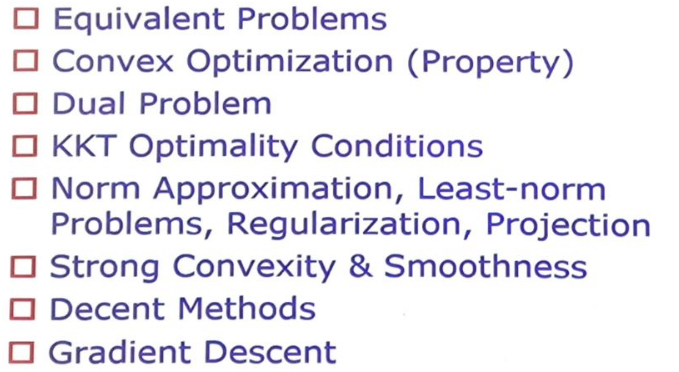

# 凸优化

## 复习重点

## 0. 前置知识

### 0.1 范数

- 非负性: $f(x)\geqslant 0$
- 正定性: 当且仅当 $x=0$ 时有 $f(x)=0$
- 齐次性: $f(tx)=|t|f(x)$
- 三角不等式: $f(x+y)\leqslant f(x)+f(y)$

对偶范数 $\|z\|_{*}=\sup \{z^{T}x|\|x\|\leqslant 1\}$, 因此有不等式 $z^{T}x\leqslant \|x\|\|z\|_{*}$

常见对偶范数存在关系 $\displaystyle \frac{1}{p}+\frac{1}{q}=1$

比如 $l_{2}$ 范数和 $l_{2}$ 范数自身是对偶范数.

还可以对矩阵定义算子范数:

$\|X\|_{a,b}=\sup \{\|Xu\|_{a}|\|u\|_{b}\leqslant 1\}$

当均为 Euclid 范数时, $X$ 的算子范数就是它的最大奇异值, 用 $\|X\|_{2}$ 表示, 称作谱范数

$\|X\|_{2}=\sigma_{\max}(X)=(\lambda_{\max}(X^{T}X))^{\frac{1}{2}}$

其对偶范数为奇异值之和, 称作核范数

$\|Z\|_{2*}=\sigma_1(Z)+\cdots+\sigma_{r}(Z)=tr(Z^{T}Z)^{\frac{1}{2}}$

$\displays