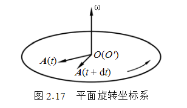
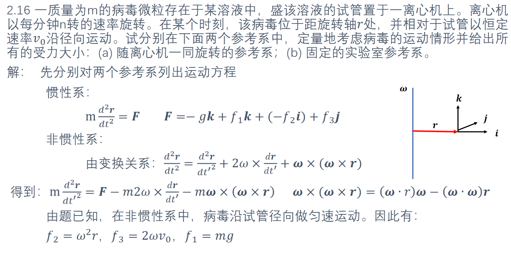
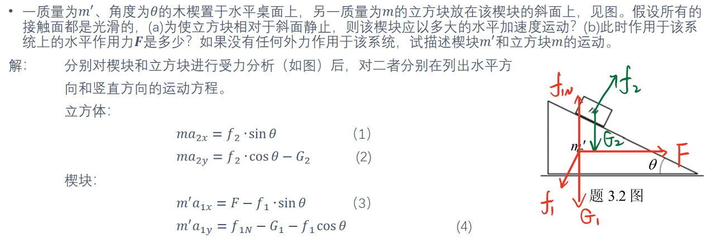
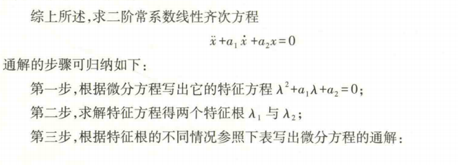

## 向量

$A\cdot B=||A||\cdot ||B||\cos\theta$

$A\times (B\times C) = B(A\cdot C)-C(A\cdot B)$

$(A\times B)\cdot C=(C\times A)\cdot B=(B\times C)\cdot A$

$\displaystyle\frac{{\rm d}}{{\rm d}t}[\boldsymbol{u}(t)\cdot\boldsymbol{v}(t)]=\frac{{\rm d}}{{\rm d}t}\boldsymbol{u}(t)\cdot \boldsymbol{v}(t)+\boldsymbol{u}(t)\cdot \frac{{\rm d}}{{\rm d}t}\boldsymbol{v}(t)$

$\displaystyle\frac{{\rm d}}{{\rm d}t}[\boldsymbol{u}(t)\times\boldsymbol{v}(t)]=\frac{{\rm d}}{{\rm d}t}\boldsymbol{u}(t)\times \boldsymbol{v}(t)+\boldsymbol{u}(t)\times \frac{{\rm d}}{{\rm d}t}\boldsymbol{v}(t)$

## 极坐标

任意矢量 $A=A_{\rho}\boldsymbol{e}_{\rho}+A_{\phi}\boldsymbol{e}_{\phi}$

位置矢量 $\boldsymbol{\rho}=\rho\boldsymbol{e}_{\rho}$, 分量和端点坐标分别为 $(\rho,0), (\rho,\phi)$, 并不一致

假设有 $\rho=\rho(t), \phi=\phi(t)$

对单位向量的定义如下, 分别为径向和横向, 本质是对直角坐标做了一个旋转变换

$\because \boldsymbol{e}_{\rho}=\cos\phi i+\sin\phi j$
$\quad\boldsymbol{e}_{\phi}=-\sin\phi i+\cos\phi j$

$\therefore\displaystyle\frac{{\rm d}\boldsymbol{e}_{\rho}}{{\rm d}t}=(-\sin\phi i+\cos\phi j)\dot{\phi}=\dot{\phi}\boldsymbol{e}_{\phi}$
$\quad\displaystyle\frac{{\rm d}\boldsymbol{e}_{\rho}}{{\rm d}t}=(-\cos\phi i-\sin\phi j)\dot{\phi}=-\dot{\phi}\boldsymbol{e}_{\rho}$

$\therefore\displaystyle\dot{\boldsymbol{\rho}}=\frac{{\rm d}}{{\rm d}t}(\rho\boldsymbol{e}_{\rho})=\dot{\rho}\boldsymbol{e}_{\rho}+\rho\dot{\phi}\boldsymbol{e}_{\phi}\quad$ (常常代表速度)
$\quad\displaystyle\ddot{\boldsymbol{\rho}}=(\ddot{\rho}-\rho\dot{\phi^2})\boldsymbol{e}_{\rho}+(\rho\ddot{\phi}+2\dot{\rho}\dot{\phi})\boldsymbol{e}_{\phi}\quad$ (常常代表加速度)

应用于圆周运动, 得

$\dot{\rho}=\rho\dot{\varphi}\boldsymbol{e}_{\varphi}$
$\ddot{\rho}=-\dot{\varphi}^2\rho\boldsymbol{e}_{\rho}+\rho\ddot{\varphi}\boldsymbol{e}_{\varphi}$

角速度大小 $\omega=\dot{\varphi}$

角速度方向使 $\boldsymbol{e}_{\rho}, \boldsymbol{e}_{\varphi}, \boldsymbol{\omega}$ 三者满足右手螺旋关系, 即沿旋转轴方向

那么就有圆周运动速度 $\dot{\boldsymbol{\rho}}=\boldsymbol{\omega}\times\boldsymbol{\rho}$, 且方向为 $\boldsymbol{e}_{\varphi}$ 方向

极矢量叉乘为轴矢量, 轴矢量叉乘也为轴矢量, 极矢量叉乘轴矢量为极矢量.

## 简谐运动

在弹性力作用下的运动方程为: $m\ddot{x}=-kx$ 即 $\ddot{x}+\omega_0^2x=0$

则 $\displaystyle\dot\theta^2=\omega_0^2=\frac{k}{m}, \dot\theta=\omega_0=\sqrt{\frac{k}{m}}$

若在恒定外力 $F$ 下运动, 则运动方程可以写为 $\displaystyle m\frac{{\rm d}^2}{{\rm d}t^2}(x-\frac{F}{k})=-k(x-\frac{F}{x})$

即平衡位置发生了改变, 振动特性却没有改变, 仍有 $\displaystyle\dot\theta=\omega_0=\sqrt{\frac{k}{m}}$

$
\begin{cases}
\theta=\theta_0\cos\omega t \\
\dot{\theta}=-\omega\theta_0\sin\omega t \\
\end{cases}
$

$x=A\sin\omega t+B\cos\omega t$

$x=A\sin(\omega t+\varphi)$

$x=Ae^{i\omega t}+Be^{-i\omega t}$

$
\begin{aligned}
x(t)
&=x_1(t)+x_2(t)\\
&=A[\cos(\omega_1t+\varphi)+\cos(\omega_2t+\varphi)] \\
&=2A|\cos\frac{\omega_2-\omega_1}{2}t|\cos(\frac{\omega_1+\omega_2}{2}t+\varphi) \\
\end{aligned}
$

假设该音叉和标准音叉分别为 $x_1(t)=A\cos(\omega_1t+\varphi), x_2(t)=A\cos(\omega_2t+\varphi)$

所以两只音叉合并为

$
\begin{aligned}
x(t)
&=x_1(t)+x_2(t)=A[\cos(\omega_1t+\varphi)+\cos(\omega_2t+\varphi)] \\
&=2A|\cos\frac{\omega_2-\omega_1}{2}t|\cos(\frac{\omega_1+\omega_2}{2}t+\varphi) \\
\end{aligned}
$

拍的周期为 $\displaystyle T=\frac{2\pi}{|\omega_1-\omega_2|}$

拍频为 $f=|f_1-f_2|$

## 伯努利方程

伯努利方程为 $\displaystyle p+\frac{1}{2}\rho v^2+\rho gz=C$, 其中 $C$ 为常量.

可以用于求流体力学里的压强. 同时可以解释伯努利现象.

## 旋转坐标系

有相对桌面参考系 $S$ 和匀速圆周运动参考系 $S'$

对于固定在 $S'$ 上的一点:

$\because\displaystyle\frac{{\rm d}}{{\rm d}t}\boldsymbol{A}=\boldsymbol{\omega}\times\boldsymbol{A}$

$\therefore{\rm d}\boldsymbol{A}=(\boldsymbol{\omega}\times\boldsymbol{A}){\rm d}t$

若 $\boldsymbol{A}$ 相对 $S'$ 运动, 增量为 ${\rm d}\boldsymbol{A}'$

那么我们有一般关系式

$\displaystyle(\frac{{\rm d}\boldsymbol{A}}{{\rm d}t})_S=(\frac{{\rm d}\boldsymbol{A}}{{\rm d}t})_{S'}+\boldsymbol{\omega}\times\boldsymbol{A}$

或写作符号, $t$ 旁边的一撇只是用来说明参考系的选取

$\displaystyle\frac{{\rm d}}{{\rm d}t}=\frac{{\rm d}}{{\rm d}t'}+\boldsymbol{\omega}\times$

将位置矢量带入得速度

$\displaystyle\frac{{\rm d}\boldsymbol{r}}{{\rm d}t}=\frac{{\rm d}\boldsymbol{r}}{{\rm d}t'}+\boldsymbol{\omega}\times\boldsymbol{r}$

再带入得加速度

$
\begin{aligned}
\displaystyle\frac{{\rm d}\dot{\boldsymbol{r}}}{{\rm d}t}
&=\frac{{\rm d}\dot{\boldsymbol{r}}}{{\rm d}t'}+\boldsymbol{\omega}\times\dot{\boldsymbol{r}} \\
&=\frac{{\rm d}}{{\rm d}t'}(\frac{{\rm d}\boldsymbol{r}}{{\rm d}t'}+\boldsymbol{\omega}\times\boldsymbol{r})+\boldsymbol{\omega}\times(\frac{{\rm d}\boldsymbol{r}}{{\rm d}t'}+\boldsymbol{\omega}\times\boldsymbol{r}) \\
&=\frac{{\rm d}^2\boldsymbol{r}}{{\rm d}t'^2}+2\boldsymbol{\omega}\times\frac{{\rm d}\boldsymbol{r}}{{\rm d}t}+\boldsymbol{\omega}\times(\boldsymbol{\omega}\times\boldsymbol{r})
\end{aligned}
$

可以看出, 分为三项, 第一项是 $S'$ 中的加速度, 第三项为向心加速度,
而多出来的第二项, 称为科里奥利加速度.

在地球上, 由于重力加速度是相对 $S$ 而言的, 所以有

$\boldsymbol{g}=\boldsymbol{g}_0-2\boldsymbol{\omega}\times\boldsymbol{v}'-\boldsymbol{\omega}\times(\boldsymbol{\omega}\times\boldsymbol{r})$

科里奥利加速度指向运动方向的右手边.

## 旋转坐标系中的各种量

在旋转坐标系中:

* 角速度 $\dot\theta$ 的地位等同于惯性系的速度;
* 角加速度 $\ddot\theta$ 的地位等同于惯性系的加速度; 
* 转动惯量 $\displaystyle I=\int\rho^2{\rm d}m$ 的地位等同于惯性系的质量;
* 力矩 $\boldsymbol{F}\times\boldsymbol{r}$ 的地位等同于惯性系里的力;
* 角动量 $L=r×p=r×mv=mr×v$ 的地位等同于惯性系的动量;
* 转动动能 $\displaystyle E=\frac{1}{2}I\dot\theta^2$.

角动量大小 $L=|r×p|=|r×mv|=m|r×v|=2mS'$.

并且我们有角动量定理: 质点所受的合外力矩等于它的角动量对时间的变化率.

角动量守恒定律指出, 当合外力矩为零时, 角动量守恒, 物体与中心点的连线单位时间扫过的面积不变, 在天体运动中表现为开普勒第二定律.

类似牛顿第二定律: $\displaystyle\boldsymbol{F}\times\boldsymbol{r}=I\ddot\theta=\int\rho{\rm d}m \ddot\theta$

圆环以直径为轴旋转时的转动惯量为

$\displaystyle I=2\int_0^\pi\frac{m}{2\pi R}(R\sin\theta)^2{\rm d}\theta=\frac{1}{2}mR^2$

圆球的转动惯量为:

$\displaystyle I=\int{\rm d}m(r\sin\theta)^2=\int\frac{m}{\frac{4}{3}\pi R^3}[2\pi(r\sin\theta)r{\rm d}r{\rm d}\theta](r\sin\theta)^2=\frac{2}{5}mR^2$

木棍沿着中心的转动惯量为:

$\displaystyle I=\int_{-\frac{l}{2}}^{\frac{l}{2}}\frac{m}{l}{\rm d}xx^2=\frac{1}{12}ml^2$

平行轴定理, 可以实现两个不同的平行轴之间转动惯量的转换, 其中 $I_C$ 为经过质心的转轴的转动惯量, $d$ 为两个轴之间的距离:

$I=I_C+md^2$

使用平行轴定理可知, 木棍沿着端点的轴的转动惯量为:

$\displaystyle I=\frac{1}{12}ml^2+m(\frac{l}{2})^2=\frac{1}{3}ml^2$

## 两体系统

对于只有两质点之间相互作用的系统, 有运动方程:

$m_1\boldsymbol{\ddot{r}}_1=-f(r)\boldsymbol{r}$, $m_2\boldsymbol{\ddot{r}}_2=f(r)\boldsymbol{r}$, 其中 $\boldsymbol{r}=\boldsymbol{r}_1-\boldsymbol{r}_2$

进而有 $m_1\boldsymbol{\ddot{r}}_1+m_2\boldsymbol{\ddot{r}}_2=0$ 和 $\displaystyle \boldsymbol{\ddot{r}}=\boldsymbol{\ddot{r}}_1-\boldsymbol{\ddot{r}}_2=-\left( \frac{1}{m_1}+\frac{1}{m_2} \right)f(r)\boldsymbol{r}$

定义约化质量 $\displaystyle\mu=\frac{m_1m_2}{m_1+m_2}$, 质心 $m_C=m_1+m_2, m_C\boldsymbol{r}_C=m_1\boldsymbol{r}_1+m_2\boldsymbol{r}_2$

则我们可以将运动方程写作 $\boldsymbol{\ddot{r}}_C=0, \mu\boldsymbol{\ddot{r}}=-f(r)\boldsymbol{r}$

解方程组, 就可以很容易地讨论两个质点的运动:

$\displaystyle\boldsymbol{r}_1=\frac{m_2}{m_1+m_2}\boldsymbol{r}+\boldsymbol{r}_C, \boldsymbol{r}_2=\frac{m_1}{m_1+m_2}\boldsymbol{r}+\boldsymbol{r}_C$

## 波动方程

### 柔软绳上的横波

只需要记住:

$\displaystyle \frac{\partial^2u}{\partial x^2}-\frac{1}{v^2}\frac{\partial^2u}{\partial t^2}=0, v=\sqrt{\frac{F_T}{\rho}}$

$u$ 为质点的位移, $x$ 为质点的位置, $t$ 为时间, $v$ 为波传播的速度, $F_T$ 为绳子的张力, $\rho$ 为绳子的密度. 

### 橡皮泥中的纵波

杨氏模量 $\displaystyle Y=\frac{L}{S}\left( \frac{\partial F_T}{\partial L} \right)$, $L, S$ 分别为橡皮泥的长度和横截面积.

运动方程为

$\displaystyle\rho_0{\rm d}xS\frac{\partial^2u}{\partial t^2}=YS\frac{\partial^2u}{\partial x^2}{\rm d}x$

或

$\displaystyle\frac{\partial^2u}{\partial x^2}{\rm d}x-\frac{1}{c^2}\frac{\partial^2u}{\partial t^2}=0$, 其中 $\displaystyle c=\sqrt{\frac{Y}{\rho_0}}$

### 声音波速

$F_T\to -pS$

$\displaystyle Y=\frac{L}{S}\left( \frac{\partial F_T}{\partial L} \right)\to -\frac{L}{S}\frac{\partial (pS)}{\partial L}=-V\left( \frac{\partial p}{\partial V} \right)\equiv B=\frac{1}{\kappa_T}$

其中 $B$ 为体积弹性模量, $\kappa_T$ 为等温压缩率

那么 $\displaystyle p=p_0+\Delta p, \Delta p=-B\frac{\Delta V}{V}$

那么声波波速为 $\displaystyle v=\sqrt{\frac{B}{\rho_0}}$

### 驻波

驻波也可以看作是两频率相等方向相反行波的叠加, 振动最弱点称为波节或节点而振动最强为波腹或反节点.

## 洛伦茨变换

$
\begin{cases}
x'=\gamma(x-ut) \\
y'=y \\
z'=z \\
t'=\gamma(t-\frac{u}{c^2}x) \\
\end{cases}
$

<!-- ## 2.16 

## 3.2

$\therefore$ 楔块以加速度 $a$ 在桌面上匀加速直线运动.

$\quad$ 立方块 m 水平加速度和竖直加速度恒定, 且初速度为零, 说明是沿着一定的角度 $\alpha$ 做匀加速直线运动, 且 $\tan\alpha=\displaystyle|\frac{\ddot{y}}{\ddot{x}}|=\frac{m+m'}{m'}\tan\theta.$ -->

## 常微分方程

$y'+P(x)y=0$ 对应的解是 $\displaystyle y=Ce^{-\int P(x){\rm d}x}$

$y'+P(x)y=Q(x)$ 对应的解是 $\displaystyle y=e^{-\int P(x){\rm d}x}\left( \int Q(x)e^{\int P(x){\rm d}x}{\rm d}x+C \right)$

## 自由落体

物体下落过程中受到空气的阻力 $F_d=−kv$, 其中 $v$ 是物体的速度, $k$ 为与速度无关的常量. 

### 终极速度

对下落稳定时:

$\boldsymbol{F}_d+m\boldsymbol{g}=m\boldsymbol{g}-k\boldsymbol{v}=0$

$\therefore\displaystyle \boldsymbol{v}=\frac{m\boldsymbol{g}}{k}$

### 速度对时间

对下落过程:

$\boldsymbol{F}_d+m\boldsymbol{g}=m\boldsymbol{g}-k\boldsymbol{v}=m\boldsymbol{a}$

取竖直向下为正方向:

$\displaystyle mg-kv=ma=m\frac{{\rm d}v}{{\rm d}t}$

$\therefore\displaystyle \frac{{\rm d}t}{m}=\frac{{\rm d}v}{mg-kv}$

$\therefore\displaystyle \int\frac{{\rm d}t}{m}=\int\frac{{\rm d}v}{mg-kv}$

$\therefore\displaystyle \frac{t}{m}+C=-\frac{1}{k}\int\frac{{\rm d}(mg-kv)}{mg-kv}=-\frac{1}{k}\ln(mg-kv)$

当 $t=0$ 时, $v=0$, 带入可得

$\therefore\displaystyle C=-\frac{1}{k}\ln (mg)$

$\therefore\displaystyle \ln(mg-kv)=\ln(mg)-\frac{k}{m}t$

$\therefore\displaystyle mg-kv=e^{\ln(mg)-\frac{k}{m}t}=\frac{mg}{e^{\frac{k}{m}t}}$

$\therefore\displaystyle v=\frac{mg}k{}-\frac{mg}{ke^{\frac{k}{m}t}}$

### 加速度对时间

$\therefore\displaystyle a=\frac{{\rm d}v}{{\rm d}t}=ge^{-\frac{k}{m}t}$

### 下落距离对时间

$\therefore\displaystyle x=\int v{\rm d}t=\frac{mgt}{k}+\frac{m^2g}{k^2}\int e^{-\frac{k}{m}t}{\rm d}(-\frac{k}{m}t)=\frac{mgt}{k}+\frac{m^2g}{k^2}e^{-\frac{k}{m}t}+C$

当 $t=0$ 时, 带入 $x=0$ 得:

$\therefore\displaystyle x=\frac{m^2g}{k^2}e^0+C=0$

$\therefore\displaystyle C=-\frac{m^2g}{k^2}$

$\therefore\displaystyle x=\frac{mgt}{k}+\frac{m^2g}{k^2}e^{-\frac{k}{m}t}-\frac{m^2g}{k^2}$

<!-- 
## 7.8

**题目:** 证明对于强迫阻尼振动，外力的平均功率等于阻尼力耗散的功
率．

$\because$ 强迫阻尼振动一个周期后的动能和势能依然不变

$\therefore\displaystyle \int F\dot x{\rm d}t-\int F_\gamma\dot x{\rm d}t=\Delta E_k+\Delta E_p=0$ 

$\therefore\displaystyle \overline{P}=\frac{1}{T}\int F\dot x{\rm d}t=\frac{1}{T}\int F_{\gamma}\dot x{\rm d}t$

$\therefore$ 外力的平均功率等于阻尼力耗散的功率.
 -->
