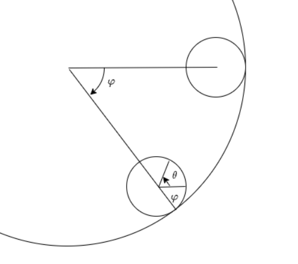
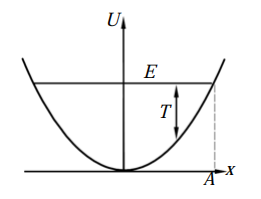

# 大学物理第六次作业

6.6, 7.1, 7.5, 7.8

## 6.6

### (a)

设小球质量为 $m$, 动能为 $E_k$, 转动动能为 $E_1$, 平动动能为 $E_2$, 小球半径为 $r$, 大球半径为 $R$.

由功能关系可知 

$E_k=mg(R-r)$

$E_k=E_1+E_2$

$\displaystyle E_2=\frac{1}{2}m[(R-r)\dot \varphi]^2$

对转动角度分析可知:

$\because r(\theta+\varphi)=R\varphi$

$\therefore\displaystyle\theta=(\frac{R}{r}-1)\varphi, \theta'=(\frac{R}{r}-1)\varphi'$

小球的转动惯量 $\displaystyle I=\frac{2}{5}mr^2$

$\therefore\displaystyle E_1=\frac{1}{2}(\frac{2}{5}mr^2)[(\frac{R}{r}-1)\dot\varphi]^2=\frac{1}{5}m[(R-r)\dot\varphi]^2$

$\therefore\displaystyle \frac{E_1}{E_2}=\frac{2}{5}$

$\therefore\displaystyle E_1=\frac{2}{7}E_k=\frac{2}{7}mg(R-r)$

$\quad\displaystyle E_2=\frac{5}{7}E_k=\frac{5}{7}mg(R-r)$

### (b)

进行最低点进行受力分析:

$N-mg=m(R-r)\dot\varphi^2$

由 (a) 得

$\displaystyle E_1=\frac{1}{5}m[(R-r)\dot\varphi]^2=\frac{2}{7}mg(R-r)$

$\therefore\displaystyle \dot\varphi^2=\frac{10g}{7(R-r)}$

$\therefore\displaystyle N=mg+m(R-r)\dot\varphi^2=\frac{17}{7}mg$

## 7.1

### (a)

对于简谐运动有

$\displaystyle m\ddot x+kx=0, \omega_0^2=\frac{k}{m}$

解常微分方程可得

$x=A\cos(\omega_0t+\varphi), \dot x=-\omega_0A\sin(\omega_0t+\varphi)$

由物理量对时间平均公式 $\displaystyle \overline{P}=\frac{1}{T}\int_0^TP{\rm d}t$ , 势能公式 $\displaystyle\frac{1}{2}kx^2$, 动能公式 $\displaystyle\frac{1}{2}m\dot x^2$ 和 $\displaystyle\frac{1}{T}=\frac{\omega_0}{2\pi}$ 可得

$\displaystyle\overline{E}_{pT}=\frac{1}{T}\int_0^T\frac{1}{2}kx^2{\rm d}t=\frac{1}{4\pi}kA^2\int_0^{2\pi}\cos^2(\omega_0t+\varphi){\rm d}(\omega_0t)=\frac{1}{4}kA^2$

$\displaystyle\overline{E}_{kT}=\frac{1}{T}\int_0^T\frac{1}{2}m\dot x^2{\rm d}t=\frac{1}{4\pi}m\omega_0^2A^2\int_0^{2\pi}\sin^2(\omega_0t+\varphi){\rm d}(\omega_0t)=\frac{1}{4}kA^2$

### (b)

$\displaystyle \overline{E}_{px}=\frac{1}{A}\int_0^A\frac{1}{2}kx^2{\rm d}x=\frac{1}{6}kA^2$

$
\begin{aligned}
\overline{E}_{kx}
&=\frac{1}{A}\int_0^A\frac{1}{2}m\dot x^2{\rm d}x \\
&=\frac{1}{A}\int_0^A\frac{1}{2}m\dot x^3{\rm d}t \\
&=\frac{1}{\omega_0A}\int_0^\frac{\pi}{2}\frac{1}{2}m(-\omega_0A\sin(\omega_0t+\varphi))^3{\rm d}(\omega_0t) \\
&=-\frac{1}{2}m\omega_0^2A^2\int_0^\frac{\pi}{2}\sin^3(\omega_0t+\varphi){\rm d}(\omega_0t) \\
&=\frac{1}{3}kA^2
\end{aligned}
$

### (c)

由该图我们可以看出, 动能所占的面积大于势能, 因而 $\overline{E}_{kx}>\overline{E}_{px}$.

## 7.5

设弹簧伸长量为 $X$, $x$ 为每个质点相对于原来位置的位移.

每个小质点的速度为 $\displaystyle\dot x=\frac{x}{X}\dot X$

弹簧动能为

$\displaystyle E_k=\frac{1}{2}\int_0^X\dot x^2(\frac{m_s}{X}{\rm d}x)=\frac{m_s\dot X^2}{2X^3}\int_0^Xx^2{\rm d}x=\frac{1}{6}m_s\dot X^2$

由能量守恒得

$\displaystyle -mgX-m_sg\frac{X}{2}+\frac{1}{2}kX^2+\frac{1}{2}m\dot X^2+\frac{1}{6}m_s\dot X^2=0$

对时间求导得

$\displaystyle -mg\dot X-\frac{1}{2}m_sg\dot X+kX\dot X+m\dot X\ddot X+\frac{1}{3}m_s\dot X\ddot X=0$

当 $\dot X=0$ 时, 该式意义不大

当 $\dot X\neq 0$ 时,

$\therefore\displaystyle -mg-\frac{1}{2}m_sg+kX+m\ddot X+\frac{1}{3}m_s\ddot X=0$

$\therefore\displaystyle (m+\frac{1}{3}m_s)\ddot X=-kX+mg+\frac{1}{2}m_sg$

相当于是有恒定外力的简谐振动

$\because\displaystyle\omega_0^2=\frac{k}{M}=\frac{k}{m+\frac{1}{3}m_s}, \omega_0=\frac{2\pi}{T}$

$\therefore\displaystyle T=2\pi\sqrt{\frac{m+\frac{1}{3}m_s}{k}}$

## 7.8

**题目:** 证明对于强迫阻尼振动，外力的平均功率等于阻尼力耗散的功
率．

$\because$ 强迫阻尼振动一个周期后的动能和势能依然不变

$\therefore\displaystyle \int F\dot x{\rm d}t-\int F_\gamma\dot x{\rm d}t=\Delta E_k+\Delta E_p=0$ 

$\therefore\displaystyle \overline{P}=\frac{1}{T}\int F\dot x{\rm d}t=\frac{1}{T}\int F_{\gamma}\dot x{\rm d}t$

$\therefore$ 外力的平均功率等于阻尼力耗散的功率.