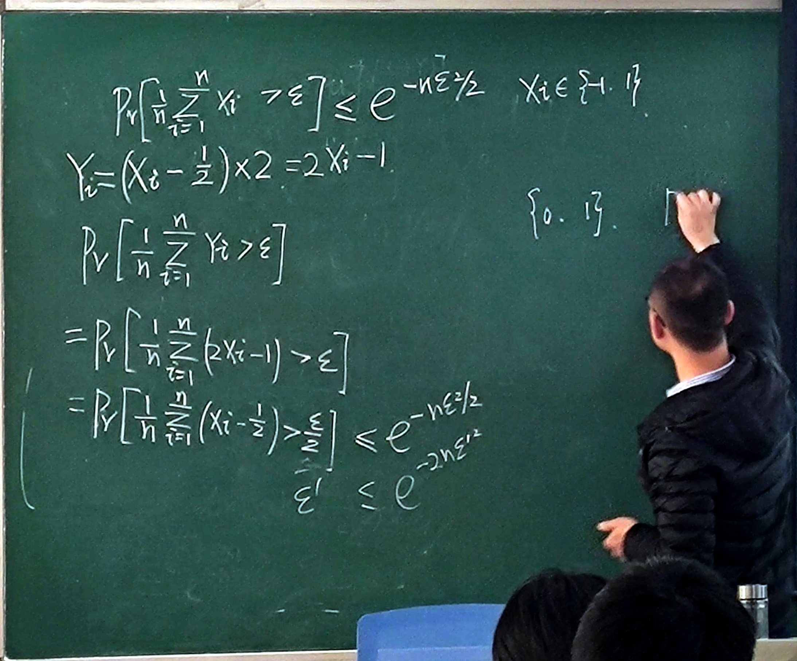
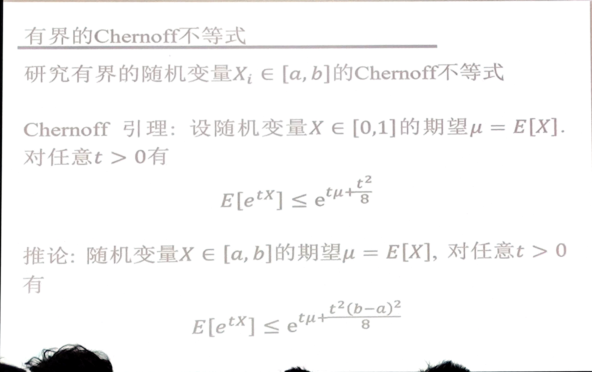
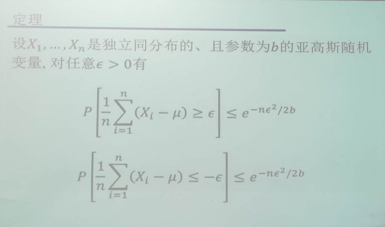

# Chernoff 方法

## Chernoff 方法

根据 Markov 不等式有

$\displaystyle P[X\geqslant \epsilon]=P[e^{tX}\geqslant e^{t\epsilon}]\leqslant e^{-t\epsilon}E[e^{tX}]$

特别地, 有

$\displaystyle P[X\geqslant \epsilon]\leqslant \min_{t>0}\{e^{-t\epsilon}E[e^{tX}]\}$

同理

$\displaystyle P[X-E(X)\leqslant -\epsilon]=P[e^{t(X-E(X))}\geqslant e^{-\epsilon t}]\leqslant e^{\epsilon t}E[e^{t(X-E(X))}]$

## 二值 Chernoff 界

$\displaystyle X_1,X_2,\cdots,X_{n}$ 相互独立且 $X_{i}\sim \mathrm{Ber}(p_{i})$, 令 $\displaystyle \mu=\sum_{i=1}^{n}E[X_{i}]=\sum_{i=1}^{n}p_{i}$, 对任意 $\epsilon>0$ 有

$\displaystyle P[\sum_{i=1}^{n}X_{i}\geqslant (1+\epsilon)\mu]\leqslant \left( \frac{e^{\epsilon}}{(1+\epsilon)^{1+\epsilon}} \right)^{\mu}$

同理有

$\displaystyle P[\sum_{i=1}^{n}X_{i}\leqslant (1-\epsilon)\mu]\leqslant \left( \frac{e^{-\epsilon}}{(1-\epsilon)^{1-\epsilon}} \right)^{\mu}\leqslant e^{\frac{\mu \epsilon^{2}}{2}}$

**证明:**

$\displaystyle E[e^{tX_{i}}]=1-p_{i}+p_{i}e^{t}\leqslant e^{\pi(e^{t}-1)}$

$
\begin{aligned}
&\quad\ P[\sum_{i=1}^{n}X_{i}>(1+\epsilon)\mu] \\
&= P[e^{t\sum_{i=1}^{n}X_{i}}>e^{t(1+\epsilon)\mu}] \\
&\leqslant e^{-t(1+\epsilon)\mu}\prod_{i=1}^{n} E[e^{tX_{i}}] \\
&\leqslant e^{-(1+\epsilon)t\mu}e^{\mu(e^{t}-1)} \\
&= e^{\mu(e^{t}-1)-(1+\epsilon)t\mu}
\end{aligned}
$

$\because \displaystyle f(t)=e^{t}-1-(1+\epsilon)t$

$\therefore \displaystyle f'(t)=e^{t}-(1+\epsilon)$

$\therefore \displaystyle t=\ln(1+\epsilon)>0$

代入 $t$ 即可

## Rademacher 随机变量

若随机变量 $X \in \{+1,-1\}$ 满足 $\displaystyle P(X=+1)=P(X=-1)=\frac{1}{2}$, 则有

$\displaystyle P\left[ \frac{1}{n}\sum_{i=1}^{n}X_{i}\geqslant \epsilon \right]\leqslant e^{-\frac{n\epsilon^{2}}{2}}$

$\displaystyle P\left[ \frac{1}{n}\sum_{i=1}^{n}X_{i}\leqslant -\epsilon \right]\leqslant e^{-\frac{n\epsilon^{2}}{2}}$

证明:

## 有界的 Chernoff 不等式

**证明:**

## Sub-Gaussian 随机变量

亚高斯分布随机变量表示随机变量的尾部分布不会比一个高斯分布更严重.

有界随机分布是亚高斯随机分布.

高斯分布也是.

证明:

令 $Y=X-\mu$

$\displaystyle E[e^{(X-\mu)t}]=\int_{-\infty}^{+\infty}\frac{1}{\sqrt{2\pi} \sigma}e^{yt}e^{-\frac{y^{2}}{2\sigma^{2}}}\mathrm{d}x=e^{\frac{\sigma^{2}t^{2}}{2}}$

### 性质

还有性质, 当参数为 $b$, 且 $E[X_{i}]=0$, 有

$\displaystyle E[\max_{i\in [n]}X_{i}]\leqslant \sqrt{2b\ln n}$

根据 Jonson 不等式

$\displaystyle e^{E[\max_{i\in [n]}tX_{i}]}\leqslant E[e^{\max_{i\in [n]}\{tX_{i}\}}]=E[\max_{i\in [n]}e^{tX}]\leqslant E[\sum_{i=1}^{n}e^{tX_{i}}]\leqslant ne^{\frac{bt^{2}}{2}}$

因此

$\displaystyle tE[\max_{i\in [n]}X_{i}]\leqslant \ln n+\frac{bt^{2}}{2}$

$\displaystyle E[\max_{i\in [n]}X_{i}]\leqslant \frac{\ln n}{t}+\frac{bt}{2}$

最优 $\displaystyle t^{*}=\sqrt{\frac{2\ln n}{b}}$, 代入可得

$\displaystyle E[\max_{i\in [n]}X_{i}]\leqslant \sqrt{2b\ln n}$

