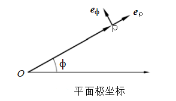

# Vector

## Vector

$A\cdot B=||A||\cdot ||B||\cos\theta$

$A\times (B\times C) = B(A\cdot C)-C(A\cdot B)$

$(A\times B)\cdot C=(C\times A)\cdot B=(B\times C)\cdot A$

$\boldsymbol{F}, \boldsymbol{v}, \boldsymbol{v}=\boldsymbol{\omega}\times\boldsymbol{r}, \boldsymbol{\omega}=\boldsymbol{r}\times\boldsymbol{F}$

$\displaystyle\frac{{\rm d}}{{\rm d}t}[\boldsymbol{u}(t)\cdot\boldsymbol{v}(t)]=\frac{{\rm d}}{{\rm d}t}\boldsymbol{u}(t)\cdot \boldsymbol{v}(t)+\boldsymbol{u}(t)\cdot \frac{{\rm d}}{{\rm d}t}\boldsymbol{v}(t)$

$\displaystyle\frac{{\rm d}}{{\rm d}t}[\boldsymbol{u}(t)\times\boldsymbol{v}(t)]=\frac{{\rm d}}{{\rm d}t}\boldsymbol{u}(t)\times \boldsymbol{v}(t)+\boldsymbol{u}(t)\times \frac{{\rm d}}{{\rm d}t}\boldsymbol{v}(t)$

## Polar

任意矢量 $A=A_{\rho}\boldsymbol{e}_{\rho}+A_{\phi}\boldsymbol{e}_{\phi}$

位置矢量 $\boldsymbol{\rho}=\rho\boldsymbol{e}_{\rho}$, 分量和端点坐标分别为 $(\rho,0), (\rho,\phi)$, 并不一致

假设有 $\rho=\rho(t), \phi=\phi(t)$

对单位向量的定义如下, 分别为径向和横向, 本质是对直角坐标做了一个旋转变换

$\because \boldsymbol{e}_{\rho}=\cos\phi i+\sin\phi j$
$\quad\boldsymbol{e}_{\phi}=-\sin\phi i+\cos\phi j$

$\therefore\displaystyle\frac{{\rm d}\boldsymbol{e}_{\rho}}{{\rm d}t}=(-\sin\phi i+\cos\phi j)\overset{\cdot}{\phi}=\overset{\cdot}{\phi}\boldsymbol{e}_{\phi}$
$\quad\displaystyle\frac{{\rm d}\boldsymbol{e}_{\rho}}{{\rm d}t}=(-\cos\phi i-\sin\phi j)\overset{\cdot}{\phi}=-\overset{\cdot}{\phi}\boldsymbol{e}_{\rho}$

$\therefore\displaystyle\overset{\cdot}{\boldsymbol{\rho}}=\frac{{\rm d}}{{\rm d}t}(\rho\boldsymbol{e}_{\rho})=\overset{\cdot}{\rho}\boldsymbol{e}_{\rho}+\rho\overset{\cdot}{\phi}\boldsymbol{e}_{\phi}\quad$ (常常代表速度)
$\quad\displaystyle\overset{\cdot\cdot}{\boldsymbol{\rho}}=(\overset{\cdot\cdot}{\rho}-\rho\overset{\cdot}{\phi^2})\boldsymbol{e}_{\rho}+(\rho\overset{\cdot\cdot}{\phi}+2\overset{\cdot}{\rho}\overset{\cdot}{\phi})\boldsymbol{e}_{\phi}\quad$ (常常代表加速度)

应用于圆周运动, 得

$\overset{\cdot}{\rho}=\rho\overset{\cdot}{\varphi}\boldsymbol{e}_{\varphi}$
$\overset{\cdot\cdot}{\rho}=-\overset{\cdot}{\varphi^2}\rho\boldsymbol{e}_{\rho}+\rho\overset{\cdot\cdot}{\varphi}\boldsymbol{e}_{\varphi}$

角速度大小 $\omega=\overset{\cdot}{\varphi}$

角速度方向使 $\boldsymbol{e}_{\rho}, \boldsymbol{e}_{\varphi}, \boldsymbol{\omega}$ 三者满足右手螺旋关系, 即沿旋转轴方向

那么就有圆周运动速度 $\overset{\cdot}{\boldsymbol{\rho}}=\boldsymbol{\omega}\times\boldsymbol{\rho}$, 且方向为 $\boldsymbol{e}_{\varphi}$ 方向

