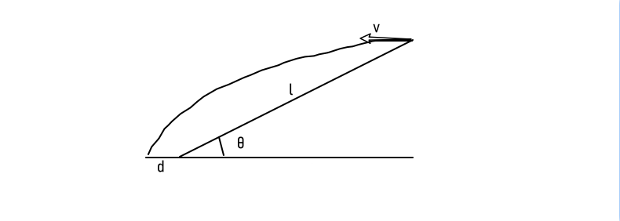
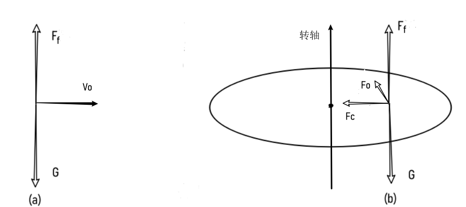

教材习题 2.3，2.5，2.8，2.9，2.14，2.16

# 运动学

## 2.3

取 $g= 10 \ \text{m}/\text{s}^2$

假设钢球在窗最上端速度为 $v_1$, 最下端为 $v_2$, 接触地面速度为 $v_3$

$\therefore$ 由钢球在 $h=1.3$ m 的窗前下落了 $t_0=0.125$ s

$
\therefore \begin{cases}
v_2=v_1+gt_0 \\
\displaystyle h=v_1t_0+\frac{1}{2}gt_0^2 \\
\end{cases}
\Rightarrow
\begin{cases}
\displaystyle v_1=\frac{h-\frac{1}{2}gt_0^2}{t_0}=8\times (\frac{13}{10})=9.775 \ \text{m/s}\\
v_2=v_1+gt_0=11.025 \ \text{m/s}
\end{cases}
$

$\because t_1=2.0$ s 后重返窗最下端

$\therefore\displaystyle v_3=v_2+g\frac{t_1}{2}=21.025 \ \text{m}/\text{s}$

$\therefore\displaystyle H=\frac{v_3^2}{2g}=22.10253125 \ \text{m}$

## 2.5

### (a)

$\therefore h=l\sin\theta$

$\because h=\frac{1}{2}gt^2$

$\therefore\displaystyle t=\sqrt{\frac{2h}{g}}=\sqrt{\frac{2l\sin\theta}{g}}$

$\therefore\displaystyle d=x-l\cos\theta=vt-l\cos\theta=v\sqrt{\frac{2l\sin\theta}{g}}-l\cos\theta$

$\therefore\displaystyle d=v\sqrt{\frac{2l\sin\theta}{g}}-l\cos\theta$

### (b)

令 $\displaystyle d=v\sqrt{\frac{2l\sin\theta}{g}}-l\cos\theta>0$

$\therefore\displaystyle v>l\cos\theta\sqrt{\frac{g}{2l\sin\theta}}$

$\therefore$ 只有当抛射体速度 $v$ 大于 $\displaystyle l\cos\theta\sqrt{\frac{g}{2l\sin\theta}}$ 时才能越过观察者头顶

## 2.8

设已知地球自转周期为 $T_e$, 地球绕太阳公转周期为 $T_s$, 地球赤道半径为 $R_e$, 地球绕太阳公转半径为 $R_s$

要求地球自转加速度与公转加速度之比 $a_e:a_s$

$\because\displaystyle F=ma=m\omega^2R=m(\frac{2\pi}{T})^2R$

$\therefore\displaystyle a=\frac{4\pi^2R}{T^2}$

$\therefore\displaystyle a_e:a_s=\frac{4\pi^2R_e}{T_e^2}\cdot \frac{T_s^2}{4\pi^2R_s}=\frac{R_eT_s^2}{R_sT_e^2}$

## 2.9

假设该音叉和标准音叉分别为 $x_1(t)=A\cos(\omega_1t+\varphi), x_2(t)=A\cos(\omega_2t+\varphi)$

所以两只音叉合并为

$
\begin{aligned}
x(t)
&=x_1(t)+x_2(t)=A[\cos(\omega_1t+\varphi)+\cos(\omega_2t+\varphi)] \\
&=2A|\cos\frac{\omega_2-\omega_1}{2}t|\cos(\frac{\omega_1+\omega_2}{2}t+\varphi) \\
\end{aligned}
$

拍的周期为 $\displaystyle T=\frac{2\pi}{|\omega_1-\omega_2|}$

拍频为 $f=|f_1-f_2|$

$\because$ 当音叉一支粘上一小块蜡时, 音叉的频率会降低, 此时拍频也跟着降低

$\therefore$ 说明 $f_1>f_2$

$\therefore f_1=f_2+f=387$ Hz

## 2.14

设 A 地与 B 地的距离为 $s$

### (a)

$\therefore\displaystyle t_a=\frac{2s}{v'}$

### (b)

$\therefore\displaystyle t_b=\frac{s}{v'+u}+\frac{s}{v'-u}$

对 $v'$ 要求为 $v'>u$

### (c)

$\therefore\displaystyle t_c=\frac{2s}{\sqrt{v'^2-u^2}}$

对 $v'$ 要求为 $v'>u$

## 2.16

### (a)

该病毒从离旋转轴 $r$ 处开始, 沿着径向向外以速度 $v_0$ 匀速直线运动, 加速度为零,
受力如图, 有向上的浮力 $F_f$ 和向下的重力 $G$, 合力为零.

### (b)

设旋转的参考系为 $S$, 实验室参考系为 $S'$

因为离心机每分钟 $n$ 转

$\therefore$ 角速度 $\displaystyle\omega=\frac{\pi n}{30}$

$\quad$ 位置 $\displaystyle\boldsymbol{R}=\boldsymbol{r}+\boldsymbol{v}_0t$

$\displaystyle\therefore \frac{{\rm d}\boldsymbol{R}}{{\rm d}t}=\frac{{\rm d}\boldsymbol{R}}{{\rm d}t'}+\boldsymbol{\omega}\times\boldsymbol{R}=\boldsymbol{v}_0+\boldsymbol{\omega}\times\boldsymbol{r}+t\boldsymbol{\omega}\times\boldsymbol{v}_0$

$
\begin{aligned}
\displaystyle\therefore\frac{{\rm d}^2\boldsymbol{R}}{{\rm d}t^2}
=\ &\frac{{\rm d}^2\boldsymbol{R}}{{\rm d}t'^2}+2\boldsymbol{\omega}\times\frac{{\rm d}\boldsymbol{R}}{{\rm d}t'}+\boldsymbol{\omega}\times(\boldsymbol{\omega}\times\boldsymbol{R}) \\
=\ &2\boldsymbol{\omega}\times\boldsymbol{v}_0+\boldsymbol{\omega}\times(\boldsymbol{\omega}\times\boldsymbol{R}) \\
=\ &2\boldsymbol{\omega}\times\boldsymbol{v}_0-(\boldsymbol{\omega}\cdot \boldsymbol{\omega})\boldsymbol{R} \\
=\ &2\boldsymbol{\omega}\times\boldsymbol{v}_0-\frac{4\pi^2n^2}{3600}(\boldsymbol{r}+\boldsymbol{v}_0t) \\
\end{aligned}
$

如图, 病毒运动情形为以螺旋线的方式向外运动, 其中径向速度大小为 $v_0$

受力分别为浮力 $\boldsymbol{F}_f$, 重力 $\boldsymbol{G}$

向心力 $\displaystyle\boldsymbol{F}_c=-\frac{\pi^2n^2}{900}(\boldsymbol{r}+\boldsymbol{v}_0t)$, 大小为 $\displaystyle F_c=\frac{\pi^2n^2}{900}(r+v_0t),$ 方向指向旋转轴

科里奥利力 $\boldsymbol{F}_o=2\boldsymbol{\omega}\times\boldsymbol{v}_0$, 大小为 $\displaystyle F_o=2\omega v_0=\frac{\pi nv_0}{15}$, 方向垂直于转轴和向心力, 指向速度方向一侧