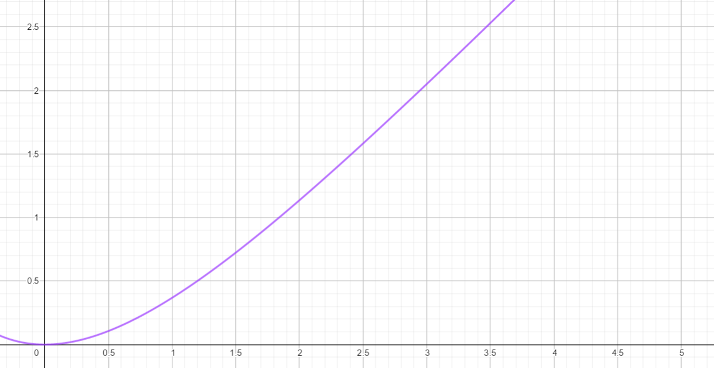

3.1 3.2 3.5 3.10 3.13 3.14

# 第三次习题

## 3.1

如图, 对单独一个质点分析, 由图中几何关系可得:

$\because\displaystyle \frac{-\frac{1}{2}F}{ma_x}=\frac{\sqrt{l^2-x^2}}{x}$

$\therefore\displaystyle a_x=-\frac{F}{2m}\cdot \frac{x}{\sqrt{l^2-x^2}}$

当 $x=l$ 时:

每个质点速度为零, 不存在与 $F$ 同向或反向的加速度, 与 $F$ 垂直的方向上存在较大的加速度.

## 3.2

### (a)

对立方块 $m$:

$mg=F\cos\theta$

$ma=F\sin\theta$

$\therefore a=g\tan\theta$

$\because$ 楔块和立方块相对静止, 即有相同的加速度

$\therefore$ 楔块应该以 $g\tan\theta$ 大小的水平加速度运动

### (b)

对相对静止时的系统:

$\therefore F=(m+m')a=(m+m')g\tan\theta$

若没有外力作用:

$\because mv=m'v'$

## 3.5

设物体的质量为 $m$.

### (a)

对下落稳定时:

$\boldsymbol{F}_d+m\boldsymbol{g}=m\boldsymbol{g}-k\boldsymbol{v}=0$

$\therefore\displaystyle \boldsymbol{v}=\frac{m\boldsymbol{g}}{k}$

### (b)

对下落过程:

$\boldsymbol{F}_d+m\boldsymbol{g}=m\boldsymbol{g}-k\boldsymbol{v}=m\boldsymbol{a}$

取竖直向下为正方向:

$\displaystyle mg-kv=ma=m\frac{{\rm d}v}{{\rm d}t}$

$\therefore\displaystyle \frac{{\rm d}t}{m}=\frac{{\rm d}v}{mg-kv}$

$\therefore\displaystyle \int\frac{{\rm d}t}{m}=\int\frac{{\rm d}v}{mg-kv}$

$\therefore\displaystyle \frac{t}{m}+C=-\frac{1}{k}\int\frac{{\rm d}(mg-kv)}{mg-kv}=-\frac{1}{k}\ln(mg-kv)$

当 $t=0$ 时, $v=0$, 带入可得

$\therefore\displaystyle C=-\frac{1}{k}\ln (mg)$

$\therefore\displaystyle \ln(mg-kv)=\ln(mg)-\frac{k}{m}t$

$\therefore\displaystyle mg-kv=e^{\ln(mg)-\frac{k}{m}t}=\frac{mg}{e^{\frac{k}{m}t}}$

$\therefore\displaystyle v=\frac{mg}k{}-\frac{mg}{ke^{\frac{k}{m}t}}$

如图:

### (c)

$\therefore\displaystyle a=\frac{{\rm d}v}{{\rm d}t}=ge^{-\frac{k}{m}t}$

如图:

### (d)

$\therefore\displaystyle x=\int v{\rm d}t=\frac{mgt}{k}+\frac{m^2g}{k^2}\int e^{-\frac{k}{m}t}{\rm d}(-\frac{k}{m}t)=\frac{mgt}{k}+\frac{m^2g}{k^2}e^{-\frac{k}{m}t}+C$

当 $t=0$ 时, 带入 $x=0$ 得:

$\therefore\displaystyle x=\frac{m^2g}{k^2}e^0+C=0$

$\therefore\displaystyle C=-\frac{m^2g}{k^2}$

$\therefore\displaystyle x=\frac{mgt}{k}+\frac{m^2g}{k^2}e^{-\frac{k}{m}t}-\frac{m^2g}{k^2}$

如图:

## 3.10

假设 $\mu$ 的单位为 $\text{L}/\text{s}$, 易知其与 $\text{kg}/\text{s}$ 有相同的数量关系.

$\therefore \Delta m=\mu\Delta t$

$\quad F\Delta t=\Delta mv-(-\Delta mv)$

$\therefore F \Delta t=2\Delta mv=2\mu v\Delta t$

$\therefore F=2\mu v$

## 3.13

### (a)

对质点恰好达到轨道最高点:

$\because\displaystyle mg=m\frac{v^2}{r}$

$\quad\displaystyle \frac{1}{2}mv_m^2=\frac{1}{2}mv^2+2mgr$

$\therefore v_m=\sqrt{5gr}$

### (b)

对 $P$ 点:

$\because\displaystyle mg\sin\theta=m\frac{v_P^2}{r}$

$\quad\displaystyle \frac{1}{2}mv_0^2=\frac{1}{2}mv_P^2+mg(r+r\sin\theta)$

$\therefore v_P^2=v_0^2-2gr(1+\sin\theta)$

$\therefore\displaystyle \sin\theta=\frac{v_P^2}{gr}=\frac{v_0^2}{gr}-2-2\sin\theta$

$\therefore\displaystyle \sin\theta=\frac{v_0^2}{3gr}-\frac{2}{3}=0.334375$

$\therefore \theta = \arcsin 0.334375$

## 3.14

