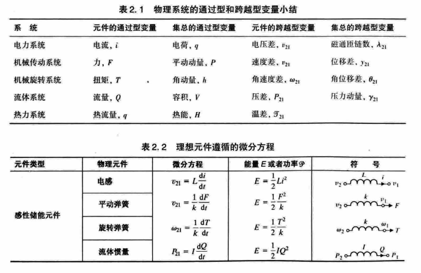

# 系统数学模型

## 常见物理系统

在旋转坐标系中:

* 角速度 $\dot\theta$ 的地位等同于惯性系的速度;
* 角加速度 $\ddot\theta$ 的地位等同于惯性系的加速度; 
* 转动惯量 $\displaystyle I=\int\rho^2{\rm d}m$ 的地位等同于惯性系的质量, 质点转动惯量为 $I = mr^{2}$;
* 力矩 $T = \boldsymbol{F}\times\boldsymbol{r}$ 的地位等同于惯性系里的力;
* 角动量 $L=r×p=r×mv=mr×v$ 的地位等同于惯性系的动量;
* 转动动能 $\displaystyle E=\frac{1}{2}I\dot\theta^2$;
* 类似牛顿第二定律: $\displaystyle T = \boldsymbol{F}\times\boldsymbol{r}=I\ddot\theta=\int\rho^{2}{\rm d}m \ddot\theta$

输入和输出之间可以使用常微分方程来描述.

## 线性常微分方程

线性就是变量间成一次关系, 即满足

- 叠加性: $y(x_1+x_2) = y(x_1) + y(x_2)$
- 齐次性: $y(\beta x) = \beta y(x)$

注意, $y = kx + b$ 不属于线性关系, 它不满足齐次性.

常见的线性关系例子有:

- 等比关系: $y = kx$
- 导数关系: $y = \dot{x}$
- 积分关系: $y = \int x \mathrm{d}t$
- 线性常微分: 见下图公式

在微分方程中就是你要求的未知函数 y(x) 和这个函数的各种阶的导数, 不管有多少阶, 多少个, 都是一次方.

## 线性化近似模型

- 限制范围, 使系统工作在 **线性区**, 忽略非线性;
- 换一个角度考察所谓的 **小信号**. 可以用线性模型来代替非线性模型.

使用泰勒展开可知

$\displaystyle y = f(x) = y_0 + \left.\frac{\mathrm{d}y}{\mathrm{d}x}\right|_{x_0} (x - x_0) + \frac{1}{2}\left. \frac{\mathrm{d}^2y}{\mathrm{d}x^2} \right|_{x_0} (x - x_0)^{2} + \cdots$

当 $(x - x_0)$ 在小范围内波动时, 可以近似为

$\displaystyle (y - y_0) = \left. \frac{\mathrm{d}y}{\mathrm{d}x} \right|_{x_0}(x - x_0) = k(x-x_0)$

因此有 $\Delta y = k \Delta x$, 即线性的小信号模型.

其中一个可以应用小信号模型的就是 **单摆系统**.

作用于单摆质点上的扭矩为

$T = MgL\sin \theta$

由类牛顿第二定律可知

$T = ML^{2} \ddot{\theta}$

因此我们有

$\displaystyle \ddot{\theta} = \frac{g}{L}\sin \theta \thickapprox \frac{g}{L}\theta, -\frac{\pi}{4} \le \theta \le \frac{\pi}{4}$

## 拉普拉斯变换

