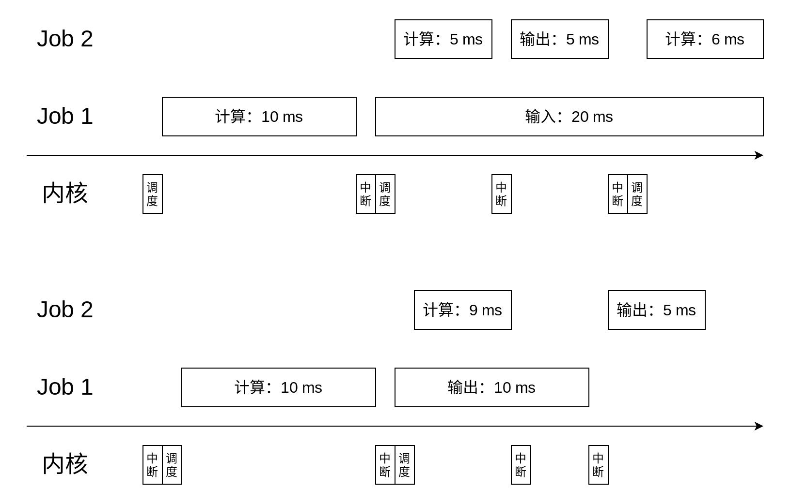
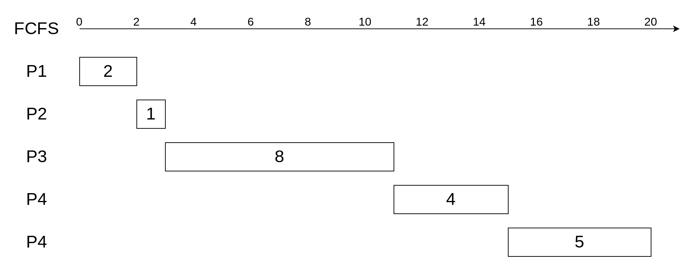
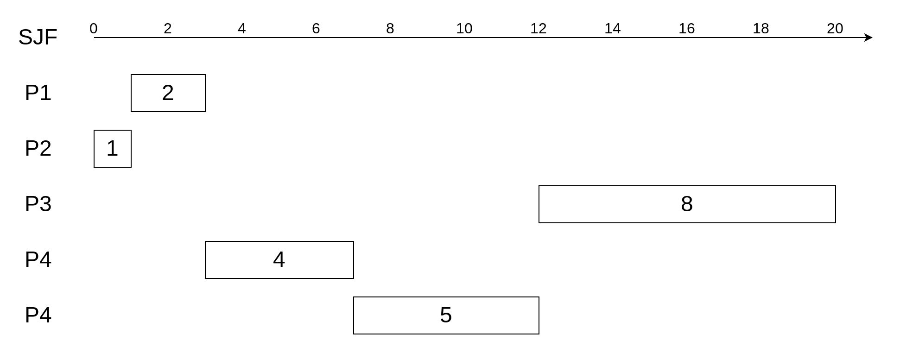
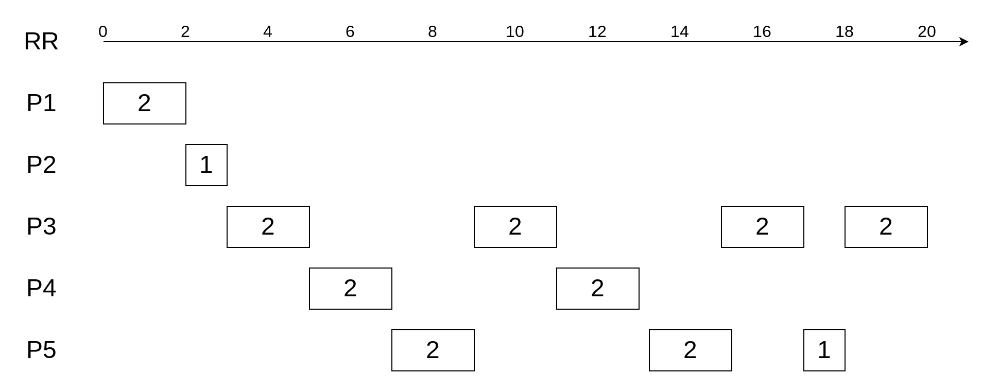

# 操作系统期中作业

## 201300035 方盛俊

## 一、简答题

### 1. 说明抽象资源和物理资源之间的区别，并举出两个例子。

物理资源是计算机拥有的、对于实际硬件而言的资源，如处理器、内存或磁盘。而抽象资源是操作系统对物理资源的一种抽象，以屏蔽具体的硬件细节，以便于加速应用程序的开发。

常见的例子有：

- 将属于物理资源的处理器，抽象成进程、线程；
- 将属于物理资源的物理内存地址，抽象成虚拟地址；
- 将属于物理资源的磁盘，抽象成文件系统。

### 2. 操作系统有哪些架构，说明各自的特点。

- 简要架构：一些功能简单的操作系统，会选择将应用程序与操作系统放置在同一个地址空间中，无需底层硬件提供复杂的内存管理、特权级隔离等功能。
- 宏内核架构：操作系统内核的所有模块（包括进程调度、内存管理、文件系统、设备驱动等）均运行在内核态，具备直接操作硬件的能力。
- 微内核架构：微内核架构会尝试对宏内核架构的操作系统进行解耦，将单个功能和模块（如文件系统、设备驱动等）从内核中拆分出来，作为一个个独立运行的服务；内核仅保留极少的功能，为这些服务提供通信和协作等基础能力。
- 外核架构：提出库操作系统概念，封装对硬件的抽象，与应用直接连接；操作系统内核只负责对硬件资源在多个库操作系统之间的多路复用支持。
- 多内核架构：将一个多内核系统堪称是一个由多个独立处理器核通过网络互联而成的分布式系统，对于不同处理器核之间的交互，提供了一层基于进程间通信的抽象。
- 混合内核架构：将多种架构的操作系统融合称为一种内核架构。

### 3. 什么是用户态，什么是内核态，这两种状态如何切换？

内核态：拥有着对整个操作系统的管理权限，能够访问所有的内存空间对应的状态。

用户态：只有部分权限，且只能访问应用程序对应的内存空间，无法访问内核地址空间的状态。

切换：处于用户态的程序，触发了异常或中断的时候，例如系统调用，就会从用户态转为内核态，以内核特权级执行相应的处理；处理完成后，就从内核态返回到之前用户态进程中断的位置，进入用户态。

### 4. 简要描述什么是策略与机制的分离，举例说明。

「将策略与机制相分离」是操作系统乃至计算机系统中控制复杂度的一个重要设计原则。其中 **机制** (mechanism) 表示该「如何做」，即实现某一功能的具体执行机构，常常位于系统的底层；**策略** (policy) 表示「做什么」，即在机制的基础上，借助一些参数或算法的变化，以达到对该功能的优化，或者达到不同的功能目标，常常位于系统的高层。

常见的例子有：

- 登录功能：以什么用户、什么权限登录属于策略；输入处理、策略文件管理、桌面启动加载属于机制。
- 调度功能：FIFO 算法、时间片轮转等算法属于策略；调度队列的设计、调度实体的表示、调度的中断处理属于机制。

### 5. 什么是进程控制块（PCB），它有哪些主要内容？

在内核中，每个进程都通过一个数据结构来保存它相关的状态，如它的进程标识符 PID、进程状态、虚拟内存状态、打开的文件等，这个数据结构称为进程控制块 PCB。

### 6. 简述进程的生命周期。

- 新生状态（new）：表示一个进程刚刚被创建出来，还未完成初始化，不能被调度运行。经过初始化后，进程进入预备状态。
- 预备状态（ready）：该状态表示进程可以被调度执行，但还未被调度器选择。在被调度器选择执行后，进程进入运行状态。
- 运行状态（running）：该状态表示进程正在 CPU 上运行。当一个进程执行一段时间后，调度器可以选择中断它并放回调度队列，进而进入预备状态。如果进程需要等待一些外部事件，例如某个 I/O 请求的完成，就可以放弃 CPU 进入阻塞状态。当进程运行结束，它就会进入终止状态。
- 阻塞状态（blocked）：该状态表示该进程需要等待外部时间，例如某个 I/O 的完成，暂时无法被调度。当该进程等待的外部事件完成后，就会进入预备状态。
- 终止状态（terminated）：该状态表示进程已经完成了执行，且不会再被调度。

### 7. 什么是系统调用？简述系统调用流程。

系统调用是一种特殊的异常，是操作系统为用户程序提供服务的一种手段。内核实现系统调用是以一个软中断的形式，即陷阱指令，如 i386 的 `int 0x80` 指令实现的。

具体流程如下：

1. 用户程序调用库函数，例如 `printf()`；
2. 库函数调用系统级封装函数，例如 `write()`；
3. 封装函数使用使用陷阱指令触发系统调用，进入内核态；
4. 在内核态中，进入系统调用处理程序 `system_call`；
5. 通过系统调用号来区分不同的系统调用，进行分发，执行相应的系统调用；
6. 通过 `iret` 这类指令返回用户态。

### 8. 进程间有哪些通信方式，各自有什么特点？

概括地讲，有三种范式：

- 生产者消费者模式：一个进程的输出作为另一个进程的输入。这样的通信是单向的，生产者只负责写，消费者只负责读。常见的例子有管道（pipe）。
- 客户端服务端模式：允许进程之间的双向通信，一个进程给另一个进程发送信息之后，可以收到回复。常见的例子有套接字（socket）。
- 文件系统模式：进程之间可以通过读写文件的方式来交流信息。这种通信方式可以在时间上分离。

具体而言，宏内核下典型的进程间通信机制，有管道、消息队列、信号量、共享内存、信号机制、套接字机制和文件系统。

### 9. 在用户态实现线程的最大优点是什么？最大缺点是什么？

最大优点是应用程序自己创建，内核不可见，不需要内核相关的支持，因此兼容大部分内核，并且更为轻量级，创建开销较小。

最大缺点是，内核不可见，因此功能也受限，例如进程里有一个线程进行 I/O，内核就会阻塞这个进程里面的所有线程。

### 10. 内核采取一系列动作以便在两个进程之间进行上下文切换，请描述一下这些过程。

1. 将当前处理器的寄存器上下文保存到当前进程的系统级上下文的现场信息中；
2. 将新进程系统级上下文中的现场信息作为新的寄存器上下文恢复到处理器的各个寄存器中；
3. 将控制转移到新进程执行。

### 11. 最短作业优先算法在什么情况下是最优的？怎么证明？

当所有任务同时到达，且优化目标是平均周转时间时，最短任务优先算法 SJF 是最优的。周转时间 = 完成时间 - 到达时间。我们假设所有任务的到达时间均为零，则周转时间就是完成时间。平均周转时间即是所有周转时间求和后除以任务数。

我们令 $T_1, T_2, \cdots, T_{n}$ 分别为这 $n$ 个任务的执行时间，且依次按顺序执行，那么就有平均周转时间为

$\displaystyle \bar{T} = \frac{T_1 + (T_1 + T_2) + \cdots + (T_1 + \cdots + T_{n} )}{n} = \frac{nT_1 + (n-1)T_2 + \cdots + T_{n}}{n}$

我们假设这个顺序不符合最短任务优先算法，且此时 $\bar{T}$ 最小，则存在 $i < j$ 使得 $T_i > T_j$, 那么有

$(n + 1 - i)T_i + (n + 1 - j)T_j > (n + 1 - i)T_j + (n + 1 - j)T_i$

则我们只需要在 $\bar{T}$ 表达式中用后者把前者替换掉，就能得到一个有着更小的 $\bar{T}$ 的顺序，这与我们的假设 $\bar{T}$ 最小产生矛盾。

因此 SJF 就是在这种情况下最优的调度算法。

### 12. 简述实时系统中调度问题的单调速率算法。

单调速率算法是一个用于调度周期任务的静态优先级实时调度算法。这里的速率是指任务的到达算率，它是任务周期的倒数，即 $1 / T$。该调度算法需要预知任务的周期 $T$，并且根据周期静态地为每个任务分配一个优先级，任务的周期越短，意味着其截止时间要求越迫切，其优先级越高。单调速率算法还支持抢占调度，高优先级的任务可以抢占低优先级的任务执行。

### 13. 怎么解决多级反馈队列调度算法中的饿死问题？

定时地将所有任务的优先级提升到最高。在一个长任务被分配到最低优先级之后，如果没有一种机制提高任务的优先级，且此时一直有短任务要调度，那么这个长任务就不会有被执行的机会，进而造成饿死现象。因此需要定时将所有任务优先级提高，保证任何一个任务都不会被饿死。

### 14. 什么是虚拟地址（空间）和物理地址（空间）？ 

我们可以将物理内存看成一个大数组，其中每个字节都可以通过与之唯一对应的地址进行访问，这个地址就是物理地址。

在引入虚拟内存的抽象后，应用程序使用虚拟地址访问存储在内存中的数据与代码。在程序执行中，CPU 会使用内存管理单元 MMU 将虚拟地址转为物理地址。

### 15. 请简述分页式存储管理的基本实现原理。

分页机制的基本思想是将应用程序的虚拟地址空间划分为连续的、等长的虚拟页（区别于分段式的不定长的段），同时物理地址也被划分为连续的、等长的物理页。然后给每个进程赋予相应的页表，即每个进程的虚拟页到物理页的映射关系表。

在具体的地址翻译过程中，MMU 首先解析虚拟地址中的虚拟页号，并通过虚拟页号找到页表中对应的条目，取出其中存储的物理页的地址，在加上虚拟地址中的页内偏移量得到最终的物理地址。

### 16. 假设物理内存足够大，虚拟内存是否还有存在的必要？如果不使用虚拟内存抽象，只使用物理内存寻址，会对操作系统的内存管理带来哪些改变？

即使物理内存足够大，虚拟内存依然有存在的必要。

如果不使用虚拟内存抽象，只使用物理内存寻址的话，首先是无法保证不同应用程序所使用的物理内存之间的隔离性，比如 A 程序可能无意中使用了 B 程序的物理内存，进而导致后者的错误运行；其次是无法保证应用程序可用的地址空间是连续和统一的，增加了程序编写及编译的复杂性。

### 17. 什么是优先级反转问题？怎么解决？

在程序执行时，多个任务可能对同一份数据产生竞争，因此任务会使用锁来保护共享数据。假设有三个任务 A、B、C，它们的优先级为 A > B > C。任务 C 在执行时持有一把锁，但被高优先级的 A 抢占了。而任务 A 也恰好想申请 C 所持有的锁，但是失败了，于是进入了阻塞状态等待 C 放锁。此时 B 和 C 都处于可运行的状态，但是 B 的优先级高于 C，因此 B 优先运行。这种时候，看起来就好像 B 的优先级高于 A 一样，这一问题就被称为优先级反转。

针对优先级反转问题，一种可行的解决方案是优先级继承。在上面的例子中，任务 A 可以通过将自己的优先级转移给占有锁的任务 C，让任务 C 优先执行并且释放锁。之后，任务 A 可以在任务 C 放锁后以抢占的方式立即执行，从而避免了优先级反转问题。

### 18. 简述下管程中的 Brinch Hansen、Hoare、Mesa 语义区别。

- Hoare 语义：`signal()` 立刻会进行线程切换，让被 `wakeup` 的线程运行；`condition` 一定会被这个被 `wakeup` 的线程持有。
- Brinch Hansen 语义：`signal()` 会把一个线程唤醒，将其放入准备队列中，然后直接结束运行退出管程，因此 `signal()` 必须是最后一条语句。
- Mesa 语义：`signal()` 会把一个线程唤醒，将其放入准备队列中，然后继续执行当前线程；`condition` 不一定被这个被 `wakeup` 的线程持有，线程再一次进入管程时，必须检查 `condition` 是否满足。

### 19. 简要说明 Peterson 算法的原理，Peterson 算法符合 safety 和 liveness 性质吗？说明理由。

Peterson 算法是一种纯软件算法，可以解决两个线程的临界区问题。

Peterson 算法有两个重要变量，第一个是全局数组 `flag`，共有两个成员变量（`flag[0]` 和 `flag[1]`），分别代表线程 0 和线程 1 是否尝试进入临界区。第二个是全局变量 `turn`，如果两个线程都申请进入临界区，那么 `turn` 将决定最终能够进入临界区的线程编号。在应用程序开始时，`flag` 数组的两个成员变量都被设为 `FALSE`，表示两个线程都没有申请进入临界区。线程在进入临界区之前必须满足两个条件之一，对线程 0 来说，就必须满足 `flag[1] == FALSE`（线程 1 没申请进入临界区）或 `turn == 0`（线程 1 也申请进入临界区，但 `turn` 决定线程可以进入临界区）。

Perterson 算法符合 safety 和 liveness 性质。对于线程 0 想要进入临界区的时候，有三种情况，分别是线程 1 正准备进入临界区，线程 1 在临界区内部和线程 1 在执行其他代码。

- 线程 1 正准备进入临界区：由于线程 1 已经标记了 `flag[1] = TRUE`，则两个线程将根据 `turn` 的值确定哪个线程进入，只会有一个线程进入临界区，因此符合 safety 性质。
- 线程 1 在临界区内部：由于线程 1 在临界区内部，它维持 `flag[1] = TRUE`，并且也没有再更新 `turn`，而线程 0 一定会将 `turn` 设为 `1`，因此线程 0 只会自旋等待，不会进入临界区，因此符合 safety 性质。
- 线程 1 在执行其他代码：线程 1 在离开临界区后会设置 `flag[1] = FALSE`，表示不再占有临界区，因此线程 0 可以进入临界区，因此符合 liveness 性质。

### 20. 简要说明信号量、互斥锁、条件变量的区别和联系。

区别：

- 互斥锁是对临界区这一部分代码上锁，以保证临界区的一系列指令原子式地执行。
- 条件变量是检查某一条件满足之后，才会继续执行。
- 信号量是使用一个整型变量来累计唤醒次数，当信号量为负值的时候就休眠。

联系：

我们可以使用信号量来实现互斥锁或条件变量。只要设置信号量初始值为 `1`，就能成为一个锁；只要设置信号量初始值为 `0`，就能成为一个条件变量。

## 二、应用题

### 1. 

### 2.

**(a)**

对于「Shell 接收用户输入的命令 `ls`，并创建一个新的进程执行该命令」的情况，`fork` 会更合适。

因为在 Shell 中，虽然一个 Shell 创建的进程的功能各不相同，但是它们都来自同一个用户，因此可以共享很多状态。例如可以共享文件描述符，更改输入和输出对应的文件描述符。借此能够实现类似于 `ls > newfile.txt` 的输出重定向效果。

**(b)**

对于「Web 服务器收到请求，并创建一个新的进程处理该请求」的情况，`fork` 会更合适。

因为 Web 服务器场景中，服务器会为每一个请求单独创建一个进程，由于这些进程的程序逻辑都十分相似，甚至就是同一个进程。对于大量的请求，会重复创建同一个程序对应的进程多次，如果我们使用的是 `fork`，借助 `fork` 后进程的「共享内存」和「写时复制」机制，我们便能以少量的资源创建大量的进程，应对大量的请求。

**(c)**

对于「父进程创建一个子进程，并利用管道通信」的情况，`fork` 会更合适。

父子进程之间通过匿名管道的大致流程如下：父进程首先通过 `pipe` 创建好对应的管道两端，然后通过 `fork` 创建出子进程。由于子进程是可以继承文件描述符的，因此父子进程相当于通过 `fork` 的继承完成了一次 IPC 权限的分发。然后父子进程就可以通过管道来进行进程间的通信。要注意的是，在完成继承后，父子都会有管道两端，需要主动关闭多余的端口，否则可能会导致出错。

### 3.

该份代码总共创建 4 个进程。

首先在第一个 `fork()` 之后，进程变为了 2 个，两个进程再分别都进行了第二个 `fork()`，因此进程变为了 4 个。

### 4.

**(a)**

**(b)**

- FCFS：平均周转时间为 $\bar{T} = (2 + 3 + 11 + 15 + 20) / 5 = 10.2 \text{ ms}$
- SJF：平均周转时间为 $\bar{T} = (1 + 3 + 7 + 12 + 20) / 5 = 8.6 \text{ ms}$
- 非抢占式优先级：平均周转时间为 $\bar{T} = (1 + 3 + 7 + 12 + 20) / 5 = 8.6 \text{ ms}$
- RR：平均周转时间为 $\bar{T} = (2 + 3 + 13 + 18 + 20) / 5 = 11.2 \text{ ms}$

**(c)**

- FCFS：平均等待时间为 $\bar{T} = (0 + 2 + 3 + 11 + 15) / 5 = 6.2 \text{ ms}$
- SJF：平均等待时间为 $\bar{T} = (0 + 1 + 3 + 7 + 12) / 5 = 4.6 \text{ ms}$
- 非抢占式优先级：平均等待时间为 $\bar{T} = (0 + 1 + 3 + 7 + 12) / 5 = 4.6 \text{ ms}$
- RR：平均等待时间为 $\bar{T} = (0 + 2 + 9 + 12 + 13) / 5 = 7.2 \text{ ms}$

因此平均等待时间最短的算法为 SJF 和非抢占式优先级算法。

