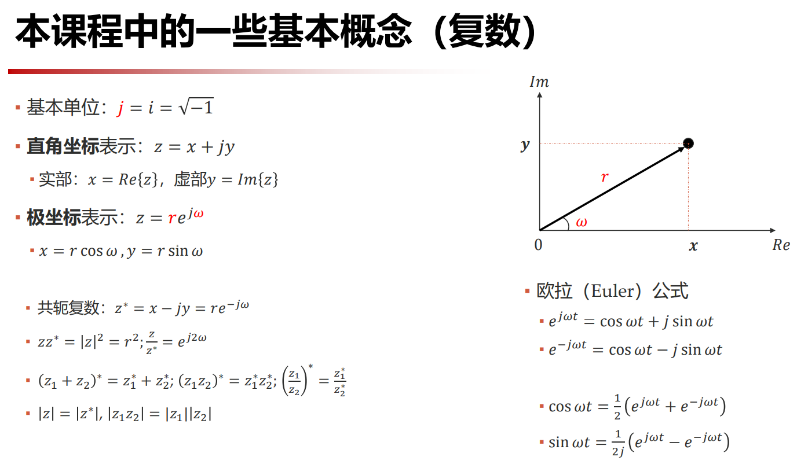
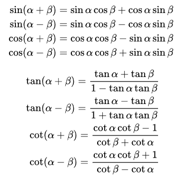
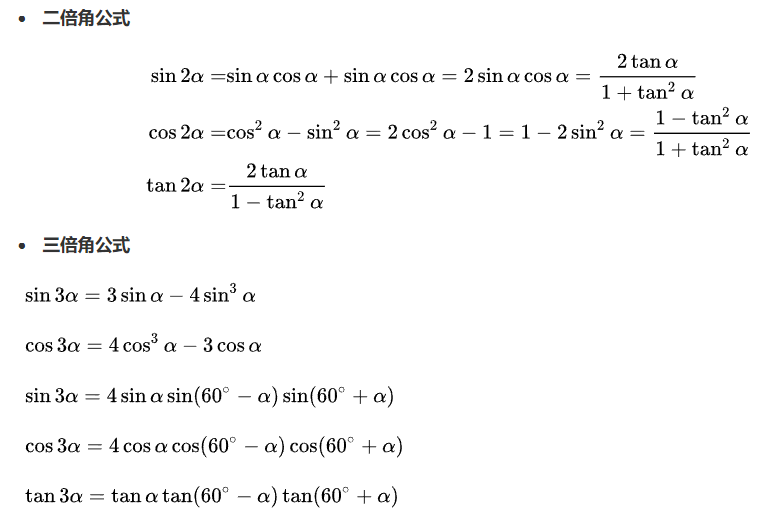
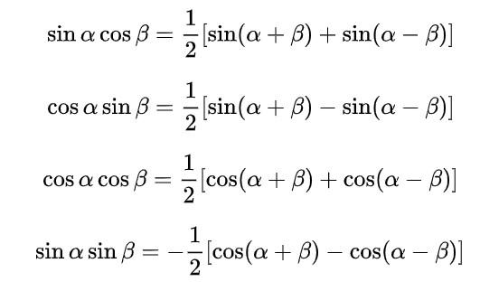
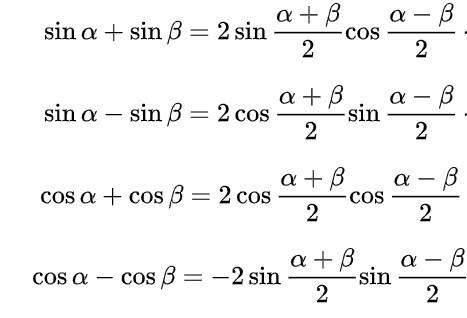
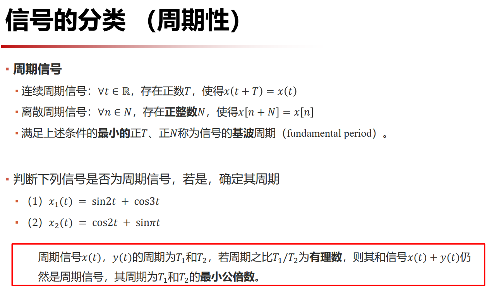

# 信号的时域分析

## 复数

## 二角和差公式

## 和差化积与积化和差公式

## 周期性

- 由积化和差公式可知, 正弦余弦信号乘积也可以是周期信号.
- 周期信号可能分解为周期信号, 非周期信号也可能分解为周期信号;

对于离散信号来说, 其周期性

$\displaystyle x[n] = \cos (\omega n), \frac{\omega}{2\pi} \to \begin{cases} \text{有理数, 周期序列} \\ \text{无理数, 非周期序列} \end{cases}$

- 连续正弦信号一定是周期信号, 而正弦序列不一定是周期序列;
- 两连续周期信号之和不一定是周期信号, 而两周期序列之和一定是周期序列.

## 信号分类

- 能量信号与功率信号
    - 能量信号: $0 < 𝑊 < ∞，𝑃 = 0$
    - 功率信号: $𝑊 → ∞，0 < 𝑃 < ∞$
    - 直流信号与周期信号都是功率信号
- 因果信号
    - 因果信号指的是在时间零点之前没有非零值
- 一维信号和多维信号
- 连续信号和离散信号
- 确定信号和随机信号

## 信号的运算

- 尺度变换: $x(t) \to x(at)$ 扩大到原来的 $1 / a$ 倍
- 翻转: $x(t) \to x(-t)$
- 时移: $x(t) \to x(t - t_0)$ 右移 $t_0$
- 相加: $x(t) = x_1(t) + x_2(t)$
- 相乘: $x(t) = x_1(t) \cdot x_2(t)$

单信号变换画波形: 先尺度变化, 再翻转, 最后时移.

## 基本连续信号

都很重要, 看课件!

