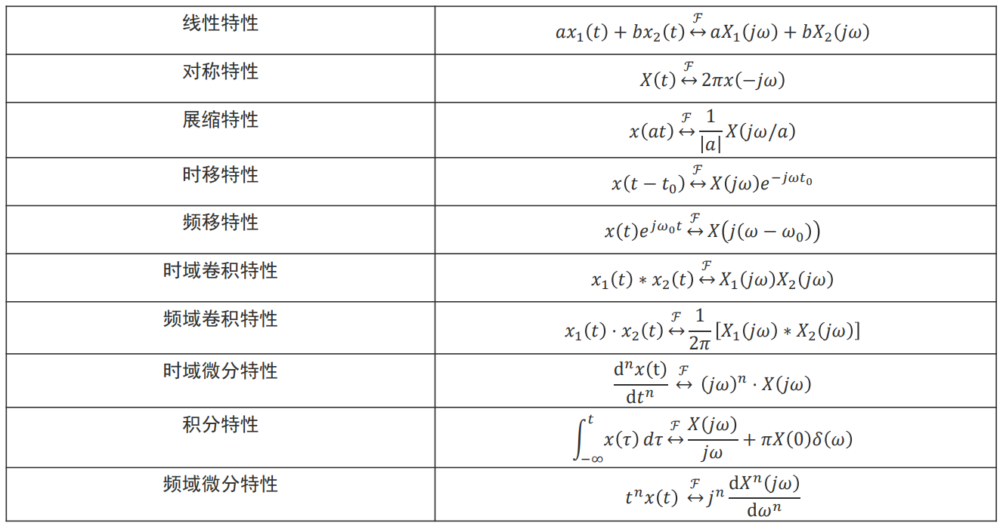
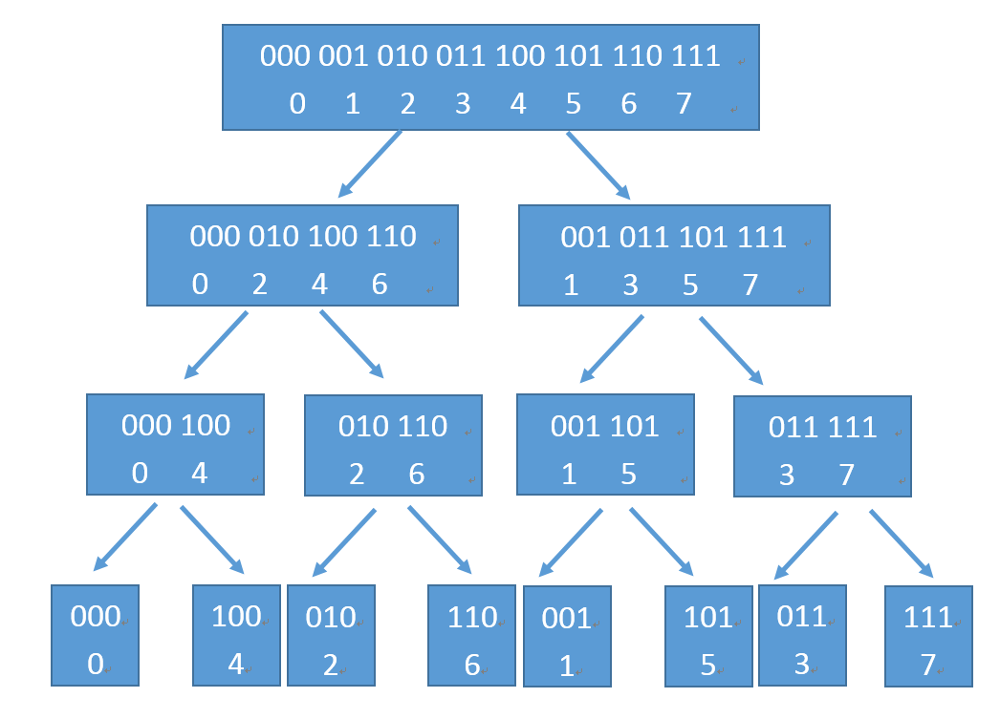

# 傅里叶变换 (Fourier transform)

## 0. 数学知识

### 0.1 卷积公式

$\displaystyle x(t)*h(t) = \int_{-\infty}^{+\infty}x(\tau)h(t-\tau)\mathrm{d}\tau$

对于脉冲函数 $\delta(t)$ 来说

$\displaystyle x(t)*\delta(t) = \int_{-\infty}^{+\infty}x(\tau)\delta(t-\tau)\mathrm{d}\tau = x(t)$

这也相等于说明了函数可以看作一个无穷维的向量, 其中 $\delta(t-\tau)$ 是一系列正交基.

## 1. 傅里叶级数

### 1.1 函数内积

函数可以看作一个无穷维的向量, 因此也定义其内积.

首先我们定义区间 $(t_0, t_0+T)$ 上的内积:

$\displaystyle \left<f(t), g(t) \right> = \int_{t_0}^{t_0+T}f(t)\overline{g(t)}\mathrm{d}t$

注意复函数要取共轭. (复向量内积时, 取共轭有助于保证自身内积 $\left\| \alpha \right\|^{2}$ 为正)

该定义是 $n$ 维向量内积

$\displaystyle \left<\alpha, \beta \right> = \sum_{i=1}^{n}\alpha_i\beta_i$

的自然推广.

### 1.2 三角函数族

三角函数族

$\{ \cos n\omega t, \sin n\omega t \}, n=0,1,2,\cdots,\infty$

是在 $(t_0, t_0+T)$ 上的完备正交集, 其中 $\displaystyle \omega = \frac{2\pi}{T}$

- 任意两个不同函数的乘积在 $[t_0, t_0+T]$ 上内积等于零
    - $\displaystyle \int_{t_0}^{t_0+T}\cos n\omega t\cdot \cos m\omega t \mathrm{d}t=\frac{1}{2}[\cos (n+m)\omega t+\cos (n-m)\omega t] = 0$
    - 其他使用积化和差公式同理
- 任一函数的平方在 $[t_0, t_0+T]$ 上的内积都不等于零
    - $\displaystyle \left\| \sin n\omega t \right\|^{2}= \left\| \cos n\omega t \right\|^{2}=\frac{T}{2}$
    - $\displaystyle \left<1, 1 \right> = T$

因此我们可以使用三角函数族来变换一个函数的正交基

$\displaystyle x(t) = a_0 + \sum_{n=1}^{\infty}a_n\cos n\omega t + \sum_{n=1}^{\infty}b_n\sin n\omega t$

其中

- $\displaystyle a_0 = \frac{\left<x(t), 1\right>}{\left<1, 1\right>} = \frac{1}{T}\int_{t_0}^{t_0+T}x(t)\mathrm{d}t$
- $\displaystyle a_n = \frac{\left<x(t), \cos n\omega t\right>}{\left<\cos n\omega t, \cos n\omega t\right>} = \frac{2}{T}\int_{t_0}^{t_0+T}x(t)\cos n\omega t\mathrm{d}t$
- $\displaystyle b_n = \frac{\left<x(t), \sin n\omega t\right>}{\left<\sin n\omega t, \sin n\omega t\right>} = \frac{2}{T}\int_{t_0}^{t_0+T}x(t)\sin n\omega t\mathrm{d}t$

称为傅里叶级数 (三角函数形式).

### 1.3 指数函数族

指数函数族

$\{ e^{jn\omega t} \}, n=0, \pm 1,\pm 2,\cdots,\pm \infty$

是在 $(t_0, t_0+T)$ 上的完备正交集, 其中 $\displaystyle \omega = \frac{2\pi}{T}$

这是因为

$\displaystyle \left<e^{jn\omega t}, e^{jm\omega t} \right> = \int_{t_0}^{t_0+T}e^{jn\omega t}\cdot e^{-jn\omega t}\mathrm{d}t = \int_{t_0}^{t_0+T}e^{j(n-m)\omega t}\mathrm{d}t = \begin{cases}
T, n=m \\ 0, n\neq m\end{cases}$

满足

- 任意两个不同函数的乘积在 $[t_0, t_0+T]$ 上内积等于零
- 任一函数的平方在 $[t_0, t_0+T]$ 上的内积都不等于零

因此我们可以使用指数函数族来变换一个函数的正交基

$\displaystyle x(t) = \sum_{n=-\infty}^{+\infty}X_n e^{jn\omega t} = \sum_{n=-\infty}^{+\infty}X_n(\cos n\omega t + j\sin n\omega t)$

因此我们其实也有 $\begin{cases}a_n = X_n+X_{-n} \\ b_n = j(X_n-X_{-n})\end{cases}$

即有 $\begin{cases}\displaystyle X_0 = \frac{a_0}{2} \\ \displaystyle X_n = \frac{a_n - j b_n}{2} \\ \displaystyle X_{-n} = \frac{a_n + j b_n}{2}\end{cases}$

其中

$\displaystyle X_n = \frac{\left<x(t), e^{jn\omega t} \right>}{\left<e^{jn\omega t}, e^{jn\omega t} \right>} = \frac{1}{T}\int_{t_0}^{t_0+T}x(t)\cdot e^{-jn\omega t}\mathrm{d}t$

注意复函数要取共轭, 因此有个负号.

- 分析公式: $\displaystyle X_n = \frac{1}{T}\int_{t_0}^{t_0+T}x(t)e^{-jn\omega t}\mathrm{d}t$
- 合成公式: $\displaystyle x(t) = \sum_{n=-\infty}^{+\infty}X_n e^{jn\omega t}$

## 2. 数字信号处理的傅里叶变换

### 2.1 傅里叶变换

重新定义 $\displaystyle \omega_0 = \frac{2\pi}{T}$, 有

- 分析公式: $\displaystyle X_n = X(nj\omega_0) = \frac{1}{T}\int_{t_0}^{t_0+T}x(t)\cdot e^{-jn\omega_0 t}\mathrm{d}t$
    - 两边乘以 $T$ 得: $\displaystyle TX_n = \frac{2\pi}{\omega_0}X(nj\omega_0) = \int_{t_0}^{t_0+T}x(t)\cdot e^{-jn\omega_0 t}\mathrm{d}t$
- 合成公式: $\displaystyle x(t) = \sum_{n=-\infty}^{+\infty}X_n e^{jn\omega_0 t} = \sum_{n\omega_0=-\infty}^{+\infty}\frac{X(nj\omega_0)}{\omega_0} e^{jn\omega_0 t}\Delta(n\omega_0)$

令周期 $T \to \infty$, 即 $\omega_0 \to 0$,

则 $\omega = n\omega_0$ 变得连续, 并且重新定义 $\displaystyle X(j\omega) = \frac{2\pi}{\omega_0}X(nj\omega_0)$,

则我们有

- $n\omega_0 \to \omega$
- $\Delta(n\omega_0) \to \mathrm{d}\omega$
- $\displaystyle \frac{X(jn\omega_0)}{\omega_0} \to \frac{X(j\omega)}{2\pi}$
- $\displaystyle \sum_{n\omega_0=-\infty}^{+\infty} \to \int_{-\infty}^{+\infty}$

因此到傅里叶变换, 可以适用于非周期信号.

- $\displaystyle X(j\omega) = \int_{-\infty}^{+\infty}x(t)e^{-j\omega t}\mathrm{d}t$
- $\displaystyle x(t) = \frac{1}{2\pi}\int_{-\infty}^{+\infty}X(j\omega)e^{j\omega t}\mathrm{d}\omega$

前者称为 **傅里叶正变换**, 后者称为 **傅里叶逆变换**.

其中 $X(\omega)$ 是 $x(t)$ 的频谱函数, 一般是复函数, 可以写作

- $X(\omega) = |X(\omega)|e^{j\varphi(\omega)}$

并且 $|X(\omega)|$ 是 $X(\omega)$ 的模, 代表信号中各频率分量的相对大小, $\varphi(\omega)$ 是 $X(\omega)$ 的相位函数, 代表信号中各频率分量之间的相位关系. 二者对应的曲线分别称为幅度频谱和相位频谱.

如果 $x(t)$ 是实函数, 则 $|X(\omega)|$ 是偶函数, $\varphi(\omega)$ 是奇函数.

### 2.2 周期函数的傅里叶变换

由于周期信号不满足傅里叶变换的绝对可积条件, 所以我们无法直接使用

- $\displaystyle X(j\omega) = \int_{-\infty}^{+\infty}x(t)e^{-j\omega t}\mathrm{d}t$
- $\displaystyle x(t) = \frac{1}{2\pi}\int_{-\infty}^{+\infty}X(j\omega)e^{j\omega t}\mathrm{d}\omega$

但是我们可以通过周期函数的傅里叶级数来推导

由 $\mathcal{F}[1]=2\pi \delta(\omega)$ 和频移特性可得 $\mathcal{F}[e^{j\omega_0t}] = 2\pi\delta(\omega-\omega_0)$

$x(t)$ 的傅里叶级数为

$\displaystyle x(t) = \sum_{n=-\infty}^{+\infty}X_n e^{jn\omega_0t}$

两边同时取傅里叶变换得

$\displaystyle \mathcal{F}[x(t)] = \mathcal{F}\left[ \sum_{n=-\infty}^{\infty}X_ne^{jn\omega_0t} \right] = \sum_{n=-\infty}^{\infty}X_n\mathcal{F}\left[ e^{jn\omega_0t} \right] = 2\pi\sum_{n=-\infty}^{+\infty}X_n\delta(\omega-n\omega_0)$

因此有

- $\displaystyle \mathcal{F}[x(t)] = 2\pi\sum_{n=-\infty}^{+\infty}X_n\delta(\omega-n\omega_0)$
- $\displaystyle X_n = \frac{1}{T}\int_{t_0}^{t_0+T}x(t)e^{-jn\omega_0t}\mathrm{d}t$

说明有

- 周期信号 $x(t)$ 的傅里叶变换有位于 $0, \pm \omega_0, \pm 2\omega_0, \cdots$ 处的冲激信号组成, 冲激信号的强度等于对应傅里叶级数系数的 $2\pi$ 倍.
- 傅里叶变换反应频谱密度, 因此周期信号的傅里叶变换不是有限值, 是冲激函数, 表明在无穷小的频带范围内取得无穷大的频谱值.
- 周期信号的频谱是离散的.

### 2.3 时域采样的频域分析

由于

$\displaystyle \mathcal{F}[\delta_{T_s}(t)] = X(j\omega) = 2\pi\sum_{-\infty}^{+\infty}X_n\delta(\omega-n\omega_s)=\omega_s\sum_{n=-\infty}^{+\infty}\delta(\omega-n\omega_s)$

(冲击串的傅里叶变换仍然是冲击串)

因此有

$\displaystyle \mathcal{F}[x_s(t)] = \frac{1}{2\pi}[X(j\omega)*\omega_s\sum_{-\infty}^{+\infty}\delta(\omega-n\omega_s)] = \frac{1}{T_s}\sum_{-\infty}^{+\infty}X(j(\omega-n\omega_s))$

时域对信号做离散化, 频域表现为原始时域信号频谱 $X(j\omega)$ 的周期延拓 (重复), 时域的离散化导致了频域的周期性.

反之亦然, 因此一个域的离散化和另一个域的周期性相对应.

### 2.4 时域采样定理

采样定理: 若连续信号 $x(t)$ 是一个频带受限信号 (若 $\left| \omega \right| > \omega_m$ 则 $X(j\omega)=0, \omega_m=2\pi f_m$), $x(t)$ 的等间隔样本值 $x_s(t)$, 用 $x_s(t)$ 唯一表示 $x(t)$ 的条件是

$\displaystyle T_s < \frac{1}{2 f_m}$ 即 $\omega_s > 2\omega_m$

$f_s = 2 f_m$ 为最小采样频率, 称为 Nyquist Rate.

## 3. 数字图像处理的傅里叶变换

### 3.1 傅里叶变换

实际上, 还有另外一种傅里叶变换的定义方法, 即傅里叶变换对

- $\displaystyle F(\mu) = \int_{-\infty}^{+\infty}f(t)e^{-j 2\pi\mu t}\mathrm{d}t$
- $\displaystyle f(t) = \int_{-\infty}^{+\infty}F(\mu)e^{j 2\pi\mu t}\mathrm{d}\mu$

和先前的傅里叶变换不一样之处在于系数的不同.

或者使用欧拉公式表示为

- $\displaystyle F(\mu) = \int_{-\infty}^{+\infty}f(t)[\cos (2\pi \mu t)-j\sin (2\pi\mu t)]\mathrm{d}t$

证明如下:

$
\begin{aligned}
\int_{-\infty}^{+\infty}F(\mu)e^{j 2\pi\mu t}\mathrm{d}\mu &= \int_{-\infty}^{+\infty} \left( \int_{-\infty}^{+\infty} f(t)e^{-j 2\pi\mu t}\mathrm{d}t \right) e^{j 2\pi\mu t}\mathrm{d}\mu \\
&= \int_{-\infty}^{+\infty} \left( \int_{-\infty}^{+\infty} f(t')e^{-j 2\pi\mu t'}\mathrm{d}t' \right) e^{j 2\pi\mu t}\mathrm{d}\mu \\
&= \int_{-\infty}^{+\infty} f(t')\left( \int_{-\infty}^{+\infty} e^{j 2\pi\mu (t-t')}\mathrm{d}\mu \right) \mathrm{d}t' \\
&= \int_{-\infty}^{+\infty} f(t') \delta(t-t') \mathrm{d}t' \\
&= f(t) * \delta(t) \\
&= f(t)
\end{aligned}
$

其中用到了 $\displaystyle \int_{-\infty}^{+\infty}e^{j 2\pi\mu t}\mathrm{d}\mu = \delta(t)$, 即 $1_{\mathbb{R}}$ 和 $\delta(t)$ 互为傅里叶变换.

### 3.2 对称性

- $f(t)$ 的傅里叶变换为 $F(\mu)$
- $F(t)$ 的傅里叶变换为 $f(-\mu)$

对于冲击函数我们还有

- $\delta(t-t_0)$ 傅里叶变换为 $e^{-j 2\pi\mu t_0}$
- $e^{-j 2\pi at}$ 傅里叶变换为 $\delta(-\mu-a)$
- $e^{j 2\pi at}$ 傅里叶变换为 $\delta(\mu-a)$

### 3.3 冲击串

对于冲击串 $\displaystyle s_{\Delta T}(t) = \sum_{n=-\infty}^{+\infty}\delta(t-n\Delta T)$

我们有傅里叶级数系数 $\displaystyle c_n = \frac{1}{\Delta T}\int_{-\Delta T / 2}^{\Delta T / 2}s_{\Delta T}(t)e^{-j \frac{2\pi n}{\Delta T}t}\mathrm{d}t = \frac{1}{\Delta T}$

因此有傅里叶级数 $\displaystyle s_{\Delta T}(t) = \sum_{n=-\infty}^{\infty}c_n e^{j \frac{2\pi n}{\Delta T}t}\mathrm{d}t = \frac{1}{\Delta T}\sum_{n=-\infty}^{\infty}e^{j \frac{2\pi n}{\Delta T}t}\mathrm{d}t$

两边同时进行傅里叶变换可得

$\displaystyle S(\mu) = \frac{1}{\Delta T}\sum_{n=-\infty}^{\infty} \mathfrak{I}\left\{ e^{j \frac{2\pi n}{\Delta T}t}\mathrm{d}t \right\} = \frac{1}{\Delta T}\sum_{n=-\infty}^{\infty} \delta(\mu - \frac{n}{\Delta T})$

冲激串的傅里叶变换还是冲激串, 但是周期由 $\Delta T$ 变为 $\displaystyle \frac{1}{\Delta T}$.

### 3.4 卷积

- 平移性质
    - $\displaystyle \mathfrak{I}\{ h(t-\tau) \} = H(\mu)e^{-j 2\pi \mu\tau}$
- 卷积定理
    - $f(t)*h(t) \Leftrightarrow H(\mu)F(\mu)$
    - $f(t)h(t) \Leftrightarrow H(\mu)*F(\mu)$

### 3.5 采样

采样后函数 $\displaystyle \tilde{f}(t) = f(t)s_{\Delta T}(t) = \sum_{n=-\infty}^{\infty}f(t)\delta(t-n\Delta T)$

采样后函数的傅里叶变换

$
\begin{aligned}
\tilde{F}(\mu) &= F(\mu)*S(\mu) \\
&= \int_{-\infty}^{\infty}F(\tau)S(\mu-\tau)\mathrm{d}\tau \\
&= \int_{-\infty}^{\infty}F(\tau)\frac{1}{\Delta T}\sum_{-\infty}^{\infty}\delta(\mu-\tau-\frac{n}{\Delta T})\mathrm{d}\tau \\
&= \frac{1}{\Delta T}\sum_{-\infty}^{\infty}\int_{-\infty}^{\infty}F(\tau)\delta(\mu-\frac{n}{\Delta T}-\tau)\mathrm{d}\tau \\
&= \frac{1}{\Delta T}\sum_{-\infty}^{\infty}F(\mu-\frac{n}{\Delta T}) \\
\end{aligned}
$

可见采样后函数的傅里叶变换是无限周期性拷贝的, 间隔 $\displaystyle \frac{1}{\Delta T}$.

因此我们有采样定理, 对于带限函数 $f(t)$ 来说, 其傅里叶变换后的非零频率属于 $[-\mu_m, \mu_m]$, 因此只要

$\displaystyle \frac{1}{2\Delta} > \mu_m$ 即 $\displaystyle \frac{1}{\Delta T} > 2\mu_m$

即可完美复原, 其中 $2\mu_m$ 称为奈奎斯特频率 (Nyquist Frequency).

但是带限函数这个要求太严格了, 很少有函数能够做到.

尤其是有限持续时间函数 (即有限长度采样), 有限持续时间函数必然是不带限的, 因此混淆是不可避免的.

抗混淆一定是事先防止或减轻混淆, 通过平滑输入函数，减少高频分量来实现抗混淆.

### 3.6 离散傅里叶变换 (DFT)

对于采样后函数 $\displaystyle \tilde{f}(t) = f(t)s_{\Delta T}(t) = \sum_{n=-\infty}^{\infty}f(t)\delta(t-n\Delta T)$

我们还可以直接进行傅里叶变换

$
\begin{aligned}
\tilde{F}(\mu) &= \int_{-\infty}^{+\infty}\tilde{f}(t)e^{-j 2\pi \mu t}\mathrm{d}t \\
&= \int_{-\infty}^{+\infty}\sum_{n=-\infty}^{\infty}f(t)\delta(t-n\Delta T)e^{-j 2\pi \mu t}\mathrm{d}t \\
&= \sum_{n=-\infty}^{\infty}\int_{-\infty}^{+\infty}f(t)\delta(t-n\Delta T)e^{-j 2\pi \mu t}\mathrm{d}t \\
&= \sum_{n=-\infty}^{\infty}f_n e^{-j 2\pi \mu n \Delta T}, \quad [f_n=f(n \Delta T)] \\
\end{aligned}
$

我们在之前已经证明了 $\tilde{F}(\mu)$ 是以 $\displaystyle \frac{1}{\Delta T}$ 为周期的周期函数, 因此我们这里只考虑 $\tilde{F}(\mu)$ 的一个周期 $\displaystyle [0, \frac{1}{\Delta T}]$.

我们在 $\tilde{F}(\mu)$ 的一个周期 $\displaystyle [0, \frac{1}{\Delta T}]$ 上采样 $M$ 个样本, 即通过

$\displaystyle \mu = \frac{m}{M \Delta T}, m = 0,1,2,\cdots, M-1$

采样得到

$\displaystyle F_m = \sum_{n=0}^{M-1}f_n e^{-j 2\pi mn / M}, m = 0,1,2,\cdots, M-1$

此即离散傅里叶变换 (DFT).

同理我们有离散傅里叶反变换 (IDFT)

$\displaystyle f_n = \frac{1}{M}\sum_{m=0}^{M-1}F_m e^{j 2\pi mn / M}, m = 0,1,2,\cdots, M-1$

因此有

- 离散傅里叶变换 (DFT):
    - $\displaystyle F(u) = \sum_{x=0}^{M-1}f(x) e^{-j 2\pi ux / M}, u = 0,1,2,\cdots, M-1$
- 离散傅里叶反变换 (IDFT):
    - $\displaystyle f(x) = \frac{1}{M}\sum_{u=0}^{M-1}F(u) e^{j 2\pi ux / M}, x = 0,1,2,\cdots, M-1$

可以看出表达式不依赖采样间隔和频率间隔, 因此适用于任何均匀取样的有限离散样本集.

并且它们有着无限周期, 周期为 $M$ 的性质.

- $F(u) = F(u+KM)$
- $f(u) = f(x+KM)$

如果我们有

- 采样间隔为 $\Delta T$

则有

- 总时间长度为 $T = M \Delta T$
- 频率间隔为 $\displaystyle \Delta u = \frac{1}{M\Delta T} = \frac{1}{T}$
- 频域范围为 $\displaystyle \Omega = M \Delta u = \frac{1}{\Delta T}$

### 3.7 二维连续傅里叶变换

- 二维傅里叶变换
    - $\displaystyle F(u,v) = \int_{-\infty}^{\infty}\int_{-\infty}^{\infty}f(t,z)e^{-j 2\pi(ut+vz)}\mathrm{d}t\mathrm{d}z$
- 二维傅里叶反变换
    - $\displaystyle f(t,z) = \int_{-\infty}^{\infty}\int_{-\infty}^{\infty}F(u,v)e^{j 2\pi(ut+vz)}\mathrm{d}u\mathrm{d}v$

### 3.8 二维离散傅里叶变换 (DFT)

- 二维离散傅里叶变换 (DFT)
    - $\displaystyle F(u,v) = \sum_{x=0}^{M-1}\sum_{y=0}^{N-1}f(x,y)e^{-j 2\pi(ux / M + vy / N)}$
- 二维离散傅里叶反变换 (IDFT)
    - $\displaystyle f(x,y) = \frac{1}{MN}\sum_{u=0}^{M-1}\sum_{v=0}^{N-1}F(u,v)e^{j 2\pi(ux / M + vy / N)}$

旋转性:

- $\displaystyle f(r,\theta+\theta_0) \Leftrightarrow F(\omega, \varphi+\theta_0)$

其中使用的是极坐标.

平移性:

- $\displaystyle f(x,y)e^{j 2\pi(u_0x / M + v_0y / N)} \Leftrightarrow F(u-u_0,v-v_0)$
- $\displaystyle f(x-x_0,y-y_0) \Leftrightarrow F(u,v)e^{-j 2\pi(x_0u / M + y_0v / N)}$

如果我们令 $u_0=M/2$, $v_0=N/2$, 则有

- $f(x,y)(-1)^{x+y} \Leftrightarrow F(u-M/2,v-N/2)$

幅度, 相角与功率谱:

- 极坐标表示: $\displaystyle F(u,v)=|F(u,v)|e^{j\phi(u,v)}$
- 幅度 (傅里叶谱): $|F(u,v)| = [R^{2}(u,v)+I^{2}(u,v)]^{\frac{1}{2}}$
- 相角 ($[-\pi, \pi]$): $\displaystyle \phi(u,v) = \arctan \left[ \frac{I(u,v)}{R(u,v)} \right]$
- 功率谱: $P(u,v) = |F(u,v)|^{2} = R^{2}(u,v) + I^{2}(u,v)$

二维离散卷积:

- $\displaystyle f(x,y)*h(x,y) = \sum_{m=0}^{M-1}\sum_{n=0}^{N-1}f(m,n)h(x-m,y-n)$
    - 该式给出了一个二维周期序列中的一个周期, 因此也被称为循环卷积
- $f(x,y)*h(x,y) \Leftrightarrow F(u,v)H(u,v)$
- $f(x,y)h(x,y) \Leftrightarrow F(u,v)*H(u,v)$

要理解循环卷积, 我们可以使用一个一维序列来说明:

对于 $\displaystyle y(x) = f(x)*h(x) = \sum_{m=0}^{M-1}\sum_{n=0}^{N-1}f(m,n)h(x-m,y-n)$

用矩阵形式表示就是

$
\begin{bmatrix} y(0) \\ y(1) \\ y(2) \\ \vdots \\ y(M-1) \\\end{bmatrix} = \begin{bmatrix} h(0) & h(M-1) & h(M-2) & \cdots  & h(1) \\ h(1) & h(0) & h(M-1) & \cdots & h(2) \\ h(2) & h(1) & h(0) & \cdots & h(3) \\ \vdots & \vdots & \vdots & \vdots & \vdots\\ h(M-1) & h(M-2) & h(M-3) & \cdots &h(0) \end{bmatrix}\begin{bmatrix} f(0) \\ f(1) \\ f(2) \\ \vdots \\ f(M-1) \\\end{bmatrix}
$

可以看出, 如果周期过于相近的话, 会产生缠绕错误, 所以我们要在 $f(x)$ 和 $h(x)$ 末尾处进行零填充, 使得 $M \ge M_{f}+M_{h}-1$.

二维同理, 也要进行零填充.

但是有一个问题, 我们如何对频率域滤波器 $H(u,v)$ 进行零填充?

- 先将 $H(u,v)$ 转为空间域的 $h(x,y)$, 进行零填充后再转回来
    - 会出现振铃现象, 因此并不实用
- 不进行零填充, 直接构造一个与 $F(u,v)$ 一样大小的 $H(u,v)$
    - 没有完全解决缠绕问题, 但是问题不大, 因为图像已经经过零填充了

频率域滤波步骤:

1. 给定一副大小为 $M \times N$ 的输入图像 $f(x, y)$, 选择填充参数 $P$ 和 $Q$. 典型地, 我们选择 $P = 2M$ 和 $Q = 2N$.
2. 对 $f(x, y)$ 添加必要数量的 $0$, 形成大小为 $P × Q$ 的填充后图像 $f_{p}(x, y)$.
3. 用 $(−1)^{x+y}$ 乘以 $f(x,y)$ 移到其变换的中心.
4. 计算来自步骤 3 的图像的 DFT, 得到 $F(u, v)$.
5. 生成一个实的、对称的滤波函数 $H(u, v)$, 其大小为 $P \times Q$, 中心在 $(P / 2, Q / 2)$ 处. 用阵列相乘形成乘积 $G(u,v)=H(u,v)F(u,v)$.
6. 得到处理后的图像: $g_{p}(x,y) = \{ \operatorname{real}[\mathfrak{I}^{-1}[G(u,v)]] \}(-1)^{x+y}$
7. 通过 $g_{p}(x,y)$ 的左上象限提取 $M \times N$ 区域，得到最终处理结果 $g(x,y)$.

### 3.9 快速傅里叶变换 (FFT)

对于离散傅里叶变换对

- 离散傅里叶变换 (DFT):
    - $\displaystyle F(u) = \sum_{x=0}^{M-1}f(x) e^{-j 2\pi ux / M}, u = 0,1,2,\cdots, M-1$
- 离散傅里叶反变换 (IDFT):
    - $\displaystyle f(x) = \frac{1}{M}\sum_{u=0}^{M-1}F(u) e^{j 2\pi ux / M}, x = 0,1,2,\cdots, M-1$

我们将 $\omega_{M}^{k} = e^{j 2\pi k / M}$ 给抽取出来, 则有

- 离散傅里叶变换 (DFT):
    - $\displaystyle F(u) = \sum_{x=0}^{M-1}f(x) (e^{-j 2\pi u / M})^x = \sum_{x=0}^{M-1}f(x)(\omega_{M}^{-u})^{x}$
- 离散傅里叶反变换 (IDFT):
    - $\displaystyle f(x) = \frac{1}{M}\sum_{u=0}^{M-1}F(u) (e^{j 2\pi x / M})^u = \frac{1}{M}\sum_{u=0}^{M-1}F(u)(\omega_{M}^{x})^u$

其中 $\omega_{M}^{k} = e^{j 2\pi k / M}$ 代表着复平面上将单位圆 $M$ 等分, 并以原点为起点, 以 $k$ 等分点为终点形成的向量. 

因此我们很自然地就能得到两个相关性质:

- 折半引理: $\omega_{2M}^{2k} = \omega_{M}^{k}$
    - 由几何意义可知, 两者表示的向量终点是一样的.
- 消去引理: $\omega_{M}^{k + M / 2} = -\omega_{M}^{k}$
    - 由几何意义可知, 两者表示的向量方向恰好相反.

> 一个 $n - 1$ 次多项式在 $n$ 个不同点处的取值唯一确定了该多项式.

因此, 我们也可以将离散傅里叶变换视作 **多项式的点值表示** 过程. 其中 $f(x)$ 是多项式的系数, $\omega_{M}^{k}$ 是我们带入的不同点, 最后求出点值表示 $F(u)$.

我们对多项式 $\displaystyle f(x) = \sum_{i=0}^{n-1}a_ix^{i}$ 进行研究, 我们带入 $x=\omega_{n}^{k}$, 并对多项式以奇偶的方式进行划分, 则有

$
\begin{aligned}
f(x) &= (a_0x^{0} + a_2x^{2} + \cdots + a_{n-2}x^{n-2}) \\
&+ (a_1x^{1} + a_3x^{3} + \cdots + a_{n-1}x^{n-1}) \\
\end{aligned}
$

令 $f_1(x) = a_0x^{0} + a_2x^{1} + \cdots + a_{n-2}x^{\frac{n}{2}-1}$, $f_2(x) = a_1x^{0} + a_3x^{1} + \cdots + a_{n-1}x^{\frac{n}{2}-1}$

则有 $f(x) = f_1(x^{2}) + xf_2(x^{2})$

带入 $x = \omega_{n}^{k}$ 有

$
\begin{aligned}
f(\omega_{n}^{k}) &= f_1(\omega_{n}^{2k}) + \omega_{n}^{k}f_2(\omega_{n}^{2k}) \\
&= f_1(\omega_{\frac{n}{2}}^{k}) + \omega_{n}^{k}f_2(\omega_{\frac{n}{2}}^{k}) \\
\end{aligned}
$

带入 $x = \omega_{n}^{k+\frac{n}{2}}$ 有

$
\begin{aligned}
f(\omega_{n}^{k+\frac{n}{2}}) &= f_1(\omega_{n}^{2k+n}) + \omega_{n}^{k+\frac{n}{2}}f_2(\omega_{n}^{2k+n}) \\
&= f_1(\omega_{n}^{2k}\cdot \omega_{n}^{n}) - \omega_{n}^{k}f_2(\omega_{n}^{2k}\cdot \omega_{n}^{n}) \\
&= f_1(\omega_{n}^{2k}) - \omega_{n}^{k}f_2(\omega_{n}^{2k}) \\
&= f_1(\omega_{\frac{n}{2}}^{k}) - \omega_{n}^{k}f_2(\omega_{\frac{n}{2}}^{k}) \\
\end{aligned}
$

其中 $\displaystyle k < \frac{n}{2}$.

由此可见, 我们只需要递归地求出 $f_1(\omega_{\frac{n}{2}}^{k}), f_2(\omega_{\frac{n}{2}}^{k})$ 即可 $O(1)$ 地合并结果.

因此我们能够用 $O(\log n)$ 的时间复杂度求出 $f(\omega_{n}^{k})$, 进而可以用 $O(n\log n)$ 的时间复杂度求出所有的 $f(\omega_{n}^{k}), k=0,2,\cdots,n-1$.

同理, 对于离散傅里叶反变换, 我们只需要将傅里叶正变换中乘上的单位根变为其共轭复数, 分治完的每一项除以 $n$ 即可得到原多项式的每一项系数.

相比于直接进行离散傅里叶变换 (DFT) 所用的 $O(n^{2})$ 的时间复杂度, 快速傅里叶变换 (FFT) 的 $O(n\log n)$ 有着显著的加速.

我们将划分情况推演出来

可以发现 $\omega_{n}^{i}$ 在最终的序列中的位置下标相当于 $i$ 二进制下翻转得到的数.

因此我们可以将自顶向下的递归算法改为自底向上的循环算法, 可以实现算法常数级别的优化.

### 3.10 二维快速傅里叶变换 (FFT2)

二维傅里叶变换是在一维傅里叶变换基础上实现的, 实现方法为:

1. 对 2 维输入数据的每一行进行 FFT 变换, 变换结果仍然按行存入一个二维数组中;
2. 对按行 FFT 变换后的结果, 对每一列进行FFT变换, 变换结果仍然按列存入一个二维数组中, 该数组即为 2 维FFT变换结果.

对于一个 $M \times N$ 的二维数据, FFT2 的时间复杂度为 $O(MN\log(MN))$.

若 $M=N$, 则时间复杂度可以简化为 $O(N^2\log N)$, 优于暴力算法的 $O(N^{3})$.

