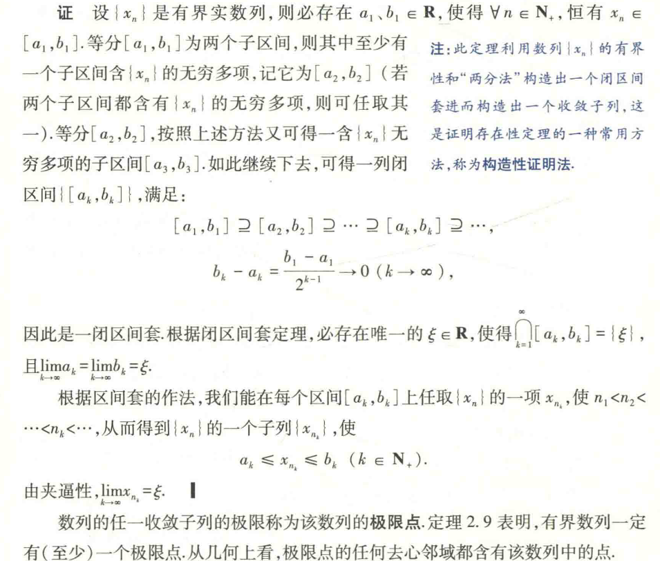
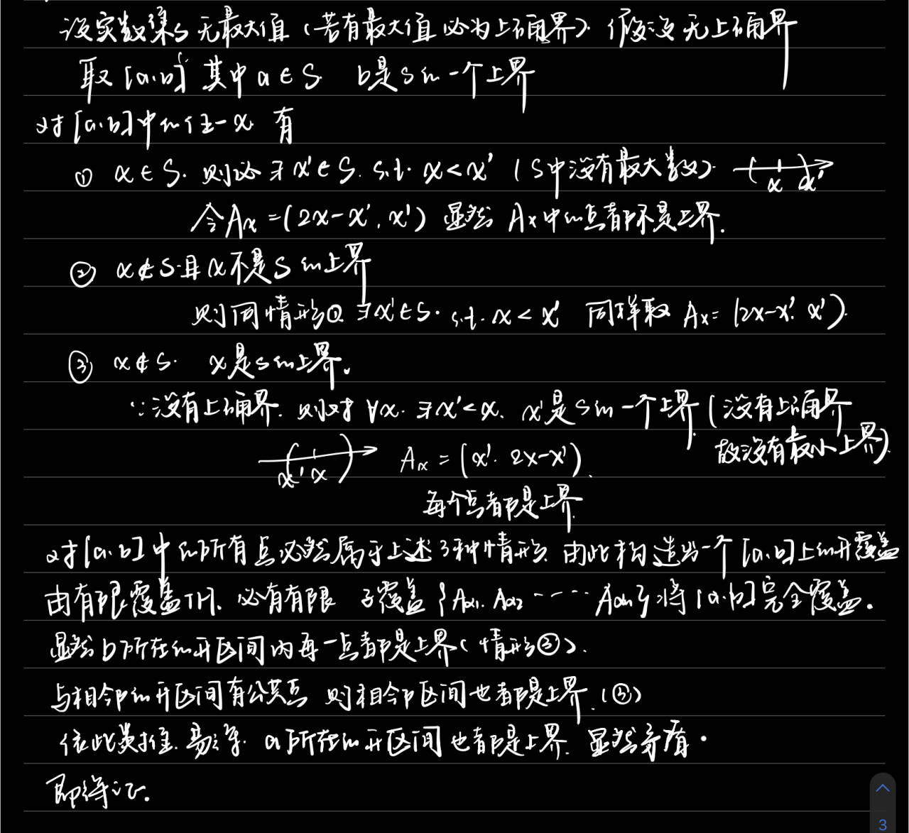
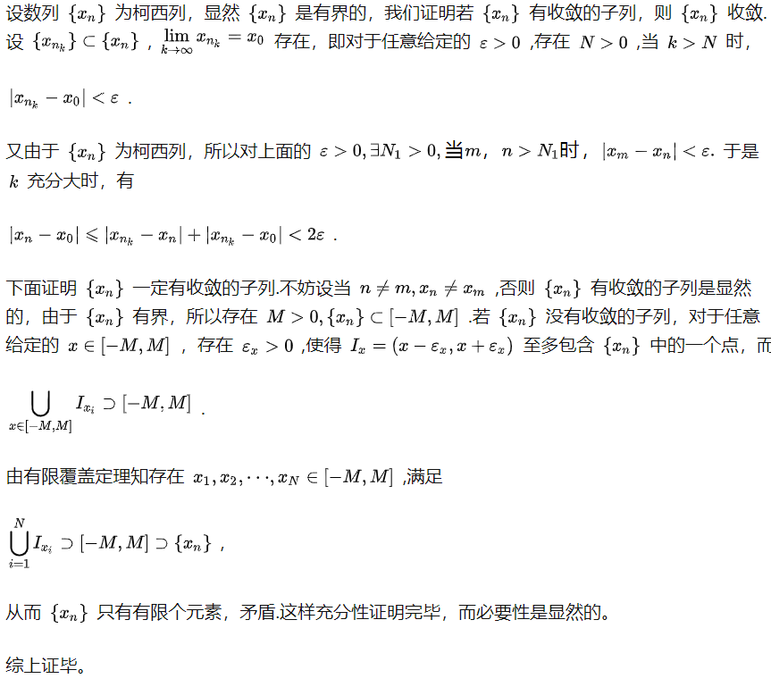

# 实数的连续性

# 确界定理 

非空有上(下)界的数集, 则必有上(下)确界.

# 单调有界定理

若$\{a_n\}$单调递增(减)且有上(下)界, 则$\{a_n\}$是收敛的.

## 确界定理$\Rightarrow$单调有界定理: 

$\{a_n\}$有上确界, 记为 $A = sup\{a_n\}$

$A \geq a_n 对 \forall n成立$

$\therefore\forall \varepsilon>0,\exist n_0, 使得a_{n_0}> A -\varepsilon$

$当n > n_0时, A+\varepsilon > A\geq a_n \geq a_{n_0} > A - \varepsilon$

$即|a_n - A| < \varepsilon$

# 闭区间套定理

区间列$\{[a_n,b_n]\}$

$$
[a_1, b_1] \supset [a_2, b_2] \supset \cdots \supset [a_n, b_n] \supset \cdots
$$

$$
b_n - a_n \to 0
$$

## 单调有界定理$\Rightarrow$区间套定理:

$构造闭区间套:$

$区间列\{[a_n,b_n]\}$

$对[a, b]进行二分, 保证缩小所得的闭区间依然被无限多个区间覆盖.$

$$
[a_1, b_1] \supset [a_2, b_2] \supset \cdots \supset [a_n, b_n] \supset \cdots
$$

$$
b_n - a_n \to 0
$$

$\because b_n>a_1,a_n<b_1$

$\therefore a_n,b_n分别有上下确界$

$则存在唯一的\xi \in [a_n, b_n], n = 1,2,3\dots$

$且a_n\to \xi ,b_n\to \xi$

# 归并原理

$\{a_n\}是收敛数列且收敛于A\Leftrightarrow \{a_n\}的任意一个子列都收敛于A$

# Weierstrass收敛子列定理

有界的数列必有收敛的子数列.

## 区间套定理$\Rightarrow$Weierstrass收敛子列定理:

# Cauchy收敛准则

$若\{a_n\}满足: \forall \varepsilon > 0, \exist N, 当\forall m, n> N时, |a_m - a_n| < \varepsilon$

$则称\{a_n\} 为Cauchy数列或基本数列.$

柯西收敛准则: $\{a_n\}收敛 \Leftrightarrow \{a_n\}为Cauchy数列$

在有理数中不成立, 进一步说明了实数的完备性.

## $\Rightarrow:$

$|a_m - A| < \varepsilon, |a_n - A| < \varepsilon$

$|a_m - a_n| \leq |a_m - A| + |a_n - A| < 2\varepsilon$

## $\Leftarrow:$

### 先证明有界

$a_1, a_2, \cdots ,a_N, a_{N+1},\cdots, a_m, \cdots$

$当m>N时, |a_m - a_{N+1}| < \varepsilon \Rightarrow a_{N+1} -\varepsilon < a_m < a_{N+1} + \varepsilon$

$说明此时a_m有界.$

$当n \leq N 时, \{a_n\}是有限的, 显然可知也是有界的.$

### 再用Weierstrass定理

$\{a_{n_k}是一个收敛的子数列, 且收敛到A\}$

$\forall \varepsilon>0, \exist N, m,n>N 时$

$|a_m - a_{n_k}|< \varepsilon$

$|a_m - A|\leq |a_m - a_{n_k}| + | a_{n_k} - A| < 2\varepsilon$

# 有限覆盖定理

## 覆盖

$\displaystyle S是一个数集, \{A_{\alpha}\}, A_{\alpha}是一个区间, \alpha \in \Lambda, S\subset \bigcup_{\alpha \in \Lambda}$

$\Leftrightarrow \forall x \in S, \exist \alpha_0 使得 x\in A_{\alpha_0}$

$则称\{A_{\alpha}\}覆盖S, 或S被\{A_{\alpha}\}覆盖.$

$若A_{\alpha}都是开区间, 则称为开覆盖.$

$若部分A_{\alpha}即可覆盖S, 则称为子覆盖.$

$若有限个A_{\alpha}即可覆盖S, 则称为有限子覆盖.$

$如\{A_{\alpha}\}是[a, b]的一个开覆盖, 则必存在有限子覆盖.$

$但是若\{A_{\alpha}\}是(a, b)的一个开覆盖, 则不一定存在有限子覆盖$

$如\{A_{\alpha}\}=\{(0,1-\displaystyle\frac{1}{n})\}覆盖(0,1),但是不存在有限的子覆盖覆盖(0,1)$

## 证明:

反证法.

$假设不可能有有限的子覆盖.$

$构造闭区间套:$

$区间列\{[a_n,b_n]\}$

$对[a, b]进行二分, 保证缩小所得的闭区间依然被无限多个区间覆盖.$

$$
[a_1, b_1] \supset [a_2, b_2] \supset \cdots \supset [a_n, b_n] \supset \cdots
$$

$$
b_n - a_n \to 0
$$

$则存在唯一的\xi \in [a_n, b_n], n = 1,2,3\dots$

$\because \xi 是一个确切的数$

$\therefore 一定存在一个确切的区间将\xi覆盖, 与题设无限多个区间覆盖\xi矛盾$

$\therefore 说明存在有限子覆盖$

# 等价

这几个定理都是等价的, 都是实数连续性.

$确界定理 \Rightarrow 单调有界定理 \Rightarrow 区间套定理 \Rightarrow 收敛子列定理 \Rightarrow \text{Cauchy}定理 \Rightarrow 有限覆盖定理 \Rightarrow 确界定理$

## 有限覆盖定理 $\Rightarrow$ 确界定理:

$取a\in S, b是S的一个上界$

$[a,b]中的点x:$

* $x\in S$
* $x\not\in S, x不是S的上界$
* $x\not\in S, x是S的上界$

反证法.

$假设S中没有最大的数, 没有上确界, 即不存在最小的上界.$

#### $对x\in S:$

$\therefore \exist x'\in S, 使得x<x', 令A_x=(2x-x', x')$

$\therefore A_x里的点都不是上界.$

#### $对x\not\in S, x不是S的上界:$

$\therefore \exist x'\in S, 使得x<x', 令A_x=(2x-x', x')$

$\therefore A_x里的点都不是上界.$

#### $对x\not\in S, x是S的上界:$

$\therefore \exist x'\in S, x'是S的上界, 且x'<x, 令A_x=(x', 2x-x')$

$\therefore A_x里的点全是上界.$

#### $综上$

$我们有A_1, A_2, \cdots, A_n$

$A_n的元素全为上界, 又因为是有限子开覆盖, 与A_n相连的A_{n-1}也全是上界$

$同理递推出全是上界, 产生矛盾, 说明原假设错误.$

$确界定理可证.$

## 有限覆盖定理 $\Rightarrow$ 归并原理 $\Rightarrow$ Cauchy定理:

