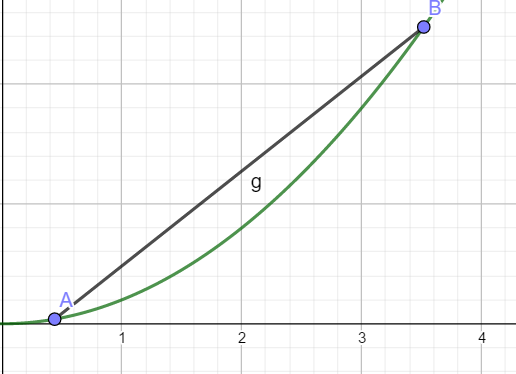
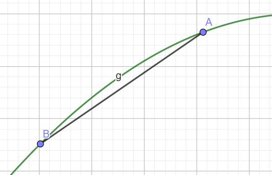
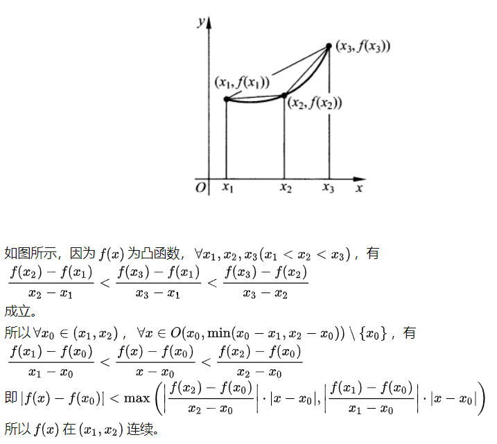

# 函数性态的研究

# 作出y=f(x)的图像

* $step1: 确定定义域$
* $step2: f(x)是否有对称性$
* $step3: 求y'=f',y''=f''$
* $step4: 求f(x)的单调区间, 极性, 驻点$
* $step5: 凹凸区间, 拐点$
* $step6: 渐近线$

# 严格单调

* $y=f(x)在区间I上严格单调递增 \Rightarrow f'(x)\geq 0$
  * $y=x^3$
* $f'(x)> 0 \Rightarrow y=f(x)在区间I上严格单调递增$

$证明: 用拉格朗日定理, x_2>x_1,f(x_2)-f(x_1)=(x_2-x_1)f(\xi)>0$

## 充要条件

$y=f(x)在区间I上严格单调递增$

$\Leftrightarrow f'(x)\geq 0 且 S\{x|f'(x)=0\}中的点不可能形成一个区间$

# 极值问题

$若x_0是y=f(x)的驻点, 即f'(x_0)=0, 且f''(x_0)>0时,$
$则x_0为f(x)的极小点$

$若x_0是y=f(x)的驻点, 即f'(x_0)=0, 且f''(x_0)<0时,$
$则x_0为f(x)的极大点$

$\because f(x)-f(x_0)$
$\displaystyle=f'(x_0)(x-x_0)+\frac{1}{2}f''(x_0)(x-x_0)^2+o((x-x_0)^2)$
$\displaystyle=\frac{1}{2}f''(x_0)(x-x_0)^2$
$>0$

$若f''(x_0)=0, 则将这个过程继续下去:$
$奇数次导等于0时, 不是极值点$
$偶数次导等于0时, 是极值点, 导数>0有极小点, 导数<0有极大点$

# 凹凸性

## 凸函数

$y=f(x)在I内,$
$f(\lambda x_1+(1-\lambda)x_2)\leq \lambda f(x_1)+(1-\lambda)f(x_2), 0<\lambda<1$

## 凹函数

$y=f(x)在I内,$
$f(\lambda x_1+(1-\lambda)x_2)\geq \lambda f(x_1)+(1-\lambda)f(x_2), 0<\lambda<1$

## 三点斜率不等式

## 凸函数连续

### 凸函数不一定可导

连续可导 => 可导 = 可微 => 左右导存在 = 连续 => 左连续 / 右连续

### 左右导存在

凸函数左导存在, 右导也存在, 所以凸函数连续, 但不一定可导

<!-- $\forall \varepsilon>0, \exist \delta, \forall x\in(x_0, x_0+\delta),$

$$
\begin{aligned}
f'_+(x)
&=\lim_{\Delta x\to 0}\frac{f(x_0+\Delta x)-f(x_0)}{\Delta x} \\
\end{aligned}
$$ -->

### 定理

$若f(x)为凸函数, 且f'(x)\exist \Leftrightarrow f'(x)单调递增$

# 拐点

$若y=f(x)在x_0点处切线存在, 且凹凸性发生变化, 则称拐点$

$当二阶导数存在时, 常用二阶导数表示$

# 渐近线

## 垂直渐近线

$\displaystyle\lim_{x\to x_0}f(x)=\infty$

$最多有无数条, 如y=\tan x$

## 水平渐近线

$\displaystyle\lim_{x\to \infty}f(x)=y_0$

$最多有两条, 如y=\arctan x$

## 斜渐近线

$\displaystyle\lim_{x\to \infty}[f(x)-(ax+b)]=0$

$\displaystyle\lim_{x\to \infty}\frac{f(x)-(ax+b)}{x}=0$
$\Rightarrow\displaystyle\lim_{x\to \infty}\frac{f(x)}{x}=a,\lim_{x\to \infty}\frac{f(x)}{x}=a,\lim_{x\to \infty}[f(x)-ax]=b$

$最多有两条, 如y=\arctan x+x$

# 作图范例

