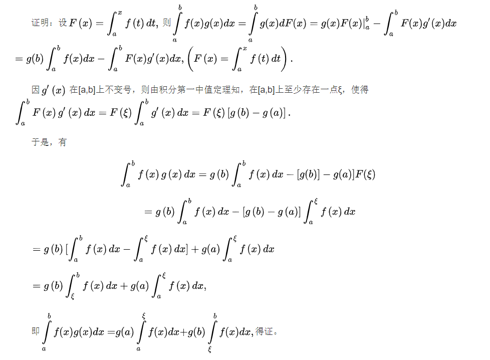

# 定积分

$f(x)有第一类间断点时, 无法用有限的初等函数表示$

# 定积分的换元

$不定积分\displaystyle\int f(\varphi(t)){\rm d}\varphi(t)=\int f(\varphi(t))\varphi'(t){\rm d}t$

$对于定积分, \displaystyle\int_a^bf(x){\rm d}x, 令x=\varphi(t), (连续可导, \varphi\in C[a,b])$

$其中\varphi[\alpha,\beta]\subset[a,b], \varphi(\alpha)=a, \varphi(\beta)=b$

$\displaystyle\int_a^bf(\varphi(t)){\rm d}\varphi(t)=\int_\alpha^\beta f(\varphi(t))\varphi'(t){\rm d}t$

---

$\displaystyle(\ln\frac{x}{2})'=\frac{\frac{1}{2}}{\frac{x}{2}}=\frac{1}{x}$

$\displaystyle(\ln x)'=\frac{1}{x}$

## 例题

$令x=R\sin t$

$$
\begin{aligned}
\int_0^R\sqrt{R^2-x^2}{\rm d}x&=\int_0^{\frac{\pi}{2}}\sqrt{R^2-\sin^2t}{\rm d}R\sin t \\
&=R^2\int_0^{\frac{\pi}{2}}\cos^2t{\rm d}t \\
\end{aligned}
$$

# 性质

## 偶函数的原函数不一定是奇函数

考虑常数项C

## 奇函数的原函数一定是偶函数

$令F(x)=\displaystyle\int_0^xf(x){\rm d}x+C$

$\therefore F(x)-F(-x)=\displaystyle\int_0^xf(x){\rm d}x+\int_{-x}^0f(x){\rm d}x=\int_{-x}^xf(x){\rm d}x=0$

$\therefore F(x)=F(-x)$

## 计算特性

$$
\displaystyle\int_{-a}^af(x){\rm d}x=\begin{cases}
0, &f(x)为奇函数 \\
\displaystyle 2\int_{0}^af(x){\rm d}x, &f(x)为偶函数 \\
\end{cases}
$$

$利用x=-t换元来证明$

## 例

$$
\int_{-\frac{\pi}{2}}^{\frac{\pi}{2}}\frac{x^2\sin x}{1+x^6}{\rm d}x=0
$$

## 周期函数

$若f(x)是以T>0为周期的函数, 则对于\forall a\in R$

$$
\int_a^{a+T}f(x){\rm d}x=\int_0^Tf(x){\rm d}x
$$

### 证明一

$令a=kT+r$

$令x=u+kT, x=u+(k+1)T,$
$当u=r时x=ku+r, 当u=r时x=(k+1)u+r$

$$
\begin{aligned}
&\int_a^{a+T}f(x){\rm d}x \\
=&\int_{kT+r}^{(k+1)T+r}f(x){\rm d}x \\
=&\int_{kT+r}^{(k+1)T}f(x-kT){\rm d}(x-kT)+\int_{(k+1)T}^{(k+1)T+r}f(x-(k+1)T){\rm d}(x-(k+1)T) \\
=&\int_{r}^{T}f(u){\rm d}u+\int_{0}^{r}f(v){\rm d}v \\
=&\int_{0}^{T}f(x){\rm d}x \\
\end{aligned}
$$

### 证明二

$$
\begin{aligned}
\int_a^{a+T}f(x){\rm d}x
&=\int_a^0f(x){\rm d}x+\int_0^Tf(x){\rm d}x+\int_T^{a+T}f(x){\rm d}x \\
&=\int_a^0f(x){\rm d}x+\int_0^Tf(x){\rm d}x+\int_T^{a+T}f(t+T){\rm d}(t+T) \\
&=\int_a^0f(x){\rm d}x+\int_0^Tf(x){\rm d}x+\int_0^{a}f(t){\rm d}t \\
&=\int_a^0f(x){\rm d}x+\int_0^Tf(x){\rm d}x+\int_0^{a}f(x){\rm d}x \\
&=\int_0^Tf(x){\rm d}x \\
\end{aligned}
$$

# 分部积分法

$\displaystyle\int u(x){\rm d}v(x)=u(x)\cdot v(x)-\int v(x){\rm d}u(x)$

$$
\begin{aligned}
\int_a^b f(x){\rm d}x&=\int_a^b u(x){\rm d}v(x) \\
&=[u(x)v(x)-\varphi(x)]|_a^b \\
\end{aligned}
$$

$定积分分部\displaystyle\int_a^bu(x){\rm d}v(x)=u\cdot v|_a^b-\int_a^bv{\rm d}u$

## 例

$\displaystyle I_n=\int_0^\frac{\pi}{2}\sin^nx{\rm d}x,J_n=\int_0^\frac{\pi}{2}\cos^nx{\rm d}x$

$令x=\frac{\pi}{2}-t易知I_n=J_n$

$
\begin{aligned}
I_n
&=\int_0^\frac{\pi}{2}\sin^{n-1}x\sin x{\rm d}x \\
&=-\int_0^\frac{\pi}{2}\sin^{n-1}x{\rm d}\cos x \\
&=-\sin^{n-1}x\cos x|_0^\frac{\pi}{2}+\int_0^\frac{\pi}{2}\cos x{\rm d}\sin^{n-1}x \\
&=-\sin^{n-1}x\cos x|_0^\frac{\pi}{2}+(n-1)\int_0^\frac{\pi}{2}\cos^2 x\sin^{n-2}x{\rm d}x \\
&=-\sin^{n-1}x\cos x|_0^\frac{\pi}{2}+(n-1)\int_0^\frac{\pi}{2}(1-\sin^2 x)\sin^{n-2}x{\rm d}x \\
&=-\sin^{n-1}x\cos x|_0^\frac{\pi}{2}+(n-1)I_{n-2}-(n-1)I_n \\
\end{aligned}
$

$
\therefore I_n=\displaystyle\frac{n-1}{n}I_{n-2}=
\begin{cases}
I_{2k+1}=\displaystyle\frac{(2k)!!}{(2k+1)!!} \\
I_{2k}=\displaystyle\frac{(2k-1)!!}{(2k)!!}\frac{\pi}{2} \\
\end{cases}
$

$可以用来逼近求\pi$

# 定积分第二中值定理

$\displaystyle\int_a^bf(x)g(x){\rm d}x, 其中g(x)\in C[a,b], f(x)\geq 0, f'(x)\leq 0且连续$
$则\exist\xi\in[a,b], 使得\displaystyle\int_a^bf(x)g(x){\rm d}x=f(a)\int_a^\xi g(x){\rm d}x$

## 证明

$令\displaystyle G(x)=\int_a^xg(t){\rm d}t, 则G'(x)=g(x)$

$
\begin{aligned}
\therefore\int_a^bf(x)g(x){\rm d}x&=\int_a^bf(x){\rm d}G(x) \\
&=f(x)G(x)|_a^b-\int_a^bG(x){\rm d}f(x) \\
&=f(b)G(b)-\int_a^bG(x)f'(x){\rm d}x \\
\end{aligned}
$

$G(x)在[a,b]上连续, 则有界, 记为m\leq G(x)\leq M$

$\therefore -mf'(x)\leq -G(x)f'(x)\leq -Mf'(x)$

$\therefore\displaystyle f(a)m\leq f(b)G(b)-m(f(b)-f(a))\leq f(b)G(b)-\int_a^bG(x)f'(x){\rm d}x\leq f(b)G(b)-M(f(b)-f(a))\leq f(a)M$

$\therefore \displaystyle f(a)m\leq \int_a^bf(x)g(x){\rm d}x\leq f(a)M$

$若f(a)\neq 0, 则\exist\xi\in[a,b], G(\xi)=\displaystyle\frac{\displaystyle\int_a^bf(x)g(x){\rm d}x}{f(a)}$

## 思考

$若没有f(x)\geq 0$

