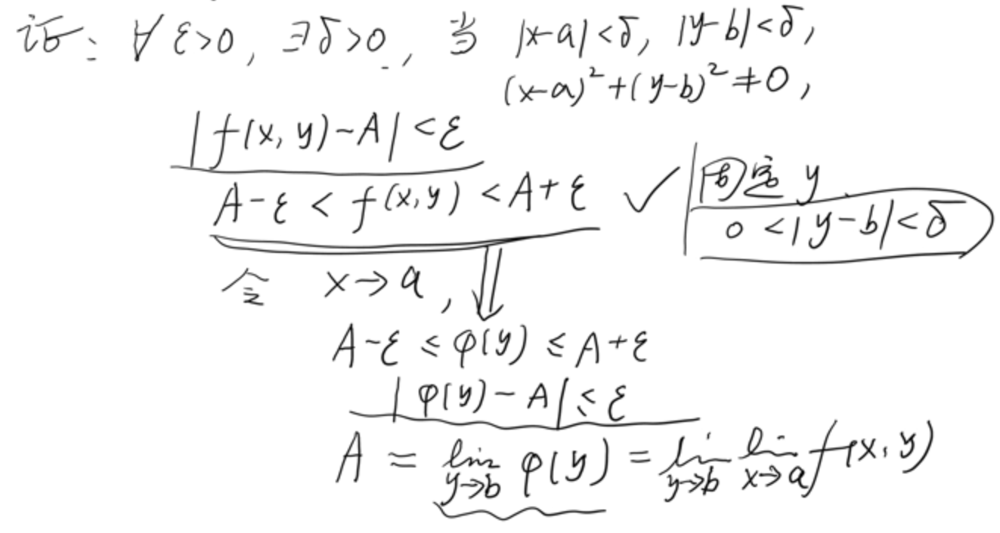

# 多元函数及其极限

## 重极限

$\forall\varepsilon>0, \exist\delta>0,$ 当 $0<||\vec{x}-\vec{a}||<\delta$ 时, 且 $\vec{x}\in D$, 有 $|f(\vec{x})-A|<\varepsilon $

$\forall\varepsilon>0, \exist\delta>0,$ 当 $x<\delta, y<\delta, (x-a)^2+(y-b)^2\neq 0$ 时, 且 $\vec{x}\in D$, 有 $|f(\vec{x})-A|<\varepsilon $

或者

$\forall\varepsilon>0, \exist\delta>0,$ s.t. $f([\bigcup(\vec{a}, \delta)]\bigcap D \setminus\{\vec{a}\})\subset \bigcup(A,\varepsilon)$

### 方法

证明有极限, 可以通过让 $x, y$ 同时小于同一个 $\delta$.

反驳有极限, 可以通过令 $y=g(x)$, 以不同方式趋近极限, 让结果不唯一.

## 累次极限

将 $x, y$ 中的任意一个先视为常数, 先后达到极限.

$\displaystyle\lim_{y\to b}\lim_{x\to a}f(x,y)=\lim_{y\to b}\varphi(y)$

$\displaystyle\lim_{x\to a}\lim_{y\to b}f(x,y)=\lim_{x\to a}\gamma(x)$

## 定理

若 (1) $\displaystyle\lim_{x\to a,y\to b}f(x,y)=A$; (2) $y\neq b$ 时, $\displaystyle\lim_{x\to a}f(x,y)=\varphi(y)$ 存在, 
则 $\displaystyle\lim_{y\to b}\lim_{x\to a}f(x,y)=\lim_{y\to b}\varphi(y)=A$

