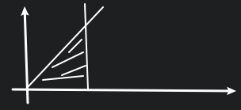
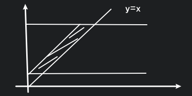
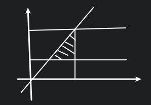

# 多元函数积分学

* 重积分
* 曲线积分
* 曲面积分

## 二重积分

$\displaystyle \iint_{D_{xy}}f(x,y)\Delta \sigma_i$

### 可积性

可积类型:

* 连续的
* 分段连续的

改变某些点处的值, 并不影响最终的积分.

### 曲顶柱体

二重积分在几何意义上来说是求一个曲顶柱体的体积.

$\displaystyle \iint_{D_{xy}}f(x,y)\Delta \sigma_i=\lim \sum f(\xi_i, \eta_i)\Delta \sigma_i=\iint_{D_{xy}}f(x,y)\Delta \sigma$

其中 $\Delta\sigma$ 称为面积元素.

### 性质

* $\displaystyle\iint_{D_{xy}}0{\rm d}\sigma=0$
* $\displaystyle\iint_{D_{xy}}{\rm d}\sigma=S(D_{xy})$
* $\displaystyle\iint_{D_{xy}}[f(x,y)\pm g(x,y)]{\rm d}\sigma=\iint_{D_{xy}}f(x,y){\rm d}\sigma \pm \iint_{D_{xy}}g(x,y){\rm d}\sigma$
* $\displaystyle\iint_{D_{xy}}\lambda f(x,y){\rm d}\sigma=\lambda\iint_{D_{xy}}f(x,y){\rm d}\sigma$
* 若 $f(x,y)\leq g(x,y)$ 则 $\displaystyle\iint_{D_{xy}}f(x,y){\rm d}\sigma \leq \iint_{D_{xy}}g(x){\rm d}\sigma$
* 若 $D_{xy}=D_1\cup D_2$ 且 ${\rm d}(D_1\cap D_2)=0$ 则 $\displaystyle\iint_{D_{xy}}f(x,y){\rm d}\sigma=\iint_{D_1}f(x,y){\rm d}\sigma \pm \iint_{D_2}f(x,y){\rm d}\sigma$ (积分区域可加性)
* $\displaystyle|\iint_{D_{xy}}f(x,y){\rm d}\sigma|=\iint_{D_{xy}}|f(x,y)|{\rm d}\sigma$
* $\displaystyle\iint_{D_{xy}}f(x,y)g(x,y){\rm d}\sigma=f(\xi, \eta)\iint_{D_{xy}}g(x,y){\rm d}\sigma$ (二重积分中值定理)

### 穿线法

对应 $\displaystyle\iint_a^b{\rm d}x\iint_{y_1(x)}^{y_2(x)}{\rm d}y$

同理也可以从 $y$ 轴开始穿线.

### 面包体积

切出一片片面包片.

$\displaystyle V=\int_a^b S(x){\rm d}x=\int_a^b[\int_{y_1(x)}^{y_2(x)}f(x,y){\rm d}y]{\rm d}x$

记为 $\displaystyle \int_a^b{\rm d}x\int_{y_1(x)}^{y_2(x)}f(x,y){\rm d}y$

二重积分就被化成了累次积分.

这是 $x$ 型区域.

对于 $y$ 型区域:

同理有

$\displaystyle V=\int_a^b S(x){\rm d}x=\int_a^b[\int_{x_1(x)}^{x_2(x)}f(x,y){\rm d}x]{\rm d}y$

记为 $\displaystyle \int_a^b{\rm d}y\int_{x_1(x)}^{x_2(x)}f(x,y){\rm d}x$

### 例一

$\displaystyle \iint_D x^2y^2{\rm d}x{\rm d}y, D: y=0, x=a, y=\frac{b}{a}x$

$\therefore \displaystyle \iint_D x^2y^2{\rm d}x{\rm d}y=\int_0^a{\rm d}x\int_0^{\frac{b}{a}x}x^2y^2{\rm d}y$

$\quad \displaystyle \iint_D x^2y^2{\rm d}x{\rm d}y=\int_0^b{\rm d}y\int_{\frac{a}{b}y}^ax^2y^2{\rm d}x$

### 例二

$\displaystyle \iint_D (x^2+y^2){\rm d}\sigma, D: y=a, y=3a, y=x, y=x+a$

这题显然应该用 $y$ 型区域求积分.

$\displaystyle \displaystyle \iint_D (x^2+y^2){\rm d}\sigma=\int_a^{3a}{\rm d}y\int_{y-a}^y (x^2+y^2){\rm d}x$

### 例三

$\displaystyle \iint_D \frac{y\sin x}{x^2-1}{\rm d}\sigma, D: 1\leq y\leq 2, y\leq x\leq 2$

$\therefore \displaystyle \iint_D \frac{y\sin x}{x^2-1}{\rm d}\sigma=\int_1^2{\rm d}x\int_1^x \frac{y\sin x}{x^2-1}{\rm d}y$

$\quad \displaystyle \iint_D \frac{y\sin x}{x^2-1}{\rm d}\sigma=\int_1^2{\rm d}y\int_y^2 \frac{y\sin x}{x^2-1}{\rm d}x$

其中后面一个积分是积不出来的, 只能选择第一个进行积分.

$\therefore \displaystyle \int_1^2{\rm d}x\int_1^x \frac{y\sin x}{x^2-1}{\rm d}y=\int_1^2\frac{\sin x}{x^2-1}{\rm d}x\int_1^x y{\rm d}y=\int_1^2\frac{1}{2}\sin x{\rm d}x$

### 例四

$\displaystyle I=\iint_D xy^2{\rm d}\sigma, D: |x|+|y|\leq 1$

在 $x$ 型区域是对称的, 由奇偶性可知

$I=0$

## 三重积分

$\displaystyle \iiint_{\Omega_{xyz}}f(x,y,z)\Delta V_i$

## 曲线积分

$\displaystyle \int_r f(x,y,z)\Delta s$

$
\begin{cases}
x=x(t) \\
y=y(t) \\
z=z(t) \\
\end{cases}
$

## 曲面积分

$\displaystyle \iint_{\sum}f(x,y,z)\Delta S_i$

$
\begin{cases}
x=x(u,v) \\
y=y(u,v) \\
z=z(u,v) \\
\end{cases}
$

