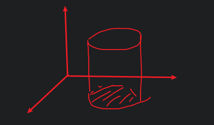
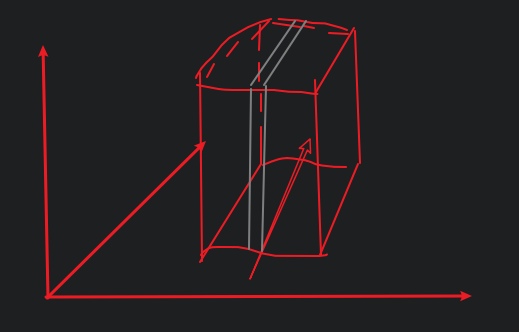
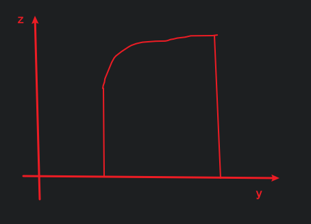
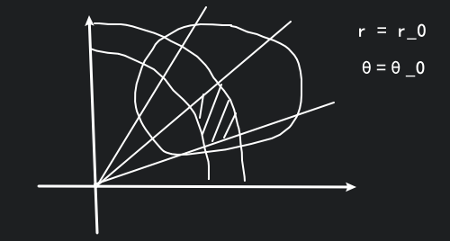
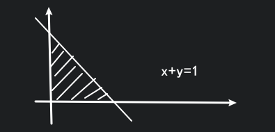
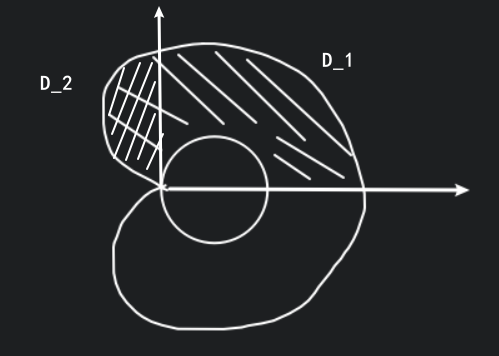
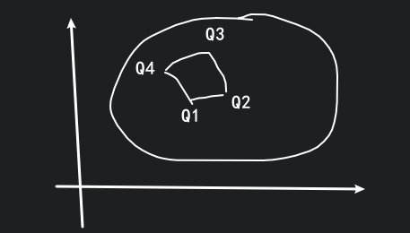
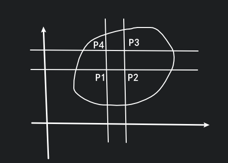
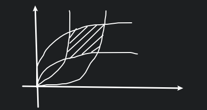

# 多元函数积分学

* 重积分
* 曲线积分
* 曲面积分

## 二重积分

$\displaystyle \iint_{D_{xy}}f(x,y)\Delta \sigma_i$

其中面积元素 $\Delta \sigma={\rm d}x{\rm d}y$

基本思想: 将二重积分化为累次积分.

### 可积性

可积类型:

* 连续的
* 分段连续的

改变某些点处的值, 并不影响最终的积分.

### 曲顶柱体

二重积分在几何意义上来说是求一个曲顶柱体的体积.

$\displaystyle \iint_{D_{xy}}f(x,y)\Delta \sigma_i=\lim \sum f(\xi_i, \eta_i)\Delta \sigma_i=\iint_{D_{xy}}f(x,y)\Delta \sigma$

其中 $\Delta\sigma$ 称为面积元素.

### 性质

* $\displaystyle\iint_{D_{xy}}0{\rm d}\sigma=0$
* $\displaystyle\iint_{D_{xy}}{\rm d}\sigma=S(D_{xy})$
* $\displaystyle\iint_{D_{xy}}[f(x,y)\pm g(x,y)]{\rm d}\sigma=\iint_{D_{xy}}f(x,y){\rm d}\sigma \pm \iint_{D_{xy}}g(x,y){\rm d}\sigma$
* $\displaystyle\iint_{D_{xy}}\lambda f(x,y){\rm d}\sigma=\lambda\iint_{D_{xy}}f(x,y){\rm d}\sigma$
* 若 $f(x,y)\leq g(x,y)$ 则 $\displaystyle\iint_{D_{xy}}f(x,y){\rm d}\sigma \leq \iint_{D_{xy}}g(x){\rm d}\sigma$
* 若 $D_{xy}=D_1\cup D_2$ 且 ${\rm d}(D_1\cap D_2)=0$ 则 $\displaystyle\iint_{D_{xy}}f(x,y){\rm d}\sigma=\iint_{D_1}f(x,y){\rm d}\sigma \pm \iint_{D_2}f(x,y){\rm d}\sigma$ (积分区域可加性)
* $\displaystyle|\iint_{D_{xy}}f(x,y){\rm d}\sigma|=\iint_{D_{xy}}|f(x,y)|{\rm d}\sigma$
* $\displaystyle\iint_{D_{xy}}f(x,y)g(x,y){\rm d}\sigma=f(\xi, \eta)\iint_{D_{xy}}g(x,y){\rm d}\sigma$ (二重积分中值定理)

### 穿线法

对应 $\displaystyle\iint_a^b{\rm d}x\iint_{y_1(x)}^{y_2(x)}{\rm d}y$

同理也可以从 $y$ 轴开始穿线.

### 面包体积

切出一片片面包片.

$\displaystyle V=\int_a^b S(x){\rm d}x=\int_a^b[\int_{y_1(x)}^{y_2(x)}f(x,y){\rm d}y]{\rm d}x$

记为 $\displaystyle \int_a^b{\rm d}x\int_{y_1(x)}^{y_2(x)}f(x,y){\rm d}y$

二重积分就被化成了累次积分.

这是 $x$ 型区域.

对于 $y$ 型区域:

同理有

$\displaystyle V=\int_a^b S(x){\rm d}x=\int_a^b[\int_{x_1(x)}^{x_2(x)}f(x,y){\rm d}x]{\rm d}y$

记为 $\displaystyle \int_a^b{\rm d}y\int_{x_1(x)}^{x_2(x)}f(x,y){\rm d}x$

### 例一

$\displaystyle \iint_D x^2y^2{\rm d}x{\rm d}y, D: y=0, x=a, y=\frac{b}{a}x$

$\therefore \displaystyle \iint_D x^2y^2{\rm d}x{\rm d}y=\int_0^a{\rm d}x\int_0^{\frac{b}{a}x}x^2y^2{\rm d}y$

$\quad \displaystyle \iint_D x^2y^2{\rm d}x{\rm d}y=\int_0^b{\rm d}y\int_{\frac{a}{b}y}^ax^2y^2{\rm d}x$

### 例二

$\displaystyle \iint_D (x^2+y^2){\rm d}\sigma, D: y=a, y=3a, y=x, y=x+a$

这题显然应该用 $y$ 型区域求积分.

$\displaystyle \displaystyle \iint_D (x^2+y^2){\rm d}\sigma=\int_a^{3a}{\rm d}y\int_{y-a}^y (x^2+y^2){\rm d}x$

### 例三

$\displaystyle \iint_D \frac{y\sin x}{x^2-1}{\rm d}\sigma, D: 1\leq y\leq 2, y\leq x\leq 2$

$\therefore \displaystyle \iint_D \frac{y\sin x}{x^2-1}{\rm d}\sigma=\int_1^2{\rm d}x\int_1^x \frac{y\sin x}{x^2-1}{\rm d}y$

$\quad \displaystyle \iint_D \frac{y\sin x}{x^2-1}{\rm d}\sigma=\int_1^2{\rm d}y\int_y^2 \frac{y\sin x}{x^2-1}{\rm d}x$

其中后面一个积分是积不出来的, 只能选择第一个进行积分.

$\therefore \displaystyle \int_1^2{\rm d}x\int_1^x \frac{y\sin x}{x^2-1}{\rm d}y=\int_1^2\frac{\sin x}{x^2-1}{\rm d}x\int_1^x y{\rm d}y=\int_1^2\frac{1}{2}\sin x{\rm d}x$

### 例四

$\displaystyle I=\iint_D xy^2{\rm d}\sigma, D: |x|+|y|\leq 1$

在 $x$ 型区域是对称的, 由奇偶性可知

$I=0$

## 极坐标系下的二重积分

$\displaystyle I=\iint_D f(x, y){\rm d}\sigma$

那么 ${\rm d}\sigma={\rm d}r{\rm d}\theta \ ?$

进行分割, 我们知道微元面积应为大扇形减小扇形.

$\displaystyle {\rm d}\sigma=\frac{1}{2}(r+\Delta r)^2\Delta \theta-\frac{1}{2}r^2\Delta \theta=r\Delta r\Delta\theta+\frac{1}{2}(\Delta r)^2\Delta\theta$

对高阶无穷小忽略不计, 得

${\rm d}\sigma=r{\rm d}r{\rm d}\theta$

### 先 $r$ 后 $\theta$ 积分

相当于一堆小扇形的一部分相加.

$\displaystyle I=\int_\alpha\beta{\rm d}\theta\int_{r_1(\theta)}^{r_2(\theta)}f(r\cos\theta, r\sin\theta)r{\rm d}r$

$r_1$ 在里, $r_2$ 在外.

### 先 $\theta$ 后 $r$ 积分

相当于一堆小圆环的一部分相加.

逆时针是正方向, 因为沿着逆时针方向, 角度在增大.

$\displaystyle I=\int_a^b r{\rm d}r\int_{\theta_1(r)}^{\theta_2(r)}f(r\cos\theta, r\sin\theta){\rm d}\theta$

### 例一

$\displaystyle I=\iint_Df(x,y){\rm d}\sigma$

当成 $\theta$ 型区域:

$\displaystyle I=\int_0^\frac{\pi}{2}{\rm d}\theta\int_0^{\frac{1}{\sin\theta+\cos\theta}}f(r\cos\theta, r\sin\theta)r{\rm d}r$

其中 $\displaystyle r=\frac{1}{\sin\theta+\cos\theta}$ 为 $x+y=1$ 的极坐标方程.

当成 $r$ 型区域:

分成三个部分.

$\because\displaystyle r\cos\theta+r\sin\theta=1$

$\therefore\displaystyle \theta=\arcsin\frac{1}{\sqrt{2}r}-\frac{\pi}{4}, \theta\in [0,\frac{\pi}{4}]$

$\quad\displaystyle \theta=\frac{3}{4}\pi-\arcsin\frac{1}{\sqrt{2}r}, \theta\in[\frac{\pi}{4}, \frac{\pi}{2}]$

$\displaystyle I=\int_0^{\frac{\sqrt{2}}{2}}r{\rm d}r\int_0^\frac{\pi}{2}f{\rm d}\theta+\int_{\frac{\sqrt{2}}{2}}^1r{\rm d}r\int_0^{\arcsin\frac{1}{\sqrt{2}r}-\frac{\pi}{4}}f{\rm d}\theta+\int_{\frac{\sqrt{2}}{2}}^1r{\rm d}r\int_{\frac{3}{4}\pi-\arcsin\frac{1}{\sqrt{2}r}}^\frac{\pi}{2}f{\rm d}\theta$

### 例二

求 $r=a(1+\cos\theta)$ 与 $r=a\cos\theta$ 围成的面积.

$\displaystyle I=\iint_Df(x, y){\rm d}\sigma=\iint_D{\rm d}\sigma=S(D)$

$\displaystyle S=\iint_{D_1}{\rm d}\sigma+\iint_{D_2}{\rm d}\sigma=\int_0^\frac{\pi}{2}{\rm d}\theta\int_{a\cos\theta}^{a(1+\cos\theta)}r{\rm d}r+\int_\frac{\pi}{2}^\pi{\rm d}\theta\int_0^{a(1+\cos\theta)}r{\rm d}r$

### 坐标变换

$\displaystyle \iint_{D_{xy}}f(x,y){\rm d}\sigma$, 令 $
\begin{cases}
x=x(u,v) \\
y=y(u,v) \\
\end{cases}
$ 使得 $D_{xy}\to D_{uv}$

有 $P_1(u_0, v_0),P_1(u_0+\Delta u, v_0),P_1(u_0+\Delta u, v_0+\Delta v),P_1(u_0, v_0+\Delta v)$

即 $Q_1(x(u_0, v_0), y(u_0, v_0)), Q_2(x(u_0+\Delta u, v_0), y(u_0+\Delta u, v_0))$

$\quad Q_3(x(u_0+\Delta u, v_0+\Delta v), y(u_0+\Delta u, v_0+\Delta v))$

$\quad Q_4(x(u_0, v_0+\Delta v), y(u_0, v_0+\Delta v))$

使用拉格朗日定理

$\displaystyle\overrightarrow{Q_1Q_2}=(\frac{\partial x}{\partial u}\Delta u, \frac{\partial y}{\partial u}\Delta u), \overrightarrow{Q_1Q_4}=(\frac{\partial x}{\partial v}\Delta v, \frac{\partial y}{\partial v}{\rm D}v)$

面积 $S=|\overrightarrow{Q_1Q_2}\times \overrightarrow{Q_1Q_4}|=\begin{vmatrix}\frac{\partial x}{\partial u}&\frac{\partial y}{\partial u}\\\frac{\partial x}{\partial v}&\frac{\partial y}{\partial v}\end{vmatrix}\Delta u\Delta v=|J|{\rm d}u{\rm d}v$

$\displaystyle I=\iint_Df(x,y){\rm d}x{\rm d}y=\iint f(x(u,v), y(u,v))|J|{\rm d}u{\rm d}v$

我们可以类推一元函数: $\displaystyle\int_a^bf(x){\rm d}x=\int_\alpha^\beta f(\varphi(t))\varphi'(t){\rm d}t$

这里的 $|J|$ 就相当于导数.

极坐标可以看作是这种变换的一种特殊形式:

$
\because
\begin{cases}
x=r\cos\theta \\
y=r\sin\theta \\
\end{cases}
$

$\therefore J=\begin{vmatrix}\cos\theta&\sin\theta\\-r\sin\theta&r\cos\theta\end{vmatrix}=r$

### 例三

$\displaystyle I=\iint_D(x^2+y^2){\rm d}\sigma, D: y=ax^2, y=bx^2, x=py^2, x=qy^2, 0<a<b, 0<p<q$

令 $\displaystyle\frac{y}{x^2}=u, \frac{x}{y^2}=v$

$
\therefore
\begin{cases}
x=u^{-\frac{2}{3}}v^{-\frac{1}{3}} \\
y=u^{-\frac{1}{3}}v^{-\frac{2}{3}}
\end{cases}
$

$\therefore\displaystyle J=\begin{vmatrix}-\frac{2}{3}u^{-\frac{5}{3}}v^{-\frac{1}{3}}&-\frac{1}{3}u^{-\frac{4}{3}}v^{-\frac{2}{3}}\\-\frac{1}{3}u^{-\frac{2}{3}}v^{-\frac{4}{3}}&-\frac{2}{3}u^{-\frac{1}{3}}v^{-\frac{5}{3}}\end{vmatrix}=\frac{1}{3u^2v^2}$

$\therefore\displaystyle I=\iint_{D_{uv}}(x^2+y^2)\frac{1}{3u^2v^2}{\rm d}u{\rm d}v=\iint_{D_{uv}}((u^{-\frac{2}{3}}v^{-\frac{1}{3}})^2+(u^{-\frac{1}{3}}v^{-\frac{2}{3}})^2)\frac{1}{3u^2v^2}{\rm d}u{\rm d}v$

### 例四: 椭球体体积

$\displaystyle V: \frac{x^2}{a^2}+\frac{y^2}{b^2}+\frac{z^2}{c^2}\leq 1$

$\therefore\displaystyle V=8\iint_{D_{xy}}c\sqrt{1-\frac{x^2}{a^2}-\frac{y^2}{b^2}}{\rm d}x{\rm d}y$

令 $
\begin{cases}
x=as\cos t \\
y=bs\sin t \\
\end{cases}
$

则有

$\because J=\begin{vmatrix}a\cos t&b\sin t\\-as\sin t&bs\cos t\end{vmatrix}=abs$

$\therefore\displaystyle V=8c\iint_{D_{st}}\sqrt{1-(s^2\cos^2t+s^2\sin^2t)} \ abs \ {\rm d}s{\rm d}t$

其中 $D_{st}: 0\leq s \leq 1, 0\leq t\leq \frac{\pi}{2}$

$\therefore\displaystyle V=8c\iint_{D_{st}}\sqrt{1-s^2} \ abs \ {\rm d}s{\rm d}t$

## 三重积分

$\displaystyle \iiint_{\Omega_{xyz}}f(x,y,z)\Delta V_i$

## 曲线积分

$\displaystyle \int_r f(x,y,z)\Delta s$

$
\begin{cases}
x=x(t) \\
y=y(t) \\
z=z(t) \\
\end{cases}
$

## 曲面积分

$\displaystyle \iint_{\sum}f(x,y,z)\Delta S_i$

$
\begin{cases}
x=x(u,v) \\
y=y(u,v) \\
z=z(u,v) \\
\end{cases}
$

