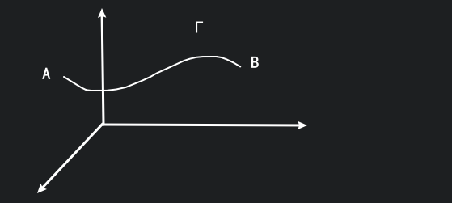
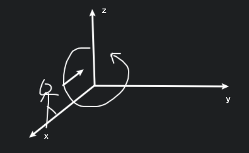

# 第Ⅱ型曲线积分

第Ⅰ型曲线积分称为对弧长的积分. 第Ⅱ型曲线积分称为对坐标的积分. 

## 思路

$\displaystyle \int_{r}f(x,y,z){\rm d}s=\int_\alpha^\beta f(x(t),y(t),z(t))\sqrt{x'(t)^2+y'(t)^2+z'(t)^2}{\rm d}t$

有一个 $\vec{F}$, 可以看作是物理模型中的力, 沿着曲线 $\Gamma$ 移动, 计算其所做的功. 

$\displaystyle\int_{\Gamma}\vec{F}\cdot {\rm d}\vec{s}=\int_{\Gamma}\vec{F}\cdot \vec{\tau}{\rm d}s$

若从 $A$ 点积到 $B$ 点, 可以形式化地记成 $\displaystyle\int_A^B\vec{F}\cdot {\rm d}\vec{s}$, 注意这里与定积分不一样.

$\displaystyle\vec{\tau}=\frac{\{x'(t),y'(t),z'(t)\}}{\sqrt{x'(t)^2+y'(t)^2+z'(t)^2}}=\{\cos\alpha,\cos\beta,\cos\gamma\}$

$\displaystyle\vec{\tau}\cdot {\rm d}s=\{\cos\alpha,\cos\beta,\cos\gamma\}{\rm d}s=\{{\rm d}x,{\rm d}y,{\rm d}z\}$

$\displaystyle\int\vec{F}\cdot \vec{\tau}{\rm d}s=\int_\alpha^\beta [P(x,y,z){\rm d}x+Q(x,y,z){\rm d}x+R(x,y,z){\rm d}z]$

要注意方向, 究竟是从哪个点开始积到哪个点, 这里是从 $\alpha$ 点积到 $\beta$ 点.

而另一种形式

$\displaystyle\int\vec{F}\cdot \vec{\tau}{\rm d}s=\int_m^M [P(x,y,z)\cos\alpha+Q(x,y,z)\cos\beta+R(x,y,z)\cos\gamma]{\rm d}s$

这里就要关注大小, $m=\min\{\alpha,\beta\}, M=\max\{\alpha,\beta\}$

如果使用参数方程:

$\displaystyle\int_\alpha^\beta P(x,y,z){\rm d}x=\int_\alpha^\beta P(x(t),y(t),z(t))x'(t){\rm d}t$

## 例一

$\displaystyle I=\int_r2xy{\rm d}x+x^2{\rm d}y, \Gamma:$ 以 $O(0,0)$ 为起点, $B(1,1)$ 为终点. $A(1,0)$.

### $y=x^2$:

$\displaystyle I=\int_0^12x\cdot x^2{\rm d}x+x^2{\rm d}x^2=\int_0^1(2x^3+2x^3){\rm d}x=1$

### $x=y^2$:

$\displaystyle I=\int_0^12y^2\cdot y{\rm d}y^2+y^4{\rm d}y=\int_0^15y^4{\rm d}y=1$

### 折线段 $\overrightarrow{OA}+\overrightarrow{AB}$:

$\displaystyle I=\int_{\overrightarrow{OA}}+\int_{\overrightarrow{AB}}=\int_0^12x\cdot 0{\rm d}x+\int_0^11^2{\rm d}y=1$

### $\Gamma:\begin{cases}x=x \\y=x^2\end{cases}$:

同理 $y=x^2$.

## 例二

$\displaystyle I=\oint_{\Gamma}-y{\rm d}x+x{\rm d}y, \Gamma: x^2+y^2=1$, 沿着逆时针方向.

$\displaystyle I=\int_0^{2\pi}[-\sin\theta{\rm d}\cos\theta+\cos\theta{\rm d}\sin\theta]=\int_0^{2\pi}{\rm d}\theta=2\pi$

可以推出来 $\displaystyle I=\oint_{\Gamma}-y{\rm d}x+x{\rm d}y=S$, 即封闭曲线围成的面积.

## 例三

$\displaystyle I=\int_{\Gamma}x{\rm d}x+y{\rm d}y+z{\rm d}z, \Gamma:\begin{cases}x^2+y^2+z^2=1 \\x+y+z=0\end{cases}$

站在 $x$ 轴正向看逆时针, 是指

这题中的 $\vec{F}=\{x,y,z\}$, 即是曲线的法向量, 与切线垂直.

可以很简单地得到: $I=0$.

