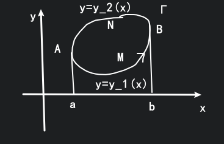
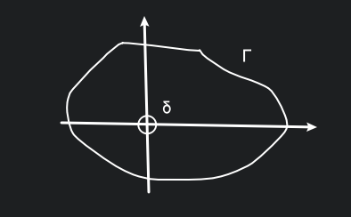

# Green公式

## 黎曼积分类型

* $\displaystyle \int_a^{b}f(x)\mathrm{d}x$
* $\displaystyle\iint_{D_{xy}}f(x,y)\mathrm{d}x\mathrm{d}y$
* $\displaystyle\iiint_Vf(x,y,z)\mathrm{d}x\mathrm{d}y\mathrm{d}z$
* $\displaystyle\int_{\Gamma}f(x,y,z)\mathrm{d}s \quad \int_\Gamma P\mathrm{d}x+Q\mathrm{d}y+R\mathrm{d}z$
* $\displaystyle\iint_{\Sigma}f(x,y,z)\mathrm{d}S \quad \iint_\Sigma P\mathrm{d}y\mathrm{d}z+Q\mathrm{d}z\mathrm{d}x+R\mathrm{d}x\mathrm{d}y$

## 三大积分公式

$\displaystyle \int_a^bf(x)\mathrm{d}x=F(x)|_a^b=F(b)-F(a)=\int_{\partial[a,b]}F(x)\mathrm{d}x$

我们有三大积分公式: Green公式, Gauss 公式, 斯托克斯公式

* Green公式 $\displaystyle \oint_\Gamma P\mathrm{d}x+Q\mathrm{d}y=\iint_{D_{xy}}\left( \frac{\partial Q}{\partial x} -\frac{\partial P}{\partial y}  \right)\mathrm{d}x\mathrm{d}y$
* Gauss 公式 $\displaystyle \iiint \left( \frac{\partial P}{\partial x} +\frac{\partial Q}{\partial y} +\frac{\partial R}{\partial z}  \right)\mathrm{d}V=\iint_\Sigma P\mathrm{d}y\mathrm{d}z+Q\mathrm{d}z\mathrm{d}x+R\mathrm{d}x\mathrm{d}y$
* 斯托克斯公式 $\displaystyle \iint_\Sigma \begin{vmatrix}	\cos\alpha &\cos\beta &\cos\gamma \\\frac{\partial }{\partial x}  &\frac{\partial }{\partial y}  &\frac{\partial }{\partial z}  \\	P &Q &R \end{vmatrix}\mathrm{d}S=\oint_\Gamma P\mathrm{d}x+Q\mathrm{d}y+R\mathrm{d}z$

## Green公式

$\displaystyle \oint_\Gamma P\mathrm{d}x+Q\mathrm{d}y=\iint_{D_{xy}}\left( \frac{\partial Q}{\partial x} -\frac{\partial P}{\partial y}  \right)\mathrm{d}x\mathrm{d}y$

1. $D_{xy}$ 是连通的.
2. $P(x,y), Q(x,y)$ 在 $D_{xy}$ 上连续可导.
3. $\Gamma$ 取正向, 即封闭区域始终在左边.

### 证明:

$\displaystyle\oint_\Gamma P(x,y)\mathrm{d}x=\iint_{D_{xy}}-\frac{\partial P}{\partial y}\mathrm{d}x\mathrm{d}y$

$a\leqslant x\leqslant b, y_1(x)\leqslant y\leqslant y_{2}(x)$

$
\begin{aligned}
P_L &=\oint_{\Gamma}=\int_{\overgroup{AMB}}+\int_{\overgroup{BNA}} \\
    &=\int_{a}^{b}P(x,y_1(x))\mathrm{d}x-\int_{a}^{b}P(x,y_2(x))\mathrm{d}x \\
\end{aligned}
$

$
\begin{aligned}
P_R &=\int_{a}^{b}\left[ \int_{y_{1}(x)}^{y_{2}(x)}-\frac{\partial P}{\partial y}\mathrm{d}(y) \right]\mathrm{d}x \\
    &=\int_{a}^{b}P(x,y_1(x))\mathrm{d}x-\int_{a}^{b}P(x,y_2(x))\mathrm{d}x  \\
\end{aligned}
$

## 曲线积分求面积

取 $P=-y, Q=x$

$\displaystyle \frac{1}{2}\oint_{\Gamma}-y\mathrm{d}x+x\mathrm{d}y=\iint_{D_{xy}}\mathrm{d}x\mathrm{d}y=S$

例如取 $\displaystyle D: \frac{x^{2}}{a^{2}}+\frac{y^{2}}{b^{2}}\leqslant 1, \begin{cases} x=a\cos\theta \\ y=b\sin \theta \end{cases}$

$
\begin{aligned}
S_{D_{xy}} 
&=\frac{1}{2}\oint_{\Gamma}-y\mathrm{d}x+x\mathrm{d}y \\
&=\frac{1}{2}\int_{0}^{2\pi}(-1\cdot b\sin \theta a\sin \theta+a\cos\theta\cdot b\cos\theta)\mathrm{d}\theta \\
&=\frac{1}{2}ab\int_{0}^{2\pi}\mathrm{d}\theta \\
&=\pi ab
\end{aligned}
$

## 例题

$\displaystyle I=\oint \frac{x\mathrm{d}y-y\mathrm{d}x}{x^{2}+y^{2}}=\oint_{\Gamma}P\mathrm{d}x+Q\mathrm{d}y$

不能用Green公式, 因为可能不可导

所以要

$
\Gamma: \begin{cases}
    x=\cos\theta \\
    y=\sin \theta
\end{cases}
$

$\displaystyle I=\int_{0}^{2\pi}\frac{\cos^{2}\theta+\sin^{2}\theta}{1}\mathrm{d}\theta=2\pi$

将题目改一下

$\Gamma$ 是包含 $O(0,0)$ 在内的一条任意的封闭曲线.

此时能用Green公式, 但是我们可以先将原点挖掉.

$\displaystyle I=\oint \frac{x\mathrm{d}y-y\mathrm{d}x}{x^{2}+y^{2}}=\oint_{\Gamma}P\mathrm{d}x+Q\mathrm{d}y=\oint_{\gamma+\Gamma\delta}-\oint_{\Gamma\delta}=+\oint_{\Gamma\delta}=2\pi$

不同的题目挖掉的形状是不一样的, 例如这题就是分母是 $x^{2}+y^{2}$, 所以用小圆来挖.

## 路径无关性质

1. $\displaystyle \frac{\partial Q}{\partial x}=\frac{\partial P}{\partial y}$
2. $\displaystyle \oint_{\Gamma}P\mathrm{d}x+Q\mathrm{d}y=0$
3. $\displaystyle \int_{\Gamma}P\mathrm{d}x+Q\mathrm{d}y$ 只与 $\Gamma$ 的起点和终点有关 (与路径无关)
4. $P\mathrm{d}x+Q\mathrm{d}y$ 是一个恰当微分, 即 $\exist u=u(x,y)$ 使 $\mathrm{d}u=P\mathrm{d}x+Q\mathrm{d}y$ 即 $\displaystyle P=\frac{\partial u}{\partial x}, Q=\frac{\partial u}{\partial y}$

这四个结论是等价的, 均是与路径无关的条件.

互相证明也很简单

$\displaystyle \oint=0$

$\displaystyle \oint=\int_{\Gamma_2}+\int_{\Gamma_1}=0$

$\displaystyle \oint=-\int_{\Gamma_1}+\int_{\Gamma_1}=0$

**与路径无关时有:**

$\displaystyle \int_{(x_0,y_0)}^{(x,y)}P(x,y)\mathrm{d}x+Q(x,y)\mathrm{d}y \Rightarrow \exist u=u(x,y), \frac{\partial u}{\partial x}=P, \frac{\partial u}{\partial y}=Q$

即要证明 $\mathrm{d}u=P\mathrm{d}x+Q\mathrm{d}y$

称为存在原函数.

**证明:**

用导数的性质和积分中值定理来证明:

$\displaystyle \frac{\partial u}{\partial x}=\lim_{\Delta x \to 0}\frac{u(x+\Delta x, y)-u(x,y)}{\Delta x}=\lim_{\Delta x \to 0}\frac{\displaystyle \int_{(x_0, y_0)}^{(x+\Delta x, y)}-\int_{(x_0, y_0)}^{(x, y)}}{\Delta x}=\lim_{\Delta x \to 0} \frac{\displaystyle \int_{(x,y)}^{(x+\Delta x, y)}P(x,y)\mathrm{d}x}{\Delta x}=\lim_{\Delta x \to 0}\frac{P(x+\theta \Delta x, y)\cdot \Delta x}{\Delta x}=P(x,y)$

