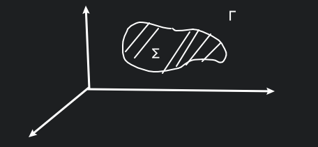
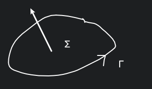
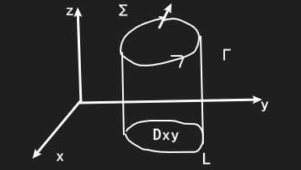

# 斯托克斯公式

## 形式

$\displaystyle \iint_\Sigma \begin{vmatrix}	\cos\alpha &\cos\beta &\cos\gamma \\\frac{\partial }{\partial x}  &\frac{\partial }{\partial y}  &\frac{\partial }{\partial z}  \\	P &Q &R \end{vmatrix}\mathrm{d}S=\oint_\Gamma P\mathrm{d}x+Q\mathrm{d}y+R\mathrm{d}z$

在空间中有几条封闭的曲线, 可以先看一条曲线, 这条曲线对应有一个第Ⅱ形的曲面积分:

$
\begin{aligned}
&\quad\ \oint_{\Gamma}P(x,y,z)\mathrm{d}x+Q(x,y,z)\mathrm{d}y+R(x,y,z)\mathrm{d}z \\
&=\iint_{\Sigma}\left[ \frac{\partial R}{\partial y}-\frac{\partial Q}{\partial z} \right]\mathrm{d}y\land \mathrm{d}z+\left[ \frac{\partial P}{\partial z}-\frac{\partial R}{\partial x} \right]\mathrm{d}z\land \mathrm{d}x+\left[ \frac{\partial Q}{\partial x}-\frac{\partial P}{\partial y} \right]\mathrm{d}x\land \mathrm{d}y  \\
&=\iint_\Sigma \begin{vmatrix}	\mathrm{d}y\land \mathrm{d}z &\mathrm{d}z\land \mathrm{d}x &\mathrm{d}x\land \mathrm{d}y \\\frac{\partial }{\partial x}  &\frac{\partial }{\partial y}  &\frac{\partial }{\partial z}  \\	P &Q &R \end{vmatrix} \\
&=\iint_\Sigma \begin{vmatrix}	\cos\alpha &\cos\beta &\cos\gamma \\\frac{\partial }{\partial x}  &\frac{\partial }{\partial y}  &\frac{\partial }{\partial z}  \\	P &Q &R \end{vmatrix}\mathrm{d}S \\
\end{aligned}
$

其中 $\Gamma$ 的取向与 $\Sigma$ 的侧满足右手规则.

## 证明

只需证明: $\displaystyle \oint_{\Gamma}P(x,y,z)\mathrm{d}x=\iint_{\Sigma}\frac{\partial P}{\partial z}\mathrm{d}z\land \mathrm{d}x-\iint_{\Sigma}\frac{\partial P}{\partial y}\mathrm{d}x\land \mathrm{d}y$

证明:

$\Sigma: z=z(x,y)$ 其投影为 $D_{xy}$, $L$ 是 $\Gamma$ 在 $xOy$ 面的投影

$L: \begin{cases}
    x=x(t) \\
    y=y(t) \\
    z=0 \\
\end{cases},
\Gamma: \begin{cases}
    x=x(t) \\
    y=y(t) \\
    z=z(x(t),y(t)) \\
\end{cases},
t\in (\alpha,\beta)$

这个过程中用参数方程, 将空间上的方程转成了平面上的方程, 再用 Green 公式.

$
\begin{aligned}
P_{\text{left}} &=\oint_{\Gamma}P(x,y,z)\mathrm{d}x \\
&=\int_{\alpha}^{\beta}P(x(t),y(t),z(x(t),y(t)))x'(t)\mathrm{d}t \\
&=\oint_{L}P(x,y,z(x,y))\mathrm{d}x \\
&=\oint_{L}P(x,y,z(x,y))\mathrm{d}x+0\mathrm{d}y \\
&=\iint_{D_{xy}}\left[ 0-\frac{\partial P}{\partial y} \right]\mathrm{d}x\land\mathrm{d}y \\
&=-\iint_{D_{xy}}\left[ \frac{\partial P}{\partial x}\frac{\partial x}{\partial y}+\frac{\partial P}{\partial y}\frac{\partial y}{\partial y}+\frac{\partial P}{\partial z}\frac{\partial z}{\partial y} \right]\mathrm{d}x\land\mathrm{d}y \\
&=-\iint_{D_{xy}}\left[ \frac{\partial P}{\partial y}+\frac{\partial P}{\partial z}\cdot z_{y} \right]\mathrm{d}x\land\mathrm{d}y \\
&=\iint_{D_{xy}}\frac{\partial P}{\partial z}\cdot (-z_{y})\mathrm{d}x\land\mathrm{d}y-\iint_{D_{xy}}\frac{\partial P}{\partial y}\mathrm{d}x\land\mathrm{d}y \\
&=\iint_{\Sigma}\frac{\partial P}{\partial z}\mathrm{d}z\land \mathrm{d}x-\iint_{D_{xy}}\frac{\partial P}{\partial y}\mathrm{d}x\land\mathrm{d}y \\
\end{aligned}
$

多元复合函数求偏导容易错, 例如:

$z=f(x,xy,x+y)$

$\displaystyle \frac{\partial z}{\partial x}=\frac{\partial f}{\partial x}\cdot \frac{\partial x}{\partial x}+\frac{\partial f}{\partial (xy)}\cdot \frac{\partial (xy)}{\partial x}+\frac{\partial f}{\partial (x+y)}\cdot \frac{\partial (x+y)}{\partial x}=\frac{\partial f}{\partial x}+f_2y+f_3$

注意这里的 $\displaystyle \frac{\partial z}{\partial x}$ 和 $\displaystyle \frac{\partial f}{\partial x}$ 并不一样, 要注意, 上文的两个 $\displaystyle \frac{\partial P}{\partial y}$ 就不一样.

而对于 $\Sigma: z-z(x,y)=0$, $\displaystyle \frac{\{-z_{x},-z_{y},1\}}{\sqrt{1+z_{x}^{2}+z_{y}^{2}}}$

$\displaystyle \frac{-z_{y}}{\sqrt{1+z_{x}^{2}+z_{y}^{2}}}=\cos \beta, \frac{1}{\sqrt{1+z_{x}^{2}+z_{y}^{2}}}=\cos \gamma$

$\displaystyle \iint_{\Sigma}\frac{\partial P}{\partial z}\mathrm{d}z\land \mathrm{d}x=\iint_{\Sigma}\frac{\partial P}{\partial z}\cos \beta\mathrm{d}S=\iint_{\Sigma} \frac{\partial P}{\partial z}\frac{\cos \beta}{\cos \gamma}\cos\gamma\mathrm{d}S=\iint_{\Sigma} \frac{\partial P}{\partial z}\frac{\cos \beta}{\cos \gamma}\mathrm{d}x\land \mathrm{d}y=\iint_{\Sigma} \frac{\partial P}{\partial z}(-z_{y})\mathrm{d}x\land \mathrm{d}y$

