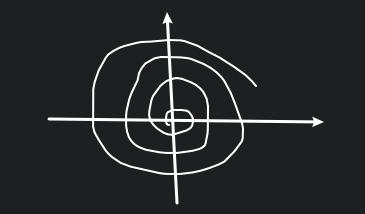

# 考试范围

## 积分

期中考过的会少一些, 不超过 30%, 20%.

主要是涉及到重积分, 曲线曲面积分那部分. 这部分以各种各样的计算, 几大积分公式为主. 还有可能有含有参变量的积分, 以及它的连续性, 可导性, 可积性.

## 数项级数

数项级数.

正项级数的判别法.

任意项级数的判别法.

## 函数项级数

连续, 可积, 可导的可交换性.

一致收敛性的分析.

## 幂级数

收敛范围的特殊性.

内闭一致收敛性

## 复习题

### 1.

$\displaystyle I=\iiint_{\Omega}(x+y+z)\mathrm{d}x\mathrm{d}y\mathrm{d}z, \Omega: \sqrt{x^{2}+y^{2}}\leqslant z\leqslant h$

$
\begin{aligned}
I&=\iint_{S}\mathrm{d}x\mathrm{d}y\int_{\sqrt{x^{2}+y^{2}}}^{h}(x+y+z)\mathrm{d}z \\
&=\iint_{S}\left[\frac{h^{2}}{2} + h \left(x + y\right) - \frac{x^{2}}{2} - \frac{y^{2}}{2} - \left(x + y\right) \sqrt{x^{2} + y^{2}}\right]\mathrm{d}x\mathrm{d}y \\
&=\int_{0}^{2\pi}\mathrm{d}\theta\int_{0}^{h}\left[ r(\cos\theta+\sin\theta)h+\frac{1}{2}h^{2}-r(\cos\theta+\sin\theta)r-\frac{1}{2}r^{2} \right]r\mathrm{d}r \\ 
&=2 \pi\int_{0}^{h}\left[ rh(\cos\theta+\sin\theta)+\frac{1}{2}h^{2}-r^{2}(\cos\theta+\sin\theta)-\frac{1}{2}r^{2} \right]r\mathrm{d}r \\
\end{aligned}
$

### 2.

设 $f\in C'\mathbb{R}$, 求 $\displaystyle \lim_{t \to 0} \frac{1}{t^{4}}\iint_{\Omega}f(\sqrt{x^{2}+y^{2}+z^{2}})\mathrm{d}x\mathrm{d}y\mathrm{d}z, \Omega: x^{2}+y^{2}+z^{2}\leqslant t^{2}$

令 $\begin{cases} x=\rho\sin\varphi\cos\theta \\ y=\rho\sin\varphi\sin\theta \\ z=\rho\cos\varphi \end{cases}$

原式即

$
\begin{aligned}
&\quad\ \lim_{t \to 0}\frac{1}{t^{4}}\int_{0}^{2\pi}\mathrm{d}\theta\int_{0}^{\pi}\mathrm{d}\varphi\int_{0}^{t}f(\rho)\cdot \rho^{2}\sin\varphi\mathrm{d}\rho \\
&=\displaystyle \lim_{t \to 0}\frac{1}{t^{4}}\cdot 2\pi\cdot 2\cdot \mathrm{d}\varphi\int_{0}^{t}f(\rho)\cdot \rho^{2}\mathrm{d}\rho \\
&=\lim_{t \to 0}\frac{\displaystyle 4\pi \int_{0}^{t}\rho^{2}f(\rho)\mathrm{d}\rho}{t^{4}} \\
&=\lim_{t \to 0}\frac{4\pi\cdot t^{2}f(t)}{4t^{3}} \\
&=\lim_{t \to 0}\frac{\pi f(t)}{t} \\
\end{aligned}
$

当 $f(t)\to 0$ 时, 可以继续洛必达 $\displaystyle \lim_{t \to 0}\frac{\pi f(t)}{t}=\lim_{t \to 0} f'(t)=f'(0)$

当 $f(t)\not\to 0$ 时, $\displaystyle \lim_{t \to 0}\frac{\pi f(t)}{t}\to +\infty$

### 3.

$\displaystyle \int_{L}x\mathrm{d}s, L:r=ae^{k\theta}, a>0$ 在 $r=a$ 内部.

曲线积分公式 $\displaystyle I=\int_{a}^{b}f(x(t),y(t))\sqrt{x'(t)^{2}+y'(t)^{2}}\mathrm{d}t$

而极坐标为 $\displaystyle I=\int_{\alpha}^{\beta}f(r(\theta)\cos\theta, r(\theta)\sin\theta)\sqrt{r(\theta)^{2}+r'(\theta)^{2}}$

这是一个无穷的积分.

所以从 $0$ 积到 $+\infty$.

### 4.

$\displaystyle \int_{L}x^{2}\mathrm{d}s, L: \begin{cases} x^{2}+y^{2}+z^{2}=a^{2} \\ x+y+z=0 \end{cases}, a>0$

$\therefore \displaystyle \oint_{L}x^{2}\mathrm{d}s=\frac{1}{3}\oint_{L}(x^{2}+y^{2}+z^{2})\mathrm{d}s=\frac{1}{3}a^{2}\oint_{L}\mathrm{d}s=\frac{1}{3}\pi a^{4}$

### 5.

$\displaystyle \int_{\partial\Omega}-\frac{y}{x^{2}+y^{2}}\mathrm{d}x+\frac{x}{x^{2}+y^{2}}\mathrm{d}y$, 其中 $\partial \Omega$ 是 $\Omega$ 的边界, 逆时针方向.

我们只需要挖掉中间的一个小圆 $\delta: x^{2}+y^{2}=\delta^{2}$

然后就能用 Green 公式了.

### 6.

$\displaystyle \iint_{\Sigma}x^{2}\mathrm{d}y\land \mathrm{d}z+y^{2}\mathrm{d}z\land \mathrm{d}x+z^{2}\mathrm{d}x\land \mathrm{d}y, \Sigma: (x-a)^{2}+(y-b)^{2}+(z-c)^{2}=R^{2}$, 取外侧方向.

我们可以做一部分, 由对称性可得其他部分.

$\displaystyle \iint_{\Sigma}z^{2}\mathrm{d}x\land \mathrm{d}y, z=z(x,y), \Sigma_{\text{top}}: c+\sqrt{R^{2}-(x-a)^{2}-(y-b)^{2}}, \Sigma_{\text{bottom}}: c-\sqrt{R^{2}-(x-a)^{2}-(y-b)^{2}}, D_{xy}: (x-a)^{2}+(y-b)^{2}\leqslant R^{2}$

$
\begin{aligned}
\iint_{\Sigma}z^{2}\mathrm{d}x\land \mathrm{d}y
&=\iint_{\Sigma_{\text{top}}}+\iint_{\Sigma_{\text{bottom}}} \\
&=\iint_{D_{xy}}\left( c+\sqrt{R^{2}-(x-a)^{2}-(y-b)^{2}} \right)^{2}\mathrm{d}x\mathrm{d}y \\
&-\iint_{D_{xy}}\left( c-\sqrt{R^{2}-(x-a)^{2}-(y-b)^{2}} \right)^{2}\mathrm{d}x\mathrm{d}y \\
&=4c\iint_{D_{xy}}\sqrt{R^{2}-(x-a)^{2}-(y-b)^{2}}\mathrm{d}x\mathrm{d}y \\
&=4c\int_{0}^{2\pi}\mathrm{d}\theta\int_{0}^{R}\sqrt{R^{2}-r^{2}}\cdot r\mathrm{d}r \\
&=8\pi c\cdot \frac{1}{3}R^{3} \\ 
&=\frac{8}{3}\pi c R^{3} \\ 
\end{aligned}
$

同理有 $\displaystyle \frac{8}{3}\pi a R^{3}, \frac{8}{3}\pi b R^{3}$

**或者用另一种方法:**

$\displaystyle I=2\iiint_{\Omega}(x+y+z)\mathrm{d}x\mathrm{d}y\mathrm{d}z$

令 $x-a=u, y-b=v, z-c=w$, 则

$\displaystyle I=2\iiint_{\Omega}(u+a+v+b+w+c)\mathrm{d}u\mathrm{d}v\mathrm{d}w, u^{2}+v^{2}+w^{2}\leqslant R^{2}$

$
\begin{aligned}
I&=2\iiint_{\Omega}(u+a+v+b+w+c)\mathrm{d}u\mathrm{d}v\mathrm{d}w \\
&=2\iiint_{\Omega}(u+v+w)\mathrm{d}u\mathrm{d}v\mathrm{d}w+2\iiint_{\Omega}(a+b+c)\mathrm{d}u\mathrm{d}v\mathrm{d}w \\
&=0+2(a+b+c)\iiint_{\Omega}\mathrm{d}u\mathrm{d}v\mathrm{d}w \\
&=\frac{8}{3}\pi R^{3}(a+b+c) \\
\end{aligned}
$

**或者再换一种做法, 将其换成第一型的曲面积分:**

令 $x-a=u, y-b=v, z-c=w$, 则

$\displaystyle I=\iint_{\Sigma'}(a+u)^{2}\mathrm{d}v\mathrm{d}w+(v+b)^{2}\mathrm{d}w\mathrm{d}u+(w+c)\mathrm{d}u\mathrm{d}v, \Sigma':u^{2}+v^{2}+w^{2}=R^{2}$

$\displaystyle \frac{\{u,v,w\}}{\sqrt{u^{2}+v^{2}+w^{2}}}=\{\frac{u}{R},\frac{v}{R},\frac{w}{R}\}$

$
\begin{aligned}
I&=\iint_{\Sigma'}(a+u)^{2}\mathrm{d}v\mathrm{d}w+(v+b)^{2}\mathrm{d}w\mathrm{d}u+(w+c)\mathrm{d}u\mathrm{d}v \\
&=\iint_{\Sigma'}[(a+u)^{2}\frac{u}{R}+(v+b)^{2}\frac{v}{R}+(w+c)\frac{w}{R}]\mathrm{d}S \\
&=\frac{1}{R}\iint_{\Sigma}[(u^{3}+v^{3}+w^{3})+2(au^{2}+bv^{2}+cw^{2})+(a^{2}u+b^{2}v+c^{2}w)]\mathrm{d}S \\
&=\frac{1}{R}\iint_{\Sigma}2(au^{2}+bv^{2}+cw^{2})\mathrm{d}S \\
\end{aligned}
$

我们又知道 $\displaystyle \iint_{\Sigma'}u^{2}\mathrm{d}S=\iint_{\Sigma'}v^{2}\mathrm{d}S=\iint_{\Sigma'}w^{2}\mathrm{d}S=\frac{1}{3}\iint_{\Sigma'}(u^{2}+v^{2}+w^{2})\mathrm{d}S=\frac{4}{3}\pi R^{4}$

$\displaystyle I=\frac{1}{R}\iint_{\Sigma}2(au^{2}+bv^{2}+cw^{2})\mathrm{d}S=\frac{8}{3}\pi R^{3}(a+b+c)$