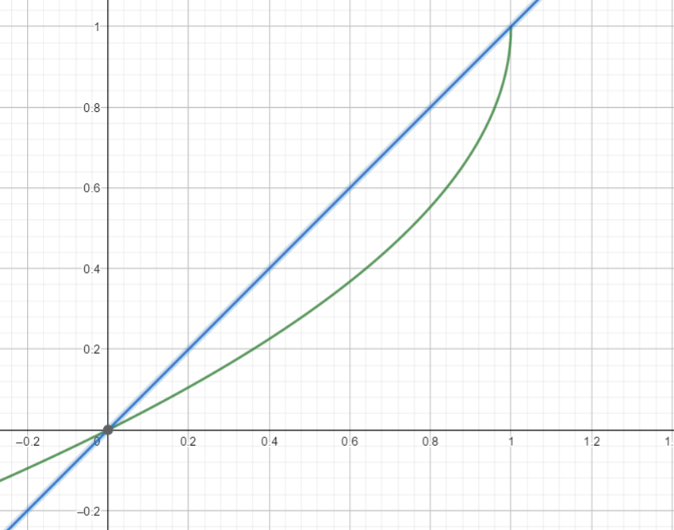
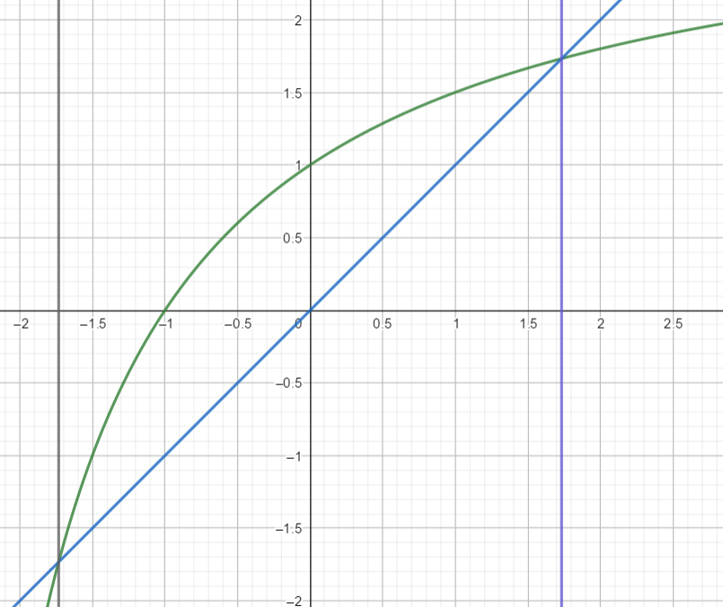
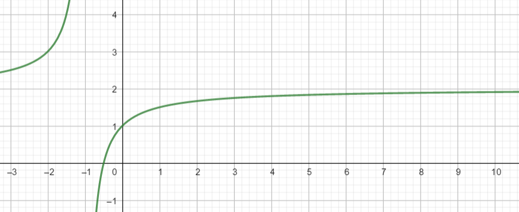

# 预备知识

## 三角不等式

$|a|-|b| \leq |a\pm b \leq |a| + |b|$

## 伯努利不等式

$$
a_i>-1 (i=1,2,\cdots,n)且同号
$$

$$
\prod_{i=1}^{n} (1+a_i) \geq 1+\sum_{i=1}^na_i
$$

或

$$
(1+x)^n \geq 1 + nx
$$

## 柯西不等式

$$
(\sum_{i=1}^nx_iy_i)^2 \leq (\sum_{i=1}^nx_i^2)(\sum_{i=1}^ny_i^2)
$$

## 平均值不等式

## 斯笃兹定理

$y_{n+1} > y_n, \displaystyle\lim_{n\to \infty} y_n = + \infty$

$\displaystyle \lim_{n \to \infty}\frac{x_n-x_{n-1}}{y_n-y_{n-1}} = \lim_{n \to \infty} \frac{x_n}{y_n}$

### 例

$\displaystyle \lim \frac{\sum a_n}{n} = a$

# 例一

$0 < x_1 < 1$

$x_n = 1 - \sqrt{1-x_{n-1}}$

用单调有界定理证明:

$x_n-x_{n-1} = 1 - x_{n-1} - \sqrt{1 - x_{n-1}} < 0$

${x_n}是单调递减的.$

$(1-x_n)^2=1-x_n$

$x_n = 1 或 x_n = 0$

$再用数学归纳法和不动点证明有界.$

$设f(x) = 1 - \sqrt{1-x}$

$\therefore x_n = f(x_{n-1})$

$(1)当 x = x_1, 0 < x_1 < 1$

$(2)假设0 < x_k < 1成立$

$\because f(x)单调递增$

$\therefore f(0) < f(x_k) < f(1)$

$\therefore 0 < x_{k+1} < 1$

$综上0 < x_n < 1, \{x_n\}递减, \{x_n\}收敛$

# 例二

$0 < x_1 < \sqrt{3}, f(x)=\displaystyle\frac{3(1+x)}{3+x}$

# 例三

$x_1 = 1, x_n = 1 + \displaystyle \frac{x_{n-1}}{1+x_{n-1}}$

$x_0是不动点也是极限, x_0 = \displaystyle\frac{\sqrt{5}+1}{2}$

$构造|x_n - x_0|=\displaystyle\frac{1}{\delta}|x_{n-1} - x_0| = \cdots = \frac{1}{\delta^{n-1}}|x_1 - x_0|$

$x_0 = 1 + \displaystyle\frac{x_0}{x_0 + 1}$

$$
\begin{aligned}
|x_n-x_0| &= \displaystyle|\frac{1+2x_{n-1}}{x_{n-1} + 1} - \frac{1+2x_0}{x_0 + 1}| \\
&= \frac{|x_{n-1}-x_0|}{(1+x_0)(1+x_{n-1})}  \\
&< \frac{|x_{n-1}-x_0|}{1+x_0} \\
&< \cdots \\
&< \frac{|x_1-x_0|}{(1+x_0)^{n-1}} \\
&\to 0
\end{aligned}
$$

# 例四

