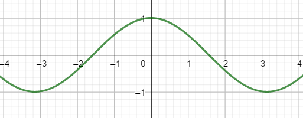

习题2.1：（A）1（2、3），2，6，7，8，18，（B）1，3，4，5
习题2.2：（A）1（4、9），3（4、19、13），6（1、3、4、6），8

# 2.1(A)

# 1.

## (2)

$$
\begin{aligned}
f'(x)&=\lim_{\Delta x\to 0}\frac{f(x+\Delta x)-f(x)}{\Delta x} \\
&=\lim_{\Delta x\to 0}\frac{\ln(x+\Delta x)-\ln x}{\Delta x} \\
&=\lim_{\Delta x\to 0}\frac{\ln(1+\frac{\Delta x}{x})}{\Delta x} \\
&=\lim_{\Delta x\to 0}\frac{\Delta x}{x\cdot \Delta x} \\
&=\frac{1}{x}
\end{aligned}
$$

## (3)

$$
\begin{aligned}
f'(0)&=\lim_{\Delta x\to 0}\frac{f(0+\Delta x)-f(0)}{\Delta x} \\
&=\lim_{\Delta x\to 0}\frac{(0+\Delta x)^2\sin\frac{1}{0+\Delta x}-\Delta x^2\sin\frac{1}{\Delta x}}{\Delta x} \\
&=0
\end{aligned}
$$

# 2.

## (1)

$$
\begin{aligned}
&\lim_{\Delta x\to 0}\frac{f(x_0-\Delta x)-f(x_0)}{\Delta x} \\
=&-\lim_{\Delta x\to 0}\frac{f(x_0+(-\Delta x))-f(x_0)}{-\Delta x} \\
=&-f'(x_0)
\end{aligned}
$$

## (2)

$$
\begin{aligned}
&\lim_{h\to 0}\frac{f(x_0+h)-f(x_0-h)}{h} \\
&\lim_{h\to 0}\frac{f(x_0+h)-f(x_0)+f(x_0)-f(x_0-h)}{h} \\
=&\lim_{h\to 0}\frac{f(x_0+h)-f(x_0)}{h}+\lim_{h\to 0}\frac{f(x_0-h)-f(x_0)}{-h} \\
=&2f'(x_0)
\end{aligned}
$$

## (3)

$$
\begin{aligned}
&\lim_{n\to+\infty}n[f(x_0+\frac{1}{n})-f(x_0)] \\
=&\lim_{n\to+\infty}\frac{f(x_0+\frac{1}{n})-f(x_0)}{\frac{1}{n}} \\
=&f'(x_0)
\end{aligned}
$$

## (4)

$$
\begin{aligned}
&\lim_{x\to x_0}\frac{x_0f(x)-xf(x_0)}{x-x_0} \\
=&\lim_{x\to x_0}\frac{x_0f(x_0+(x-x_0))-(x_0+x-x_0)f(x_0)}{x-x_0} \\ 
=&\lim_{x\to x_0}\frac{x_0f(x_0+(x-x_0))-x_0f(x_0)}{x-x_0}-\lim_{x-x_0}\frac{(x-x_0)f(x_0)}{x-x_0} \\ 
=&x_0f'(x_0)-f(x_0)
\end{aligned}
$$

# 6.

## (a)

## (b)

# 7.

$\because f是偶函数, f'(0)存在$

$\therefore f(x)=f(-x)$

$
\begin{aligned}
\therefore f'(0)&=\displaystyle\lim_{\Delta x \to 0}\frac{f(0+\Delta x)-f(0)}{\Delta x} \\
&=-\displaystyle\lim_{\Delta x \to 0}\frac{f(0-\Delta x)-f(0)}{-\Delta x} \\
&=-f'(0)
\end{aligned}
$

$\therefore 2f'(0)=0$

$\therefore f'(0)=0$

# 8.

