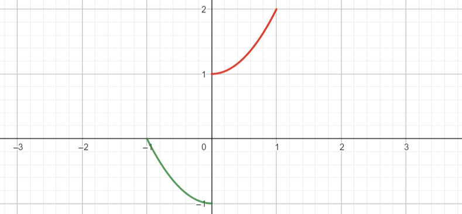
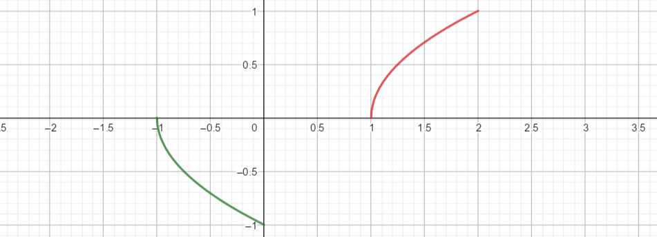
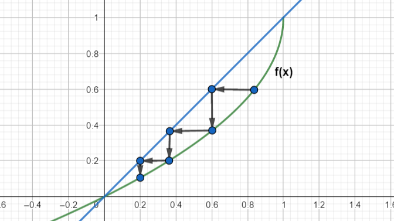

习题1.1：（A）5，9，16（4），20，（B）5，7，

习题1.2：1，6，7（2），10（2、3、6），11（4），12，14，（B），2（2），3，5

---

# 习题1.1 (A)

# 5.

### 无界:

$\forall M > 0, \exist X \in A, 使得|X|>M$

### 上无界:

$\forall M \in \mathbf{R}, \exist X \in A, 使得X>M$

### 下无界:

$\forall M \in \mathbf{R}, \exist X \in A, 使得X<M$

# 9.

(1) 满射

(2) 满射

(3) 单射

# 16.(4)

是由 $y = \sqrt{x}$ , $y=\ln x$, $y=x^2$ 和 $y=\arcsin x$ 复合而成的.

$\because \sqrt{1+\ln^2(\arcsin x)}$

$\therefore 1+\ln^2(\arcsin x) \geq 0$

$\therefore \arcsin x > 0$

$\therefore 0 < x \leq 1$

# 20.

$设底面半径为r.$

$底面半径C = 2\pi r = \theta R$

$\therefore r = \displaystyle\frac{\theta R}{2\pi}$

$\therefore 底面面积S = \pi r^2= \displaystyle\frac{\theta^2 R^2}{4\pi}$

$\therefore 高h=\sqrt{R^2 - r^2} = \sqrt{R^2 - \displaystyle\frac{\theta^2 R^2}{4\pi^2}}$

$\therefore 容积V(\theta) = \displaystyle\frac{1}{3}Sh = \frac{\theta^2 R^2}{12\pi}\sqrt{R^2 - \displaystyle\frac{\theta^2 R^2}{4\pi^2}}$

$其中定义域为:$

$\because R^2-r^2=(R+r)(R-r)>0$

$\therefore R > r = \displaystyle\frac{\theta R}{2\pi}>0$

$\therefore 0 < \theta < 2\pi$

$\therefore 定义域为 (0, 2\pi)$

# 习题1.1 (B)

# 5.

$$
f(x) = 
\begin{cases}
&x^2-1, x\in[-1, 0) \\
&x^2+1, x\in[0,1]
\end{cases}
$$

所以

$$
f^{-1}(x) =
\begin{cases}
&-\sqrt{x+1}, x\in (-1, 0] \\
&\sqrt{x-1}, x\in [1,2]
\end{cases}
$$

# 7.

$\because f(xy)=f(x)f(y)-x-y$

### $令 x=1, y=1.$

$\therefore f(1)=f^2(1)-2$

$\therefore f(1)=2 或 f(1)=-1$

### $令 x=0, y=0.$

$\therefore f(0)=f^2(0)$

$\therefore f(0)=0 或 f(0)=1$

### $假设f(1)=-1$

$令 y=1.$

$\therefore f(x)=-f(x)-x-1$

$\therefore f(x)=\displaystyle\frac{-x-1}{2}$

$\therefore f(0)=-\displaystyle\frac{1}{2}不符合题意$

### $假设f(1)=2$

$令 y=1.$

$\therefore f(x)=2f(x)-x-1$

$\therefore f(x)=x+1$

$\therefore f(0)=0+1=1符合题意$

### $综上f(x)=x+1$

# 习题1.2 (A)

# 1.

(1) $不能, 无穷多个\varepsilon并不能代表对任意的\varepsilon都成立.$

(2) $不能, 无穷多项a_n并不能代表对N以后的任意a_n都成立.$

(3) $不能, 可能找到比\varepsilon_0还要小的正数\varepsilon使得|a_n-a| > \varepsilon$

# 6.

## (1)

正确.

### 证明:

$\because \displaystyle\lim_{n\to\infty}a_n=A$

$\therefore \forall \varepsilon > 0 ,\exist N > 0, 使得n>N时,  |a_n - A| < \varepsilon$

$当A=0, n>N时, 有|a_n|<\varepsilon, 即有||a_n|-|0||<\varepsilon成立$

$当A\neq 0, n>N时, 由保号性可知a_n和A同号.$

$\therefore ||a_n|-|A||=|a_n - A|<\varepsilon$

$综上 \displaystyle\lim_{n\to \infty}|a_n|=|A|$

## (2)

不正确.

### 证明:

$令\{a_n\} 的通项公式a_n=1, A=-1$

$易知 \displaystyle\lim_{n\to\infty}|a_n|=|A|=1 且 \lim_{n\to\infty}a_n=1 \neq A=-1$

## (3)

正确.

### 证明:

$\because \displaystyle\lim_{n\to\infty}|a_n|=0$

$\therefore \forall \varepsilon > 0 ,\exist N > 0, 使得n>N时,  ||a_n| - 0| < \varepsilon$

$\therefore 当n>N时, |a_n - 0|= ||a_n||= ||a_n| - 0| < \varepsilon$

$\therefore \displaystyle\lim_{n\to \infty}a_n=0$

## (4)

正确.

### 证明:

$\because \displaystyle\lim_{n\to\infty}a_n=A$

$\therefore \forall \varepsilon > 0 ,\exist N > 0, 使得n>N时,  |a_n - A| < \varepsilon$

$\because n + 1 > n > N$

$\therefore |a_{n+1} - A| < \varepsilon$

$\therefore \displaystyle\lim_{n\to\infty}a_{n+1}=A$

## (5)

不正确.

### 证明:

$令 A = 0, 则a_n可能为0.$

$\because 分母不能为0.$

$\therefore \displaystyle\lim_{n\to\infty}\frac{a_{n+1}}{a_n}=A不成立$

## (6)

不正确.

### 证明:

$令\alpha=0, \{a_n\}的通项公式a_n=1, A=2$

$\therefore \displaystyle\lim_{n\to\infty}\alpha a_n=\alpha A=0$

$但是此时\displaystyle\lim_{n\to\infty}a_n=1\neq A=2$

## Correct

正确.

### 证明:

$\therefore |\alpha a_n-\alpha A|<\varepsilon$

$\therefore |a_n- A|<\frac{\varepsilon}{\alpha}$

# 7.(2)

$对任意\varepsilon>0,要使$

$$
|n-\sqrt{n^2-n} - \frac{1}{2}|<\varepsilon
$$

成立

$$
\begin{aligned}
|\sqrt{n^2}-\sqrt{n^2-n} - \frac{1}{2}|&= |\frac{n}{\sqrt{n^2}+\sqrt{n^2-n}} - \frac{1}{2}| \\
&\leq |\frac{n}{\sqrt{n^2}+\sqrt{n^2-2n+1}} - \frac{1}{2}| \\
&=|\frac{n}{2n-1} - \frac{1}{2}| \\
&=|\frac{1}{4n-2}| \\
&\leq \varepsilon
\end{aligned}
$$

$\therefore 4n-2 \geq \displaystyle\frac{1}{\varepsilon}$

$\therefore n \geq \displaystyle\frac{1}{4\varepsilon} + \frac{1}{2}$

$\therefore n > N = \min\{1, [\displaystyle\frac{1}{4\varepsilon} + \frac{1}{2}]\}$

# 10.

## (2)

$$
\begin{aligned}
&\lim_{n\to\infty}\frac{3^n+(-2)^n}{3^{n+1}+(-2)^{n+1}} \\
=&\lim_{n\to\infty}\frac{1+(\displaystyle\frac{-2}{3})^n}{3-2(\displaystyle\frac{-2}{3})^n} \\
=&\frac{\displaystyle\lim_{n\to\infty}1+(\frac{-2}{3})^n}{\displaystyle\lim_{n\to\infty}3-2(\frac{-2}{3})^n} \\
=&\frac{1}{3}
\end{aligned}
$$

## (3)

$$
\begin{aligned}
&\lim_{n\to\infty}\left(\frac{1+2+\cdots+n}{n+2}-\frac{n}{2}\right) \\
=&\lim_{n\to\infty}\left(\frac{n(1+n)}{2n+4}-\frac{n(n+2)}{2n+4}\right) \\
=&\lim_{n\to\infty}\frac{-n}{2n+4} \\
=&\lim_{n\to\infty}\frac{-1}{2+\displaystyle\frac{4}{n}} \\
=&\frac{-1}{\displaystyle\lim_{n\to\infty}(2+\frac{4}{n})} \\
=&-\frac{1}{2} \\
\end{aligned}
$$

## (6)

易知

$$
\sqrt[n]{2} \leq \sqrt[n]{2+\sin^2n} \leq \sqrt[n]{3}
$$

又有

$$
\lim_{n\to\infty}\sqrt[n]{2}=1 ,\lim_{n\to\infty}\sqrt[n]{3}=1
$$

由夹逼定理可知

$$
\lim_{n\to\infty}\sqrt[n]{2+\sin^2n}=1
$$

# 11.(4)

$为了证明\{a_n\}收敛, 只需证明它满足\text {Chauchy}条件. 由于\forall n, p\in \mathbf{N_+}$

$$
\begin{aligned}
|a_{n+p}-a_n|=&\frac{1}{(n+1)!} + \frac{1}{(n+2)!} + \cdots + \frac{1}{(n+p)!} \\
<& \frac{1}{n(n+1)} + \frac{1}{(n+1)(n+2)} + \cdots + \frac{1}{(n+p-1)(n+p)} \\
=& \frac{1}{n} - \frac{1}{n+1} + \frac{1}{n+1} - \frac{1}{n+2} + \cdots + \frac{1}{n+p-1} - \frac{1}{n+p} \\
=& \frac{1}{n} -\frac{1}{n+p} \\
<& \frac{1}{n} \\
\end{aligned}
$$

$所以, \forall \varepsilon > 0, 只要取N=[\displaystyle\frac{1}{\varepsilon}], 则\forall n>N以及p\in \mathbf{N_+}, 恒有|a_{n+p}-a_n|<\varepsilon, 故\{a_n\}满足\text{Cauchy}条件, 所以收敛.$

# 12.

证明: 

$\because 该数列是\text{Cauchy}数列$

$\therefore 该数列收敛$

$\therefore 该数列有界$

$\therefore 由\text{Weierstrass}定理知该数列存在收敛子列$

# 14-like

$令x_{n+1}=x_n, 带入x_{n+1}=\displaystyle\frac{3(x_n+1)}{x_n+3}, 解得:$

$x(x+3)-3x-3=x^2-3=0$

$x_n=\sqrt{3} 或 x_n=-\sqrt{3}$

$令f(x)=\displaystyle\frac{3(x+1)}{x+3}=3-\frac{6}{x+3}, f(x)在(0,+\infty)递增$

$\therefore f(\pm \sqrt{3})=\pm \sqrt{3}$

$\because x_{n+1}-x_n=\displaystyle\frac{3x_n+3-x_n(x_n+3)}{x_n+3}=\frac{3-x_n^2}{x_n+3}>0,$

$因为在后面可证得x_n<\sqrt{3}$

$\therefore \{x_n\}是递增数列$

$使用数学归纳法$

$①当n=1时, 有0<x_1=1<\sqrt{3}$

$②假设当n=k时, 有0<x_k<\sqrt{3}成立$

$当n=k+1时,$

$\because 0<x_k<\sqrt{3}且 x_k<x_{k+1}且 x_{k+1}=f(x_k), f(\sqrt{3})=\sqrt{3}$

$\therefore 0<x_k<f(x_{k+1})<f(\sqrt{3})$

$\therefore 0<x_{k_1}<\sqrt{3}$

$\therefore 由数学归纳法可证得0<x_n<\sqrt{3}$

$\therefore 由单调有界定理可知\lim x_n 存在, 设\lim x_n=A$

$\therefore \lim x_{n+1}=A$

$\because x_{n+1}=\displaystyle\frac{3(x_n+1)}{x_n+3}$

$\therefore A=\displaystyle\frac{3(A+1)}{A+3}$

$\therefore A=\sqrt{3}, A=-\sqrt{3}(舍去)$

$\therefore \lim x_n=\sqrt{3}$

# 14.

### 证明数列$\{x_n\}$收敛:

$令x_{n+1}=x_n, 带入x_{n+1}=1-\sqrt{1-x_n}, 解得:$

$x_n=0 或 x_n=1$

$令f(x)=1-\sqrt{1-x}$

$即有f(0)=0, f(1)=1$

$由图可知, f(x)在[0,1]单调递增, 数列\{x_n\}是单调减数列.$

由数学归纳法:

(1) $当x_n=x_1时, 0 < x_1 < 1成立$

(2)

$假设当x_n=x_k时, 0 < x_k < 1成立$

$当x_n=x_{k+1}时,$

$\because f(x) 在 [0,1]单调递增$

$\therefore f(0) < f(x_k) < f(1)$

$\therefore 0 < x_{k+1} < 1$

$综上可知\{x_n\}是有界的, 又因\{x_n\}是单调递减数列$

$\therefore \{x_n\}收敛$

### $求\displaystyle\lim_{n\to\infty}x_n$:

$设\displaystyle\lim_{n\to\infty}x_n=A,  f(x)=1-\sqrt{1-x}$

$\because 0 < x_n < 1$

$\therefore A \geq 0$

#### $假设 A > 0$

$\therefore\forall \varepsilon >0 ,\exist N, \forall n> N, 使得0 \leq |x_n - A| = x_n - A < \varepsilon$

$\therefore A \leq x_n < A + \varepsilon$

$令A=1-\sqrt{1-x}$

$\therefore 1-x=(1-A)^2$

$\therefore x=1-(1-A)^2 > A$

$若x_{n-2}=1-(1-A)^2, 则x_{n-1}=f(x_{n-2})=A$

$\therefore x_n=f(x_{n-1}) < x_{n-1}=A, 与 A \leq x_n矛盾$

$若A<x_{n-2}<1-(1-A)^2, 则x_{n-1}<f(x_{n-2})=A$

$\therefore x_n=f(x_{n-1}) < x_{n-1}<A, 与 A \leq x_n矛盾$

#### $综上$

$A = 0$

### 求$\displaystyle\lim_{n\to\infty}\frac{x_{n+1}}{x_n}$:

$证明\displaystyle\lim_{n\to\infty}(n-\sqrt{n^2-n})=\frac{1}{2}$

$对任意\varepsilon>0,要使$

$$
|n-\sqrt{n^2-n} - \frac{1}{2}|<\varepsilon
$$

成立

$$
\begin{aligned}
|\sqrt{n^2}-\sqrt{n^2-n} - \frac{1}{2}|&= |\frac{n}{\sqrt{n^2}+\sqrt{n^2-n}} - \frac{1}{2}| \\
&\leq |\frac{n}{\sqrt{n^2}+\sqrt{n^2-2n+1}} - \frac{1}{2}| \\
&=|\frac{n}{2n-1} - \frac{1}{2}| \\
&=|\frac{1}{4n-2}| \\
&\leq \varepsilon
\end{aligned}
$$

$\therefore 4n-2 \geq \displaystyle\frac{1}{\varepsilon}$

$\therefore n \geq \displaystyle\frac{1}{4\varepsilon} + \frac{1}{2}$

$\therefore n > N = \min\{1, [\displaystyle\frac{1}{4\varepsilon} + \frac{1}{2}]\}$

$\therefore \displaystyle\lim_{n\to\infty}(n-\sqrt{n^2-n})=\frac{1}{2}$

#### 对原式:

$$
\begin{aligned}
\lim_{n\to\infty}\frac{x_{n+1}}{x_n} &= \frac{1-\sqrt{1-x_n}}{x_n}\\
&= \frac{1}{x_n} - \sqrt{\frac{1}{x_n^2}-\frac{1}{x_n}}\\
&=\frac{1}{2}
\end{aligned}
$$

# 1.2 (B)

# 2.(2)

$$
\begin{aligned}
&\lim_{n\to \infty}[1-\frac{1}{3}+\frac{1}{9}- \cdots + \frac{(-1)^{n-1}}{3^{n-1}}]  \\
=&\lim_{n\to \infty}\frac{1-(-\displaystyle\frac{1}{3})^n}{1+\displaystyle\frac{1}{3}} \\
=&\lim_{n\to \infty}{\frac{3}{4}-\frac34(-\displaystyle\frac{1}{3})^n} \\
=&\frac{3}{4}
\end{aligned}
$$

# 3.

## (1)

$\because \displaystyle\lim_{n\to\infty}a_n=0$

$\therefore \forall \varepsilon > 0 , \exist N >0 ,\forall n > N, 使得|a_n|<\varepsilon$

$令A=a_1+\cdots+a_N, 易知A是一个存在确切值的实数$

$
\begin{aligned}
\therefore |\displaystyle\frac{a_1+a_2+\cdots+a_n}{n}| &= |\frac{a_1+\cdots+a_N}{n}+\frac{a_{N+1}+\cdots+a_n}{n}| \\
&= |\frac{A}{n}+\frac{0\times(n-N)}{n}| \\
&= |\frac{A}{n}| \\
&< \varepsilon
\end{aligned}
$

$\therefore \exist N = \left[|\displaystyle\frac{A}{\varepsilon}|\right],使得|\displaystyle\frac{a_1+a_2+\cdots+a_n}{n}-0|<\varepsilon 成立$

$\therefore \displaystyle\lim_{n\to\infty}\frac{a_1+a_2+\cdots+a_n}{n}=0$

## (2)

$\because \displaystyle\lim_{n\to\infty}a_n=a$

$\therefore \forall \varepsilon > 0 , \exist N >0 ,\forall n > N, 使得|a_n-a|<\varepsilon$

$令A=a_1+\cdots+a_N, 易知A是一个存在确切值的实数$

$
\begin{aligned}
\therefore |\displaystyle\frac{a_1+a_2+\cdots+a_n}{n}-a| &= |\frac{a_1+\cdots+a_N}{n}+\frac{a_{N+1}+\cdots+a_n}{n}-a| \\
&= |\frac{A}{n}+\frac{(n-N)a}{n}-a| \\
&= |\frac{A-Na}{n}| \\
&< \varepsilon
\end{aligned}
$

$\therefore \exist N = \left[|\displaystyle\frac{A-Na}{\varepsilon}|\right],使得|\displaystyle\frac{a_1+a_2+\cdots+a_n}{n}-a|<\varepsilon 成立$

$\therefore \displaystyle\lim_{n\to\infty}\frac{a_1+a_2+\cdots+a_n}{n}=a$

# 5.

$设\{b_n\}是单调增数列\{a_n\}的一个收敛子列$

$\therefore \forall \varepsilon > 0 , \exist M >0 ,\forall n > M, 使得|b_n-a|<\varepsilon$

$\because \{a_n\}是单调递增数列, b_M \in \{a_n\}$

$当n>N, N满足a_N=b_M时,$

$对于每个a_n, 总能找到c_n < a_n < d_n, 其中c_n,d_n\in \{b_n\}$

$\therefore 构造出新单调增数列\{c_n\}和\{d_n\}$

$\because 单调增数列\{c_n\}和\{d_n\}都是收敛数列\{b_n\}的子列$

$\therefore\displaystyle\lim_{n\to\infty}c_n=a,\displaystyle\lim_{n\to\infty}d_n=a$

$由夹逼定理得\displaystyle\lim_{n\to\infty}a_n=a$