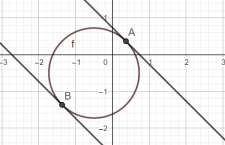

# 数学分析作业

## 201300035 方盛俊

习题 5.3: (A) 26(5), 28, 33,  (B) 2, 7, 
习题 5.4: (A) 2, 4(4), 5(3), 6, 10

## 5.3 (A)

### 26. (5)

$\therefore\displaystyle \frac{\partial z}{\partial x}=f_1y+\frac{f_2}{y}-\frac{g_1y}{x^2}$

$\therefore\displaystyle \frac{\partial^2 z}{\partial x\partial y}=f_{11}yx-\frac{f_{12}yx}{y^2}+f_1+\frac{f_{21}x}{y}-\frac{f_{22}x}{y^3}-\frac{f_2}{y^2}-\frac{g_{11}y}{x^3}-\frac{g_1}{x^2}$

### 28.

令 $\displaystyle \cos\alpha=\frac{1}{\sqrt{a^2+1}}, \sin\alpha=\frac{a}{\sqrt{a^2+1}}, \cos\beta=\frac{1}{\sqrt{b^2+1}}, \sin\beta=\frac{b}{\sqrt{b^2+1}}$

$\therefore\displaystyle \frac{\partial u}{\partial \xi}=\frac{\partial u}{\partial x}\cos\alpha+\frac{\partial u}{\partial y}\sin\alpha$

$\therefore\displaystyle \frac{\partial^2 u}{\partial \xi\partial \eta}=\frac{\partial^2 u}{\partial x^2}\cos\alpha\cos\beta+\frac{\partial^2 u}{\partial x\partial y}(\sin\alpha\cos\beta+\cos\alpha\sin\beta)+\frac{\partial^2 u}{\partial^2 y}\sin\alpha\sin\beta$

$
\therefore
\begin{cases}
\displaystyle \cos\alpha\cos\beta=\frac{1}{\sqrt{a^2+1}\sqrt{b^2+1}}=k \\
\displaystyle \sin\alpha\cos\beta+\cos\alpha\sin\beta=\frac{a+b}{\sqrt{a^2+1}\sqrt{b^2+1}}=4k \\
\displaystyle \sin\alpha\sin\beta=\frac{ab}{\sqrt{a^2+1}\sqrt{b^2+1}}=3k \\
\end{cases}
$

$
\therefore
\begin{cases}
a+b=4 \\
ab=3 \\
\end{cases}
\Rightarrow
\begin{cases}
a=1 \\
b=3 \\
\end{cases}
\text{or}
\begin{cases}
a=3 \\
b=1 \\
\end{cases}
$

### 33.

令 $\displaystyle u(x,y,z)=x+\frac{z}{y}, v(x,y,z)=y+\frac{z}{x}$

$\because\displaystyle F(x+\frac{z}{y}, y+\frac{z}{x})=F(u,v)=0$

$\therefore\displaystyle F_u{\rm d}(x+\frac{z}{y})+F_v{\rm d}(y+\frac{z}{x})=0$

$\therefore\displaystyle F_u{\rm d}x+\frac{F_u}{y}{\rm d}z-\frac{F_uz}{y^2}{\rm d}y+F_v{\rm d}y+\frac{F_v}{x}{\rm d}z-\frac{F_vz}{x^2}{\rm d}x=0$

$\therefore\displaystyle (\frac{F_u}{y}+\frac{F_v}{x}){\rm d}z=(\frac{F_vz}{x^2}-F_u){\rm d}x+(\frac{F_uz}{y^2}-F_v){\rm d}y$

$\therefore\displaystyle {\rm d}z=\frac{\displaystyle\frac{F_vz}{x^2}-F_u}{\displaystyle\frac{F_u}{y}+\frac{F_v}{x}}{\rm d}x+\frac{\displaystyle\frac{F_uz}{y^2}-F_v}{\displaystyle\frac{F_u}{y}+\frac{F_v}{x}}{\rm d}y$

$\because\displaystyle {\rm d}z=\frac{\partial z}{\partial x}{\rm d}x+\frac{\partial z}{\partial y}{\rm d}y$

$\therefore\displaystyle \frac{\partial z}{\partial x}=\frac{\displaystyle\frac{F_vz}{x^2}-F_u}{\displaystyle\frac{F_u}{y}+\frac{F_v}{x}}, \frac{\partial z}{\partial y}=\frac{\displaystyle\frac{F_uz}{y^2}-F_v}{\displaystyle\frac{F_u}{y}+\frac{F_v}{x}}$

代入原式可得 $\frac{\displaystyle\frac{F_vz}{x}-F_ux}{\displaystyle\frac{F_u}{y}+\frac{F_v}{x}}+\frac{\displaystyle\frac{F_uz}{y}-F_vy}{\displaystyle\frac{F_u}{y}+\frac{F_v}{x}}=z-xy$

$\therefore\displaystyle \frac{F_vz}{x}-F_ux+\frac{F_uz}{y}-F_vy=(z-xy)(\frac{F_u}{y}+\frac{F_v}{x})$

$\therefore\displaystyle x\frac{\partial z}{\partial x}+y\frac{\partial z}{\partial y}=z-xy$ 成立

## 5.3 (B)

### 2.

$
\begin{aligned}
\frac{\partial f}{\partial \boldsymbol{l}}
&=\frac{3}{\sqrt{13}}\cdot \frac{\partial f}{\partial x}+\frac{2}{\sqrt{13}}\cdot \frac{\partial f}{\partial y} \\
&=a(\frac{2}{2\sqrt{2}}\cdot \frac{\partial f}{\partial x}-\frac{2}{2\sqrt{2}}\cdot \frac{\partial f}{\partial y})+b(-\frac{\partial f}{\partial x}) \\
&=(\frac{2a}{2\sqrt{2}}-b)\cdot \frac{\partial f}{\partial x}-\frac{2a}{2\sqrt{2}}\cdot \frac{\partial f}{\partial y} \\
\end{aligned}
$

$
\begin{cases}
\displaystyle -\frac{2a}{2\sqrt{2}}=\frac{2}{\sqrt{13}} \\
\displaystyle \frac{2a}{2\sqrt{2}}-b=\frac{3}{\sqrt{13}} \\
\end{cases}
\Rightarrow
\begin{cases}
\displaystyle a=-\frac{2\sqrt{26}}{13} \\
\displaystyle b=-\frac{5\sqrt{13}}{13} \\
\end{cases}
$

$\therefore\displaystyle \frac{\partial f}{\partial \boldsymbol{l}}=-\frac{2\sqrt{26}}{13}\cdot \frac{\partial f}{\partial \boldsymbol{l}_1}-\frac{5\sqrt{13}}{13}\cdot \frac{\partial f}{\partial \boldsymbol{l}_2}=\frac{15\sqrt{13}-2\sqrt{26}}{13}$

### 7.

令 $z=\sqrt{x^2+y^2}$

$\therefore\displaystyle \frac{\partial u}{\partial x}=\frac{{\rm d} u}{{\rm d} z}\frac{\partial z}{\partial x}=\frac{{\rm d} u}{{\rm d} z}\frac{x}{\sqrt{x^2+y^2}},\frac{\partial u}{\partial y}=\frac{{\rm d} u}{{\rm d} z}\frac{\partial z}{\partial y}=\frac{{\rm d} u}{{\rm d} z}\frac{y}{\sqrt{x^2+y^2}}$

$\therefore\displaystyle \frac{\partial^2 u}{\partial x^2}=\frac{{\rm d}^2 u}{{\rm d} z^2}\frac{x^2}{x^2+y^2}+\frac{{\rm d} u}{{\rm d} z}\frac{\displaystyle\sqrt{x^2+y^2}-\frac{x^2}{\sqrt{x^2+y^2}}}{x^2+y^2}=\frac{{\rm d}^2 u}{{\rm d} z^2}\frac{x^2}{z^2}+\frac{{\rm d} u}{{\rm d} z}\frac{\displaystyle z-\frac{x^2}{z}}{z^2}$

$\therefore\displaystyle \frac{\partial^2 u}{\partial y^2}=\frac{{\rm d}^2 u}{{\rm d} z^2}\frac{y^2}{x^2+y^2}+\frac{{\rm d} u}{{\rm d} z}\frac{\displaystyle\sqrt{x^2+y^2}-\frac{y^2}{\sqrt{x^2+y^2}}}{x^2+y^2}=\frac{{\rm d}^2 u}{{\rm d} z^2}\frac{y^2}{z^2}+\frac{{\rm d} u}{{\rm d} z}\frac{\displaystyle z-\frac{y^2}{z}}{z^2}$

$\because\displaystyle \frac{\partial^2 u}{\partial x^2}+\frac{\partial^2 u}{\partial y^2}-\frac{1}{x}\cdot \frac{\partial u}{\partial x}+u=x^2+y^2$

$\therefore\displaystyle \frac{{\rm d}^2 u}{{\rm d} z^2}\frac{x^2}{z^2}+\frac{{\rm d} u}{{\rm d} z}\frac{\displaystyle z-\frac{x^2}{z}}{z^2}+\frac{{\rm d}^2 u}{{\rm d} z^2}\frac{y^2}{z^2}+\frac{{\rm d} u}{{\rm d} z}\frac{\displaystyle z-\frac{y^2}{z}}{z^2}-\frac{1}{x}\frac{{\rm d} u}{{\rm d}z}\frac{x}{z}+u=z^2$

$\therefore\displaystyle \frac{{\rm d}^2 u}{{\rm d} z^2}+u=z^2$

$\therefore u=u_h+u_p$, 其中 $u_h$ 是 $\displaystyle\frac{{\rm d}^2 u}{{\rm d} z^2}+u=0$ 的解, $u_p$ 是满足原式的特解

$\therefore\displaystyle u_h=C_1\cos z+C_2\sin z, h_p=z^2-2$

$\therefore\displaystyle u=C_1\cos z+C_2\sin z+z^2-2$

$\therefore\displaystyle u=C_1\cos\sqrt{x^2+y^2}+C_2\sin \sqrt{x^2+y^2}+x^2+y^2-2$

## 5.4 (A)

### 2.

$f(x_0+\Delta x, y_0+\Delta y)=f(x_0,y_0)+f_x\Delta x+f_y\Delta y+\frac{1}{2}f_{xx}(\Delta x)^2+f_{xy}\Delta x\Delta y+f_{yy}(\Delta y)^2$

$\because f(x,y)=\sin x\sin y$

$\therefore f_x=\cos x\sin y, f_y=\sin x\cos y$

$\therefore f_{xx}=-\sin x\sin y, f_{xy}=\cos x\cos y, f_{yy}=-\sin x\sin y$

$\therefore f_x(\frac{\pi}{4}, \frac{\pi}{4})=\frac{1}{2}, f_y(\frac{\pi}{4}, \frac{\pi}{4})=\frac{1}{2}, f_{xx}(\frac{\pi}{4}, \frac{\pi}{4})=-\frac{1}{2}, f_{xy}(\frac{\pi}{4}, \frac{\pi}{4})=\frac{1}{2}, f_{yy}(\frac{\pi}{4}, \frac{\pi}{4})=-\frac{1}{2}$

$\therefore f(x_0+\Delta x, y_0+\Delta y)=\frac{1}{2}+\frac{1}{2}\Delta x+\frac{1}{2}\Delta y-\frac{1}{4}f_{xx}+\frac{1}{2}f_{xy}-\frac{1}{4}f_{yy}+o(\Delta x^2+\Delta y^2)$

### 4. (4)

令 $\displaystyle \frac{\partial z}{\partial x}=2e^{2x}(x+2y+y^2)+e^{2x}=2e^{2x}(x+2y+y^2+\frac{1}{2})=0$

$\quad\displaystyle \frac{\partial z}{\partial y}=2e^{2x}(1+y)=0$

$\therefore \begin{cases}
x=\frac{1}{2} \\
y=-1
\end{cases}$

$\because\displaystyle f_{xx}=4e^{2x}(x+2y+y^2+1)=2e, f_{xy}=4e(1+y)=0,f_{yy}=2e^{2x}=2e$

$\therefore$ Hesse 矩阵 $H=\begin{pmatrix}2e&0\\0&2e\end{pmatrix}$

$\because \begin{vmatrix}2e&0\\0&2e\end{vmatrix}=4e^2>0, |2e|>0$

$\therefore$ Hesse 矩阵正定

$\therefore$ 函数 $z=e^{2x}(x+2y+y^2)$ 仅在点 $(\frac{1}{2}, -1)$ 有极小值 $\displaystyle z_{min}=-\frac{e}{2}$

### 5. (3)

令 $f_x=2x-12=0, f_y=2y+16$

$\therefore x=6, y=-8$, 而 $6^2+(-8)^2=100>25$, 即驻点不在区域 $D$ 内

令 $x^2+y^2=25$, 则有 $y^2=25-x^2, y=\sqrt{25-x^2}$

$\therefore z=x^2+25-x^2-12x+16\sqrt{25-x^2}=25-12x+16\sqrt{25-x^2}$

$\therefore\displaystyle z'=-12-\frac{16x}{\sqrt{25-x^2}}=0 \Rightarrow x=-3$

$\therefore\displaystyle z''=-\frac{\displaystyle 16\sqrt{25-x^2}+16\frac{x^2}{\sqrt{25-x^2}}}{25-x^2}=-\frac{25}{4}<0$

$\therefore z(-3)=125, z(-5)=85, z(5)=-35$

$\therefore$ 在 $x=-3$ 有最大值 $125$, 在 $x=5$ 有最小值 $-35$

### 6.

**解法一:**

$
\therefore
\begin{cases}
a=xyz \\
x>0 \\
y>0 \\
z>0 \\
\end{cases}
$

$\therefore\displaystyle f=\frac{1}{x}+\frac{1}{y}+\frac{1}{z}=\frac{1}{x}+\frac{1}{y}+\frac{xy}{a}$

令 $\displaystyle f_x=-\frac{1}{x^2}+\frac{y}{a}=0, f_y=-\frac{1}{y^2}+\frac{x}{a}=0$

$\therefore x=y=\sqrt[3]{a}$

$\because\displaystyle f_{xx}=\frac{2}{x^3}=\frac{2}{a}, f_{xy}=\frac{1}{a}, f_{yy}=\frac{2}{y^3}=\frac{2}{a}$

$\therefore$ Hesse 矩阵 $H=\begin{pmatrix}\frac{2}{a}&\frac{1}{a}\\\frac{1}{a}&\frac{2}{a}\end{pmatrix}$

$\therefore\displaystyle |\frac{2}{a}|>0, \begin{vmatrix}\frac{2}{a}&\frac{1}{a}\\\frac{1}{a}&\frac{2}{a}\end{vmatrix}=\frac{3}{a^2}>0$

$\therefore$ 在 $\displaystyle (\frac{1}{\sqrt[3]{a}},\frac{1}{\sqrt[3]{a}})$ 有最小值

$\therefore x=y=z=\sqrt[3]{a}$

**解法二:**

$\displaystyle \frac{1}{x}+\frac{1}{y}+\frac{1}{z}\geq 3\sqrt[3]{\frac{1}{xyz}}=\frac{3}{\sqrt[3]{a}}$

当且仅当 $x=y=z=\sqrt[3]{a}$ 时取到最小值.

### 10.

$
\therefore
\begin{cases}
x^2+y^2=z \\
x+y+z=1
\end{cases}
$

$\therefore (x+\frac{1}{2})^2+(y+\frac{1}{2})^2=\frac{3}{2}$

$\therefore x, y$ 的范围为以 $(-\frac{1}{2}, -\frac{1}{2})$ 为圆心, $\frac{\sqrt{6}}{2}$ 为半径的圆上点

$\therefore z=1-(x+y)\Rightarrow y=-x+1-z$

$\therefore (x+y)_{min}=\sqrt{2}(-\frac{\sqrt{2}}{2}-\frac{\sqrt{6}}{2}), (x+y)_{max}=\sqrt{2}(-\frac{\sqrt{2}}{2}+\frac{\sqrt{6}}{2})$

$\therefore z_{max}=2+\sqrt{3}, z_{min}=2-\sqrt{3}$

$\because\displaystyle d^2=x^2+y^2+z^2=z+z^2=(z+\frac{1}{2})^2-\frac{1}{4}$

$\therefore d_{max}=\sqrt{9+5\sqrt{3}}, d_{min}=\sqrt{9-5\sqrt{3}}$
