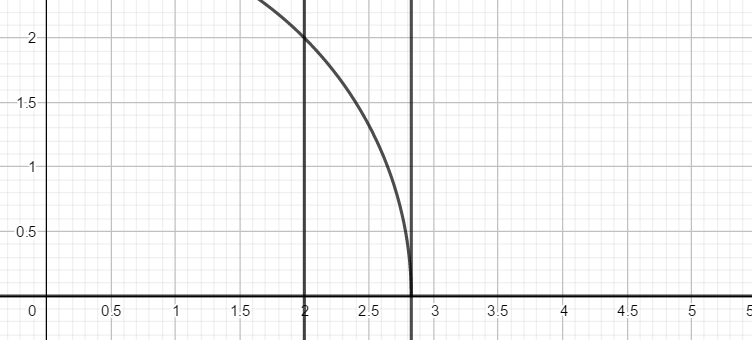
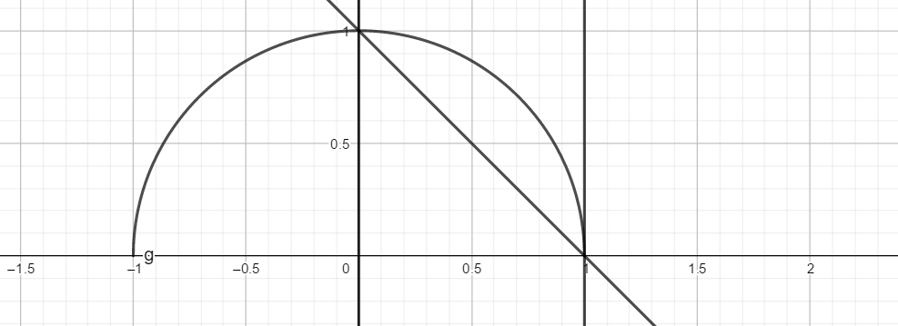
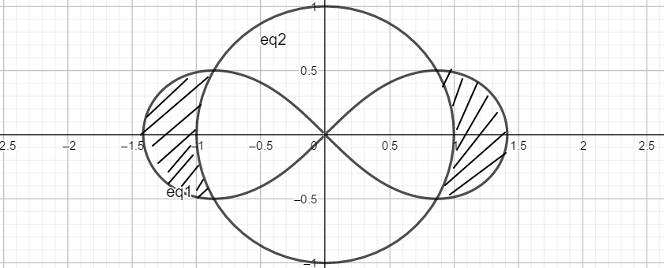

# 第六次作业

## 201300035 方盛俊

习题 6.1: (A) 5(1, 4)

习题 6.2: (A) 3(2, 6, 7, 10), 5(1, 3), 6(4), 7(2), 8(2), 9(1, 2), 13(1, 3), 14(2) (B) 1(1, 3), 2, 3, 6, 13

## 6.1 (A)

### 5.

#### (1)

当 $x\geq 0, y\geq 0, x+y\leq 1$ 时, 有 $x+y\leq (x+y)^2$, 且并不恒能取等号

$\therefore\displaystyle\iint_{(\sigma)}(x+y){\rm d}\sigma < \iint_{(\sigma)}(x+y)^2{\rm d}\sigma$

#### (4)

由区域 $(\sigma_2)=\{(x,y)|x^2+y^2\leq 1\}$ 和函数 $z(x,y)=x^2y$ 的对称性可知

$\therefore\displaystyle \iint_{(\sigma_2)}x^2=0$

又因为 $x^2y$ 在 $((\sigma_2)=\{(x,y)|x^2+y^2\leq 1, y\geq 0\})$ 上大于等于零, 且不恒为零

$\therefore\displaystyle \iint_{(\sigma_1)}x^2>0$

$\therefore\displaystyle \iint_{(\sigma_1)}x^2>\iint_{(\sigma_2)}x^2$

## 6.2 (A)

### 3.

#### (2)

对于 $x$ 型区域:

$\displaystyle \iint_{(\sigma)}\frac{x^2}{y^2}{\rm d}\sigma=\int_1^2{\rm d}x\int_{\frac{1}{x}}^{x}\frac{x^2}{y^2}{\rm d}y=\int_1^2(x^3-x){\rm d}x=\frac{9}{4}$

#### (6)

$\displaystyle \iint_{(\sigma)}e^{-y^2}{\rm d}\sigma=\int_0^1{\rm d}y\int_0^ye^{-y^2}{\rm d}x=\int_0^1ye^{-y^2}{\rm d}y=\frac{1}{2}\int_0^1e^{-y^2}{\rm d}y^2=\frac{1}{2}-\frac{1}{2}e$

#### (7)

由对称性

$
\begin{aligned}
\iint_{(\sigma)}(y+xf(x^2+y^2)){\rm d}\sigma
&=\int_0^1{\rm d}y\int_{-\sqrt{y}}^{\sqrt{y}}xf(x^2+y^2){\rm d}x+\int_{-1}^1{\rm d}x\int_{x^2}^1y{\rm d}y \\
&=\frac{1}{2}\int_0^1{\rm d}y\int_y^yf(x^2+y^2){\rm d}x^2+\int_{-1}^1(\frac{1}{2}-\frac{1}{2}x^4){\rm d}x \\
&=0+\int_{-1}^1(\frac{1}{2}-\frac{1}{2}x^4){\rm d}x \\
&=\frac{4}{5} \\
\end{aligned}
$

#### (10)

将 $y=-3x$ 带入 $y=4-x^2$ 解 $x^2-3x-4=(x-4)(x+1)=0$ 

得 $x=-1, x=4$ (舍去)

$$
\begin{aligned}
&\quad\iint_{(\sigma)}x\ln(y+\sqrt{1+y^2}){\rm d}\sigma \\
&=\int_3^4{\rm d}y\int_{-\sqrt{4-y}}^{\sqrt{4-y}}x\ln(y+\sqrt{1+y^2}){\rm d}x+\int_{-1}^1x{\rm d}x\int_{-3x}^3\ln(y+\sqrt{1+y^2}){\rm d}y \\
&=\int_{-1}^1x{\rm d}x\int_{-3x}^3\ln(y+\sqrt{1+y^2}){\rm d}y \\
&=\int_{-1}^1x{\rm d}x[y\ln(y+\sqrt{1+y^2})|_{-3x}^3-\int_{-3x}^3y{\rm d}\ln(y+\sqrt{1+y^2})] \\
&=\int_{-1}^1x{\rm d}x[y\ln(y+\sqrt{1+y^2})|_{-3x}^3-\int_{-3x}^3y\frac{1+\frac{y}{\sqrt{1+y^2}}}{y+\sqrt{1+y^2}}{\rm d}y] \\
&=\int_{-1}^1x{\rm d}x[y\ln(y+\sqrt{1+y^2})|_{-3x}^3-\int_{-3x}^3y\frac{\frac{y+\sqrt{1+y^2}}{\sqrt{1+y^2}}}{y+\sqrt{1+y^2}}{\rm d}y] \\
&=\int_{-1}^1x{\rm d}x[y\ln(y+\sqrt{1+y^2})|_{-3x}^3-\int_{-3x}^3\frac{y}{\sqrt{1+y^2}}{\rm d}y] \\
&=\int_{-1}^1x{\rm d}x(y\ln(y+\sqrt{1+y^2})-\sqrt{1+y^2})|_{-3x}^3 \\
&=\int_{-1}^1x(C+3x\ln(-3x+\sqrt{1+9x^2})+\sqrt{1+9x^2}){\rm d}x \\
\end{aligned}
$$

其中 $C=3\ln(3+\sqrt{10})-\sqrt{10}$, 是个常数

$\ln(-3x+\sqrt{1+9x^2})+\ln(3x+\sqrt{1+9x^2})=\ln(1+9x^2-9x^2)=0$

说明 $\ln(-3x+\sqrt{1+9x^2})$ 是奇函数

所以 $x(C+3x\ln(-3x+\sqrt{1+9x^2})+\sqrt{1+9x^2})$ 也是奇函数

$\therefore\displaystyle \iint_{(\sigma)}x\ln(y+\sqrt{1+y^2}){\rm d}\sigma=0$

### 5.

#### (1)

对于 $x^2+x$ 有最小值 $\displaystyle (-\frac{1}{2})^2-\frac{1}{2}=-\frac{1}{4}$

反解 $y=x^2+x$ 得 $\displaystyle x=\pm\sqrt{y+\frac{1}{4}}-\frac{1}{2}$

$\displaystyle \int_{-1}^1{\rm d}x\int_{x^2+x}^{x+1}f(x,y){\rm d}y=\int_{-\frac{1}{4}}^0{\rm d}y\int_{-\sqrt{y+\frac{1}{4}}-\frac{1}{2}}^{\sqrt{y+\frac{1}{4}}-\frac{1}{2}}f(x,y){\rm d}x+\int_{0}^2{\rm d}y\int_{y-1}^{\sqrt{y+\frac{1}{4}}-\frac{1}{2}}f(x,y){\rm d}x$

#### (3)

$
\begin{aligned}
&\quad\int_0^2{\rm d}x\int_0^x f(x,y){\rm d}y+\int_2^{\sqrt{8}}{\rm d}x\int_0^{\sqrt{8-x^2}}f(x,y){\rm d}y \\
&=\int_0^2{\rm d}y\int_y^2f(x,y){\rm d}x+\int_0^2{\rm d}y\int_2^{\sqrt{8-y^2}}f(x,y){\rm d}x
\end{aligned}
$

### 6. (4)

$\displaystyle \iint_{(\sigma)}\arctan\frac{y}{x}{\rm d}\sigma=\int_0^\frac{\pi}{2}{\rm d}\theta\int_0^1\arctan\frac{r\sin\theta}{r\cos\theta}\cdot r{\rm d}r=\int_0^\frac{\pi}{2}\frac{1}{2}\theta{\rm d}\theta=\frac{\pi^2}{16}$

### 7. (2)

对于 $y=1-x$, 带入 $x=r\cos\theta, y=r\sin\theta$

可得 $\displaystyle r=\frac{1}{\sin\theta+\cos\theta}$

$\displaystyle \int_0^1{\rm d}x\int_{1-x}^{\sqrt{1-x^2}}(x^2+y^2)^{-\frac{3}{2}}{\rm d}y=\int_0^\frac{\pi}{2}{\rm d}\theta\int_{\frac{1}{\sin\theta+\cos\theta}}^1r^{-3}\cdot r{\rm d}r=\int_0^\frac{\pi}{2}(\sin\theta+\cos\theta){\rm d}\theta=2$

### 8. (2)

将 $(x^2+y^2)^2=2a^2(x^2-y^2)$ 化为极坐标方程得 $r^2=2a^2(\cos^2\theta-\sin^2\theta)$

将 $x^2+y^2=a^2$ 化为极坐标方程得 $r^2=a^2$

联立两个方程得 $\displaystyle\cos^2\theta-\sin^2\theta=2\cos^2\theta-1=\frac{1}{2}$

解得 $\displaystyle \cos\theta=\pm\frac{\sqrt{3}}{2}$, 对应 $\displaystyle\theta=\pm\frac{\pi}{6},\pm\frac{5\pi}{6}$

$
\begin{aligned}
S
&=4\iint_{(\sigma)}=4\int_0^\frac{\pi}{6}{\rm d}\theta\int_a^{\sqrt{2}a\sqrt{\cos^2\theta-\sin^2\theta}}r{\rm d}r \\
&=4\int_0^\frac{\pi}{6}(a^2(\cos^2\theta-\sin^2\theta)-\frac{1}{2}a^2){\rm d}\theta \\
&=4a^2\int_0^\frac{\pi}{6}(\cos^2\theta-\sin^2\theta){\rm d}\theta-\frac{\pi}{3}a^2 \\
&=2a^2\sin(2x)|_0^\frac{\pi}{6}-\frac{\pi}{3}a^2 \\
&=(\sqrt{3}-\frac{\pi}{3})a^2 \\
\end{aligned}
$

### 9.

#### (1)

$\displaystyle V=\iint_{(\sigma)}(x^2+y^2){\rm d}\sigma=\int_0^4{\rm d}x\int_0^{4-x}(x^2+y^2){\rm d}y=\frac{88}{3}$

#### (2)

将 $x^2+y^2=2ax$ 换成极坐标方程得 $r=2a\cos\theta$

$\therefore\displaystyle V=\iint_{(\sigma)}\sqrt{x^2+y^2}{\rm d}\sigma=2\int_0^\frac{\pi}{2}{\rm d}\theta\int_0^{2a\cos\theta}r^2{\rm d}r=\frac{16a^3}{3}\int_0^1(1-\sin^2\theta){\rm d}\sin\theta=\frac{32a^3}{9}$

### 13.

#### (1)

#### (3)

