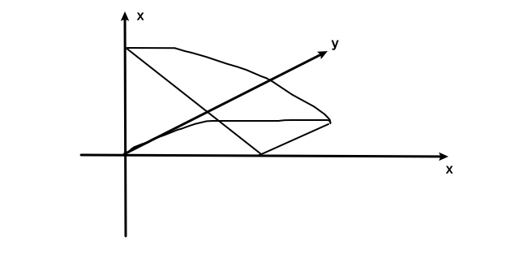
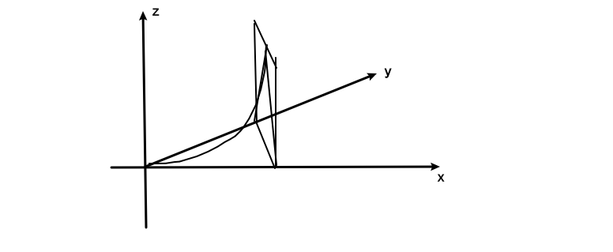

# 数学分析第七次作业

习题6.3(A): 2, 4(2, 6, 10, 15), 5, 6(2, 7), (B): 1(3), 5, 习题6.4: (A)1(3), 2(2, 3), 4, 5(3), 习题6.6: (A)1(2, 5, 6), 10(2, 6, 8)

<!-- ## 6.3 (A)

### 2.

#### (1)

正确. 

对于上半球体的任意一个点 $(x,y,z), z\geqslant 0$,
可以找到与其关于原点对称的点 $(-x,-y,-z)$, 

并且有 $(x+y+z)^{2}=(-x,-y,-z)^{2}$

而上半球体和下半球体关于原点对称

$\therefore\displaystyle  \iiint_{(V)}(x+y+z)^{2}\mathrm{d}V=2\iiint_{(V_{1})}(x+y+z)^{2}\mathrm{d}V$

#### (2)

正确. 

对于上半球体的任意一个点 $(x,y,z), z\geqslant 0$,
可以找到与其关于原点对称的点 $(-x,-y,-z)$, 

并且有 $xyz+(-x)(-y)(-z)=0$

而上半球体和下半球体关于原点对称

$\therefore\displaystyle  \iiint_{(V)}xyz\mathrm{d}V=0$

#### (3)

正确. 

由三重积分的运算性质 $\displaystyle \iiint k\mathrm{d}V=k\iiint \mathrm{d}V$, 和三重积分的几何意义 $\displaystyle \iiint \mathrm{d}V=V$ 可知正确.

#### (4)

错误.

只有球面上的点才有 $x^{2}+y^{2}+z^{2}=4$, 球内的点无法这样代换.

### 4.

#### (2)

先二后一:

对于每一个 $z$, 均有一个由 $x=y^2, y=0, x=\frac{\pi}{2}-z$ 围成的面积.

$
\begin{aligned}
\iiint_{V}y\cos(x+z)\mathrm{d}V
&=\int_{0}^{\frac{\pi}{2}} \mathrm{d}z\iint_{D_{xy}}y\cos(x+z)\mathrm{d}x\mathrm{d}y \\
&=\int_{0}^{\frac{\pi}{2}} \mathrm{d}z\int_{0}^{\sqrt{\frac{\pi}{2}-z}}\mathrm{d}y\int_{y^2}^{\frac{\pi}{2}-z} y\cos(x+z)\mathrm{d}x \\
&=\int_{0}^{\frac{\pi}{2}} \mathrm{d}z\int_{0}^{\sqrt{\frac{\pi}{2}-z}}y \left(1 - \sin{\left(y^{2} + z \right)}\right)\mathrm{d}y \\
&=\int_{0}^{\frac{\pi}{2}} \left(- \frac{z}{2} - \frac{\cos{\left(z \right)}}{2} + \frac{\pi}{4}\right)\mathrm{d}z \\
&=- \frac{1}{2} + \frac{\pi^{2}}{16} \\
\end{aligned}
$

#### (6)

$
\begin{aligned}
\iiint_{V}xy\mathrm{d}V
&=\iiint_{V}z\mathrm{d}V \\
&=\iint_{D_{xy}}\mathrm{d}x\mathrm{d}y\int_{0}^{xy}xy\mathrm{d}z \\
&=\iint_{D_{xy}}xy\mathrm{d}x\mathrm{d}y\int_{0}^{xy}\mathrm{d}z \\
&=\int_{0}^{1}\mathrm{d}x \int_{0}^{1-x}x^{2} y^{2}\mathrm{d}y \\
&=\int_{0}^{1}- \frac{x^{2} \left(x - 1\right)^{3}}{3}\mathrm{d}x  \\
&=\frac{1}{180}  \\
\end{aligned}
$

#### (10)

对于上半部分的 $V_1$ 对于高度 $z$ 有 $S=\pi r^{2}=\pi(R^{2}-z^{2})$

对于下半部分的 $V_2$ 对于高度 $z$ 有 $S=\pi r^{2}=\pi(R^{2}-(R-z)^{2})=\pi z \left(2 R - z\right)$

$
\begin{aligned}
\iiint_V z^{2}\mathrm{d}V
&=\iiint_{V_1} z^{2}\mathrm{d}V+\iiint_{V_1} z^{2}\mathrm{d}V \\
&=\int_{0}^{\frac{R}{2}}z^{2}\mathrm{d}z\iint_{D_{xy_1}} \mathrm{d}S+\int_{\frac{R}{2}}^{R}z^{2}\mathrm{d}z\iint_{D_{xy_1}} \mathrm{d}S \\
&=\pi\int_{0}^{\frac{R}{2}}z^{3}(2R-z)\mathrm{d}z+\pi\int_{\frac{R}{2}}^{R}z^{2}\left(R^{2} - z^{2}\right)\mathrm{d}z \\
&=\frac{59 \pi R^{5}}{480} \\
\end{aligned}
$

#### (15)

进行柱面坐标变换 $
\begin{cases}
x=r\cos\theta \\
y=r\sin\theta \\
z=z \\
\end{cases}
$, 则有 $J=\begin{vmatrix}\cos\theta&-r\sin\theta&0\\\sin\theta&r\cos\theta&0\\0&0&1\end{vmatrix}=r$

$
\begin{aligned}
&\quad\ \iiint_{V}z(x^{2}+y^{2})\mathrm{d}V \\
&=\iint_{D_{xy}}(x^{2}+y^{2})\mathrm{d}x\mathrm{d}y\int z\mathrm{d}z \\
&=\iint_{D_{r\theta}}r^{3}\mathrm{d}\theta\mathrm{d}r\int z\mathrm{d}z \\
&=\int_{0}^{2\pi}\mathrm{d}\theta \int_{0}^{\frac{\sqrt{2}}{2}} r^{3}\mathrm{d}r\int_{\sqrt{1-r^{2}}}^{\sqrt{4-r^{2}}}z\mathrm{d}z+\int_{0}^{2\pi}\mathrm{d}\theta \int_{\frac{\sqrt{2}}{2}}^{\sqrt{2}} r^{3}\mathrm{d}r\int_{r}^{\sqrt{4-r^{2}}} z\mathrm{d}z \\
&=2\pi\int_{0}^{\frac{\sqrt{2}}{2}} r^{3}\mathrm{d}r\int_{\sqrt{1-r^{2}}}^{\sqrt{4-r^{2}}}z\mathrm{d}z+2\pi\int_{\frac{\sqrt{2}}{2}}^{\sqrt{2}} r^{3}\mathrm{d}r\int_{r}^{\sqrt{4-r^{2}}} z\mathrm{d}z \\
&=2\pi\int_{0}^{\frac{\sqrt{2}}{2}} \frac{3}{2}x^{3}\mathrm{d}x+2\pi\int_{\frac{\sqrt{2}}{2}}^{\sqrt{2}} x^{3}(2 - x^{2})\mathrm{d}x \\
&=\frac{21 \pi}{16} \\
\end{aligned}
$

### 5.

#### (1)

进行柱面坐标变换 $
\begin{cases}
x=r\cos\theta \\
y=r\sin\theta \\
z=z \\
\end{cases}
$, 则有 $J=\begin{vmatrix}\cos\theta&-r\sin\theta&0\\\sin\theta&r\cos\theta&0\\0&0&1\end{vmatrix}=r$

$
\begin{aligned}
\int_{-1}^{1}\mathrm{d}x\int_{0}^{\sqrt{1-x^{2}}}\mathrm{d}y\int_{\sqrt{x^{2}+y^{2}}}^{1}z^{3}\mathrm{d}z
&=\int_{0}^{1} z^{3}\mathrm{d}z\iint_{D_{xy}}\mathrm{d}x\mathrm{d}y \\
&=\int_{0}^{1} z^{3}\mathrm{d}z\iint_{D_{r\theta}}r\mathrm{d}\theta\mathrm{d}r \\
&=\int_{0}^{1} z^{3}\mathrm{d}z\int_{0}^{\pi}\mathrm{d}\theta\int_{0}^{1} r\mathrm{d}r \\
&=\int_{0}^{1} \frac{1}{2}\pi z^{5}\mathrm{d}z  \\
&=\frac{\pi}{12}  \\
\end{aligned}
$

#### (2)

进行球面坐标变换 $
\begin{cases}
x=\rho\sin\varphi\cos\theta \\
y=\rho\sin\varphi\sin\theta \\
z=\rho\cos\varphi \\
\end{cases}
$, 则有 $J=\rho^2\sin\varphi$

$0\leqslant \rho\cos\varphi \leqslant 3, \rho\sin \varphi+\rho\cos \varphi=3$

$
\begin{aligned}
&\quad\ \int_{-3}^{3}\mathrm{d}x\int_{-\sqrt{9-x^{2}}}^{\sqrt{9-x^{2}}}\mathrm{d}y\int_{0}^{\sqrt{9-x^{2}-y^{2}}}z\sqrt{x^{2}+y^{2}+z^{2}}\mathrm{d}z \\
&= \iiint_{V_{\rho\varphi\theta}}\rho^{2}\cos\varphi\cdot \rho^{2}\sin \varphi\mathrm{d}V \\
\end{aligned}
$

### 6.

#### (2)

进行柱面坐标变换 $
\begin{cases}
x=\rho\cos\theta \\
y=\rho\sin\theta \\
z=z \\
\end{cases}
$, 则有 $J=\begin{vmatrix}\cos\theta&-\rho\sin\theta&0\\\sin\theta&\rho\cos\theta&0\\0&0&1\end{vmatrix}=\rho$

则转化为 $z=6-\rho^{2}, z=\rho$ 围成的立体.

令 $6-\rho^{2}=\rho$ 得 $\rho^{2}+\rho-6=(\rho+3)(\rho-2)=0$ 即 $\rho=2, \rho=-3$ (舍去)

$
\begin{aligned}
V &=\iiint_{V}\mathrm{d}V \\
&=\iint_{D_{\rho\theta}}\rho\mathrm{d}\theta\mathrm{d}\rho \int_{\rho}^{6-\rho^{2}}\mathrm{d}z \\
&=\int_{0}^{2\pi}\mathrm{d}\theta\int_{0}^{2}\rho(- \rho^{2} - \rho + 6)\mathrm{d}\theta\mathrm{d}\rho  \\
&=\frac{32 \pi}{3}  \\
\end{aligned}
$

#### (7)

进行类似柱面坐标变换的变换 $
\begin{cases}
x=a\rho\cos\theta \\
y=b\rho\sin\theta \\
z=ct \\
\end{cases}
$,
则有 $J=\begin{vmatrix}a\cos\theta&-a\rho\sin\theta&0\\b\sin\theta&b\rho\cos\theta&0\\0&0&c\end{vmatrix}=abc\rho$

则原式转化为 $t=\sqrt{\rho^{2}+1}, \rho=1$

$
\begin{aligned}
V &=\iiint_{V}\mathrm{d}V \\
&=2\iint_{D_{\rho\theta}}abc\rho\mathrm{d}\theta\mathrm{d}\rho \int_{0}^{\sqrt{\rho^{2}+1}}\mathrm{d}t \\
&=2\int_{0}^{2\pi}\mathrm{d}\theta\int_{0}^{1}abc\rho\mathrm{d}\rho \int_{0}^{\sqrt{\rho^{2}+1}}\mathrm{d}t \\
&=2\int_{0}^{2\pi}\mathrm{d}\theta\int_{0}^{1}abc\rho\sqrt{\rho^{2} + 1}\mathrm{d}\rho  \\
&=4\pi abc \int_{0}^{1}\rho\sqrt{\rho^{2} + 1}\mathrm{d}\rho  \\
&=\frac{4}{3}\pi abc (2\sqrt{2}-1)  \\
\end{aligned}
$ -->

## 6.3 (B)

### 1. (3)

进行球面坐标变换 $
\begin{cases}
x=a\rho\sin\varphi\cos\theta \\
y=b\rho\sin\varphi\sin\theta \\
z=c\rho\cos\varphi \\
\end{cases}
$, 则有 $J=abc\rho^2\sin\varphi$

$$
\begin{aligned}
&\quad\iiint_{V}\sqrt{1-\frac{x^{2}}{a^{2}}-\frac{y^{2}}{b^{2}}-\frac{z^{2}}{c^{2}}}\mathrm{d}V \\
&=\iiint_{V}\sqrt{1-\rho^{2}}\cdot abc\rho^{2}\sin \varphi\mathrm{d}\rho \\
&=abc\int_{0}^{2\pi}\mathrm{d}\theta\int_{0}^{2\pi}\sin \varphi\mathrm{d}\varphi\int_{0}^{1}\rho^{2}\sqrt{1-\rho^{2}}\mathrm{d}\rho \\
&=2abc\pi\int_{0}^{2\pi}\sin \varphi\mathrm{d}\varphi\int_{0}^{1}\rho^{2}\sqrt{1-\rho^{2}}\mathrm{d}\rho \\
\end{aligned}
$$

### 5.

