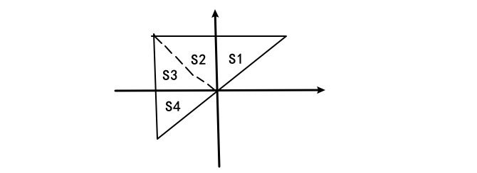
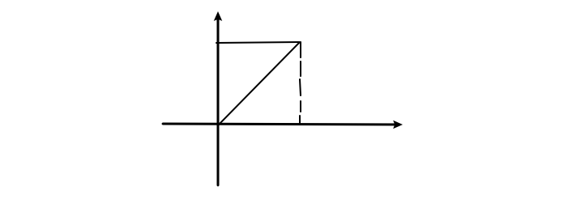
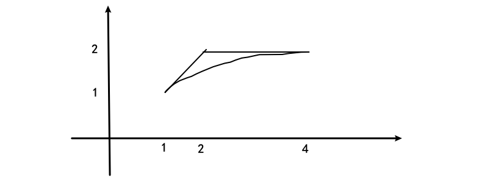

# 第九次作业

P264 第六章习题: 1, 2, 10, 14, 18, 21, 28, 29, 习题7.1: (A)3(2, 3), 11, 12(3, 6, 9, 11, 14), 14(3, 4), 15(1, 2), 18(2, 4), (B)1, 2, 3, 4(3, 4)

## 第六章习题

<!-- ### 1.

#### (1) 答案为 (A)

其中 $D_1=S_1$, 由对称性可知

$\displaystyle \iint_{S_1}xy\mathrm{d}x\mathrm{d}y+\iint_{S_2}xy\mathrm{d}x\mathrm{d}y=0, \iint_{S_3}xy\mathrm{d}x\mathrm{d}y+\iint_{S_4}xy\mathrm{d}x\mathrm{d}y=0,$
$\displaystyle \iint_{S_1}\cos x\sin y\mathrm{d}x\mathrm{d}y=\iint_{S_2}\cos x \sin y\mathrm{d}x\mathrm{d}y, \iint_{S_3}\cos x \sin y\mathrm{d}x\mathrm{d}y+\iint_{S_4}\cos x \sin y\mathrm{d}x\mathrm{d}y=0$

所以有 $\displaystyle \iint_{(D)}(xy+\cos x \sin y)\mathrm{d}x\mathrm{d}y=2\iint_{(D_1)}\cos x\sin y\mathrm{d}x\mathrm{d}y$

#### (2) 答案为 (B)

$\because \displaystyle F(t)=\int_{1}^{t}\mathrm{d}y\int_{y}^{t}f(x)\mathrm{d}x$

$
\begin{aligned}
\therefore F'(t)
&=(\int_{1}^{t}\mathrm{d}y\int_{y}^{t}f(x)\mathrm{d}x)' \\
&=(\int_{1}^{t}(\int_{y}^{t}f(x)\mathrm{d}x)\mathrm{d}y)' \\
&=\int_{1}^{t}(\int_{y}^{t}f(x)\mathrm{d}x)'\mathrm{d}y+\int_{t}^{t}f(x)\mathrm{d}x-0 \\
&=\int_{1}^{t}f(t)\mathrm{d}y \\
&=(t-1)f(t)
\end{aligned}
$

$\therefore F'(2)=f(2)$

#### (3) 答案为 (D)

$\because \displaystyle \int_{0}^{1}\mathrm{d}x\int_{x}^{1}f(x)f(y)\mathrm{d}y=\int_{0}^{1}\mathrm{d}y\int_{y}^{1}f(x)f(y)\mathrm{d}x$

$\therefore \displaystyle \int_{0}^{1}\mathrm{d}x\int_{x}^{1}f(x)f(y)\mathrm{d}y=\frac{1}{2}\int_{0}^{1}\mathrm{d}x\int_{0}^{1}f(x)f(y)\mathrm{d}y=\frac{1}{2}(\int_{0}^{1}f(x)\mathrm{d}x)^{2}=\frac{1}{2}A^{2}$

#### (4) 答案为 (C)

因为对 $\Omega_1, \Omega_2$ 均有 $z>0$, 不会因为奇函数的积分特性被消去.

且由对称性可知,

$\displaystyle \iiint_{(\Omega_1)}z\mathrm{d}V=4\iiint_{\Omega_2}z\mathrm{d}V$

#### (5) 答案为 (A)

$\displaystyle \Omega: (x+1)^{2}+(y-1)^{2}+z^{2}\leqslant 2$

进行换元 $\begin{cases} x=\rho\sin\varphi\cos\theta-1 \\ y=\rho\sin\varphi\sin\theta+1 \\ z=\rho\cos\varphi \end{cases}$

则有 $J=\rho^{2}\sin\varphi$, 其中 $0\leqslant \varphi\leqslant \pi, 0\leqslant \theta\leqslant 2\pi$

$
\begin{aligned}
&\therefore \iiint_{\Omega}(x+y+z)\mathrm{d}V \\
&=\int_{0}^{2\pi}\mathrm{d}\theta\int_{0}^{\pi}\mathrm{d}\varphi \int_{0}^{\sqrt{2}}(\rho\sin\varphi\cos\theta+\rho\sin\varphi\sin\theta+\rho\cos\varphi)\rho^{2}\sin\varphi\mathrm{d}\rho \\
&=\int_{0}^{2\pi}\frac{\sqrt{2} \pi \sin{\left(\theta + \frac{\pi}{4} \right)}}{2}\mathrm{d}\theta \\
&=0 \\
\end{aligned}
$

#### (6) 答案为 (C)

因为对于 $S, S_1$ 均有 $z>0$, 根据对称性以及恒正性我们可知

$\displaystyle \iint_{(S)}z\mathrm{d}S=4\iint_{(S_1)}z\mathrm{d}S$

#### (7) 答案为 (B)

$\displaystyle 2xy=1 \Rightarrow 2r^{2}\cos\theta\sin\theta=1 \Rightarrow r=\sqrt{\frac{1}{\sin 2\theta}}$

$\displaystyle 4xy=1 \Rightarrow 4r^{2}\cos\theta\sin\theta=1 \Rightarrow r=\sqrt{\frac{1}{2\sin 2\theta}}$

$\displaystyle y=x \Rightarrow \sin\theta=\cos\theta \Rightarrow \theta=\frac{\pi}{4}$

$\displaystyle y=\sqrt{3}x \Rightarrow \sin\theta=\sqrt{3}\cos\theta \Rightarrow \theta=\frac{\pi}{3}$

$\therefore \displaystyle \iint_{D}f(x,y)\mathrm{d}x\mathrm{d}y=\int_{\frac{\pi}{4}}^{\frac{\pi}{3}}\mathrm{d}\theta\int_{\sqrt{\frac{1}{2\sin 2\theta}}}^{\sqrt{\frac{1}{\sin 2\theta}}}f(r\cos\theta, r\sin\theta)r\mathrm{d}r$

### 2.

$
\begin{aligned}
&\quad\ \int_{1}^{2}\mathrm{d}x\int_{\sqrt{x}}^{x}\sin\frac{\pi x}{2y}+\int_{2}^{4}\mathrm{d}x \int_{\sqrt{x}}^{2}\sin \frac{\pi x}{2y}\mathrm{d}y \\
&=\int_{1}^{2}\mathrm{d}y \int_{y}^{y^{2}}\sin \frac{\pi x}{2y} \mathrm{d}x \\
&=\int_{1}^{2}(-\frac{2y}{\pi}\cos{\frac{\pi y}{2}})\mathrm{d}y  \\
&=-\frac{4}{\pi^{2}}\int_{1}^{2}y\mathrm{d}\sin{\frac{\pi y}{2}}  \\
&=-\frac{4}{\pi^{2}}(y\sin{\frac{\pi y}{2}}|_{1}^{2}-\int_{1}^{2}\sin{\frac{\pi y}{2}}\mathrm{d}y) \\
&=-\frac{4}{\pi^{2}}(-1-\frac{2}{\pi}\int_{\frac{\pi}{2}}^{\pi}\sin t\mathrm{d}t) \\
&=\frac{4}{\pi^{2}}+\frac{8}{\pi^{3}} \\
\end{aligned}
$ -->

<!-- ### 10.

#### (1)

对 $\Omega(t)$ 进行球面坐标变换 $\begin{cases} x=\rho\sin\varphi\cos\theta \\ y=\rho\sin\varphi\sin\theta \\ z=\rho\cos\varphi \end{cases}$, 则有 $\Omega(t): 0\leqslant \rho\leqslant t, J=\rho^{2}\sin\varphi$

则 $\displaystyle \iiint_{\Omega(t)}f(x^{2}+y^{2}+z^{2})\mathrm{d}V=\int_{0}^{2\pi}\mathrm{d}\theta\int_{0}^{\pi}\mathrm{d}\varphi \int_{0}^{t}f(\rho^{2})\rho^{2}\sin\varphi\mathrm{d}\rho=4\pi \int_{0}^{t}f(\rho^{2})\rho^{2}\mathrm{d}\rho$

对 $D(t)$ 极坐标变换 $\begin{cases} x=\rho\cos\theta \\ y=\rho\sin\theta \end{cases}$, 则有 $D(t): 0\leqslant \rho\leqslant t, J=\rho$

则 $\displaystyle \iint_{D(t)}f(x^{2}+y^{2})\mathrm{d}\sigma=\int_{0}^{2\pi}\mathrm{d}\theta\int_{0}^{t}f(\rho^{2})\rho\mathrm{d}\rho=2\pi \int_{0}^{t}f(\rho^{2})\rho\mathrm{d}\rho$

当 $t>0$ 时, 我们有 $f(t^{2})>0$, $\displaystyle \int_{0}^{t}f(\rho^{2})\rho\mathrm{d}\rho>0$

$\therefore \displaystyle F(t)=\frac{\displaystyle 4\pi \int_{0}^{t}f(\rho^{2})\rho^{2}\mathrm{d}\rho}{\displaystyle 2\pi \int_{0}^{t}f(\rho^{2})\rho\mathrm{d}\rho}=\frac{\displaystyle 2\int_{0}^{t}f(\rho^{2})\rho^{2}\mathrm{d}\rho}{\displaystyle \int_{0}^{t}f(\rho^{2})\rho\mathrm{d}\rho}$

$
\begin{aligned}
\therefore F'(t)
&=\frac{\displaystyle 2f(t^{2})t^{2}\left( \int_{0}^{t}f(\rho^{2})\rho\mathrm{d}\rho \right)-2f(t^{2})t\left( \int_{0}^{t}f(\rho^{2})\rho^{2}\mathrm{d}\rho \right)  }{\displaystyle \left( \int_{0}^{t}f(\rho^{2})\rho\mathrm{d}\rho \right)^{2} } \\
&=\frac{\displaystyle 2f(t^{2})t\int_{0}^{t}f(\rho^{2})\rho(t-\rho)\mathrm{d}\rho}{\displaystyle \left( \int_{0}^{t}f(\rho^{2})\rho\mathrm{d}\rho \right)^{2} } \\
&>0 \\
\end{aligned}
$

所以 $F(t)$ 在 $(0,+\infty)$ 内单调递增.

#### (2)

$\because \displaystyle \int_{-t}^{t}f(x^{2})\mathrm{d}x=2\int_{0}^{t}f(\rho^{2})\mathrm{d}\rho$

$\therefore \displaystyle \frac{2}{\pi}G(t)=\frac{2}{\pi}\cdot \frac{\displaystyle 2\pi \int_{0}^{t}f(\rho^{2})\rho\mathrm{d}\rho}{\displaystyle 2\int_{0}^{t}f(\rho^{2})\mathrm{d}\rho}=\frac{\displaystyle 2\int_{0}^{t}f(\rho^{2})\rho\mathrm{d}\rho}{\displaystyle \int_{0}^{t}f(\rho^{2})\mathrm{d}\rho}$

要证 $\displaystyle F(t)>\frac{2}{\pi}G(t)$

即证 $\displaystyle \frac{\displaystyle 2\int_{0}^{t}f(\rho^{2})\rho^{2}\mathrm{d}\rho}{\displaystyle \int_{0}^{t}f(\rho^{2})\rho\mathrm{d}\rho}>\frac{\displaystyle 2\int_{0}^{t}f(\rho^{2})\rho\mathrm{d}\rho}{\displaystyle \int_{0}^{t}f(\rho^{2})\mathrm{d}\rho}$

即证 $\displaystyle H(t)=\left( \int_{0}^{t}f(\rho^{2})\rho^{2}\mathrm{d}\rho \right) \left( \int_{0}^{t}f(\rho^{2})\mathrm{d}\rho \right) -\left( \int_{0}^{t}f(\rho^{2})\rho\mathrm{d}\rho \right)^{2}>0$

$
\begin{aligned}
\because H'(t)
&=f(t^{2})t^{2}\int_{0}^{t}f(\rho^{2})\mathrm{d}\rho+f(t^{2})\int_{0}^{t}f(\rho^{2})\rho^{2}\mathrm{d}\rho-2f(t^{2})t\int_{0}^{t}f(\rho^{2})\rho\mathrm{d}\rho  \\
&=f(t^{2})\int_{0}^{t}f(\rho^{2})(t^{2}+\rho^{2}-2t\rho)\mathrm{d}\rho  \\
&=f(t^{2})\int_{0}^{t}f(\rho^{2})(t-\rho)^{2}\mathrm{d}\rho  \\
&>0 \\
\end{aligned}
$

$\therefore H(t)$ 是单调递增的, 对于 $t>0$, 满足 $H(t)>H(0)=0$

$\therefore\displaystyle F(t)>\frac{2}{\pi}G(t)$ 成立. -->

<!-- ### 14.

$\because \displaystyle L: \frac{x^{2}}{4}+\frac{y^{2}}{3}=1 \Rightarrow 3x^{2}+4y^{2}=12$

$
\begin{aligned}
&\therefore\ \oint_{(L)}(2xy+3x^{2}+4y^{2})\mathrm{d}s \\
&=\oint_{(L)}(2xy+12)\mathrm{d}s \\
&=\oint_{(L)}2xy\mathrm{d}s+12\oint_{(L)}\mathrm{d}s \\
&=0+12a \\
&=12a \\
\end{aligned}
$

### 18.

当 $L$ 不包围点 $(0,0)$ 时,

使用 Green 公式:

$\displaystyle I=\oint_{L} \frac{x\mathrm{d}y-y\mathrm{d}x}{4x^{2}+y^{2}}=\iint_{L-\Gamma}\frac{(4x^{2}+y^{2})-x\cdot 8x+(4x^{2}+y^{2})-y\cdot 2y}{(4x^{2}+y^{2})^{2}}\mathrm{d}x\mathrm{d}y=0$

当 $L$ 包围点 $(0,0)$ 时,

令 $\Gamma: 4x^{2}+y^{2}=\delta^{2}$, 沿正向. 并作 $\begin{cases} x=\frac{1}{2}\delta\cos\theta \\ y=\delta\sin\theta \end{cases}$, 则有 $L-\Gamma$ 不包围点 $(0,0)$

$
\begin{aligned}
I
&=\oint_{L} \frac{x\mathrm{d}y-y\mathrm{d}x}{4x^{2}+y^{2}} \\
&=\oint_{L-\Gamma}\frac{x\mathrm{d}y-y\mathrm{d}x}{4x^{2}+y^{2}}+\oint_{\Gamma}\frac{x\mathrm{d}y-y\mathrm{d}x}{4x^{2}+y^{2}} \\
&=0+\oint_{\Gamma}\frac{\frac{1}{2}\delta\cos\theta\mathrm{d}\sin\theta-\delta\sin\theta\mathrm{d}\frac{1}{2}\cos\theta}{\delta^{2}} \\
&=\pi \\
\end{aligned}
$ -->

<!-- ### 21.

令 $\Gamma: x=0$, 从 $(0, -R)$ 到 $(0, R)$, 使用 Green 公式

$
\begin{aligned}
&\quad\ \int_{L}\frac{y^{2}}{\sqrt{a^{2}+x^{2}}}\mathrm{d}x+(ax+2y\ln(x+\sqrt{a^{2}+x^{2}}))\mathrm{d}y \\
&=\oint_{L+\Gamma}\frac{y^{2}}{\sqrt{a^{2}+x^{2}}}\mathrm{d}x+(ax+2y\ln(x+\sqrt{a^{2}+x^{2}}))\mathrm{d}y-\int_{-R}^{R}2y\ln a\mathrm{d}y \\
&=\iint_{L+\Gamma}\left(-\frac{2y}{\sqrt{a^{2}+x^{2}}}+a+\frac{2y}{\sqrt{a^{2}+x^{2}}}\right)\mathrm{d}x\mathrm{d}y \\
&=a\iint_{L+\Gamma}\mathrm{d}x\mathrm{d}y \\
&=\frac{1}{2}a\pi R^{2} \\
\end{aligned}
$ -->

<!-- ### 28.

$\because z=1-x^{2}-y^{2}$

$\therefore  \displaystyle \frac{\partial (y,z)}{\partial (x,y)}=\begin{vmatrix} 0 &1 \\ -2x &-2y \\\end{vmatrix}=2x, \frac{\partial (z,x)}{\partial (x,y)}=\begin{vmatrix} -2x &-2y \\ 1 &0 \\\end{vmatrix}=2y, \frac{\partial (x,y)}{\partial (x,y)}=1$

$
\begin{aligned}
\therefore I&=\iint_{\Sigma}2x^{3}\mathrm{d}y\land \mathrm{d}z+2y^{3}\mathrm{d}z\land x+3(z^{2}-1)\mathrm{d}x\land \mathrm{d}y \\
&=\iint_{S}(2x^{3}\cdot 2x+2y^{3}\cdot 2y+3((1-x^{2}-y^{2})^{2}-1))\mathrm{d}x\land \mathrm{d}y \\
&=\int_{0}^{2\pi}\mathrm{d}\theta\int_{0}^{1}(4\rho^{4}(\cos^{4}\theta+\sin^{4}\theta)+3(-2\rho^{2}+\rho^{4}))\rho\mathrm{d}\rho \\
&=\int_{0}^{2\pi}\mathrm{d}\theta\int_{0}^{1}(2t^{2}(\cos^{4}\theta+\sin^{4}\theta)+\frac{3}{2}(-2t+t^{2}))\mathrm{d}t \\
&=\int_{0}^{2\pi}(\frac{2}{3}(\cos^{4}\theta+\sin^{4}\theta)-1)\mathrm{d}\theta \\
&=-\pi \\
\end{aligned}
$ -->

<!-- ### 29.

由 Stokes 公式可知

$\because z=2-x-y$

$\therefore  \displaystyle \frac{\partial (y,z)}{\partial (x,y)}=\begin{vmatrix} 0 &1 \\ -1 &-1 \\\end{vmatrix}=1, \frac{\partial (z,x)}{\partial (x,y)}=\begin{vmatrix} -1 &-1 \\ 1 &0 \\\end{vmatrix}=1, \frac{\partial (x,y)}{\partial (x,y)}=1$

$
\begin{aligned}
&\quad\ \oint_{(L)}(y^{2}-z^{2})\mathrm{d}x+(2z^{2}-x^{2})\mathrm{d}y+(3x^{2}-y^{2})\mathrm{d}z \\
&=\iint_{\Sigma}(-2y-4z)\mathrm{d}y\land \mathrm{d}z+(-2z-6x)\mathrm{d}z\land \mathrm{d}x+(-2x-2y)\mathrm{d}x\land \mathrm{d}y \\
&=\iint_{\Sigma}(-2y-4z-2z-6x-2x-2y)\mathrm{d}x\land \mathrm{d}y \\
&=\iint_{\Sigma}(-8x-4y-6(2-x-y))\mathrm{d}x\land \mathrm{d}y \\
&=\int_{-1}^{0}\mathrm{d}x\int_{-x-1}^{x+1}(-2x + 2y - 12)\mathrm{d}y+\int_{0}^{1}\mathrm{d}x\int_{x-1}^{-x+1}(-2x + 2y - 12)\mathrm{d}y \\
&=\int_{-1}^{0}- 4 \left(x + 1\right) \left(x + 6\right)\mathrm{d}x+\int_{0}^{1}4 \left(x - 1\right) \left(x + 6\right)\mathrm{d}x \\
&=-24 \\
\end{aligned}
$ -->

## 7.1 (A)

<!-- ### 3.

#### (2)

因为级数的部分和数列为

$
\begin{aligned}
S_{n}&=\frac{1}{4\cdot 7}+\frac{1}{7\cdot 10}+\cdots +\frac{1}{(3n+1)(3n+4)} \\
&=\frac{1}{3\cdot 4}-\frac{1}{3\cdot 7}+\frac{1}{3\cdot 7}-\frac{1}{3\cdot 10}+\cdots +\frac{1}{3(3n+1)}-\frac{1}{3(3n+4)} \\
&=\frac{1}{12}-\frac{1}{3(3n+4)} \\
\end{aligned}
$

$\displaystyle \lim_{n \to \infty} S_{n}=\frac{1}{12}$

所以该级数收敛, 且其和为 $\displaystyle \frac{1}{12}$

#### (3)

因为级数的部分和数列为

$
\begin{aligned}
S_{n}
&=(\sqrt{3}-2\sqrt{2}+\sqrt{1})+(\sqrt{4}-2\sqrt{3}+\sqrt{2})+\cdots +(\sqrt{n+2}-2\sqrt{n+1}+\sqrt{n}) \\
&=-\sqrt{2}+\sqrt{1}+\sqrt{n+2}-\sqrt{n+1} \\
&=1-\sqrt{2}+\sqrt{n+2}-\sqrt{n+1} \\
&=1-\sqrt{2}+\frac{(n+2)-(n+1)}{\sqrt{n+2}+\sqrt{n+1}} \\
&=1-\sqrt{2}+\frac{1}{\sqrt{n+2}+\sqrt{n+1}} \\
\end{aligned}
$

$\displaystyle \lim_{n \to \infty} S_{n}=1-\sqrt{2}$

所以该级数收敛, 且其和为 $\displaystyle 1-\sqrt{2}$

### 11.

#### (1)

**不正确.**

令 $\displaystyle a_{n}=-1, b_{n}=\frac{1}{n(n+1)}$

其中 $\displaystyle \lim_{n \to \infty} S_{bn}=\lim_{n \to \infty} (1-\frac{1}{2}+\frac{1}{2}-\frac{1}{3}+\cdots +\frac{1}{n}-\frac{1}{n+1})=\lim_{n \to \infty} (1-\frac{1}{n+1})=1$

即满足 $\displaystyle \sum_{n=1}^{\infty} b_{n}$ 是收敛的. 并且有 $\displaystyle a_{n}=-1\leqslant b_{n}=\frac{1}{n(n+1)}$

但是 $\displaystyle \lim_{n \to \infty} S_{an}=1+1+\cdots +1=n\to -\infty$, 是发散的

所以该命题不正确.

#### (2)

对于 $\displaystyle a_{n}=\frac{(-1)^{n}}{\sqrt{n}}, b_{n}=\frac{(-1)^{n}}{\sqrt{n}}+\frac{1}{n}$

易知 $\displaystyle \sum_{n=1}^{\infty} a_n$ 是交错级数, 所以收敛. 

并且满足 $\displaystyle \lim_{n \to \infty} \frac{b_{n}}{a_{n}}=\lim_{n \to \infty} \frac{\displaystyle \frac{(-1)^{n}}{\sqrt{n}}+\frac{1}{n}}{\displaystyle \frac{(-1)^{n}}{\sqrt{n}}}=\lim_{n \to \infty} \left(1+\frac{1}{(-1)^{n}\sqrt{n}}\right)=1$

假设 $\displaystyle \sum_{n=1}^{\infty} b_{n}=\sum_{n=1}^{\infty} \left( \frac{(-1)^{n}}{\sqrt{n}}+\frac{1}{n}\right)$ 收敛.

则 $\displaystyle \sum_{n=1}^{\infty} b_{n}=\sum_{n=1}^{\infty}\frac{(-1)^{n}}{\sqrt{n}}+\sum_{n=1}^{\infty}\frac{1}{n}$, 即后面两个收敛数列的和.

但是这里仅有 $\displaystyle \sum_{n=1}^{\infty} \frac{(-1)^{n}}{\sqrt{n}}$ 是收敛的, 而 $\displaystyle \sum_{n=1}^{\infty} \frac{1}{n}$ 是发散的.

所以假设不成立, $\displaystyle \sum_{n=1}^{\infty} b_{n}$ 只能是发散的.

所以该命题不正确.

#### (3)

令 $\displaystyle a_{n}=\frac{1}{n(n+1)}$, 易知 $\displaystyle \sum_{n=1}^{\infty} a_n=1$ 收敛.

此时有 $\displaystyle \lim_{n \to \infty} \frac{a_{n+1}}{a_{n}}=\lim_{n \to \infty}\frac{n(n+1)}{(n+1)(n+2)}=\lim_{n \to \infty} \frac{n}{n+2}=1$

不满足 $\displaystyle \lim_{n \to \infty}\frac{a_{n+1}}{a_{n}}=\lambda<1$

所以该命题不正确.

#### (4)

**不正确.**

对于调和数列 $\displaystyle \sum_{n=1}^{\infty} \frac{1}{n}=1+\frac{1}{2}+\cdots$, 其中 $\displaystyle a_{n}=\frac{1}{n}\to 0\ (n\to\infty)$

$
\begin{aligned}
\sum_{n=1}^{\infty} \frac{1}{n}
&=1+\frac{1}{2}+(\frac{1}{3}+\frac{1}{4})+(\frac{1}{5}+\frac{1}{6}+\frac{1}{7}+\frac{1}{8})+\cdots \\
&>1+\frac{1}{2}+(\frac{1}{4}+\frac{1}{4})+(\frac{1}{8}+\frac{1}{8}+\frac{1}{8}+\frac{1}{8})+\cdots \\
&=1+\frac{1}{2}+\frac{1}{2}+\cdots \\
&=1+\frac{1}{2}k \to \infty
\end{aligned}
$

是发散的.

所以该命题不正确.

#### (5)

**不正确.**

调和数列 $\displaystyle \sum_{n=1}^{\infty} \frac{1}{n}=1+\frac{1}{2}+\cdots$ 是发散的, 其中 $\displaystyle a_{n}=\frac{1}{n}\to 0\ (n\to\infty)$

但是对于 $\displaystyle b_{n}=a_{n}^{2}=\frac{1}{n^{2}}$

使用 Cauchy 收敛准则:

对于 $\displaystyle \sum_{n=1}^{\infty} \frac{1}{n^{2}}, \forall \varepsilon>0, \exists N, n>N$ 时, 对 $\forall p \in \mathbb{N}$

$
\begin{aligned}
&\quad\ |a_{n}+a_{n+1}+\cdots +a_{n+p}| \\
&=\frac{1}{n^{2}}+\frac{1}{(n+1)^{2}}+\cdots +\frac{1}{(n+p)^{2}} \\
&< \frac{1}{(n-1)n}+\frac{1}{n(n+1)}+\cdots +\frac{1}{(n+p-1)(n+p)} \\
&=\frac{1}{n-1}-\frac{1}{n+p} \\
&< \frac{1}{n-1} \\
&< \varepsilon
\end{aligned}
$

因此 $\displaystyle \sum_{n=1}^{\infty} \frac{1}{n^{2}}=1+\frac{1}{2^{2}}+\cdots$ 是收敛的.

所以该命题不正确.

#### (6)

$\because \displaystyle \sum_{n=1}^{\infty} a_n^{2}$ 是收敛的.

由阶估法可知

令 $\displaystyle \lim_{n \to \infty} n^{p}a_{n}^{2}=\lambda, 0<\lambda<+\infty$, 则有 $p>1$.

$\because \displaystyle \lim_{n \to \infty}n^{p}a_{n}^{2}=(\lim_{n \to \infty}n^{\frac{p}{2}}|a_{n}|)^{2}=\lambda$

$\therefore \displaystyle \lim_{n \to \infty}n^{\frac{p}{2}}|a_{n}|=\lim_{n \to \infty}n^{\frac{p}{2}+1}\frac{|a_{n}|}{n}=\sqrt{\lambda}$

由阶估法可知

$\because \displaystyle \frac{p}{2}+1>\frac{1}{2}+1>1$

$\therefore \displaystyle \sum_{n=1}^{\infty} \frac{|a_n|}{n}$ 收敛

由绝对收敛可以推出收敛可知

$\therefore \displaystyle \sum_{n=1}^{\infty} \frac{a_n}{n}$ 收敛 -->

### 12.

#### (3)

#### (6)

#### (9)

#### (11)

#### (14)