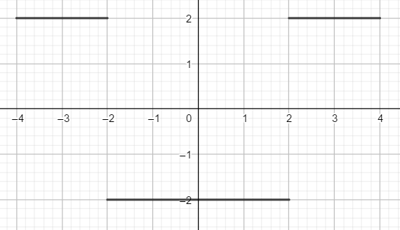

习题2.1：（A）1（2、3），2，6，7，8，18，（B）1，3，4，5
习题2.2：（A）1（4、9），3（4、19、13），6（1、3、4、6），8

# 2.1(A)

# 1.

## (2)

$$
\begin{aligned}
f'(x)&=\lim_{\Delta x\to 0}\frac{f(x+\Delta x)-f(x)}{\Delta x} \\
&=\lim_{\Delta x\to 0}\frac{\ln(x+\Delta x)-\ln x}{\Delta x} \\
&=\lim_{\Delta x\to 0}\frac{\ln(1+\frac{\Delta x}{x})}{\Delta x} \\
&=\lim_{\Delta x\to 0}\frac{\Delta x}{x\cdot \Delta x} \\
&=\frac{1}{x}
\end{aligned}
$$

## (3)

$$
\begin{aligned}
f'(0)&=\lim_{\Delta x\to 0}\frac{f(0+\Delta x)-f(0)}{\Delta x} \\
&=\lim_{\Delta x\to 0}\frac{(0+\Delta x)^2\sin\frac{1}{0+\Delta x}-0}{\Delta x} \\
&=\lim_{\Delta x\to 0}{\Delta x\sin\frac{1}{\Delta x}} \\
&=0
\end{aligned}
$$

# 2.

## (1)

$$
\begin{aligned}
&\lim_{\Delta x\to 0}\frac{f(x_0-\Delta x)-f(x_0)}{\Delta x} \\
=&-\lim_{\Delta x\to 0}\frac{f(x_0+(-\Delta x))-f(x_0)}{-\Delta x} \\
=&-f'(x_0)
\end{aligned}
$$

## (2)

$$
\begin{aligned}
&\lim_{h\to 0}\frac{f(x_0+h)-f(x_0-h)}{h} \\
&\lim_{h\to 0}\frac{f(x_0+h)-f(x_0)+f(x_0)-f(x_0-h)}{h} \\
=&\lim_{h\to 0}\frac{f(x_0+h)-f(x_0)}{h}+\lim_{h\to 0}\frac{f(x_0-h)-f(x_0)}{-h} \\
=&2f'(x_0)
\end{aligned}
$$

## (3)

$$
\begin{aligned}
&\lim_{n\to+\infty}n[f(x_0+\frac{1}{n})-f(x_0)] \\
=&\lim_{n\to+\infty}\frac{f(x_0+\frac{1}{n})-f(x_0)}{\frac{1}{n}} \\
=&f'(x_0)
\end{aligned}
$$

## (4)

$$
\begin{aligned}
&\lim_{x\to x_0}\frac{x_0f(x)-xf(x_0)}{x-x_0} \\
=&\lim_{x\to x_0}\frac{x_0f(x_0+(x-x_0))-(x_0+x-x_0)f(x_0)}{x-x_0} \\ 
=&\lim_{x\to x_0}\frac{x_0f(x_0+(x-x_0))-x_0f(x_0)}{x-x_0}-\lim_{x-x_0}\frac{(x-x_0)f(x_0)}{x-x_0} \\ 
=&x_0f'(x_0)-f(x_0)
\end{aligned}
$$

# 6.

## (a)

## (b)

# 7.

$\because f是偶函数, f'(0)存在$

$\therefore f(x)=f(-x)$

$
\begin{aligned}
\therefore f'(0)&=\displaystyle\lim_{\Delta x \to 0}\frac{f(0+\Delta x)-f(0)}{\Delta x} \\
&=-\displaystyle\lim_{\Delta x \to 0}\frac{f(0-\Delta x)-f(0)}{-\Delta x} \\
&=-f'(0)
\end{aligned}
$

$\therefore 2f'(0)=0$

$\therefore f'(0)=0$

# 8.

## (1)

$\because \varphi在x=a处连续$

$\therefore\displaystyle \lim_{x\to a}\varphi(x)=\varphi(a)$

$
\begin{aligned}
\therefore f'_-(a)&=\lim_{\Delta x\to 0^-}\frac{(x-a+\Delta x)\varphi(x+\Delta x)-(x-a)\varphi(x)}{\Delta x} \\
&= \lim_{\Delta x\to 0^-}\frac{(a-a+\Delta x)\varphi(a+\Delta x)-(a-a)\varphi(a)}{\Delta x} \\
&= \lim_{\Delta x\to 0^-}\frac{\Delta x\cdot\varphi(a+\Delta x)}{\Delta x} \\
&=\varphi(a)
\end{aligned}
$

$\therefore 同理f'_+(a)=\varphi(a)$

$\therefore f'_-(a)=f'_+(a)$

$\therefore f在x=a处可导$

## (2)

$
\begin{aligned}
\therefore g'_-(a)&= \lim_{\Delta x\to 0}\frac{|x-a+\Delta x|\varphi(x+\Delta x)-|x-a|\varphi(x)}{\Delta x} \\
&= \lim_{\Delta x\to 0}\frac{|a-a+\Delta x|
\varphi(a+\Delta x)-|a-a|\varphi(a)}{\Delta x} \\
&= \lim_{\Delta x\to 0}\frac{|\Delta x|\cdot\varphi(a+\Delta x)}{\Delta x} \\
&=-\varphi(a)
\end{aligned}
$

$\therefore 同理g'_+(a)=\varphi(a)$

$当\varphi(a)=0时, g'_-(a)=g'_+(a)$

$\therefore g在x=a处可导$

$当\varphi(a)\neq 0时, g'_-(a)\neq g'_+(a)$

$\therefore g在x=a处不可导$

# 18.

$\because f(0)=0, f'(0)=2$

$
\begin{aligned}
\therefore\lim_{x\to 0}\frac{f(x)}{\sin 2x} &=\lim_{x\to 0}\frac{f(0+x)-f(0)}{x\cdot\frac{2\sin 2x}{2x}} \\
&=\frac{f'(0)}{2} \\
&=1
\end{aligned}
$

# 2.1(B)

# 1.

$\because f在x=0处连续$

$\therefore\displaystyle \lim_{x\to 0}f(x)=f(0)$

$\because\displaystyle \lim_{x\to 0}\frac{f(x)}{x}存在$

$\therefore\displaystyle \lim_{x\to 0}f(x)=\frac{f(x)}{x}\cdot x=f(0)$

$\therefore f(0)=0$

$\therefore\displaystyle f'(0)= \lim_{\Delta x\to 0}\frac{f(0+\Delta x)-f(0)}{\Delta x}=\frac{f(\Delta x)}{\Delta x}$

$\therefore f'(0)存在$

$\therefore f在x=0处可导$

# 3.

$\therefore\displaystyle f'(a)= \lim_{\Delta x\to 0}\frac{f(a+\Delta x)-f(a)}{\Delta x}存在, 且f(a)\neq 0$

$令\displaystyle f'(a)= \lim_{\Delta x\to 0}\frac{f(a+\Delta x)-f(a)}{\Delta x}=A$

$\therefore \displaystyle \lim_{\Delta x\to 0}\frac{f(a+\Delta x)-f(a)}{A\cdot\Delta x}=1$

$令\Delta x=\displaystyle\frac{1}{n}, 则$

$
\begin{aligned}
\therefore \lim_{n\to \infty}\left[\frac{f(a+\frac{1}{n})}{f(a)}\right]^n &=\lim_{\Delta x\to 0}\left[\frac{f(a+\Delta x)}{f(a)}\right]^{\frac{1}{\Delta x}} \\
&=\lim_{\Delta x\to 0}\left[1+\frac{f(a+\Delta x)-f(a)}{f(a)}\right]^{\frac{1}{\Delta x}} \\
&=\lim_{\Delta x\to 0}\left[1+\frac{A\cdot \Delta x}{f(a)}\right]^{\frac{f(a)}{A\cdot \Delta x}\cdot\frac{A}{f(a)}} \\
&=e^{\frac{f'(a)}{f(a)}}
\end{aligned}
$

# 4.

$\therefore f'(0)=(\sin x)'|_{x=0}=\cos 0=1, f(0)=0$

$\therefore\displaystyle f'(0)= \lim_{\Delta x\to 0}\frac{f(0+\Delta x)-f(0)}{\Delta x}=\lim_{\Delta x\to 0}\frac{f(\Delta x)}{\Delta x}=1$

$令\Delta x= \displaystyle\frac{2}{n}, 则$

$
\begin{aligned}
\therefore \lim_{n\to \infty}n^{\frac{1}{2}}\sqrt{f(\frac{2}{n})} &= \lim_{\Delta x\to 0}\sqrt{2}\cdot\sqrt{\frac{f(\Delta x)}{\Delta x}} = \sqrt{2} \\
\end{aligned}
$

# 5.

## (1)

$\because\displaystyle \lim_{x\to 0}f(x)=x^n\sin\frac{1}{x}=0$

$\therefore f(x)在x=0处连续$

## (2)

**$当n\geq2时,$**

$
\begin{aligned}
\because f'(0)&=\lim_{\Delta x\to 0}\frac{f(0+\Delta x)-f(0)}{\Delta x} \\
&=\lim_{\Delta x\to 0}\frac{(0+\Delta x)^n\sin\frac{1}{0+\Delta x}-0}{\Delta x} \\
&=\lim_{\Delta x\to 0}{\Delta x^{n-1}\sin\frac{1}{\Delta x}} \\
&=0
\end{aligned}
$

$\therefore f(x)在x=0处可导$

**$当n=1时,$**

$\because f'(0)=\displaystyle\lim_{\Delta x\to 0}{\sin\frac{1}{\Delta x}}不存在$

$\therefore f(x)在x=0处不可导$

## (3)

$当n=1时, f'(x)在x=0处不存在, 则也不连续$

$当n=2时,$

$\therefore\displaystyle f'(x)=nx^{n-1}\sin\frac{1}{x}+x^n\cos\frac{1}{x}\cdot (-\frac{1}{x^2})=2x\sin\frac{1}{x}-\cos\frac{1}{x}$

$\therefore\displaystyle \lim_{x\to 0}=\lim_{x\to 0}(2x\sin\frac{1}{x}-\cos\frac{1}{x})$

$此时\displaystyle\cos\frac{1}{x}不定, 极限不存在$

$\therefore f'(x)在x=0处不连续$

$当n\geq3时,$

$\therefore\displaystyle \lim_{x\to 0}=\lim_{x\to 0}(nx^{n-1}\sin\frac{1}{x}-x^{n-2}\cos\frac{1}{x})=0$

$\therefore f'(x)在x=0处连续$

# 2.2(A)

# 1.

## (4)

$$
\begin{aligned}
y'&=(\frac{\sin x}{\cos x})'\sec x +\tan x(\frac{1}{\cos x})' \\
&=(\frac{1}{\cos^2 x})\sec x +\tan x(\frac{\sin x}{\cos^2 x}) \\
&=\frac{\sin^2 x+1}{\cos^3 x} \\
\end{aligned}
$$

## (9)

$$
\begin{aligned}
y'&=\frac{1+(\sqrt{x+\sqrt{x}})'}{2\sqrt{x+\sqrt{x+\sqrt{x}}}} \\
&=\frac{1+\frac{1+(\sqrt{x})'}{2\sqrt{x+\sqrt{x}}}}{2\sqrt{x+\sqrt{x+\sqrt{x}}}} \\
&=\frac{1+\frac{1+\frac{1}{2\sqrt{x}}}{2\sqrt{x+\sqrt{x}}}}{2\sqrt{x+\sqrt{x+\sqrt{x}}}} \\
\end{aligned}
$$

# 3.

## (4)

$\because\displaystyle y=\sqrt[3]{\frac{1+x}{1-x}}$

$\therefore\displaystyle \ln y = \frac{1}{3}\ln(1+x)-\frac{1}{3}\ln(1-x)$

$\therefore\displaystyle \frac{y'}{y} = \frac{1}{3+3x}+\frac{1}{3-3x}$

$\therefore\displaystyle y'=(\frac{1}{3+3x}+\frac{1}{3-3x})\sqrt[3]{\frac{1+x}{1-x}}$

## (13)

$
\begin{aligned}
y'&= a^ax^{a^a-1}+a^{x^a}(ax^{a-1})\ln a+a^{a^x}(a^x\ln a)\ln a\\
&= a^ax^{a^a-1}+a^{x^a+1}x^{a-1}\ln a+a^{a^x+x}\ln^2 a\\
\end{aligned}
$

## (19)

$\because\displaystyle y=\sqrt[3]{\frac{1-\sin 2x}{1+\sin 2x}}$

$\therefore\displaystyle \ln y = \frac{1}{3}\ln(1-\sin 2x)-\frac{1}{3}\ln(1+\sin 2x)$

$\therefore\displaystyle \frac{y'}{y} = -\frac{2\cos 2x}{3-3\sin 2x}-\frac{2\cos 2x}{3+3\sin 2x}=-\frac{4}{3\cos 2x}$

$\therefore\displaystyle y'=\frac{4}{3\cos 2x}\sqrt[3]{\frac{1-\sin 2x}{1+\sin 2x}}$

# 6.

## (1)

$y'=2xf'(x^2)$

## (3)

$y'=\sin 2x[f'(\sin^2 x)-f'(\cos^2 x)]$

## (4)

$y'=e^xf'(e^x)e^{g(x)}+f(e^x)g'(x)e^{g(x)}$

## (6)

$当x=0时,$

$y'_-=\displaystyle\lim_{\Delta x \to 0^-}\frac{\frac{\Delta x}{1+e^{\frac{1}{\Delta x}}}-0}{\Delta x}=\lim_{\Delta x\to 0^-}\frac{1}{1+e^{\frac{1}{\Delta x}}}=1$

$y'_+=\displaystyle\lim_{\Delta x \to 0^+}\frac{\frac{\Delta x}{1+e^{\frac{1}{\Delta x}}}-0}{\Delta x}=\lim_{\Delta x\to 0^+}\frac{1}{1+e^{\frac{1}{\Delta x}}}=0$

$左导和右导极限不同, 此时导数不存在$

$当x\neq 0时,$

$
\begin{aligned}
y'&=\frac{1+e^{\frac{1}{x}}-x(1+e^{\frac{1}{x}})'}{(1+e^{\frac{1}{x}})^2} \\
&=\frac{1+e^{\frac{1}{x}}+\frac{1}{x}e^{\frac{1}{x}}}{(1+e^{\frac{1}{x}})^2} \\
\end{aligned}
$

# 8.

$设该点为(x_0,y_0), 设切线斜率为k$

$题目意思可转化为y_0=-kx_0$

$即证\displaystyle k=-\frac{y_0}{x_0}$

$\because xy=a$

$\therefore\displaystyle y=\frac{a}{x}$

$由导数几何意义可知\displaystyle k=y'=-\frac{a}{x_0^2}=-\frac{y_0}{x_0}$

$\therefore 可知命题成立$