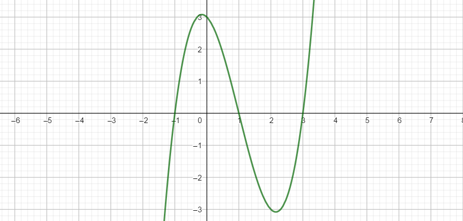

习题3.3：（A）5（3），6，10，（B）1，2，3，4，5，6，习题3.4：（A）1（1、3、5、7、9）

# 3.3 (A)

# 5. (3)

$$
\begin{aligned}
\int_{-1}^1|x|(x^2+\frac{\sin^3x}{1+\cos x}){\rm d}x
&=\int_{-1}^1|x|^3{\rm d}x+\int_{-1}^1\frac{|x|\sin^3x}{1+\cos x}{\rm d}x \\
&=2\int_0^1x^3{\rm d}x+0 \\
&=\frac{1}{2}x^4|_0^1 \\
&=\frac{1}{2} \\
\end{aligned}
$$

# 6.

$令x=t+T$

$$
\begin{aligned}
\int_a^{a+T}f(x){\rm d}x
&=\int_a^{0}f(x){\rm d}x+\int_0^{T}f(x){\rm d}x+\int_T^{a+T}f(x){\rm d}x \\
&=\int_a^{0}f(x){\rm d}x+\int_0^{T}f(x){\rm d}x+\int_T^{a+T}f(t+T){\rm d}(t+T) \\
&=\int_a^{0}f(x){\rm d}x+\int_0^{T}f(x){\rm d}x+\int_0^{a}f(t){\rm d}t \\
&=\int_a^{0}f(x){\rm d}x+\int_0^{T}f(x){\rm d}x+\int_0^{a}f(x){\rm d}x \\
&=\int_0^{T}f(x){\rm d}x \\
\end{aligned}
$$

# 10.

## (1)

$令x=\displaystyle\frac{\pi}{2}-t, x(\frac{\pi}{2})=0, x(0)=\frac{\pi}{2}$

$$
\begin{aligned}
\int_0^{\frac{\pi}{2}}f(\sin x){\rm d}x
&=\int_0^{\frac{\pi}{2}}f(\sin (\frac{\pi}{2}-t)){\rm d}(\frac{\pi}{2}-t) \\
&=-\int_{\frac{\pi}{2}}^0f(\sin (\frac{\pi}{2}-t)){\rm d}t \\
&=\int_0^{\frac{\pi}{2}}f(\cos x){\rm d}x \\
\end{aligned}
$$

## (2)

$令x=a+(b-a)t, x(0)=a, x(1)=b$

$$
\begin{aligned}
\int_a^bf(x){\rm d}x
&=\int_a^bf[a+(b-a)t]{\rm d}[a+(b-a)t] \\
&=(b-a)\int_0^1f[a+(b-a)t]{\rm d}t \\
&=(b-a)\int_0^1f[a+(b-a)x]{\rm d}x \\
\end{aligned}
$$

## (3)

$令x=1-t, x(1)=0, x(0)=1$

$$
\begin{aligned}
\int_0^1x^m(1-x)^n{\rm d}x
&=\int_0^1(1-t)^mt^n{\rm d}(1-t) \\
&=-\int_1^0t^n(1-t)^m{\rm d}t \\
&=\int_0^1x^n(1-x)^m{\rm d}x \\
\end{aligned}
$$

## (4)

$当a\geq 0时$

$令x=\sqrt{t}, x(0)=0, x(a^2)=a$

$$
\begin{aligned}
\int_0^ax^3f(x^2){\rm d}x
&=\int_0^a(\sqrt{t})^3f((\sqrt{t})^2){\rm d}\sqrt{t} \\
&=\frac{1}{2}\int_0^{a^2}tf(t){\rm d}t \\
&=\frac{1}{2}\int_0^{a^2}xf(x){\rm d}x \\
\end{aligned}
$$

$当a<0时$

$令x=-\sqrt{t}, x(0)=0, x(a^2)=a$

$$
\begin{aligned}
\int_0^ax^3f(x^2){\rm d}x
&=\int_0^a(-\sqrt{t})^3f((-\sqrt{t})^2){\rm d}(-\sqrt{t}) \\
&=\frac{1}{2}\int_0^{a^2}tf(t){\rm d}t \\
&=\frac{1}{2}\int_0^{a^2}xf(x){\rm d}x \\
\end{aligned}
$$

$\therefore 原式成立$

# 3.3 (B)

# 1.

$令x=\displaystyle\frac{\pi}{4}-\frac{t}{2}, x(\frac{\pi}{2})=0, x(-\frac{\pi}{2})=\frac{\pi}{2}$

$$
\begin{aligned}
\int_0^{\frac{\pi}{2}}\sin^mx\cdot \cos^mx{\rm d}x
&=\frac{1}{2^m}\int_0^{\frac{\pi}{2}}\sin^m2x{\rm d}x \\
&=\frac{1}{2^m}\int_0^{\frac{\pi}{2}}\sin^m(\frac{\pi}{2}-t){\rm d}(\frac{\pi}{4}-\frac{t}{2}) \\
&=-\frac{1}{2^{m+1}}\int_{\frac{\pi}{2}}^{-\frac{\pi}{2}}\cos^mt{\rm d}t \\
&=\frac{1}{2^{m}}\int_0^{\frac{\pi}{2}}\cos^mx{\rm d}x \\
\end{aligned}
$$

# 2.

$令x=t+\displaystyle\frac{\pi}{4}, x(-\frac{\pi}{4})=0, x(n\pi-\frac{\pi}{4})=n\pi$

$令t=u+n\pi, x(0)=n\pi, x(-\frac{\pi}{4})=n\pi-\frac{\pi}{4}$

$$
\begin{aligned}
&\quad\int_0^{n\pi}\sqrt{1-\sin2x}{\rm d}x \\
&=\int_0^{n\pi}\sqrt{(\sin x-\cos x)^2}{\rm d}x \\
&=\int_0^{n\pi}\sqrt{2\sin^2 (x-\frac{\pi}{4})}{\rm d}x \\
&=\int_0^{n\pi}\sqrt{2\sin^2 t}{\rm d}(t+\frac{\pi}{4}) \\
&=\int_{-\frac{\pi}{4}}^{n\pi-\frac{\pi}{4}}\sqrt{2\sin^2 t}{\rm d}t \\
&=\int_{-\frac{\pi}{4}}^0\sqrt{2\sin^2 t}{\rm d}t+\int_0^{n\pi}\sqrt{2\sin^2 t}{\rm d}t+\int_{n\pi}^{n\pi-\frac{\pi}{4}}\sqrt{2\sin^2 t}{\rm d}t \\
&=\int_{-\frac{\pi}{4}}^0\sqrt{2\sin^2 t}{\rm d}t+\int_0^{n\pi}\sqrt{2\sin^2 t}{\rm d}t+\int_0^{-\frac{\pi}{4}}\sqrt{2\sin^2 (u+n\pi)}{\rm d}u \\
&=\sqrt{2}\int_0^{n\pi}|\sin x|{\rm d}x \\
&=\sqrt{2}(\int_0^{\pi}\sin x{\rm d}x-\int_{\pi}^{2\pi}\sin x{\rm d}x+\cdots +(-1)^{n-1}\int_{(n-1)\pi}^{n\pi}\sin x{\rm d}x) \\
&=\sqrt{2}n\int_0^{\pi}\sin x{\rm d}x \\
&=\sqrt{2}n(-\cos x|_0^{\pi}) \\
&=2\sqrt{2}n \\
\end{aligned}
$$

# 3.

$令x=\displaystyle\frac{\pi}{2}-x, x(\frac{11\pi}{2})=-5\pi, x(-\frac{9\pi}{2})=5\pi$

$$
\begin{aligned}
&\quad\int_0^{10\pi}\frac{\sin^3x+\cos^3x}{2\sin^2x+\cos^4x}{\rm d}x \\
&=\int_{-5\pi}^{5\pi}\frac{\sin^3x}{2\sin^2x+\cos^4x}{\rm d}x+\int_{-5\pi}^{5\pi}\frac{\cos^3x}{2\sin^2x+\cos^4x}{\rm d}x \\
&=\int_{-5\pi}^{5\pi}\frac{\cos^3x}{2\sin^2x+\cos^4x}{\rm d}x \\
&=\int_{\frac{11\pi}{2}}^{-\frac{9\pi}{2}}\frac{\sin^3x}{2\cos^2x+\sin^4x}{\rm d}(\frac{\pi}{2}-x) \\
&=\int_{-5\pi}^{5\pi}\frac{\sin^3x}{2\sin^2x+\cos^4x}{\rm d}x \\
&=0 \\
\end{aligned}
$$

# 4.

$令x=n\pi-t, x(n\pi)=0, x(0)=n\pi$

$$
\begin{aligned}
\quad\int_0^{n\pi}x|\sin x|{\rm d}x&=\int_0^{n\pi}(n\pi-t)|\sin (n\pi-t)|{\rm d}(n\pi-t) \\
&=\int_0^{n\pi}(n\pi-t)|\sin (t)|{\rm d}t \\
&=n\pi\int_0^{n\pi}|\sin (x)|{\rm d}x-\int_0^{n\pi}x|\sin (x)|{\rm d}x \\
\end{aligned}
$$

$$
\begin{aligned}
\quad\int_0^{n\pi}x|\sin x|{\rm d}x
&=\frac{1}{2}n\pi\int_0^{n\pi}|\sin (x)|{\rm d}x \\
&=\frac{1}{2}n^2\pi\int_0^{\pi}\sin (x){\rm d}x \\
&=n^2\pi \\
\end{aligned}
$$

# 5.

$$
\begin{aligned}
&\quad\int_\frac{1}{2}^2(1+x-\frac{1}{x})e^{x+\frac{1}{x}}{\rm d}x \\
&=\int_\frac{1}{2}^2e^{x+\frac{1}{x}}{\rm d}x+\int_\frac{1}{2}^2x{\rm d}e^{x+\frac{1}{x}} \\
&=\int_\frac{1}{2}^2e^{x+\frac{1}{x}}{\rm d}x+xe^{x+\frac{1}{x}}|_\frac{1}{2}^2-\int_\frac{1}{2}^2e^{x+\frac{1}{x}}{\rm d}x \\
&=\frac{3}{2}e^{\frac{5}{2}} \\
\end{aligned}
$$

# 6.

$$
\begin{aligned}
\int\frac{xe^x}{(1+x)^2}x
&=\int\frac{1}{1+x}{\rm d}e^x-\int\frac{1}{(1+x)^2}{\rm d}e^x \\
&=\frac{e^x}{1+x}-\int e^x{\rm d}\frac{1}{1+x}-\int\frac{1}{(1+x)^2}{\rm d}e^x \\
&=\frac{e^x}{1+x}+\int\frac{e^x}{(1+x)^2}{\rm d}x-\int\frac{1}{(1+x)^2}{\rm d}e^x \\
&=\frac{e^x}{1+x}\\
\end{aligned}
$$

# 3.4 (A)

# 1.

## (1)

$$
\begin{aligned}
\therefore S
&=\int_0^19-x^2-x^2{\rm d}x \\
&=\int_0^19-2x^2{\rm d}x \\
&=(9x-\frac{2}{3}x^3)|_0^1 \\
&=\frac{25}{3} \\
\end{aligned}
$$

## (3)

$\therefore y=(\sqrt{a}-\sqrt{x})^2=x-2\sqrt{ax}+a, 0\leq x\leq a$

$$
\begin{aligned}
\therefore S
&=\int_0^a(x-2\sqrt{a}\sqrt{x}+a){\rm d}x \\
&=(\frac{1}{2}x^2-\frac{4}{3}\sqrt{a}x^\frac{3}{2}+ax)|_0^a \\
&=\frac{1}{6}a^2 \\
\end{aligned}
$$

## (5)

$令f(x)=x(x-1)(x-2)-3(x-1)=(x-1)(x^2-2x-3)=(x-1)(x+1)(x-3)=x^3-3x^2-x+3$

$\therefore 对于f(x)=0解得x_1=-1, x_2=1, x_3=3,$
$\quad 且f(x)在(-1,1)大于0, 在(1,3)小于0$

$$
\begin{aligned}
\therefore S
&=\int_{-1}^1f(x){\rm d}x+\int_1^3-f(x){\rm d}x \\
&=\int_{-1}^1(x^3-3x^2-x+3){\rm d}x+\int_1^3(-x^3+3x^2+x-3){\rm d}x \\
&=(\frac{1}{4}x^4-x^3-\frac{1}{2}x^2+3x)|_{-1}^1-(\frac{1}{4}x^4-x^3-\frac{1}{2}x^2+3x)|_1^3 \\
&=8 \\
\end{aligned}
$$

## (7)

$令\theta=\frac{1}{2}t, \theta(0)=0, \theta(\pi)=\frac{\pi}{2}$

$$
\begin{aligned}
\therefore S
&=4\int_0^{\frac{\pi}{2}}\frac{1}{2}\rho^2(\theta){\rm d}\theta \\
&=4\int_0^{\frac{\pi}{2}}\sin2\theta{\rm d}2\theta \\
&=4\int_0^{\pi}\sin t{\rm d}t \\
&=-4\cos x|_0^{\pi} \\
&=8 \\
\end{aligned}
$$

## (9)

$$
\begin{aligned}
\therefore S
&=\int_0^{2\pi}y(t){\rm d}x(t) \\
&=\int_0^{2\pi}a(1-\cos t){\rm d}a(t-\sin t) \\
&=a^2\int_0^{2\pi}(1-\cos t)^2{\rm d}t \\
&=a^2\int_0^{2\pi}(1-2\cos t+\cos^2 t){\rm d}t \\
&=a^2(x-2\sin x)|_0^{2\pi}+a^2\int_0^{2\pi}\frac{1+\cos 2t}{2}{\rm d}t \\
&=2\pi a^2+a^2\int_0^{2\pi}\frac{1+\cos 2t}{2} {\rm d}t \\
&=3\pi a^2 \\
\end{aligned}
$$