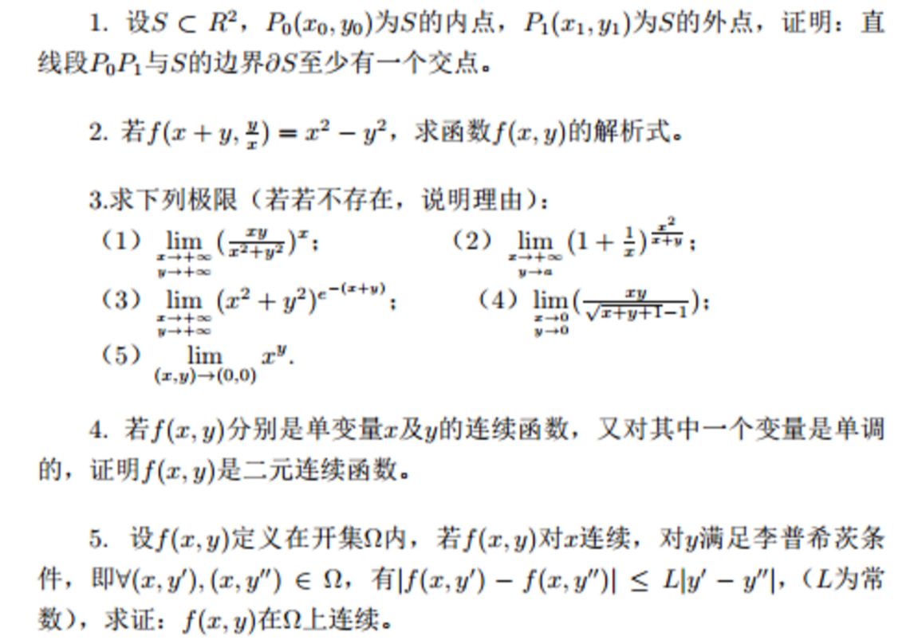

# 第二周习题

## 1.

假设直线段 $P_0P_1$ 与 $S$ 的边界无交点, 即只有内点和外点

对于线段 $P_0P_1$ 上每一个内点 $\boldsymbol{a}$ 均存在 $\delta>0$ 使得开球 $U(\boldsymbol{a}, \delta)\subset S$

同理对于线段 $P_0P_1$ 上每一个外点 $\boldsymbol{b}$ 均存在 $\delta>0$ 使得开球 $U(\boldsymbol{b}, \delta)\cap S=\empty$

我们便可以构造出开集族 $\{U(\boldsymbol{x}, \delta)\}_{\boldsymbol{x}\in P_0P_1}$, 对线段 $P_0P_1$ 形成了开覆盖

$\because P_0P_1$ 是一个闭集

$\therefore$ 可以找出有限个 $U(\boldsymbol{x}, \delta)$ 将 $P_0P_1$ 覆盖

从 $P_0$ 开始, 开集 $U(\boldsymbol{P_0}, \delta)$ 里的点全都为 $S$ 的内点

$\therefore$ 与 $U(\boldsymbol{P_0}, \delta)$ 相接的开集 $O_1$ 满足 $U(\boldsymbol{P_0}, \delta)\cap O_1\neq \empty$, 因此有 $O_1$ 里的点全为 $S$ 的内点

$\therefore$ 沿着这条开集链条可推得, 对于任意 $\boldsymbol{x}\in P_1P_2$ 均有 $U(\boldsymbol{x}, \delta)$ 里的点均为 $S$ 的内点

这个结论与 $P_1$ 是外点, $U(\boldsymbol{P_1}, \delta)\cap S=\empty$ 矛盾

$\therefore$ 线段 $P_0P_1$ 与 $S$ 的边界 $\partial S$ 至少有一个交点

## 2.

原式可写为 $\displaystyle f(a+b,\frac{b}{a})=a^2-b^2$

令 $\displaystyle x=a+b, y=\frac{b}{a}$

解得 $\displaystyle a=\frac{x}{y+1}, b=x-\frac{x}{y+1}=\frac{xy}{y+1}$

$\displaystyle\therefore f(x, y)=\frac{x^2(1-y^2)}{(y+1)^2}$

## 3.

### (1)

$\because x^2+y^2-2xy\geq 0 \Rightarrow \displaystyle\frac{xy}{x^2+y^2}\leq \frac{1}{2}, \quad (x^2+y^2\neq 0)$

对于 $x\to+\infty, y\to+\infty$

$\displaystyle 0<(\frac{xy}{x^2+y^2})^x\leq\frac{1}{2^x}$

$\displaystyle\because \frac{1}{2^x}\to 0$

由夹逼定理可知

$\displaystyle \lim_{x\to +\infty,y\to +\infty}(\frac{xy}{x^2+y^2})^x=0$

### (2)

$
\begin{aligned}
\lim_{x\to +\infty,y\to a}(1+\frac{1}{x})^{\frac{x^2}{x+y}}
&=\lim_{x\to +\infty,y\to a}e^{x\ln(1+\frac{1}{x})\cdot \frac{x}{x+y}} \\
&=\exp(\lim_{x\to +\infty,y\to a}{x\ln(1+\frac{1}{x})\cdot \lim_{x\to +\infty,y\to a}\frac{x}{x+y}}) \\
&=\exp(\lim_{x\to +\infty,y\to a}{x\cdot \frac{1}{x}\cdot \lim_{x\to +\infty,y\to a}\frac{x}{x+y}}) \\
&=e^{1\times 1} \\
&=e \\
\end{aligned}
$

### (3)

$
\begin{aligned}
&\lim_{x\to +\infty,y\to +\infty}(x^2+y^2)^{e^{-(x+y)}} \\
=&\lim_{x\to +\infty,y\to +\infty}\exp({e^{-(x+y)}\ln(x^2+y^2)}) \\
=&\exp(\lim_{x\to +\infty,y\to +\infty}{\frac{\ln(x^2+y^2)}{e^{x+y}}}) \\
=&e^0 \\
=&1 \\
\end{aligned}
$

### (4)

$\displaystyle\because \lim_{(x,y)\to (0,0)}\frac{xy}{\sqrt{x+y+1}-1}\cdot\frac{1}{\sqrt{x+y+1}+1}=\lim_{(x,y)\to (0,0)}\frac{xy}{x+y}$

$\displaystyle\quad\lim_{(x,y)\to (0,0)}\frac{1}{\sqrt{x+y+1}+1}=\frac{1}{2}$

$\displaystyle\therefore \lim_{(x,y)\to (0,0)}\frac{xy}{\sqrt{x+y+1}-1}$ 和 $\displaystyle\lim_{(x,y)\to (0,0)}\frac{xy}{x+y}$ 的极限要么同时存在, 要么同时不存在

令 $y = x$ 可得 $\displaystyle\lim_{(x,y)\to (0,0)}\frac{xy}{x+y}=\displaystyle\lim_{(x,y)\to (0,0)}\frac{x^2}{x+x}=0$

令 $y = x^2-x$ 可得 $\displaystyle\lim_{(x, y)\to (0,0)}\frac{xy}{x+y}=\displaystyle\lim_{(x,y)\to (0,0)}\frac{x^3-x^2}{x+x^2-x}=-1$

可知 $\displaystyle\lim_{(x,y)\to (0,0)}\frac{xy}{x+y}$ 极限不存在

因此 $\displaystyle\therefore \lim_{(x,y)\to (0,0)}\frac{xy}{\sqrt{x+y+1}-1}$ 极限不存在

### (5)

$\because\displaystyle\lim_{x\to 0}\lim_{y\to 0}x^y=\lim_{x\to 0}1=1$

$\quad\displaystyle\lim_{y\to 0}\lim_{x\to 0}x^y=\lim_{y\to 0}0=0$

两种累次极限的结果不一致

$\therefore\displaystyle\lim_{(x,y)\to (0,0)}x^y$ 的极限不存在

## 4.

不妨假设 $f(x,y)$ 对 $x$ 单调递增且连续

对于任意一点 $(x_0,y_0)$

$\forall\varepsilon>0, \exist\delta_1>0$, s.t. $|x-x_0|\leq \delta_1$ 时

$$
f(x_0-\delta_1,y)\leq f(x,y)\leq f(x_0+\delta_1,y)
$$

$$
-\frac{\varepsilon}{2}<f(x,y_0)-f(x_0,y_0)<\frac{\varepsilon}{2}
$$

因为对 $y$ 也连续

$\exist\delta_2>0$, s.t. $|y-y_0|\leq \delta_2$ 时

$$
-\frac{\varepsilon}{2}<f(x_0\pm\delta_1,y)-f(x_0\pm\delta_1,y_0)<\frac{\varepsilon}{2}
$$

因此我们有

$$
\begin{aligned}
f(x,y)-f(x_0,y_0)
&\leq f(x_0+\delta_1,y)-f(x_0,y_0) \\
&<f(x_0+\delta_1,y_0)+\frac{\varepsilon}{2}-f(x_0,y_0) \\
&<\varepsilon \\
\end{aligned}
$$

$$
\begin{aligned}
f(x,y)-f(x_0,y_0)
&\geq f(x_0-\delta_1,y)-f(x_0,y_0) \\
&>f(x_0-\delta_1,y_0)-\frac{\varepsilon}{2}-f(x_0,y_0) \\
&>-\varepsilon \\
\end{aligned}
$$

$\therefore |f(x,y)-f(x_0,y_0)|<\varepsilon$

$\therefore f(x,y)$ 是二元连续函数

## 5.

对于任意一点 $(x_0,y_0)\in \Omega$

$\because f(x,y)$ 对 $x$ 连续

$\forall\varepsilon>0, \exist\delta_0>0$, s.t. $|x-x_0|\leq \delta_0$ 时

$$
|f(x,y_0)-f(x_0,y_0)|<\frac{\varepsilon}{2}
$$

又由题目可知

$$
|f(x,y)-f(x,y_0)|\leq L|y-y_0|
$$

令 $\delta=\frac{\varepsilon}{2L}$, s.t. $\forall(x,y)\in U((x_0,y_0),\delta)$ 时

$$
\begin{aligned}
|f(x,y)-f(x_0,y_0)|
&\leq |f(x,y)-f(x,y_0)|+|f(x,y_0)-f(x_0,y_0)| \\
&< L\cdot \frac{\varepsilon}{2L}+\frac{\varepsilon}{2} \\
&< \varepsilon \\
\end{aligned}
$$

$\therefore f(x,y)$ 在 $\Omega$ 上连续

