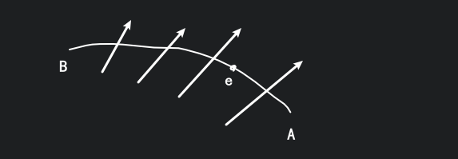

# 习题课

## 曲线积分

曲线积分主要是用于解决**变力做功**的问题.

例如, 一个电子在一个电场中运动, 我们想知道电场力对它做了多少功.

### 旋度

旋度: 转一圈, 场是否对物体做功.

奇点: 场强无穷大.

记作 $\displaystyle \text{rot} A=\begin{vmatrix} \vec{i} &\vec{j} &\vec{k} \\ \frac{\partial}{\partial x} & \frac{\partial}{\partial y} & \frac{\partial}{\partial z} \\ P & Q & R \\\end{vmatrix}$

无旋度的场是保守场, 即第二型曲线积分与路径无关.

如果与路径无关, 那么我们只需要记录"位置信息", 这个"位置信息"其实就是场的势.

如: 重力场的重力势, 电场的电势.

### 例题

$L: x^{2}+y^{2}=2$ 逆时针.

**解:**

设 $l: 4x^{2}+y^{2}=\varepsilon^{2}$

$\displaystyle \text{rot} A=\begin{vmatrix} \vec{i} &\vec{j} &\vec{k} \\ \frac{\partial}{\partial x} & \frac{\partial}{\partial y} & \frac{\partial}{\partial z} \\ P & Q & R \\\end{vmatrix}=\{0, 0, 0\}$

旋度为零, 是保守场 (其实在这里就是一个格林公式)

$
\begin{aligned}
I&=\oint \frac{4x-y}{4x^{2}+y^{2}}\mathrm{d}x+\frac{x+y}{4x^{2}+y^{2}}\mathrm{d}y \\
&=\oint_{L-l}+\oint_{l} \\
&=\oint_{l}P\mathrm{d}x+Q\mathrm{d}y \\
&=\frac{1}{\varepsilon^{2}}\oint_{l}(4x-y)\mathrm{d}x+(x+y)\mathrm{d}y \\
&=\frac{1}{\varepsilon^{2}}\iint_{D}2\mathrm{d}x\mathrm{d}y \\
&=\pi 
\end{aligned}
$

## 曲面积分

曲线积分其实是想解决**求通量**问题.

