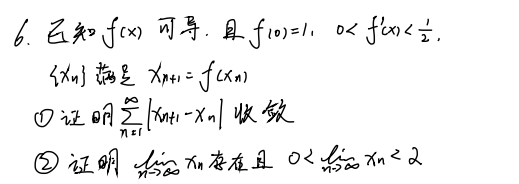
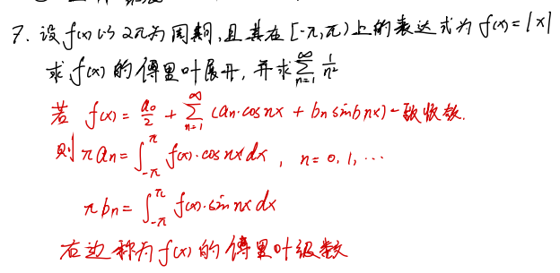

# 习题课

## 1.

**题目:** 将 $\displaystyle f(x)=\frac{1}{x^{2}-x}$ 展开为 $(x+1)$ 的幂级数, 并求其收敛域.

**解答:**

令 $t=x+1$, 则原式为 $\displaystyle \frac{1}{x^{2}-x}=\frac{1}{(t-1)(t-2)}=\frac{1}{1-t}-\frac{1}{2}\cdot \frac{1}{1-\frac{t}{2}}$

$\because \displaystyle \frac{1}{1-t}=\sum_{n=0}^{\infty}t^{n}, t\in(-1,1)$

$\quad \displaystyle \frac{1}{1-\frac{t}{2}}=\sum_{n=0}^{\infty}\frac{1}{2^{n}}t^{n}, t\in (-2,2)$

$\therefore \displaystyle f(x)=\frac{1}{x^{2}-x}=\sum_{n=0}^{\infty}\left( 1-\frac{1}{2^{n+1}} \right)t^{n}=\sum_{n=0}^{\infty}\left( 1-\frac{1}{2^{n+1}} \right)(x+1)^{n}, x\in (-2,0)$

## 2.

**题目:** 求 $\displaystyle \sum_{n=0}^{\infty}\frac{n}{n+1}(x+1)^{n}$ 的和函数及收敛域. 

**解答:**

<!-- 收敛半径 $\displaystyle R=\lim_{n \to \infty}\frac{n}{n+1}\cdot \frac{n+2}{n+1}=1$

即收敛区间为 $(-1,1)$

收敛域为 $(-1,1)$

当 $x+1=0$ 时, 原式为 $\displaystyle 0$. 

当 $x+1\neq 0$ 时,

令 $\displaystyle S(x)=\frac{1}{x+1}g(x)$, 即 $\displaystyle g(x)=\sum_{n=0}^{\infty}\frac{n}{n+1}(x+1)^{n+1}$

$\therefore \displaystyle g'(x)=\sum_{n=0}^{\infty}n(x+1)^{n}$, 令 $g'(x)=(x+1)f(x)$, 即 $\displaystyle f(x)=\sum_{n=0}^{\infty}n(x+1)^{n-1}$

$\therefore \displaystyle \int_{-1}^{x}f(x)=\sum_{n=0}^{\infty}\int_{-1}^{x}n(x+1)^{n-1}\mathrm{d}x=\sum_{n=0}^{\infty}(x+1)^{n}=\lim_{n \to \infty}\frac{1-t^{n}}{1-t}=\frac{1}{1-t}$

$\therefore \displaystyle f(x)=\frac{\mathrm{d}}{\mathrm{d}t}(\frac{1}{1-t})=\frac{1}{\left(t - 1\right)^{2}}$

$\therefore \displaystyle g'(x)=\frac{t}{\left(t - 1\right)^{2}}$

$\therefore \displaystyle g(x)=g(x)-g(-1)=\int_{0}^{t}\frac{t}{\left(t - 1\right)^{2}}\mathrm{d}t=\ln x-\frac{1}{x+1}+1$ -->

## 3.

$\therefore \displaystyle f(x)=\frac{1}{4}\ln (1+x)-\ln(1-x)+\frac{1}{2}\arctan x-x$

$
\begin{aligned}
\therefore f'(x)
&=\frac{1}{4}\left( \frac{1}{x+1}+\frac{1}{1-x} \right)+\frac{1}{2}\cdot \frac{1}{1+x^{2}}-1 \\
&=\frac{1}{4}\cdot \frac{1-x+x+1}{(x+1)(1-x)}+\frac{1}{2}\cdot \frac{1}{1+x^{2}}-1 \\
&=\frac{1}{2}\cdot \frac{1}{1-x^{2}}+\frac{1}{2}\cdot \frac{1}{1+x^{2}}-1 \\
&=\frac{1}{1-x^{4}}-1 \\
&=\sum_{n=0}^{\infty}x^{4n}-1 \\
&=\sum_{n=1}^{\infty}x^{4n} \\
\end{aligned}
$

其中 $x\in(-1,1)$

$\therefore \displaystyle f(x)=f(x)-f(0)=\int_{0}^{x}f'(x)\mathrm{d}x=\int_{0}^{x}\sum_{n=1}^{\infty}x^{4n}\mathrm{d}x=\sum_{n=1}^{\infty}\frac{1}{4n+1}x^{4n+1}$

PS:

积分 $\displaystyle \int e^{ax}\cdot \sin bx\mathrm{d}x$

$\therefore \displaystyle \int e^{ax}\cdot \sin bx\mathrm{d}x=\frac{\begin{vmatrix} (e^{ax})' & (\sin bx)' \\ e^{ax} & \sin bx \\\end{vmatrix}}{a^{2}+b^{2}}+C$

## 4.

$\because \displaystyle x_{n+1}=x_{n}+x_{n}^{3}=x_{n}(1+x_{n}^{2})$

$\therefore \displaystyle \frac{1}{x_{n+1}}=\frac{1}{x_{n}(1+x_{n}^{2})}=\frac{1}{x_{n}}-\frac{x_{n}}{1+x_{n}^{2}}$

$\therefore \displaystyle \frac{x_{n}}{1+x_{n}^{2}}=\frac{1}{x_{n}}-\frac{1}{x_{n+1}}$

$\therefore \displaystyle \sum_{n=1}^{\infty}\frac{x_{n}}{1+x_{n}^{2}}=\frac{1}{x_{1}}-\lim_{n \to \infty}\frac{1}{x_{n}}$

我们要证明 $\displaystyle x_{n}$ 是递增且无极限.

数学归纳法:

当 $x=1$ 时, $x_{2}=r+r^{3}>x_1=r$, 递增成立.

当 $x=k-1$ 时, 假设 $x_{k}-x_{k-1}>0$.

当 $x=k$ 时,

$\therefore x_{k+1}-x_{k}=f(x_{k})-f(x_{k-1})=f'(\xi)(x_{k}-x_{k-1})>0$

我们可知 $x_{n}$ 是单调递增的.

反证法, 假设极限存在, $\displaystyle \lim_{n \to \infty}x_{n}=A$.

$\because \displaystyle x_{n+1}=x_{n}+x_{n}^{3}$

$\therefore \displaystyle \lim_{n \to \infty}x_{n+1}=\lim_{n \to \infty}x_{n}+\lim_{n \to \infty}x_{n}^{3}$

$\therefore A=A+A^{3}$

$\therefore A=0$

$\because A\geqslant r>0$, 与 $A=0$ 矛盾.

所以极限不存在.

由此可知,

$\therefore \displaystyle \sum_{n=1}^{\infty}\frac{x_{n}}{1+x_{n}^{2}}=\frac{1}{x_{1}}-\lim_{n \to \infty}\frac{1}{x_{n}}=\frac{1}{r}$

## 5.

收敛半径 $\displaystyle R=\lim_{n \to \infty}\frac{a_{n}}{a_{n+1}}=\frac{n+1}{n+\frac{1}{2}}=1$

所以当 $|x|<1$ 时, $\displaystyle \sum_{n=1}^{\infty}a_{n}x^{n}$ 收敛.

设 $\displaystyle f(x)=\sum_{n=1}^{\infty}a_{n}x^{n}$

$\therefore \displaystyle f'(x)=\sum_{n=1}^{\infty}na_{n}x^{n-1}=\sum_{n=0}^{\infty}(n+1)a_{n+1}x^{n}$

当 $n=0$ 时, $\displaystyle (n+1)a_{n+1}x^{n}=1$

$
\begin{aligned}
\therefore f'(x)
&=1+\sum_{n=1}^{\infty}(n+1)a_{n+1}x^{n} \\
&=1+\sum_{n=1}^{\infty}(n+\frac{1}{2})a_{n}x^{n} \\
&=1+x\sum_{n=1}^{\infty}na_{n}x^{n-1}+\frac{1}{2}\sum_{n=1}^{\infty}a_{n}x^{n} \\
&=1+xf'(x)+\frac{1}{2}f(x) \\
\end{aligned}
$

$\therefore \displaystyle f'(x)=1+\frac{1}{2}f(x)+xf'(x)$

$\therefore \displaystyle (1-x)f'(x)-\frac{1}{2}f(x)=1$

$\therefore \displaystyle f'(x)-\frac{1}{2(1-x)}f(x)=\frac{1}{1-x}$

## 6.

### (1)

$\displaystyle |x_{n+1}-x_{n}|=|f(x_{n})-f(x_{n+1})|=f'(\xi)|x_{n}-x_{n-1}|<\frac{1}{2}|x_{n}-x_{n-1}|<\cdots<\left( \frac{1}{2} \right)^{n-1}|x_2-x_1|\leqslant$

可证明收敛.

$\because \displaystyle A=\sum_{n=1}^{\infty}x_{n+1}-x_{n}=\lim_{n \to \infty}x_{n}-x_1$

$\therefore \displaystyle \lim_{n \to \infty}x_{n}=A+x_1=C$

$\therefore x_{n+1}=f(x_{n})-f(0)+1=f'(\xi)\cdot x_{n}+1$

$\therefore \displaystyle \lim_{n \to \infty} x_{n+1}=\lim_{n \to \infty}f'(\xi)\cdot x_{n}+1$

$\therefore C=f'(\xi)\cdot C+1$

$\therefore \displaystyle C=\frac{1}{1-f'(\xi)}<2$

## 7.

欧拉级数 $\displaystyle \sum_{n=1}^{\infty}\frac{1}{n^{2}}=\frac{\pi^{2}}{6}$

