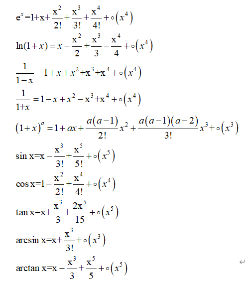

$无穷小量替换实际为恰当的泰勒展开.$

$\sin x=\frac{1}{1!}x-\frac{1}{3!}x^3+\frac{1}{5!}x^5-\frac{1}{7!}x^7\cdots$

$\cos x=\frac{1}{0!}x-\frac{1}{2!}x^2+\frac{1}{4!}x^4-\frac{1}{6!}x^6\cdots$

$e^x=1+x+\frac{x^2}{2!}+\cdots$

$\displaystyle\frac{1}{1-x}=1+x+x^2+\cdots$

$广义二项展开:(1+x)^\alpha=1+\alpha x + o(x)$

# 1.

$$
\begin{aligned}
\lim_{x\to 0}[\frac{x^2\sin \frac{1}{x}}{\sin x}+(\frac{3-e^x}{2+x})^{\csc x}] &= \lim_{x\to 0}[x\sin \frac{1}{x}+(\frac{3-e^x}{2+x})^{\csc x}] \\
&=\lim_{x\to 0}(\frac{3-e^x}{2+x})^{\csc x} \\
&=\lim_{x\to 0}\exp({\frac{1}{\sin x}}\ln(\frac{3-e^x}{2+x})) \\
&=\lim_{x\to 0}\exp({\frac{1}{\sin x}}\ln(\frac{1-e^x-x}{2+x}+1)) \\
&=\lim_{x\to 0}\exp({\frac{1}{\sin x}}\cdot\frac{1-e^x-x}{2+x}) \\
&=\lim_{x\to 0}\exp(\frac{-x-x}{x(2+x)}) \\
&=-1 \\
\end{aligned}
$$

# 2.

$$
\begin{aligned}
\lim_{x\to 0} \frac{\sqrt{1+\tan x}-\sqrt{1+\sin x}}{x^3} &=\lim_{x\to 0} \frac{{1+\frac{1}{2}\tan x}-{1-\frac{1}{2}\sin x}}{x^3} \\
&=\lim_{x\to 0} \frac{\tan x-\sin x}{2x^3}
\end{aligned}
$$

$$
\begin{aligned}
\lim_{x\to 0} \frac{\sqrt{1+\tan x}-\sqrt{1+\sin x}}{x^3} &=\lim_{x\to 0} \frac{\tan x-\sin x}{x^3(\sqrt{1+\tan x}+\sqrt{1+\sin x})} \\
&=\lim_{x\to 0} \frac{\tan x-\sin x}{2x^3} \\
&=\lim_{x\to 0} \frac{\sin x(1-\cos x)}{2x^3} \\
&=\lim_{x\to 0} \frac{\frac{1}{2}x^3}{2x^3} \\
&=\frac{1}{4}
\end{aligned}
$$

# 3.

$
已知
\begin{aligned}
\lim_{x\to 0}(1+x+\frac{f(x)}{x})^\frac{1}{x}&=e^3 \\
\end{aligned}
$

$
求
\begin{aligned}
\lim_{x\to 0}(1+\frac{f(x)}{x})^\frac{1}{x} \\
\end{aligned}
$

$
\because
\begin{aligned}
\lim_{x\to 0}(1+x+\frac{f(x)}{x})^\frac{1}{x}=\lim_{x\to 0}\exp(\frac{1}{x}\ln(1+x+\frac{f(x)}{x}))=e^3 \\
\end{aligned}
$

$\therefore \displaystyle\lim_{x\to 0}\frac{1}{x}\ln(1+x+\frac{f(x)}{x})=3$

$\therefore \displaystyle\lim_{x\to 0}\frac{f(x)}{x^2}=2$

$\therefore \displaystyle\lim_{x\to 0}(1+\frac{f(x)}{x})^\frac{1}{x}=\lim_{x\to 0}\exp(\frac{1}{x}\ln(1+\frac{f(x)}{x}))=\lim_{x\to 0}\exp(\frac{f(x)}{x^2})=e^2$

# 4.

$\displaystyle\lim_{x\to 1}\frac{x^3+ax^2+b}{x-1}=5, 求a,b.$

$由分子分母均为无穷小量可知, 1+a+b=0$

$令t=x-1, 则$

$
\begin{aligned}
\therefore \displaystyle\lim_{t\to 0}\frac{(t+1)^3+a(t+1)^2+b}{t} &= \lim_{t\to 0}\frac{1+3t+a+2at+b}{t}\\
&= \lim_{t\to 0}\frac{(3+2a)t+1+a+b}{t} \\
&= 3+2a \\
&= 5
\end{aligned}
$

$\therefore 3+2a=5,1+a+b=0$

$\therefore a=1,b=-2$

# 5.

$当a>1时,$

$$
\begin{aligned}
\lim_{x\to \infty} (\frac{1}{x}\cdot \frac{a^x-1}{a-1})^{\frac{1}{x}} &= \lim_{x\to \infty}\exp(\frac{1}{x}\ln(\frac{1}{x}\cdot \frac{a^x-1}{a-1}))\\
&= \lim_{x\to \infty}\exp(-\frac{\ln x}{x}+\frac{1}{x}\ln( \frac{a^x-1}{a-1}))\\
&= \lim_{x\to \infty}\exp(\frac{1}{x}\ln(\frac{a^x-1}{a-1}))\\
&= \lim_{x\to \infty}\exp(\frac{1}{x}\ln(\frac{a^x-1}{a^x}\cdot\frac{a^x}{a-1}))\\
&= \lim_{x\to \infty}\exp(\frac{1}{x}\ln(\frac{a^x-1}{a^x})+\frac{1}{x}\ln({a^x})-\frac{1}{x}\ln({a-1}))\\
&= \lim_{x\to \infty}\exp(-\frac{1}{xa^x}+\frac{1}{x}\ln({a^x}))\\
&= \lim_{x\to \infty}\exp(\frac{1}{x}\ln({a^x}))\\
&= a\\
\end{aligned}
$$

$当a<1时,$

$$
\begin{aligned}
\lim_{x\to \infty} (\frac{1}{x}\cdot \frac{a^x-1}{a-1})^{\frac{1}{x}} &= \lim_{x\to \infty}\exp(\frac{1}{x}\ln(\frac{1}{x}\cdot \frac{a^x-1}{a-1}))\\
&= \lim_{x\to \infty}\exp(-\frac{\ln x}{x}+\frac{1}{x}\ln( \frac{1-a^x}{1-a}))\\
&= \lim_{x\to \infty}\exp(\frac{1}{x}\ln(\frac{1-a^x}{1-a}))\\
&= \lim_{x\to \infty}\exp(\frac{1}{x}\ln({1-a^x})-\frac{1}{x}\ln({1-a}))\\
&= \lim_{x\to \infty}\exp(\frac{1}{x}\ln({1-a^x}))\\
&= \lim_{x\to \infty}\exp(-\frac{a^x}{x}))\\
&= 1\\
\end{aligned}
$$