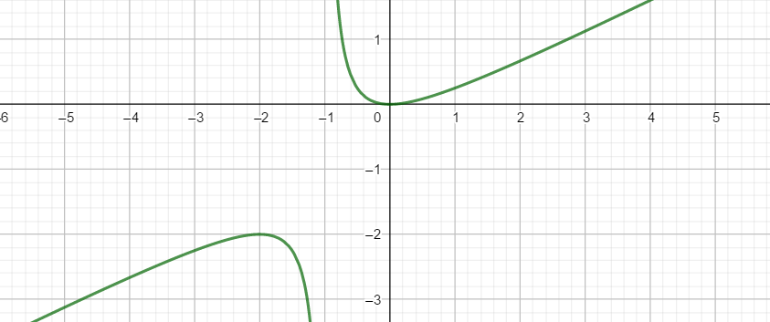

# 一

## (1)

$\displaystyle\int|1-x|{\rm d}x=\int|x-1|{\rm d}(x-1)=\ln(x-1)+C$

## (2)

$\displaystyle\int\frac{e^x(1+x)}{(1-xe^x)^2}{\rm d}x=\int\frac{{\rm d}xe^x}{(1-xe^x)^2}=\int\frac{{\rm d}(xe^x-1)}{(xe^x-1)^2}=-\frac{1}{xe^x-1}+C$

## (3)

$$
\begin{aligned}
&\quad\int(\arcsin x)^2{\rm d}x \\
&=x(\arcsin x)^2-2\int\frac{x\arcsin x}{\sqrt{1-x^2}}{\rm d}x \\
&=x(\arcsin x)^2+2\int\arcsin x{\rm d}\sqrt{1-x^2} \\
&=x(\arcsin x)^2+2\arcsin x\sqrt{1-x^2}-2\int\sqrt{1-x^2}{\rm d}\arcsin x \\
&=x(\arcsin x)^2+2\arcsin x\sqrt{1-x^2}-2x+C \\
\end{aligned}
$$

## (4)

$当a\leq 0时,$

$\displaystyle\int_0^ex|x-a|{\rm d}x=\int_0^ex(x-a){\rm d}x=\frac{1}{3}e^3-\frac{1}{2}ae^2$

$当a\geq e时,$

$\displaystyle\int_0^ex|x-a|{\rm d}x=-\int_0^ex(x-a){\rm d}x=\frac{1}{2}ae^2-\frac{1}{3}e^3$

$当0<a<e时,$

$$
\begin{aligned}
\int_0^ex|x-a|{\rm d}x
&=\int_a^ex(x-a){\rm d}x-\int_0^ax(x-a){\rm d}x \\
&=(\frac{1}{3}x^3-\frac{1}{2}ax^2)|_a^e-(\frac{1}{3}x^3-\frac{1}{2}ax^2)|_0^a \\
&=\frac{1}{3}e^3-\frac{1}{2}ae^2-\frac{1}{3}a^3 \\
\end{aligned}
$$

## (5)

$t=\sqrt{4-x^2}, t=2\sin u$

$$
\begin{aligned}
&\quad\int_{-2}^2\frac{x^2+x\ln(1+x^6)}{2+\sqrt{4-x^2}}{\rm d}x \\
&=\int_{-2}^2[\frac{x^2}{2+\sqrt{4-x^2}}+\frac{x\ln(1+x^6)}{2+\sqrt{4-x^2}}]{\rm d}x \\
&=2\int_0^2\frac{x^2}{2+\sqrt{4-x^2}}{\rm d}x \\
&=-2\int_0^2\frac{4-t^2}{2+t}{\rm d}\sqrt{4-t^2} \\
&=-2\int_0^2(2-t){\rm d}\sqrt{4-t^2} \\
&=-2\int_0^2\frac{t^2}{\sqrt{4-t^2}}{\rm d}t+4\int_0^2{\rm d}\sqrt{4-t^2} \\
&=-8\int_0^{\frac{\pi}{2}}\sin^2u{\rm d}u+8 \\
&=-4\int_0^{\frac{\pi}{2}}(1-\cos 2u){\rm d}u+8 \\
&=8-2\pi \\
\end{aligned}
$$

## (6)

$令x=\displaystyle\frac{1}{t}$

$$
\begin{aligned}
\int_0^\infty\frac{\ln x}{1+x^2}{\rm d}x
&=\int_0^1\frac{\ln x}{1+x^2}{\rm d}x+\int_1^\infty\frac{\ln x}{1+x^2}{\rm d}x \\
&=\int_0^1\frac{\ln x}{1+x^2}{\rm d}x-\int_0^1\frac{\ln (\frac{1}{t})}{1+(\frac{1}{t})^2}{\rm d}\frac{1}{t} \\
&=\int_0^1\frac{\ln x}{1+x^2}{\rm d}x-\int_0^1\frac{\ln t}{1+t^2}{\rm d}1 \\
&=0 \\
\end{aligned}
$$

# 二

$\because\displaystyle f(x)=\frac{x^2}{2(1+x)}=\frac{1}{2}(x-1)+\frac{1}{2(x+1)}$

$\therefore\displaystyle f'(x)=\frac{1}{2}-\frac{1}{2(x+1)^2}=\frac{x(x+2)}{2(x+1)^2}$
$\quad\displaystyle f''(x)=\frac{1}{(x+1)^3}$

$\therefore\displaystyle \lim_{x\to -1}=\pm\infty, \lim_{x\to \infty}\frac{f(x)}{x}=\frac{1}{2}, \lim_{x\to \infty}f(x)-\frac{1}{2}x=0$

$\therefore f(x)在(-\infty,-2)和(0,+\infty)递增, 在(-2,-1)和(-1,0)递减$

$\quad f(x)在x=-2有极大值f(-2)=-2, 在x=0有极小值f(0)=0$

$\quad f(x)在(-\infty,-1)是凹函数, 在(-1,+\infty)是凸函数$

$\quad 拐点为x=-1$

$\quad\displaystyle 渐近线为x=-1和y=\frac{1}{2}x$

# 三

$\because\displaystyle \varphi(x)=\int_a^xf(t){\rm d}t, f(x)在I上可积且连续$

$\therefore 对于任意一点x_0\in I均有$

$\forall\varepsilon>0, \exist\delta>0, 使得|x-x_0|<\delta时, 有|f(x)-f(x_0)|<\varepsilon$

$$
\begin{aligned}
&|\frac{\varphi(x+\Delta x)-\varphi(x)}{\Delta x}-f(x_0)|
=\left|\frac{\displaystyle\int_{x_0}^{x_0+\Delta x}f(t){\rm d}t-\int_{x_0}^{x_0+\Delta x}f(x_0){\rm d}t}{\Delta x}\right| \\
=&\left|\frac{\displaystyle\int_{x_0}^{x_0+\Delta x}[f(t)-f(x_0)]{\rm d}t}{\Delta x}\right|\leq\frac{\displaystyle\int_{x_0}^{x_0+\Delta x}|f(t)-f(x_0)|{\rm d}t}{\Delta x}  \\
<&\frac{\displaystyle\int_{x_0}^{x_0+\Delta x}\varepsilon{\rm d}t}{\Delta x}=\varepsilon  \\
\end{aligned}
$$

$\therefore 对于每一点x_0\in I均满足\varphi(x_0)可导且\varphi'(x_0)=f(x_0)$

$\therefore \varphi(x)在I上可导且\varphi'(x)=f(x)$

# 四

$$
\begin{aligned}
&\lim_{n\to \infty}2[\frac{n}{(n+1)^2}+\frac{n}{(n+2)^2}+\cdots +\frac{n}{(n+n)^2}] \\
=&2\lim_{n\to \infty}\frac{1}{n}[\frac{1}{(1+\frac{1}{n})^2}+\frac{1}{(1+\frac{2}{n})^2}+\cdots +\frac{1}{(1+1)^2}] \\
=&2\int_0^1\frac{1}{(1+x)^2}{\rm d}x \\
=&2\times\frac{-1}{1+x}|_0^1 \\
=&1 \\
\end{aligned}
$$

# 五

$\therefore\displaystyle\lim_{\varepsilon\to 0^+}\int_{a\varepsilon}^{b\varepsilon}\frac{f(x)}{x}{\rm d}x=\lim_{\varepsilon\to 0^+}\int_{a\varepsilon}^{b\varepsilon}\frac{f(x)-f(0)}{x}{\rm d}x+\lim_{\varepsilon\to 0^+}\int_{a\varepsilon}^{b\varepsilon}\frac{f(0)}{x}{\rm d}x$

$\because\displaystyle\lim_{\varepsilon\to 0^+}\int_{a\varepsilon}^{b\varepsilon}\frac{f(x)-f(0)}{x}{\rm d}x=\frac{f(\xi)-f(0)}{\xi}(b\varepsilon-a\varepsilon)$

$\because\displaystyle a\varepsilon<\xi<b\varepsilon\Rightarrow\frac{1}{a}>\frac{\varepsilon}{\xi}>\frac{1}{b}$

$\therefore\displaystyle \frac{f(\xi)-f(0)}{a}(b-a)>\frac{f(\xi)-f(0)}{\xi}(b\varepsilon-a\varepsilon)>\frac{f(\xi)-f(0)}{b}(b-a)$

$\because f(x)\in C[a,b], f(\xi)\to f(0)$

$\therefore\displaystyle\lim_{\varepsilon\to 0^+}\int_{a\varepsilon}^{b\varepsilon}\frac{f(x)}{x}{\rm d}x=\lim_{\varepsilon\to 0^+}\int_{a\varepsilon}^{b\varepsilon}\frac{f(0)}{x}{\rm d}x=f(0)\ln x|_{a\varepsilon}^{b\varepsilon}=f(0)\ln\frac{b}{a}$

$重点: 连续性+中值定理可以方便地求出跨度极小的积分$

# 六

$$
\begin{aligned}
f'(x)
&=(\int_0^x(x-t)g(t){\rm d}t)'+(\int_x^{2x}(t-x)g(t){\rm d}t)' \\
&=(x\int_0^xg(t){\rm d}t)'-(\int_0^xtg(t){\rm d}t)'+(\int_x^{2x}tg(t){\rm d}t)'-(x\int_x^{2x}g(t){\rm d}t)' \\
&=(x\int_0^xg(t){\rm d}t)'-xg(x)+(4xg(2x)-xg(x))-(x\int_x^{2x}g(t){\rm d}t)' \\
&=(\int_0^xg(t){\rm d}t+xg(x))-(\int_x^{2x}g(t){\rm d}t+2xg(2x)-xg(x))+4xg(2x)-2xg(x) \\
&=\int_0^xg(t){\rm d}t-\int_x^{2x}g(t){\rm d}t+2xg(2x) \\
\end{aligned}
$$

$\therefore\displaystyle f'(T)=\int_0^Tg(t){\rm d}t-\int_T^{2T}g(t){\rm d}t+2Tg(2T)=0$

# 七

$令f(x)=2x-x^2=-x(x-2),$
$\quad g(x)=f(x)-kx=(2-k)x-x^2=-x[x-(2-k)]$

$\therefore\displaystyle S_1=\int_0^2f(x){\rm d}x=(x^2-\frac{1}{3}x^3)|_0^2=4-\frac{8}{3}=\frac{4}{3}$

$\therefore\displaystyle S_2=\int_0^{2-k}g(x){\rm d}x=\frac{(2-k)^3}{2}-\frac{1}{3}(2-k)^3=\frac{1}{6}(2-k)^3=\frac{1}{8}S_1=\frac{1}{6}$

$\therefore k=1, k=3(舍去)$

$\therefore k=1, g(x)=x-x^2$

$
\begin{aligned}
\because I&=\int\sec^3 t{\rm d}t \\
&=\int\sec t{\rm d}\tan t \\
&=\sec t\tan t-\int\tan^2 t\sec t{\rm d}t \\
&=\sec t\tan t-\int\sec^3 t{\rm d}t+\int \sec t{\rm d}t \\
&=\sec t\tan t-I+\ln|\sec t+\tan t|+C \\
\end{aligned}
$

$
\begin{aligned}
\therefore C
&=\sqrt{2}+\int_0^1\sqrt{(1-2x)^2+1}{\rm d}x  \\
&=\sqrt{2}+\int_\frac{\pi}{4}^{-\frac{\pi}{4}}\sqrt{\tan^2t+1}{\rm d}(\frac{1}{2}-\frac{1}{2}\tan t)  \\
&=\sqrt{2}+\frac{1}{2}\int_{-\frac{\pi}{4}}^{\frac{\pi}{4}}\sec^3 t{\rm d}t \\
&=\sqrt{2}+\frac{1}{4}(\sec t\tan t+\ln|\sec t+\tan t|)|_{-\frac{\pi}{4}}^{\frac{\pi}{4}} \\
&=\sqrt{2}+\frac{1}{4}(\sqrt{2}+\ln(\sqrt{2}+1)+\sqrt{2}-\ln(\sqrt{2}-1)) \\
&=\frac{3\sqrt{2}}{2}+\frac{1}{2}\ln{(\sqrt{2}+1)} \\
\end{aligned}
$

$\because\displaystyle x^2-2x+y=0\Rightarrow x=\frac{2\pm2\sqrt{1-y}}{2}=1-\sqrt{1-y}$

$\therefore g^{-1}(x)=1-\sqrt{1-x}, 0\leq x\leq 1$

$\therefore g^{-1}(x)^2=(1-\sqrt{1-x})^2=2-x-2\sqrt{1-x}$

$
\begin{aligned}
\therefore V
&=\frac{1}{3}\pi-\int_0^1\pi g^{-1}(x)^2{\rm d}x \\
&=\frac{1}{3}\pi-\pi\int_0^1(2-x-2\sqrt{1-x}){\rm d}x \\
&=\frac{1}{3}\pi-\pi(2x-\frac{1}{2}x^2)|_0^1-2\pi\int_0^1\sqrt{1-x}{\rm d}(1-x) \\
&=\frac{1}{3}\pi-\pi(2x-\frac{1}{2}x^2)|_0^1-\frac{4\pi}{3}(1-x)^\frac{3}{2}|_0^1 \\
&=\frac{\pi}{6} \\
\end{aligned}
$

# 八

## (1)

$\displaystyle 令F(t)=\int_a^txf(x){\rm d}x-\frac{a+t}{2}\int_a^tf(x){\rm d}x, 则F(a)=0$

$
\begin{aligned}
\therefore F'(t)
&=tf(t)-\frac{1}{2}\int_a^tf(x){\rm d}x-\frac{a+t}{2}f(t) \\
&=\frac{t-a}{2}f(t)-\frac{1}{2}\int_a^tf(x){\rm d}x \\
&=\frac{t-a}{2}f(t)-\frac{t-a}{2}f(\xi) \\
&\geq 0
\end{aligned}
$

$\therefore F(b)\geq F(a)=0$

$\therefore 原式成立$

## (2)

$$
\begin{aligned}
|f(x)|
&=|\frac{1}{2}[f(x)-f(a)]+\frac{1}{2}[f(x)-f(b)]| \\
&=|\frac{1}{2}\int_a^xf'(x){\rm d}x-\frac{1}{2}\int_x^bf'(x){\rm d}x| \\
&\leq |\frac{1}{2}\int_a^xf'(x){\rm d}x|+|\frac{1}{2}\int_x^bf'(x){\rm d}x| \\
&\leq \frac{1}{2}\int_a^x|f'(x)|{\rm d}x+\frac{1}{2}\int_x^b|f'(x)|{\rm d}x \\
&= \frac{1}{2}\int_a^b|f'(x)|{\rm d}x \\
\end{aligned}
$$