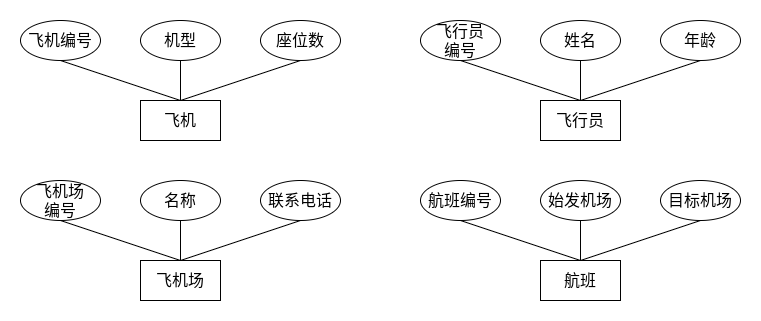
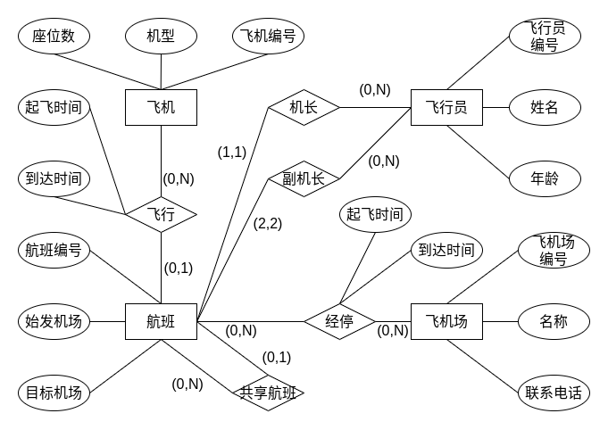

# 数据库第四次作业

## 201300035 方盛俊

## 一、

### 1.

实体及其属性的模型表示如下:

最后完整的 ER 图如下:

### 2.

关系模型:

- 飞机 (<u>飞机编号</u>, 机型, 座位数)
- 飞行员 (<u>飞行员编号</u>, 姓名, 年龄)
- 航班 (<u>航班编号</u>, 始发机场编号, 目标机场编号)
- 飞机场 (<u>飞机场编号</u>, 名称, 联系电话)
- 机长 (<u>航班编号, 飞行员编号</u>)
- 副机长 (<u>航班编号, 飞行员编号</u>)
- 飞行 (<u>飞机编号, 航班编号</u>, 起飞时间, 到达时间)
- 经停 (<u>飞机场编号, 航班编号</u>, 达到时间, 起飞时间)

### 3.

#### 3.1

最小函数依赖集:

{
$\qquad$ 航班编号 -> 飞机编号, 航班编号 -> 到达时间, 航班编号 -> 起飞时间,
$\qquad$ (飞机编号, 到达时间) -> 航班编号, (飞机编号, 起飞时间) -> 航班编号
}

#### 3.2

所有关键字:

(航班编号, 机场编号), (飞机编号, 到达时间, 机场编号), (飞机编号, 起飞时间, 机场编号)

<!-- #### 3.3

如果选取 (航班编号, 机场编号) 为主键,

那么 "航班编号 -> 起飞时间" 不符合 2NF 的定义, "起飞时间" 是单个非主键属性, "航班编号" 是候选关键字的真子集.

所以不符合 2NF, 自然也不符合 3NF.

将其分解为子关系:

- R1 (航班编号, 飞机编号, 到达时间)
- R2 (航班编号, 飞机编号, 起飞时间)
- R3 (航班编号, 机场编号)

这种分解满足 3NF.

#### 3.4

R1, R2 不满足 BCNF, 进一步分解为

- R3 (航班编号, 机场编号)
- R4 (航班编号, 飞机编号)
- R5 (航班编号, 到达时间)
- R6 (航班编号, 起飞时间) -->

#### 3.3

由 3.2 的所有关键字可以看出,

{飞机编号, 航班编号, 机场编号, 到达时间, 起飞时间}

这五个属性均为主属性, 所以必定满足 3NF 的性质: 对于 X -> A, A 是 T 的一个主属性.

所以关系模式 R 满足 3NF.

#### 3.4

不满足 BCNF, 进一步分解为

- R1 (航班编号, 机场编号)
- R2 (航班编号, 飞机编号, 到达时间, 起飞时间)

## 二、

因为 T 如果是一个 BCNF, 则根据定义可知它一定拥有性质: 任何可推导出的函数依赖 X -> A 都在 T 中, 这里 A 是不在 X 中的单一属性, X 是 T 的一个超键.

而 3NF 的定义为: 任何可推导出的函数依赖 X -> A 都在 T 中, 这里 A 是不在 X 中的单一属性, 则以下两个性质必定满足一个: (1) X 是 T 的一个超键; (2) A 是 T 的一个主属性.

由定义就可以看出, 若 T 满足 BCNF, 则一定满足 3NF 中的 (1) 性质, 所以证明成立.

