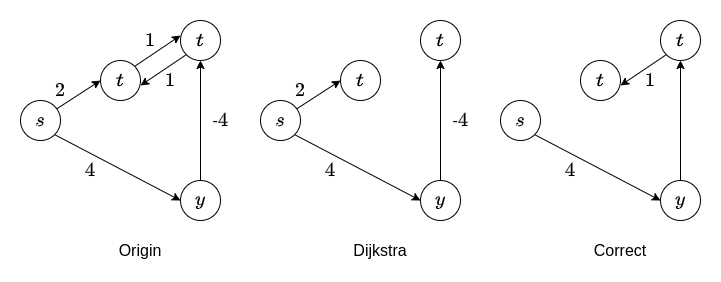
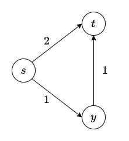

# Solution for Problem Set 11

## Problem 1

**(a)**

对于从 s 开始:

|     | s        | t      | y      | x          | z          | R           |
| --- | -------- | ------ | ------ | ---------- | ---------- | ----------- |
| 1   | (0, NIL) | (4, s) | (5, s) | (INF, NIL) | (INF, NIL) | {s}         |
| 2   | (0, NIL) | (4, s) | (5, s) | (10, t)    | (INF, NIL) | {s, t}      |
| 3   | (0, NIL) | (4, s) | (5, s) | (9, y)     | (11, y)    | {s, t, y}   |
| 4   | (0, NIL) | (4, s) | (5, s) | (9, y)     | (11, y)    | {s, t, y, x}|
| 5   | (0, NIL) | (4, s) | (5, s) | (9, y)     | (11, y)    |{s, t, y, x, z}|

对于从 z 开始:

|     | z        | x      | s      | t          | y          | R           |
| --- | -------- | ------ | ------ | ---------- | ---------- | ----------- |
| 1   | (0, NIL) | (1, z) | (3, z) | (INF, NIL) | (INF, NIL) | {z}         |
| 2   | (0, NIL) | (1, z) | (3, z) | (INF, NIL) | (INF, NIL) | {z, x}      |
| 3   | (0, NIL) | (1, z) | (3, z) | (7, s)     | (8, s)     | {z, x, s}   |
| 4   | (0, NIL) | (1, z) | (3, z) | (7, s)     | (8, s)     | {z, x, s, t}|
| 5   | (0, NIL) | (1, z) | (3, z) | (7, s)     | (8, s)     | {z, x, s, t, y}|

**(b)**



**(c)**




## Problem 2

对于一条最优路径上的节点 $s\to u\to \cdots\to v\to  t$,

我们要最大化成功率 $\max\{r(s,u)\times \cdots\times r(v,t)\}$,

即最大化 $\max\{\log r(s,u)+ \cdots+ \log r(v,t)\}$,

再取反, 则变为最小化 $\min\{(-\log r(s,u))+ \cdots+ (-\log r(v,t))\}$,

即可用 Dijkstra 算法求解.

``` python
def w(u, v):
    return - math.log(r(u, v))

def dijkstra(graph, s, t):
    for u in graph.vertices:
        u.dist = inf, u.parent = None
    s.dist = 0
    que = build_priority_queue_based_on_dist(graph)
    while not que.empty():
        u = que.extract_min()
        # 如果已经计算到 t 了, 就可以直接返回 t 了
        if u == t:
            return t
        for (u, v) in graph.edges:
            if v.dist > u.dist + w(u, v):
                v.dist = u.dist + w(u, v)
                v.parent = u
                que.decrease_key(v)

# 将找到的路径输出
print_path(dijkstra(graph, s, t))
```

## Problem 3


## Problem 4

**(a)**

不正确.

反例:

$y[2, 3], z[4, 5], x[1, 6]$

**(b)**

不正确.

反例:

$y[2, 3], z[4, 5], x[1, 6]$

**(c)**

正确.

**(d)**

不正确.

反例:

$y_1[1, 3], y_2[4, 6], y_3[7, 9]$

$x_1[3, 4], x_2[6, 7]$

**(e)**

正确.

**(f)**

不正确.

反例:

$y_1[1, 3], y_2[4, 6], y_3[7, 9]$

$x_1[3, 4], x_2[6, 7]$

**(g)**

正确.

**(h)**

正确.


## Problem 5

**伪代码:**

``` python
def set_cover(L, R):
    # 按照左值升序的顺序将所有区间排序并转换成数组 A,
    # A[i] 对应排序后的第 i 个区间
    L, R = sort_by_increasing_order_of_L(L, R)
    A = transform(L, R)
    # 将左值最小的区间 A[1] 先加入到集合中
    SOL = { A[1] }
    # 保存上一次加入的区间
    last = A[1]
    # 保存下一个可能要加入的区间
    a = None
    for i in range(1, n + 1):
        # 如果当前区间的左值小于等于上一次加入区间的右值
        if A[i].left <= last.right:
            # 考虑要不要更新 a
            # 如果 A[i] 的右值超过了上一次加入区间的右值
            if A[i].right > last.right:
                # 并且也大于之前猜测的可能要加入区间的右值
                if a == None or A[i].right > a.right:
                    # 那就作为一个新候选区间
                    a = A[i]
        else:
            # 如果当前区间的左值大于上一次加入区间的右值
            # 说明是时候加入新区间到 SOL 了
            # 如果下一个可能要加入的区间为 None
            if a == None:
                # 那就直接加入 A[i] 吧
                SOL.add(A[i])
                # 更新 last
                last = A[i]
            else:
                # 区间不为 None, 那就将其加入
                SOL.add(a)
                # 更新 last
                last = a
                # 重置 下一个可能要加入的区间
                a = None
                # i 自减, 再考虑一遍这个区间
                # 因为 last 更新了, 并且 a = None, 
                # 所以不会重复判断这个区间超过两次
                i = i - 1
    # 在结束之前, 再将候选区间加进去
    if a != None:
        SOL.add(a)
    # 并且把 A[n], 最后一个区间加入
    SOL.add(A[n])
```

**时间复杂度:**

1. 排序用时 $O(n\log n)$
2. 一共循环 $n$ 次, 因此循环用时 $O(n)$

因此这个贪心算法最后的总时间复杂度为 $O(n\log n)$

**正确性:**

先证明 `A[1]` 一定是最优结果的一部分.

因为要覆盖所有区间, 如果 `OPT(S)` 不包括 `A[1]`, 那么 `A[1]` 的左端点就不会被包括在 `OPT(S)` 中, 与题设产生矛盾. 因此 `A[1]` 一定是最优结果的一部分.

同理, `A[n]` 也一定是最优结果的一部分.

再证明我们之后加入区间 `A[i]` 或 `a` (对应两种情况) 也是最优结果的一部分.

假设区间之间有空隙, 那么一定能根据这个空隙划分成为两个子问题, 这对应于候选区间 `a = None` 的情况, 我们通过直接加入 `A[i]`, 因为 `A[i]` 一定是第二个子问题的第一个区间, 因此 `A[i]` 也是最优结果的一部分.

假设区间之间没有空隙, 对于最优结果 `OPT(S)` 中的任意一个中间区间 `opt_a`, 它一定与上一个区间 `last` 接壤, 即 `opt_a.left < last.right`, 那么我们根据伪代码, 可知 `a` 的右值一定大于 `opt_a` 的右值, 即 `a.right > opt_a.right`, 即 `OPT(S) U {a}` 覆盖了 `{opt_a}`.

这说明我们有 `OPT(S) / {opt_a} U {a}` 也依然是一个最优解, 即有 `a` 也是最优结果的一部分.

综上所述, 伪代码的正确性可证.


## Problem 6

**(a)**

令 `n = 3`, 三枚硬币面值分别为 `c[1] = 1`, `c[2] = 3`, `c[3] = 4`.

那么如果我们要找 `6` 元的零钱, 使用上述的贪心算法, 我们取出的硬币为 `c[3], c[1], c[1]`, 一共三枚.

但是我们其实可以取出 `c[2], c[2]`, 这样只需要两枚. 说明这个贪心算法并不总是正确的.

**(b)**

解法 1:

其实我们可以将任何价值的零钱, 例如为 $n$, 表示成一个 $b$ 进制的数. 这个贪心算法, 其实就相当于将 $n$ 转化为 $b$ 进制的数, 并将各位上的数字加起来, 就是最后所需要的硬币枚数.

原因是, 对于 $b$ 进制的 $m$ 位数, 必定有 $100\cdots 0 > 0XX\cdots X$, 因此对于该贪心算法的结果, 我们不可能进一步地缩减硬币枚数.

解法 2:

假设我们有一个不同于贪心算法的最优的结果 $B$, 我们将其依照面值从大到小重新排序.

我们不妨认为和我们使用贪心算法得出来的结果相比, 从第 1 位开始不同, 否则我们就将前面相同的硬币抛到一边即可, 也就是说, 我们使用贪心算法得到的结果 $A[1]$ 的面值大于 $B[1]$ ~ $B[m]$, 即 $A[1]>B[i], i=1,2,\cdots,m$. 

并且根据题意我们可知, $A[1]\leqslant \sum_{i=1}^{m}A[i]=\sum_{i=1}^{m}B[i]$

我们假设对于 $B[i]$, 每个面值为 $b^{q}$ 的硬币均不超过 $b-1$ 个, 设 $A[1]=b^{k+1}$

但是 $\sum_{i=1}^{m}B[i]\leqslant \sum_{q=0}^{k}(b-1)b^{q}=b^{k + 1} - 1<b^{k+1}=A[1]$, 产生矛盾.

因此对于 $B[i]$ 存在面值为 $b^{q}$ 的硬币超过 $b-1$ 个, 那么我们将这超过 $b-1$ 个的硬币个数设为 $x$, 那么我们可以将其换成 $1$ 个 $b^{q+1}$ 面值的硬币和 $x-q$ 个面值 $b^{q}$ 的硬币, 这样硬币总和数就减少了 $x-(1+x-q)=q-1\geqslant b-1\geqslant 1$ 个硬币.

因此这与 $B$ 是一个最优结果的假设不符. 因此贪心算法在此处就是最优的算法.


