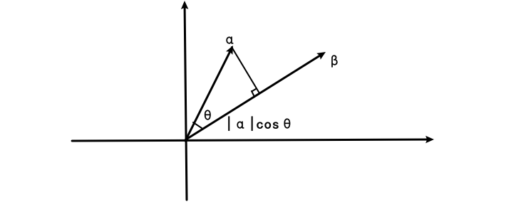
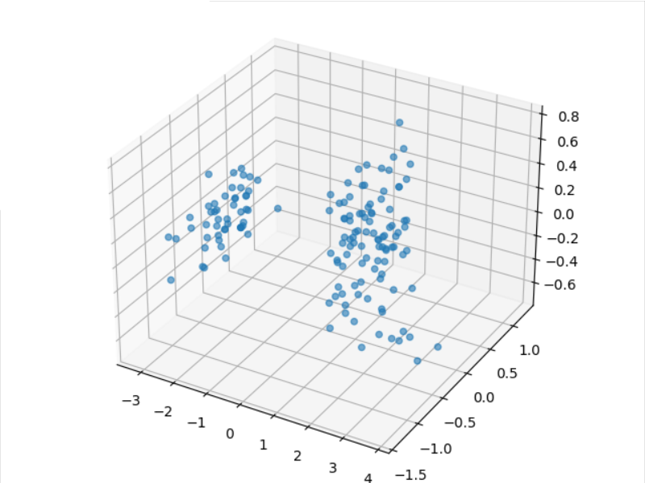

# PCA 主成分分析与数据降维

## 简介

**PCA (Principal Component Analysis) 主成分分析**是一种重要的数据分析方式, 常常用于高维数据降为低维数据.

PCA 可以用两种方式进行数学推导, 分别称为**最大可分型**和**最近重构型**, 前者基于基变换之后的方差最大, 后者基于点到划分平面的距离最小. 在这里, 我们使用最大可分型的方式进行数学推导.

本文大部分数学推导基于[【机器学习】降维——PCA —— 知乎@阿泽](https://zhuanlan.zhihu.com/p/77151308), 但是做了更为完整易懂的解释, 并且附上了以 [iris 数据集 (鸢尾花卉数据集)](https://archive.ics.uci.edu/ml/machine-learning-databases/iris/iris.data) 为案例的相应的 python 代码实现.

## 投影

对于两个向量 $\alpha=(x_1, y_1), \beta=(x_2,y_2)$

我们知道其点乘的的几何意义为

$$
\alpha\cdot \beta=x_1x_2+y_1y_2=|\alpha||\beta|\cos\theta
$$

其中 $\theta$ 为 $\alpha$ 与 $\beta$ 的夹角.

点乘的几何意义可以理解为, $\alpha$ 在 $\beta$ 方向的的投影长度乘以 $\beta$ 的长度, 如图所示:



那么我们就可以得知, $\alpha$ 在 $\beta$ 方向上的投影长度为

$$
|\alpha|\cos\theta=\frac{\alpha\cdot \beta}{|\beta|}
$$

若 $\beta$ 等于单位向量 $e$, 满足 $|e|=1$, 则有

$$
|\alpha|\cos\theta=\alpha\cdot e
$$

使用 python 和 numpy 书写, 即为

``` python
import numpy as np

base = np.array([1 / np.sqrt(2), 1 / np.sqrt(2)])
alpha = np.array([1, 2])

shadow = alpha @ base
```


## 基的变换

我们令 $\alpha=(x_1, y_1)$, 其实就默认隐含了坐标系和基的概念.

这里, 我们默认使用了 $(1,0)$ 和 $(0,1)$ 作为两个基向量, 实际上我们完全可以使用其他正交的单位向量作为基向量.

例如, 我们使用 $e_1=\begin{pmatrix} \frac{1}{\sqrt{2}} \\ \frac{1}{\sqrt{2}} \\\end{pmatrix}$ 和 $e_2=\begin{pmatrix} -\frac{1}{\sqrt{2}} \\ \frac{1}{\sqrt{2}} \\\end{pmatrix}$ 作为一组新的基, 对向量 $\alpha=\begin{pmatrix} 1 \\ 2 \\\end{pmatrix}$ 进行分析.

由上面投影的概念和几何关系可知, 向量 $\alpha$ 在新的基向量 $e_1,e_2$ 下的新坐标就是 $\alpha$ 到 $e_1, e_2$ 方向上的投影:


由上述的求投影的公式可知, 新坐标 $(x', y')$ 可以这样求得

$$
x'=\alpha\cdot e_1=\alpha^Te_1=1\cdot \frac{1}{\sqrt{2}}+2\cdot \frac{1}{\sqrt{2}}=\frac{3}{\sqrt{2}}
$$

$$
y'=\alpha\cdot e_2=\alpha^Te_2=1\cdot \left(-\frac{1}{\sqrt{2}}\right)+2\cdot \frac{1}{\sqrt{2}}=\frac{1}{\sqrt{2}}
$$

即在 $e_1, e_2$ 下的坐标为 $(\frac{3}{\sqrt{2}}, \frac{1}{\sqrt{2}})$.

我们可以用矩阵描述这个变换, 其中左边的矩阵的两个行向量分别为两个新的基 $e_1,e_2$:

$$
\begin{pmatrix} \frac{1}{\sqrt{2}} &\frac{1}{\sqrt{2}} \\ -\frac{1}{\sqrt{2}} &\frac{1}{\sqrt{2}} \\\end{pmatrix}\begin{pmatrix} 1 \\ 2 \\\end{pmatrix}=\begin{pmatrix} \frac{3}{\sqrt{2}} \\ \frac{1}{\sqrt{2}} \\\end{pmatrix}
$$

对于多个向量 $\alpha_1(1, 2), \alpha_2(2,3), \alpha_3(3,4)$ 一起做坐标变换, 可以用矩阵写为

$$
\begin{pmatrix} \frac{1}{\sqrt{2}} &\frac{1}{\sqrt{2}} \\ -\frac{1}{\sqrt{2}} &\frac{1}{\sqrt{2}} \\\end{pmatrix}\begin{pmatrix} 1 & 2 &3 \\ 2 & 3 & 4 \\\end{pmatrix}=\begin{pmatrix} \frac{3}{\sqrt{2}} & \frac{5}{\sqrt{2}} & \frac{7}{\sqrt{2}}\\ \frac{1}{\sqrt{2}} & \frac{1}{\sqrt{2}} & \frac{1}{\sqrt{2}}\\\end{pmatrix}
$$

推广之, 对于 $r$ 个新的基 $e_1,e_2,\cdots ,e_{r}$ 和 $m$ 个要转换坐标的向量 $\alpha_1, \alpha_2, \cdots \alpha_{m}$, 我们有

单个向量坐标变换:

$\begin{pmatrix} e_1^T \\ e_2^T \\ \vdots \\ e_{r}^T \\\end{pmatrix}\begin{pmatrix} \alpha_1\\\end{pmatrix}=\begin{pmatrix} e_1\alpha_1 \\ e_2\alpha_1 \\ \vdots \\ e_{m}\alpha_1 \\\end{pmatrix}$

多个向量坐标变换:

$\begin{pmatrix} e_1^T \\ e_2^T \\ \vdots \\ e_{r}^T \\\end{pmatrix}\begin{pmatrix} \alpha_1 &\alpha_2 &\cdots  &\alpha_{m} \\\end{pmatrix}=\begin{pmatrix} e_1^T\alpha_1 & e_1^T\alpha_2 &\cdots & e_1^T\alpha_{m} \\ e_2^T\alpha_1 & e_2^T\alpha_2 &\cdots & e_2^T\alpha_{m} \\ \vdots & \vdots & \ddots &\vdots \\ e_{m}^T\alpha_1 & e_{m}^T\alpha_2 &\cdots & e_{m}^T\alpha_{m}  \\\end{pmatrix}$

对于数据分析, 我们可以认为每一个 $\alpha_{i}$ 均代表一个样本数据, 一共 $m$ 个样本.


## 降维

在坐标变换中, 如果我们能找到一个好的基向量, 就可以将数据聚集在坐标轴附近.

举一个极端的例子, 对于新的基向量 $e_1(\frac{1}{\sqrt{2}}, \frac{1}{\sqrt{2}}), e_2(-\frac{1}{\sqrt{2}},\frac{1}{\sqrt{2}})$ 和要进行坐标转换的向量 $\alpha_1=\begin{pmatrix} 1 \\ 1 \\\end{pmatrix}, \alpha_2=\begin{pmatrix} 2 \\ 2 \\\end{pmatrix}, \alpha_3=\begin{pmatrix} 3 \\ 3 \\\end{pmatrix}$

我们有

$\begin{pmatrix} \frac{1}{\sqrt{2}} & \frac{1}{\sqrt{2}} \\ -\frac{1}{\sqrt{2}} & \frac{1}{\sqrt{2}}\end{pmatrix}\begin{pmatrix} 1 &2 &3 \\ 1 &2 &3 \\\end{pmatrix}=\begin{pmatrix} \sqrt{2} &2\sqrt{2} &3\sqrt{2} \\ 0 & 0 & 0 \\\end{pmatrix}$

我们可以发现, 新坐标的非零部分全部聚集到了 $e_1$ 对应的方向上, $e_2$ 对应方向的数值全部为零, 我们可以认为信息全部聚集到了 $e_1$ 维度上, 如图:


如果我们去除 $e_2$ 维度, 只保留 $e_1$ 维度的数据, 即降低了一个维度, 数据依然没有任何损失

$\begin{pmatrix} \frac{1}{\sqrt{2}} & \frac{1}{\sqrt{2}}\end{pmatrix}\begin{pmatrix} 1 &2 &3 \\ 1 &2 &3 \\\end{pmatrix}=\begin{pmatrix} \sqrt{2} &2\sqrt{2} &3\sqrt{2} \end{pmatrix}$

如图所示:


PCA 主成分分析要做的就是找到最合适的基向量, 使得尽可能多的信息保留在少数几个维度里, 达到低损耗降维的效果.

那么如何选取最合适的基向量呢? 我们可以从方差入手.


## 方差和协方差

假定现在我们有两组数据, 分别是 $\alpha=\begin{pmatrix} a_1 \\ a_2 \\ \vdots \\ a_{m} \\\end{pmatrix}, \beta=\begin{pmatrix} b_1 \\ b_2 \\ \vdots \\ b_{m} \\\end{pmatrix}$, 并称 $x_{i}=\begin{pmatrix} a_{i} \\ b_{i} \\\end{pmatrix}$ 为其中一个样本, 所以我们一共有 $m$ 个样本.

举个例子, 我们可以认为 $\alpha=\begin{pmatrix} 1 \\ 3 \\ 5 \\\end{pmatrix}$ 是房子面积, $\beta=\begin{pmatrix} 2 \\ 5 \\ 8 \\\end{pmatrix}$ 是房子价格, 其中第二个样本为 $\begin{pmatrix} 3 \\ 5 \\\end{pmatrix}$.

我们知道求方差的公式为

$$
\text{Var}(\alpha)=\frac{1}{m}\sum_{i=1}^{m} (a_i-\mu)^{2}
$$

其中 $\mu$ 为均值

$$
\mu=\frac{1}{m}\sum_{i=1}^{m} a_{i}
$$

相应的 python 实现:

``` python
import numpy as np

alpha = np.array([1., 3., 5.])
average = np.mean(alpha)
variance = ((alpha - average) ** 2).sum() / len(alpha)
```

为了简化公式, 我们可以将原式数据进行"中心化", 即将每一个数据都减去它的均值, 此时 $\alpha=\begin{pmatrix} a_1-\mu \\ a_2-\mu \\ \vdots \\ a_{m}-\mu \\\end{pmatrix}$ 则方差公式可以简化为

$$
\text{Var}(\alpha)=\frac{1}{m}\sum_{i=1}^{m} a_{i}^{2}
$$

相应的 python 实现:

``` python
import numpy as np

alpha = np.array([1., 3., 5.])
alpha -= np.mean(alpha)
variance = (alpha ** 2).sum() / len(alpha)
```

方差描述的是数据的离散程度, 而协方差描述表示两个变量的相关性.

协方差公式为:

$$
\text{Cov}(\alpha,\beta)=\frac{1}{m}\sum_{i=1}^{m}(a_{i}-\mu_{\alpha})(b_{i}-\mu_{\beta})
$$

经过"中心化"之后, 协方差公式可以简化为:

$$
\text{Cov}(\alpha,\beta)=\frac{1}{m}\sum_{i=1}^{m}a_{i}b_{i}
$$

相应的 python 实现:

``` python
import numpy as np

alpha = np.array([1., 3., 5.])
beta = np.array([2., 5., 8.])
alpha -= np.mean(alpha)
beta -= np.mean(beta)
covariance = (alpha * beta).sum() / len(alpha)
```

当协方差大于 $0$ 时, 两个向量正相关, 当协方差小于零时, 两个向量负相关, 当协方差等于 $0$ 时, 两个向量线性无关.


## 主成分分析

要推导出 PCA 最佳的基向量, 我们需要制定一个优化标准.

由几何意义我们可以很简单地看出, **所选取的基向量越好, 数据在该方向上的投影的离散程度越大**.


受到最小二乘法的启发, 我们可以以最大化方差为目标.

对于一个基向量 $e=\begin{pmatrix}e_1\\e_2\\\vdots\\e_n\end{pmatrix}$, 我们将所有的样本点 $x_{i}=\begin{pmatrix}x_{i1}\\x_{i2}\\\vdots\\x_{in}\end{pmatrix}, i=1,2,\cdots,m$ 投影到 $e$ 方向上.

即有 $x_{i}$ 在基 $e$ 下的投影长度坐标值 $\displaystyle x_{i}^Te=\sum_{j=1}^{n}e_{j}x_{ij}$

如图:


则在**这个基向量方向上的方差**为

$$
\begin{aligned}
\text{Var}(x)
&=\frac{1}{m}\sum_{i=1}^{m} (x_{i}^Te)^{2} \\
\end{aligned}
$$

我们只需要将该方差最大化, 解出基向量 $e$ 对应的值, 即转化成了一个求极值的问题.

因为 $x_{i}^Te$ 是标量, 所以有 $(x_{i}^Te)^T=x_{i}^Te$

$$
\begin{aligned}
\text{Var}(x)
&=\frac{1}{m}\sum_{i=1}^{m} (x_{i}^Te)^{2} \\
&=\frac{1}{m}\sum_{i=1}^{m} (x_{i}^Te)^T(x_{i}^Te) \\
&=\frac{1}{m}\sum_{i=1}^{m} e^T(x_{i}x_{i}^T)e \\
&=e^T\left(\frac{1}{m}\sum_{i=1}^{m}x_{i}x_{i}^T\right)e \\
\end{aligned}
$$

我们令 $\displaystyle P=\frac{1}{m}\sum_{i=1}^{m}x_{i}x_{i}^T$, 为了更好地说明问题, 我们可以先令 $x_{i}=\begin{pmatrix} a_{i} \\ b_{i} \\\end{pmatrix}$

$$
\begin{aligned}
P
&=\frac{1}{m}\sum_{i=1}^{m}x_{i}x_{i}^T \\ 
&=\frac{1}{m}\sum_{i=1}^{m}\begin{pmatrix} a_{i}^{2} &a_{i}b_{i} \\ a_{i}b_{i} &b_{i}^{2} \\\end{pmatrix} \\
&=\begin{pmatrix} \displaystyle \frac{1}{m}\sum_{i=1}^{m}a_{i}^{2} &\displaystyle \frac{1}{m}\sum_{i=1}^{m}a_{i}b_{i} \\ \displaystyle \frac{1}{m}\sum_{i=1}^{m}a_{i}b_{i} &\displaystyle \frac{1}{m}\sum_{i=1}^{m}b_{i}^{2} \\\end{pmatrix} \\
&=\begin{pmatrix} \text{Var}(a) &\text{Cov}(a,b) \\ \text{Cov}(a,b) & \text{Var}(b) \\\end{pmatrix}
\end{aligned}
$$

即 $P$ 对角线上的元素为 $x_{i}$ 在各个方向的方差, 同时对角线之外的元素为各个方向元素之间的协方差. 这个结论从 $2$ 维推广到 $n$ 维也成立.

对于求最值问题:

$$
\begin{cases} \max\{e^TP e\} \\ s.t. e^Te=1 \end{cases}
$$

使用拉格朗日乘数法可构造出

$$
L(e)=e^TP e+\lambda(1-e^Te)
$$

对于 $e$ 求导化简可得

$$
Pe=\lambda e
$$

**即有 $\lambda$ 是 $P$ 的特征值, $e$ 是 $P$ 的特征向量**, 仅在此时取得极值.

并且将 $Pe=\lambda e$ 代回原式有

$$
\text{Var}(x)=e^TPe=e^T\lambda e=\lambda e^Te=\lambda
$$

即**方差等于 $P$ 的特征值 $\lambda$**. 那么我们可知, 我们要找的最大方差便是 $P$ 的最大特征值, 第二大方差即 $P$ 的第二大特征值, 依次类推. 它们对应的特征向量即我们需要的基向量.

我们称 $P$ 为协方差矩阵, 它是一个实对称矩阵, 根据线性代数相关的知识, 我们知道它有一个性质:

**一个 n 行 n 列的实对称矩阵一定可以找到 n 个单位正交特征向量.** 我们令这 $n$ 个特征向量分别为 $e_1,e_2,\cdots,e_n$, 按照特征值由大到小的顺序从左到右排列, 再将这 $n$ 个列向量排列成为矩阵 $E=\begin{pmatrix}e_1&e_2&\cdots&e_n\end{pmatrix}$, 则有

$$
E^TPE=\begin{pmatrix} \lambda_1 & & & \\  &\lambda_2 & & \\  & &\ddots & \\  & & &\lambda_n \\\end{pmatrix}
$$

可见, 使用 $n$ 个单位正交的特征向量作为新的基向量, 在新坐标中满足: **方差 (对角线元素) 最大**和**协方差 (非对角线元素) 最小**.

我们令 $X=\begin{pmatrix} x_{1} & x_{2} & \cdots & x_{m} \end{pmatrix}=\begin{pmatrix} x_{11} & x_{21} & \cdots & x_{m1} \\  x_{12} & x_{22} & \cdots & x_{m2}  \\ \vdots & \vdots & \ddots & \vdots \\  x_{1n} & x_{2n} & \cdots & x_{mn}  \\\end{pmatrix}$, 每一列都是一个样本.

则 $P$ 可以记作

$$
P=\frac{1}{m}XX^T
$$

我们只需要解出 $\displaystyle \frac{1}{m}X^TX$ 的特征值和特征向量即可.

然后对于新的基矩阵 $E=\begin{pmatrix}e_1&e_2&\cdots&e_n\end{pmatrix}$, 根据投影和基变换的概念我们可以求出变换后的坐标:

$$
X'=E^TX
$$

如果我们只选取前 $k$ 个特征值和特征向量, 取得新的基矩阵 $E_{k}=\begin{pmatrix}e_1&e_2&\cdots&e_k\end{pmatrix}$, 则

$$
X'=E_k^TX
$$

便达到了降维的效果.


## 求解步骤

我们有 $m$ 个 $n$ 维的样本数据.

1. 将原始数据转化成为一个 $n$ 行 $m$ 列的数据矩阵 $X$;
2. 每一行减去均值, 进行"中心化";
3. 求出协方差矩阵 $\displaystyle P=\frac{1}{m}XX^T$;
4. 求出协方差矩阵的特征值和特征向量, 并按特征值由大到小排列;
5. 选取前面 $k$ 个特征向量, 排列形成矩阵 $E_{k}=\begin{pmatrix}e_1&e_2&\cdots&e_k\end{pmatrix}$
6. 计算 $X'=E_{k}^TX$, $X'$ 即为降维过后的数据.


## 示例

python 与 numpy 的实现, 在这里我们使用 [iris 数据集 (鸢尾花卉数据集)](https://archive.ics.uci.edu/ml/machine-learning-databases/iris/iris.data):

``` python
import numpy as np
import pandas as pd 
import matplotlib.pyplot as plt

# 1. Loading dataset into Pandas DataFrame and get numpy data
url = "https://archive.ics.uci.edu/ml/machine-learning-databases/iris/iris.data"
df = pd.read_csv(url, names=['sepal length','sepal width','petal length','petal width','target'])
data = df.iloc[:, :4].to_numpy()

def pca(data, n_component):
    data = data.T

    # 2. Subtract the mean
    data -= data.mean(axis = 1).reshape(-1, 1)
 
    # 3. Get the covariance matrix: 1/m * XX^T
    cov_matrix = 1 / len(data[0]) * data @ data.T
 
    # 4. Calculate the eigenvalue and eigenvector
    eigenvalues, eigenmatrix = np.linalg.eig(cov_matrix)
 
    # 5. Sort eigenmatrix by eigenvalues
    eigenmatrix = eigenmatrix[sorted(range(len(eigenvalues)),  key=lambda v: -eigenvalues[v])]
 
    # 6. Get data after dimensionality reduction
    new_data = eigenmatrix.T[:n_component] @ data
    return new_data

new_data = pca(data, 2)

print(new_data.T[:5])

# 7. Draw scatter plot
x = new_data[0]
y = new_data[1]
plt.scatter(x, y, alpha=0.6)
plt.show()
```

输出为:

``` text
[[-2.68420713 -0.32660731]
 [-2.71539062  0.16955685]
 [-2.88981954  0.13734561]
 [-2.7464372   0.31112432]
 [-2.72859298 -0.33392456]]
```


使用 sklearn 实现:

``` python {cmd}
import pandas as pd 
from sklearn.decomposition import PCA 
import matplotlib.pyplot as plt

# 1. Loading dataset into Pandas DataFrame and get numpy data
url = "https://archive.ics.uci.edu/ml/machine-learning-databases/iris/iris.data"
df = pd.read_csv(url, names=['sepal length','sepal width','petal length','petal width','target'])
data = df.iloc[:, :4].to_numpy().T

# 2. Use sklearn
pca=PCA(n_components=2)
new_data = pca.fit_transform(data.T).T

print(new_data.T[:5])

# 3. Draw scatter plot
x = new_data[0]
y = new_data[1]
plt.scatter(x, y, alpha=0.6)
plt.show()
```

输出为:

``` text
[[-2.68420713 -0.32660731]
 [-2.71539062  0.16955685]
 [-2.88981954  0.13734561]
 [-2.7464372   0.31112432]
 [-2.72859298 -0.33392456]]
```


可见两者结果一致.

我们再将其投影到 3 维坐标观察:

``` python
import numpy as np
import pandas as pd 
import matplotlib.pyplot as plt
from mpl_toolkits.mplot3d import Axes3D

# 1. Loading dataset into Pandas DataFrame and get numpy data
url = "https://archive.ics.uci.edu/ml/machine-learning-databases/iris/iris.data"
df = pd.read_csv(url, names=['sepal length','sepal width','petal length','petal width','target'])
data = df.iloc[:, :4].to_numpy()

def pca(data, n_component):
    data = data.T

    # 2. Subtract the mean
    data -= data.mean(axis = 1).reshape(-1, 1)
 
    # 3. Get the covariance matrix: 1/m * XX^T
    cov_matrix = 1 / len(data[0]) * data @ data.T
 
    # 4. Calculate the eigenvalue and eigenvector
    eigenvalues, eigenmatrix = np.linalg.eig(cov_matrix)
 
    # 5. Sort eigenmatrix by eigenvalues
    eigenmatrix = eigenmatrix[sorted(range(len(eigenvalues)),  key=lambda v: -eigenvalues[v])]
 
    # 6. Get data after dimensionality reduction
    new_data = eigenmatrix.T[:n_component] @ data
    return new_data

new_data = pca(data, 3)

print(new_data.T[:5])

# 7. Draw 3d scatter plot
fig = plt.figure()
ax = Axes3D(fig)
x = new_data[0]
y = new_data[1]
z = new_data[2]
ax.scatter(x, y, z, alpha=0.6)
plt.show()
```

输出为

``` text
[[-2.68420713 -0.32660731 -0.02151184]
 [-2.71539062  0.16955685 -0.20352143]
 [-2.88981954  0.13734561  0.02470924]
 [-2.7464372   0.31112432  0.03767198]
 [-2.72859298 -0.33392456  0.0962297 ]]
```




## 参考

1. [【机器学习】降维——PCA —— 知乎@阿泽](https://zhuanlan.zhihu.com/p/77151308)
2. [如何通俗易懂地讲解什么是 PCA 主成分分析？ —— 知乎@马同学](https://www.zhihu.com/question/41120789/answer/481966094)
3. 《机器学习》周志华
4. [NumPy 中文](https://www.numpy.org.cn/)
5. [Principle Component Analysis (PCA) for Data Visualization](https://github.com/mGalarnyk/Python_Tutorials/blob/master/Sklearn/PCA/PCA_Data_Visualization_Iris_Dataset_Blog.ipynb)
6. [主成分分析(PCA)——基于python+numpy](https://blog.csdn.net/zhili8866/article/details/52947303)