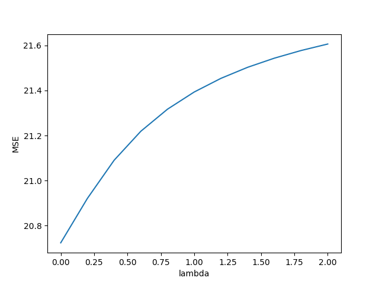

# PS2

<!-- ## 一、

**(1)**

依然有必要继续研究机器学习算法.

NFL 定理有一个重要的前提, 即所有的 "问题" 出现的机会相同, 即 $f$ 是均匀分布的, 但是实际上并不是这样. 对于某一类具体的问题来说, $f$ 一般都不是均匀分布的. 因此, 面对一个具体的问题, 一般都会有一个具体的机器学习算法, 能够取得比其他机器学习算法更好的结果.

**(2)**

对于一个有 $k$ 种分类结果的 $k$ 分类器来说, 其真实目标函数可以是任何函数 $\mathcal{X}\mapsto \{ 1,2,\cdots ,k \}$, 函数空间为 $\{ 1,2,\cdots ,k \}^{|\mathcal{X}|}$.

将 $f$ 视为遵循均匀分布, 则我们有预测正确的概率 $\displaystyle \operatorname{Pr}(h(\bm{x})=f(\bm{x}))=\frac{1}{k}$, 是一个常数. 预测错误的概率是 $\displaystyle \operatorname{Pr}(h(\bm{x})\neq f(\bm{x}))=\frac{k-1}{k}$.

对于分类问题, 任意一种性能度量 $\ell(h(\bm{x}), f(\bm{x}))$ 的输出只有两种结果, 设预测正确的结果为 $c_1$, 预测错误的结果为 $c_0$, 则有分布列 $\displaystyle \operatorname{Pr}(\ell(h(\bm{x}), f(\bm{x}))=c_1) = \frac{1}{k}$, $\displaystyle \operatorname{Pr}(\ell(h(\bm{x}), f(\bm{x}))=c_0) = \frac{k-1}{k}$.

那么有期望 $\displaystyle \mathbb{E}[\ell(h(\bm{x}), f(\bm{x}))] = \frac{1}{k}\cdot c_1+\frac{k-1}{k}\cdot c_0$, 我们可以设 $\displaystyle c=\frac{1}{k}\cdot c_1+\frac{k-1}{k}\cdot c_0$. 以二分类问题的错误率为例子, 此时 $\displaystyle c = \frac{1}{2}\cdot 0 + \frac{2-1}{2}\cdot 1 = \frac{1}{2}$. 

则我们有

$$
\begin{aligned}
\sum_{f}E_{ote}(\mathfrak{L}_{a}|X,f)
&=\sum_{f}\sum_{h}\sum_{\bm{x}\in \mathcal{X}-X}P(\bm{x})\ell(h(\bm{x}), f(\bm{x}))P(h|X,\mathfrak{L}_{a}) \\
&=\sum_{\bm{x}\in \mathcal{X}-X}P(\bm{x})\sum_{h}P(h|X,\mathfrak{L}_{a})\sum_{f}\ell(h(\bm{x}), f(\bm{x})) \\
&=\sum_{\bm{x}\in \mathcal{X}-X}P(\bm{x})\sum_{h}P(h|X,\mathfrak{L}_{a})ck^{|\mathcal{X}|} \\
&=ck^{|\mathcal{X}|}\sum_{\bm{x}\in \mathcal{X}-X}P(\bm{x})\sum_{h}P(h|X,\mathfrak{L}_{a}) \\
&=ck^{|\mathcal{X}|}\sum_{\bm{x}\in \mathcal{X}-X}P(\bm{x})\cdot 1 \\
\end{aligned}
$$

可以看出, 总误差依然与学习算法无关, 因此对于其他的性能度量, NFL 定理依然成立.

## 二、

我们定义 $\hat{\bm{w}} = [\bm{w}; b], \mathbf{X} = [\bm{X}, \bm{1}]$

则原式可用矩阵表示为

$$
(\bm{w}^{*}, b^{*}) = \hat{\bm{w}}^{*} = \argmin_{\hat{\bm{w}}}(\bm{y}-\mathbf{X}\hat{\bm{w}})^{\top}(\bm{y}-\mathbf{X}\hat{\bm{w}})
$$

令 $E_{\hat{\bm{w}}} = (\bm{y}-\mathbf{X}\hat{\bm{w}})^{\top}(\bm{y}-\mathbf{X}\hat{\bm{w}})$, 对 $\hat{\bm{w}}$ 求导得

$$
\frac{\partial \bm{E_{\hat{w}}}}{\partial \hat{\bm{w}}} = 2\mathbf{X}^{\top}(\mathbf{X}\hat{\bm{w}}-\bm{y})
$$

令上式等于零即可得到 $\hat{\bm{w}}$ 的最优解的闭式解.

当 $\mathbf{X}^{\top}\mathbf{X}$ 是满秩矩阵时, 令该式等于零即可得

$$
(\bm{w}^{*}, b^{*}) = \hat{\bm{w}}^{*} = (\mathbf{X}^{\top}\mathbf{X})^{-1}\mathbf{X}^{\top}\bm{y}
$$

令 $\hat{\bm{x}}_{i} = [\bm{x}_{i}, 1]$, 则最终线性回归模型为

$$
f(\hat{\bm{x}}_{i}) = \hat{\bm{x}}_{i}^{\top}(\mathbf{X}^{\top}\mathbf{X})^{-1}\mathbf{X}^{\top}\bm{y}
$$

## 二、

原式可用矩阵表示为

$$
(\bm{w}^{*}, b^{*}) = \argmin_{(\bm{w}, b)}\frac{1}{2}(\bm{y}-\bm{X}\bm{w}-\bm{1}b)^{\top}(\bm{y}-\bm{X}\bm{w}-\bm{1}b)
$$

令 $\bm{E} = (\bm{y}-\bm{X}\bm{w}-\bm{1}b)^{\top}(\bm{y}-\bm{X}\bm{w}-\bm{1}b)$

对 $\bm{w}$ 求导得

$$
\frac{\partial \bm{E}}{\partial \bm{w}} = \bm{X}^{\top}(\bm{X}\bm{w}+\bm{1}b-\bm{y})
$$

对 $b$ 求导得

$$
\frac{\partial \bm{E}}{\partial b} = \bm{1}^{\top}(\bm{X}\bm{w}+\bm{1}b-\bm{y})
$$

令上面两式同时等于零即可得到 $\bm{w}$ 和 $b$ 的最优解的闭式解.

当 $\bm{X}^{\top}\bm{X}$ 是满秩矩阵时, 则有

$$
\bm{w}^{*} = (\bm{X}^{\top}\bm{X})^{-1}\bm{X}^{\top}(\bm{y}-\bm{1}b^{*})
$$

令 $\bm{T} = (\bm{X}^{\top}\bm{X})^{-1}$, 则

$$
\bm{w}^{*} = \bm{T}\bm{X}^{\top}(\bm{y}-\bm{1}b^{*})
$$

代入有

$$
\begin{aligned}
b^{*}
&= \bm{1}^{\top}\bm{y} - \bm{1}^{\top}\bm{X}\bm{w}^{*}  \\
&= \bm{1}^{\top}\bm{y} - \bm{1}^{\top}\bm{X}\bm{T}\bm{X}^{\top}(\bm{y}-\bm{1}b^{*})  \\
&= \bm{1}^{\top}\bm{y} - \bm{1}^{\top}\bm{X}\bm{T}\bm{X}^{\top}\bm{y} + \bm{1}^{\top}\bm{X}\bm{T}\bm{X}^{\top}\bm{1}b^{*}  \\
\end{aligned}
$$

最后有

$$
b^{*} = \frac{\bm{1}^{\top}\bm{X}\bm{T}\bm{X}^{\top}\bm{y} - \bm{1}^{\top}\bm{y}}{\bm{1}^{\top}\bm{X}\bm{T}\bm{X}^{\top}\bm{1} - 1}
$$

最后将 $b^{*}$ 带回即可求出

$$
\bm{w}^{*} = \bm{T}\bm{X}^{\top}(\bm{y}-\bm{1}\frac{\bm{1}^{\top}\bm{X}\bm{T}\bm{X}^{\top}\bm{y} - \bm{1}^{\top}\bm{y}}{\bm{1}^{\top}\bm{X}\bm{T}\bm{X}^{\top}\bm{1} - 1})
$$

## 三、

**(1)**

令 $\displaystyle \bm{E} = \frac{1}{2}\left\| \bm{X}\bm{w}+\bm{1}b-\bm{y} \right\|_{2}^{2} + \lambda\left\| \bm{w} \right\|_{2}^{2}$

对 $\bm{w}$ 求导得

$$
\frac{\partial \bm{E}}{\partial \bm{w}} = \bm{X}^{\top}(\bm{X}\bm{w}+\bm{1}b-\bm{y}) + 2\lambda \bm{w}
$$

对 $b$ 求导得

$$
\frac{\partial \bm{E}}{\partial b} = \bm{1}^{\top}(\bm{X}\bm{w}+\bm{1}b-\bm{y})
$$

当 $(\bm{X}^{\top}\bm{X}+2\lambda \bm{I}_d)$ 是满秩矩阵时, 令该式等于零即可得

$$
\bm{w}^{*}_{\mathbf{Ridge}} = (\bm{X}^{\top}\bm{X}+2\lambda \bm{I}_d)^{-1}\bm{X}^{\top}(\bm{y}-\bm{1}b^{*}_{\mathbf{Ridge}})
$$

令 $\bm{T} = (\bm{X}^{\top}\bm{X}+2\lambda \bm{I}_d)^{-1}$, 则

$$
\bm{w}^{*}_{\mathbf{Ridge}} = \bm{T}\bm{X}^{\top}(\bm{y}-\bm{1}b^{*}_{\mathbf{Ridge}})
$$

代入有

$$
\begin{aligned}
b^{*}_{\mathbf{Ridge}}
&= \bm{1}^{\top}\bm{y} - \bm{1}^{\top}\bm{X}\bm{w}^{*}_{\mathbf{Ridge}}  \\
&= \bm{1}^{\top}\bm{y} - \bm{1}^{\top}\bm{X}\bm{T}\bm{X}^{\top}(\bm{y}-\bm{1}b^{*}_{\mathbf{Ridge}})  \\
&= \bm{1}^{\top}\bm{y} - \bm{1}^{\top}\bm{X}\bm{T}\bm{X}^{\top}\bm{y} + \bm{1}^{\top}\bm{X}\bm{T}\bm{X}^{\top}\bm{1}b^{*}_{\mathbf{Ridge}}  \\
\end{aligned}
$$

最后有

$$
b^{*}_{\mathbf{Ridge}} = \frac{\bm{1}^{\top}\bm{X}\bm{T}\bm{X}^{\top}\bm{y} - \bm{1}^{\top}\bm{y}}{\bm{1}^{\top}\bm{X}\bm{T}\bm{X}^{\top}\bm{1} - 1}
$$

最后将 $b^{*}_{\mathbf{Ridge}}$ 带回即可求出

$$
\bm{w}^{*}_{\mathbf{Ridge}} = \bm{T}\bm{X}^{\top}(\bm{y}-\bm{1}\frac{\bm{1}^{\top}\bm{X}\bm{T}\bm{X}^{\top}\bm{y} - \bm{1}^{\top}\bm{y}}{\bm{1}^{\top}\bm{X}\bm{T}\bm{X}^{\top}\bm{1} - 1})
$$

加上第二题的结果, 可以看出, 使用矩阵 $\bm{T}$ 抽象之后, 最优解和原始最优解的形式是一样的, 不同的是 $\bm{T}$ 的值, 二者的矩阵 $\bm{T}$ 括号内相差了一个 $2\lambda \bm{I}_d$ 项.

所以我们可以认为 $\bm{w}^{*}_{\mathbf{LS}}$ 和 $b^{*}_{\mathbf{LS}}$ 是 $\lambda=0$ 的 $\bm{w}^{*}_{\mathbf{Ridge}}$ 和 $b^{*}_{\mathbf{Ridge}}$ 特殊情况.

**(2)**

将恒等式

$$
\bm{X} = \bm{X}
$$

右端乘上 $(\bm{X}^{\top}\bm{X}+\lambda I_{d})(\bm{X}^{\top}\bm{X}+\lambda I_{d})^{-1}$ 即 $I_{d}$ 则有

$$
\bm{X} = \bm{X}(\bm{X}^{\top}\bm{X}+\lambda I_{d})(\bm{X}^{\top}\bm{X}+\lambda I_{d})^{-1}
$$

将 $\bm{X}$ 乘入括号内则有

$$
\bm{X} = (\bm{X}\bm{X}^{\top}\bm{X}+\lambda \bm{X})(\bm{X}^{\top}\bm{X}+\lambda I_{d})^{-1}
$$

再将 $\bm{X}$ 提出至右侧则有

$$
\bm{X} = (\bm{X}\bm{X}^{\top}+\lambda I_{m})\bm{X}(\bm{X}^{\top}\bm{X}+\lambda I_{d})^{-1}
$$

最后则有

$$
(\bm{X}\bm{X}^{\top}+\lambda I_{m})^{-1}\bm{X} = \bm{X}(\bm{X}^{\top}\bm{X}+\lambda I_{d})^{-1}
$$

式子成立.

这个结论能够帮助岭回归的计算.

当样例的维度 $d$ 大于样例数目 $m$ 的时候, 将 $\bm{X}(\bm{X}^{\top}\bm{X}+2\lambda I_{d})^{-1}$ 转为 $(\bm{X}\bm{X}^{\top}+2\lambda I_{m})^{-1}\bm{X}$ 能够将矩阵求逆求 $\bm{T}$ 的矩阵维度减少, 进而加快矩阵求逆的速度.

**(3)**

**(a)**

算出线性回归模型测试集上的 MSE 结果为 20.724023437336253.

**(b)**

取不同的权重所得结果为

| -2.0 | -1.6 | -1.2 | -0.8 | -0.4 | 0.0 | 0.4 | 0.8 | 1.2 | 1.6 | 2.0|
|---|---|---|---|---|---|---|---|---|---|---|
| 23.04 | 23.36 | 24.17 | 28.20 | 33.61 | 20.72 | 21.09 | 21.31 | 21.45 | 21.54 | 21.60 |

可以看出, 当 $\lambda < 0$ 时, 最终 MSE 变化波动巨大, 很少有规律性, 所以一般不会选择; 当 $\lambda > 0$ 时, MSE 随着 $\lambda$ 的增大而缓慢增大, 所以我们可以选择一个相对较小但仍然为正数的 $\lambda$ 值. -->

## 四、

**(1)**

由贝叶斯公式可知

$$
\begin{aligned}
p(y=n|\bm{x}) & = \frac{p(y=n)p(\bm{x}|y=n)}{p(\bm{x})}  \\
& = \frac{\displaystyle \pi_{n}\cdot ((2\pi)^{\frac{d}{2}}\det (\bm{\Sigma})^{\frac{1}{2}})^{-1}\exp (-\frac{1}{2}(\bm{x}-\bm{\mu}_{n})^{\top}\bm{\Sigma}^{-1}(\bm{x}-\bm{\mu}_{n}))}{p(\bm{x})}  \\
& = \frac{\displaystyle \pi_{n}\cdot ((2\pi)^{\frac{d}{2}}\det (\bm{\Sigma})^{\frac{1}{2}})^{-1}\exp (\bm{x}^{\top}\bm{\Sigma}^{-1}\bm{\mu}_{n}-\frac{1}{2}\bm{\mu}_{n}^{\top}\bm{\Sigma}^{-1}\bm{\mu}_{n}-\frac{1}{2}\bm{x}^{\top}\bm{\Sigma}^{-1}\bm{x})}{p(\bm{x})}  \\
\end{aligned}
$$

并且 $\argmax_{n}p(y=m|\bm{x})$ 可以转化为 $\argmax_{n}\ln p(y=m|\bm{x})$ 即有

$$
\begin{aligned}
\argmax_{n} &\ln \pi_{n}+\ln ((2\pi)^{\frac{d}{2}}\det (\bm{\Sigma})^{\frac{1}{2}})^{-1}+\bm{x}^{\top}\bm{\Sigma}^{-1}\bm{\mu}_{n} \\&-\frac{1}{2}\bm{\mu}_{n}^{\top}\bm{\Sigma}^{-1}\bm{\mu}_{n}-\frac{1}{2}\bm{x}^{\top}\bm{\Sigma}^{-1}\bm{x}-\ln p(\bm{x}) \\
\end{aligned}
$$

去除与 $n$ 无关的项即可得

$$
\argmax_{n} \bm{x}^{\top}\bm{\Sigma}^{-1}\bm{\mu}_{n}-\frac{1}{2}\bm{\mu}_{n}^{\top}\bm{\Sigma}^{-1}\bm{\mu}_{n}+\ln \pi_{n}
$$

**(2)**

将式子

$$
\bm{x}^{\top}\hat{\bm{\Sigma}}^{-1}(\hat{\bm{\mu}}_{2}-\hat{\bm{\mu}}_{1}) > \frac{1}{2}(\hat{\bm{\mu}}_{2}-\hat{\bm{\mu}}_{1})^{\top}\hat{\bm{\Sigma}}^{-1}(\hat{\bm{\mu}}_{2} - \hat{\bm{\mu}}_{1}) - \ln \frac{m_{2}}{m_{1}}
$$

拆开可得

$$
\bm{x}^{\top}\hat{\bm{\Sigma}}^{-1}\hat{\bm{\mu}}_{2} - \bm{x}^{\top}\hat{\bm{\Sigma}}^{-1}\hat{\bm{\mu}}_{1} > \frac{1}{2}\hat{\bm{\mu}}_{2}^{\top}\hat{\bm{\Sigma}}^{-1}\hat{\bm{\mu}}_{2} - \frac{1}{2}\hat{\bm{\mu}}_{1}^{\top}\hat{\bm{\Sigma}}^{-1}\hat{\bm{\mu}}_{1}-\ln \frac{m_{2}}{m_{1}}
$$

进行移项

$$
\bm{x}^{\top}\hat{\bm{\Sigma}}^{-1}\hat{\bm{\mu}}_{2}-\frac{1}{2}\hat{\bm{\mu}}_{2}^{\top}\hat{\bm{\Sigma}}^{-1}\hat{\bm{\mu}}_{2}+\ln \frac{m_{2}}{m} > \bm{x}^{\top}\hat{\bm{\Sigma}}^{-1}\hat{\bm{\mu}}_{1}-\frac{1}{2}\hat{\bm{\mu}}_{1}^{\top}\hat{\bm{\Sigma}}^{-1}\hat{\bm{\mu}}_{1}+\ln \frac{m_{1}}{m}
$$

将 $\displaystyle \ln \frac{m_{n}}{m}$ 替换为 $\ln \hat{\pi}_{n}$ 可得

$$
\bm{x}^{\top}\hat{\bm{\Sigma}}^{-1}\hat{\bm{\mu}}_{2}-\frac{1}{2}\hat{\bm{\mu}}_{2}^{\top}\hat{\bm{\Sigma}}^{-1}\hat{\bm{\mu}}_{2}+\ln \hat{\pi}_{2} > \bm{x}^{\top}\hat{\bm{\Sigma}}^{-1}\hat{\bm{\mu}}_{1}-\frac{1}{2}\hat{\bm{\mu}}_{1}^{\top}\hat{\bm{\Sigma}}^{-1}\hat{\bm{\mu}}_{1}+\ln \hat{\pi}_{1}
$$

即有 $n^{*} = \argmax_{n} \bm{x}^{\top}\bm{\Sigma}^{-1}\bm{\mu}_{n}-\frac{1}{2}\bm{\mu}_{n}^{\top}\bm{\Sigma}^{-1}\bm{\mu}_{n}+\ln \pi_{n} = 2$

所以此时 LDA 将样例预测为第 2 类.

