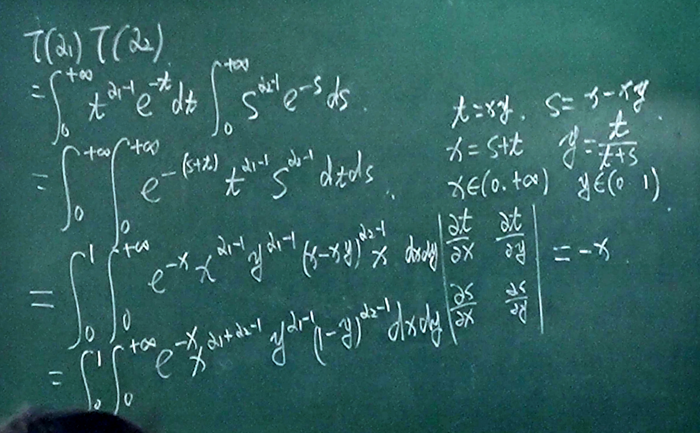
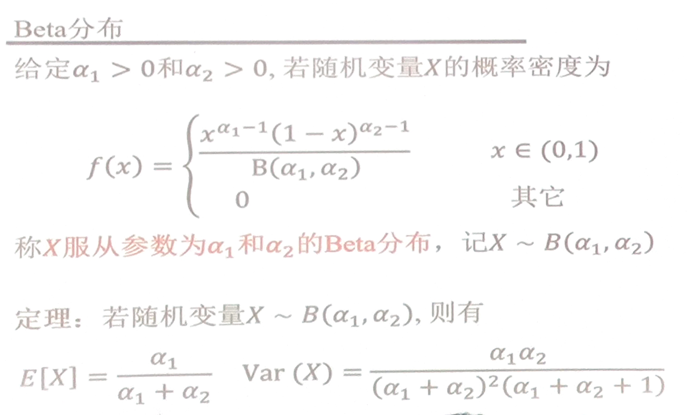

# 统计

## 样本方差与修正方差

## 原点矩与中心矩

$\displaystyle \frac{1}{n}\sum_{i=1}^{n}X_{i}^{k}$ 和 $\displaystyle \frac{1}{n}\sum_{i=1}^{n}(X_{i}-\bar{X})^{k}$

## 次序统计量

$X_{(k)}$ 是第 $k$ 小的样本.

$\displaystyle F_{k}(x)=\sum_{r=k}^{n}\binom{n}{r}[F(x)]^{r}[1-F(x)]^{n-r}$

$\displaystyle f_{k}(x)=\frac{n!}{(k-1)!(n-k)!}[F(x)]^{k-1}[1-F(x)]^{n-k}f(x)$

结论:

$\displaystyle \sum_{r=k}^{n}\binom{n}{r}p^{r}(1-p)^{n-r}=\frac{n!}{(k-1)!(n-k)!}\int_{0}^{p}t^{k-1}(1-t)^{n-k}\mathrm{d}t$

移项, 对 $p$ 求导, 可得 $g'(p)=0$, 然后就恒等于常数 $g(p)=0$, 便有等式成立.

## Beta 函数

$\displaystyle \mathrm{Beta}(\alpha_1, \alpha_2)=\int_{0}^{1}x^{\alpha_1-1}(1-x)^{\alpha_2-1}\mathrm{d}x$

第一类欧拉积分函数

$\displaystyle \mathrm{Beta}(\alpha_1, \alpha_2)=\mathrm{Beta}(\alpha_2, \alpha_1)$

## $\Gamma$ - 函数

$\displaystyle \Gamma(\alpha)=\int_{0}^{+\infty}x^{\alpha-1}e^{-x}\mathrm{d}x$

第二类欧拉积分函数

定理: $\Gamma(\alpha)=(\alpha-1)\Gamma(\alpha-1)$

$\displaystyle \Gamma(\alpha)=\int_{0}^{+\infty}x^{\alpha-1}e^{-x}\mathrm{d}x=-\int_{0}^{+\infty}x^{\alpha-1}\mathrm{d}e^{-x}=-[x^{\alpha-1}e^{-x}]_{0}^{+\infty}+\int_{0}^{+\infty}(\alpha-1)x^{\alpha-2}e^{-x}\mathrm{d}x=(\alpha-1)\Gamma(\alpha-1)$

然后 $\Gamma(n)=(n-1)!$

定理: $\displaystyle \mathrm{Beta}(\alpha_1, \alpha_2)=\frac{\Gamma(\alpha_1)\Gamma(\alpha_2)}{\Gamma(\alpha_1+\alpha_2)}$

推论: $\displaystyle \mathrm{Beta}(\alpha_1, \alpha_2)=\frac{\alpha_1-1}{\alpha_1+\alpha_2-1}\mathrm{Beta}(\alpha_1-1, \alpha_2)$

## 多维 Beta 函数

$\displaystyle \mathrm{Beta}(\alpha_1,\alpha_2,\cdots,\alpha_{k})=\frac{\Gamma(\alpha_1)\Gamma(\alpha_2)\cdots \Gamma(\alpha_{k})}{\Gamma(\alpha_1+\alpha_2+\cdots+\alpha_{k})}$

## Beta 分布

## 均匀分布的第 k 顺序统计量

$\displaystyle X_{(k)}\sim B(k, n-k+1)$

