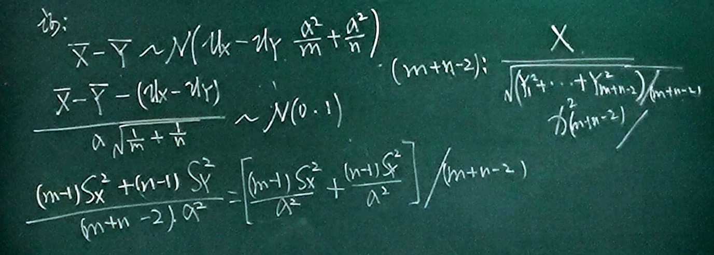
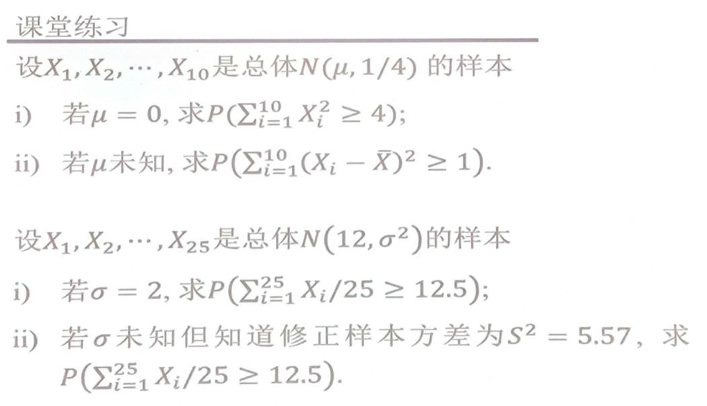
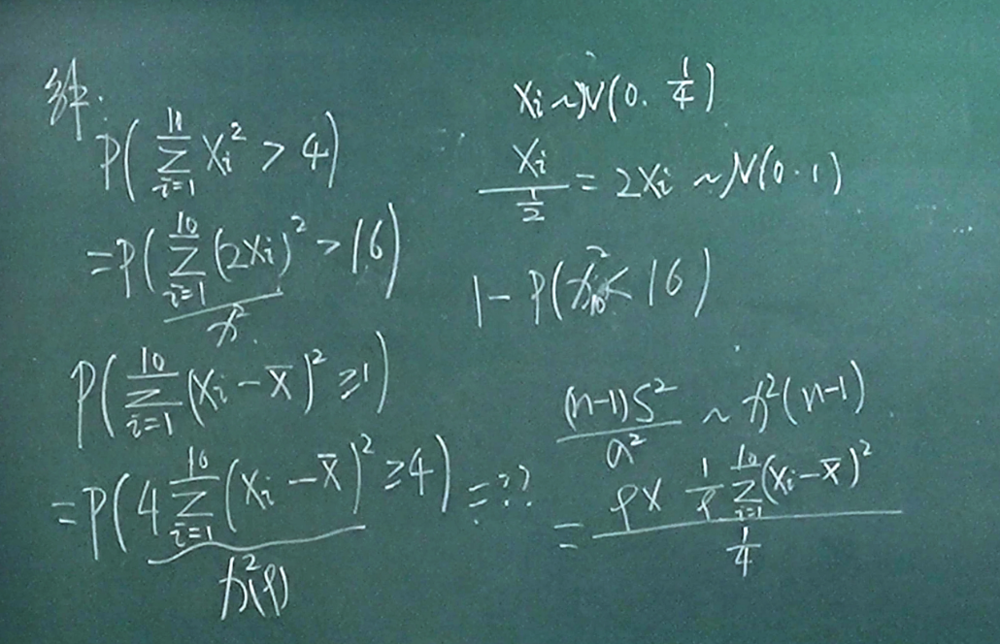

# 正态分布的抽样分布

## 正态分布的抽样分布定理一

$\displaystyle \bar{X}=\frac{1}{n}\sum_{i=1}^{n}X_{i}, S^{2}=\frac{1}{n-1}\sum_{i=1}^{n}(X_{i}-\bar{X})^{2}$

$\displaystyle \bar{X}\sim N(\mu, \frac{\sigma^{2}}{n})$

## 正态分布的抽样分布定理二

$\bar{X}, S^{2}$ 相互独立.

$\displaystyle \frac{(n-1)S^{2}}{\sigma^{2}}\sim \chi^{2}(n-1)$

## 正态分布的抽样分布定理三

$\displaystyle \frac{\bar{X}-\mu}{\sqrt{S^{2} / n}}\sim t(n-1)$

可以通过定理二变化出来.

## 正态分布的抽样分布定理四

$\displaystyle \frac{S_{X}^{2} / \sigma_{X}^{2}}{S_{Y}^{2} / \sigma_{Y}^{2}}\sim F(m-1, n-1)$

## 正态分布的抽样分布定理五

两个分布方差相等

$\displaystyle \frac{\bar{X}-\bar{Y}-(\mu_{X}-\mu_{Y})}{\displaystyle \sqrt{\frac{(m-1)S_{X}^{2}+(n-1)S_{Y}^{2}}{m+n-2}}\sqrt{\frac{1}{m}+\frac{1}{n}}}\sim t(m+n-2)$

## 使用

$\displaystyle \bar{X}=\frac{1}{n}\sum_{i=1}^{n}X_{i}\sim N(\mu, \sigma^{2})$
 
$\sigma^{2}$ 已知:

$\displaystyle \frac{(n-1)S^{2}}{\sigma^{2}}\sim \chi^{2}(n-1)$

$\mu$ 已知:

$\displaystyle \frac{\bar{X}-\mu}{S / \sqrt{n}}\sim t(n-1)$

## 练习

(1) 正态分布.

(2) 转化为 t 分布.

## 分位数 (点)

$\lambda_{\alpha}=-\lambda_{1-\alpha}$

## 正态分布分位点

$\displaystyle P(X>\mu_{\alpha})=\int_{\mu_{\alpha}}^{+\infty}f(x)\mathrm{d}x=\alpha$

称点 $\mu_{\alpha}$ 为正态分布上侧 $\alpha$ 分位点.

- $\alpha=1-\Phi(\mu_{\alpha})$
- $\mu_{1-\alpha}=-\mu_{\alpha}$

## F 分布分位点

$\displaystyle F_{1-\alpha}(m,n)=\frac{1}{F_{\alpha}(n,m)}$

