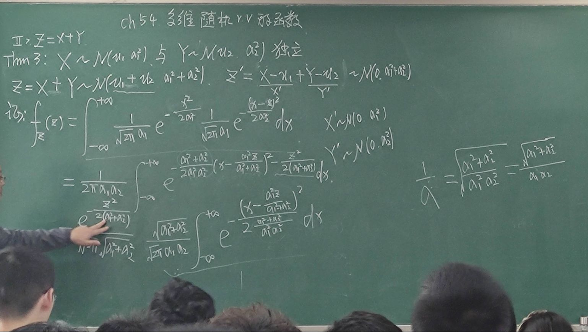

# 二维随机变量

## 最大最小值随机变量

$X\sim e(\alpha), Y\sim e(\beta)$， 求 $Z_1=\max(X,Y), Z_2=\min(X,Y)$ 的概率密度.

$F_{x}(x)=1-e^{\alpha x}, x\geqslant 0$

## 分布求和

例题:

$X\sim e(\lambda_1)$ 与 $Y\sim u(0,1)$ 相互独立, 求 $Z=X+Y$ 的概率密度.

解:

$\displaystyle f_{x}(x)=\begin{cases} \lambda_1 e^{-\lambda_1 x}, & x\geqslant 0 \\ 0, & x<0 \end{cases}$

$\displaystyle f_{z}(z)=\int_{-\infty}^{+\infty}f_{x}(x)f_{y}(z-x)\mathrm{d}x, x\in (0,+\infty), z-x\in (0,1), x\leqslant z\leqslant x+1$

$\displaystyle f_{z}(z)=\begin{cases} 0, & z < 0 \\ \displaystyle \int_{0}^{z}\lambda_1e^{-\lambda_1x}\mathrm{d}x, & z\in [0,1] \\ \displaystyle \int_{z-1}^{z}\lambda_1e^{-\lambda_1x}\mathrm{d}x, & z>1 \end{cases}$

