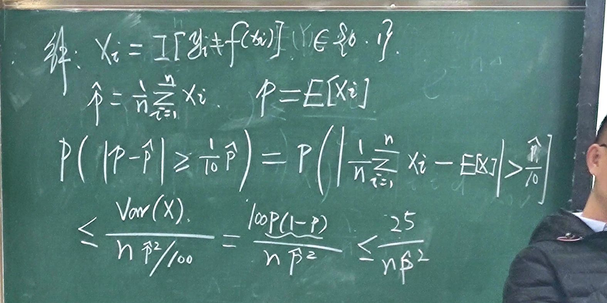

# 概率不等式

## 机器学习

## Markov 不等式

对任意随机变量 $X\geqslant 0$ 和 $\epsilon>0$, 有

$\displaystyle P(X\geqslant \epsilon)\leqslant \frac{E(X)}{\epsilon}$

**证明:**

$\because E(X)=E(X|X<\epsilon)P(X<\epsilon)+E(X|X\geqslant \epsilon)P(X\geqslant \epsilon)\leqslant 0+\epsilon P(X\geqslant \epsilon)$

$\therefore \displaystyle P(X\geqslant \epsilon)\leqslant \frac{E(X)}{\epsilon}$

**推论:** 对任意随机变量, 以及单调递增的非负函数 $g(x)$, 有

$\displaystyle P(X\geqslant \epsilon)\leqslant \frac{E(g(X))}{g(\epsilon)}$

**证明:**

$\because P(X\geqslant \epsilon)=P(g(X)\geqslant g(\epsilon))$

$\therefore \displaystyle P(X\geqslant \epsilon)\leqslant \frac{E(g(X))}{g(\epsilon)}$

用得最多的有 $g(x)=x^{2}, g(x)=e^{x}$, 后者用得最多

## Chebyshev 不等式

$\displaystyle P(|X-\mu|>\epsilon)\leqslant \frac{\mathrm{Var}(X)}{\epsilon^{2}}$

**证明:**

我们已经知道 $A\to B$ 便可知道 $P(A)\leqslant P(B)$

而 $|x-\mu|>\epsilon \Rightarrow (x-\mu)^{2}>\epsilon^{2}$

$\therefore \displaystyle P(|X-\mu|>\epsilon)\leqslant P((X-\mu)^{2}>\epsilon^{2})\leqslant \frac{1}{\epsilon^{2}}E(X-\mu)^{2}=\frac{\mathrm{Var}(X)}{\epsilon^{2}}$

### 例题二

$X\sim N(-1.2), Y\sim N(1,8)$, 相关系数为 $1$, 求 $P(|X+Y|\geqslant 6)\leqslant \ ?$

**解:**

$\therefore E(Z)=E(X)+E(Y)=0$, 可以用 Chebyshev 不等式.

$\therefore \displaystyle P(|X+Y|\geqslant 6)\leqslant \frac{\mathrm{Var}(X+Y)}{36}$

### 例题二

$\displaystyle E(X)=2, E(Y)=2, \mathrm{Var}(X)=1, \mathrm{Var}(Y)=4, \rho_{XY}=-\frac{1}{2}$, 求 $P(|X-Y|\geqslant 6)$

**解:**

$\therefore E(X-Y)=E(X)-E(Y)=0$, 可以用 Chebyshev 不等式.

$\therefore \displaystyle P(|X-Y|\geqslant 6)=\frac{\mathrm{Var}(X-Y)}{36}=\frac{1+4-2\times (-\frac{1}{2})\times 1\times 2}{36}=\frac{7}{36}$

## 单边 Chebyshev 不等式 (Cantelli 不等式)

设随机变量 $X$ 均值 $\mu>0$, 方差 $\sigma^{2}$, 则对任意 $\epsilon>0$ 有

$\displaystyle P(X-\mu\geqslant \epsilon)\leqslant \frac{\sigma^{2}}{\sigma^{2}+\epsilon^{2}}$

$\displaystyle P(X-\mu\geqslant -\epsilon)\leqslant \frac{\sigma^{2}}{\sigma^{2}+\epsilon^{2}}$

**证明:**

令  $Y=X-\mu$, $E(Y)=0$, $\sigma^{2}=\mathrm{Var}(Y)$, $t\in (0,+\infty)$

$\therefore \displaystyle P(Y\geqslant \epsilon)=P(Y+t\geqslant \epsilon+t)\leqslant P[(Y+t)^{2}\geqslant (\epsilon+t)^{2}]\leqslant \frac{1}{(\epsilon+t)^{2}}E[(Y+t)^{2}]=\frac{\sigma^{2}+t^{2}}{(\epsilon+t)^{2}}$

令 $\displaystyle t'=\arg \min_{t\in (0,+\infty)}\frac{\sigma^{2}+t^{2}}{(\epsilon+t)^{2}}$

求导等于零可得 $\displaystyle t'=\frac{\sigma^{2}}{\epsilon}$

$\therefore \displaystyle P(Y\geqslant \epsilon)\leqslant \frac{\sigma^{2}+(\frac{\sigma^{2}}{\epsilon})^{2}}{(\epsilon+\frac{\sigma^{2}}{\epsilon})^{2}}=\frac{\sigma^{2}(\sigma^{2}+\epsilon^{2})}{(\sigma^{2}+\epsilon^{2})^{2}}=\frac{\sigma^{2}}{\epsilon^{2} + \sigma^{2}}$

另一种情况同理.

## Chebyshev 不等式推论

若 $X_1,X_2,\cdots,X_{n}$ 满足 $E(X_{i})=\mu$ 和 $\mathrm{Var}(X_{i})\leqslant \sigma^{2}$, 对任意 $\epsilon>0$ 有

$\displaystyle P\left( \left| \frac{1}{n}\sum_{i=1}^{n}X_{i}-\mu \right|  \geqslant \epsilon \right)\leqslant \frac{\sigma^{2}}{n\epsilon^{2}}$

**证明:**

$\displaystyle Y=\frac{1}{n}\sum_{i=1}^{n}X_{i}, E(Y)=\mu$

$\therefore \displaystyle P(|Y-\mu|>\epsilon)\leqslant \frac{\mathrm{Var}(Y)}{\epsilon^{2}}=\frac{\displaystyle \frac{1}{n^{2}}\mathrm{Var}(\sum_{i=1}^{n}X_{i})}{\epsilon^{2}}\leqslant \frac{\displaystyle \frac{1}{n^{2}}\cdot n\cdot \sigma^{2}}{\epsilon^{2}}=\frac{\sigma^{2}}{n\epsilon^{2}}$

### 例题

## Young 不等式

给定常数 $a>0, b>0$, 对于满足 $\displaystyle \frac{1}{p}+\frac{1}{q}=1$ 的实数 $p>0,q>0$ 有

$\displaystyle ab\leqslant \frac{1}{p}a^{p}+\frac{1}{q}b^{q}$

**证明:**

$
\begin{aligned}
ab &= \exp(\ln(ab)) \\
&= \exp(\ln a + \ln b) \\
&= \exp(\frac{1}{p}\ln a^{p} + \frac{1}{q}\ln b^{q}) \\
&\leqslant \frac{1}{p}\exp(\ln a^{p}) + \frac{1}{q}\exp(\ln b^{q}) \\
&= \frac{1}{p}a^{p} + \frac{1}{q}b^{q} \\
\end{aligned}
$

## Holder 不等式

对任意随机变量 $X$ 和 $Y$ 以及实数 $p>0$ 和 $q>0$ 满足 $\displaystyle \frac{1}{p}+\frac{1}{q}=1$, 有

$\displaystyle E(|XY|)\leqslant (E(|X|^{p}))^{\frac{1}{p}}(E(|Y|^{q}))^{\frac{1}{q}}$

特别地, 当 $p=q=2$ 时, 变成 Cauchy-Schwartz 不等式.

**证明:**

$\displaystyle c=(E(|X|^{p}))^{\frac{1}{p}}, d=(E(|Y|^{q}))^{\frac{1}{q}}$

由 Young 不等式可得

$\displaystyle \frac{|XY|}{c\cdot d}\leqslant \frac{1}{p}\cdot \frac{|X|^{p}}{c^{p}}+\frac{1}{q}\cdot \frac{|Y|^{q}}{d^{q}}$

进而可知

$\displaystyle \frac{E(|XY|)}{c\cdot d}\leqslant \frac{1}{p}\frac{E(|X|^{p})}{E(|X|^{p})}+\frac{1}{q}\frac{E(|Y|^{q})}{E(|Y|^{q})}=\frac{1}{p}+\frac{1}{q}=1$

## 矩生成函数 (Moment Generating Function)

定义随机变量 $X$ 的矩生成函数为

$\displaystyle M_{X}(t)=E(e^{tX})$

### 定理一

对任意 $n\geqslant 1$

$\displaystyle E(X^{n})=M_{X}^{(n)}(0)$

