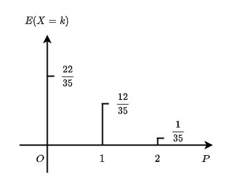

# 概率统计第四次作业

## 201300035 方盛俊

## 3.1

**证明 $E(X)=np$:**

$\because X\sim B(n,p)$

$\therefore \displaystyle P(X=k)=\binom{n}{k}p^{k}(1-p)^{n-k}$

$\therefore \displaystyle E(X)=\sum_{k=0}^{\infty}k\cdot P(X=k)=\sum_{k=0}^{\infty}k\binom{n}{k}p^{k}(1-p)^{n-k}=(1-p)^{n}\sum_{k=1}^{\infty}k\binom{n}{k}\left( \frac{p}{1-p} \right)^{k}$

令 $\displaystyle x=\frac{p}{1-p}$, 则

$\because \displaystyle \sum_{k=0}^{\infty}\binom{n}{k}x^{k}=(1+x)^{n}$

两边求导得

$\therefore \displaystyle \sum_{k=1}^{\infty}k\binom{n}{k}x^{k-1}=n(1+x)^{n-1}$

$\therefore \displaystyle \sum_{k=1}^{\infty}k\binom{n}{k}x^{k}=nx(1+x)^{n-1}$

$\therefore \displaystyle E(X)=(1-p)^{n}\cdot n\cdot \frac{p}{1-p}\cdot \left( 1+\frac{p}{1-p} \right)^{n-1}=np$

**证明 $\mathrm{Var}(X)=np(1-p)$:** 

$
\begin{aligned}
\therefore \mathrm{E}(X^{2})
&=\sum_{k=0}^{\infty}k^{2}\cdot P(X=k) \\
&=\sum_{k=0}^{\infty}k^{2}\binom{n}{k}p^{k}(1-p)^{n-k} \\
&=\sum_{k=0}^{\infty}k(k-1)\binom{n}{k}p^{k}(1-p)^{n-k}+\sum_{k=0}^{\infty}k\binom{n}{k}p^{k}(1-p)^{n-k} \\
&=(1-p)^{n}\sum_{k=1}^{\infty}k(k-1)\binom{n}{k}\left( \frac{p}{1-p} \right)^{k}+(1-p)^{n}\sum_{k=1}^{\infty}k\binom{n}{k}\left( \frac{p}{1-p} \right)^{k} \\
\end{aligned}
$

$\because \displaystyle \sum_{k=1}^{\infty}k\binom{n}{k}x^{k-1}=n(1+x)^{n-1}$

$\therefore \displaystyle \sum_{k=2}^{\infty}k(k-1)\binom{n}{k}x^{k-2}=n(n-1)(1+x)^{n-2}$

$\therefore \displaystyle \sum_{k=2}^{\infty}k(k-1)\binom{n}{k}x^{k}=n(n-1)x^{2}(1+x)^{n-2}$

$\therefore \displaystyle E(X^{2})=(1-p)^{n}\cdot n(n-1)\left( \frac{p}{1-p} \right)^{2}\left( 1+\frac{p}{1-p} \right)^{n-2}+np=n(n-1)p^{2}+np=np(1-p)+n^{2}p^{2}$

$\therefore \displaystyle \mathrm{Var}(X)=E(X^{2})-E(X)^{2}=np(1-p)$

## 3.2

**证明 $\displaystyle E(X)=\frac{1}{p}$:**

$\because \displaystyle P(X=k)=(1-p)^{k-1}p$

$\therefore \displaystyle E(X)=\sum_{k=1}^{\infty}k\cdot P(X=k)=\sum_{k=1}^{\infty}k(1-p)^{k-1}p=p\sum_{k=1}^{\infty}k(1-p)^{k-1}$

$\because \displaystyle \sum_{k=0}^{\infty}x^{k}=\frac{1}{1-x}$

$\therefore \displaystyle \sum_{k=1}^{\infty}kx^{k-1}=\frac{1}{(1-x)^{2}}$

$\therefore \displaystyle \sum_{k=1}^{\infty}k(1-p)^{k-1}=\frac{1}{p^{2}}$

$\therefore \displaystyle E(X)=p\cdot \frac{1}{p^{2}}=\frac{1}{p}$

**证明 $\displaystyle \mathrm{Var}(X)=\frac{1-p}{p^{2}}$:**

$\therefore \displaystyle E(X^{2})=\sum_{k=1}^{\infty}k^{2}(1-p)^{k-1}p=p\sum_{k=2}^{\infty}k(k-1)(1-p)^{k-1}+p\sum_{k=1}^{\infty}k(1-p)^{k-1}$

$\because \displaystyle \sum_{k=1}^{\infty}kx^{k-1}=\frac{1}{(1-x)^{2}}$

$\therefore \displaystyle \sum_{k=2}^{\infty}k(k-1)x^{k-2}=\frac{2}{(1-x)^{3}}$

$\therefore \displaystyle \sum_{k=2}^{\infty}k(k-1)x^{k-1}=\frac{2x}{(1-x)^{3}}$

$\therefore \displaystyle E(X^{2})=p\cdot \frac{2(1-p)}{p^{3}}+\frac{1}{p}=\frac{1}{p}+\frac{2(1-p)}{p^{2}}=\frac{2 - p}{p^{2}}$

$\therefore \displaystyle \mathrm{Var}(X)=E(X^{2})-E(X)^{2}=\frac{2 - p}{p^{2}}-\frac{1}{p^{2}}=\frac{1 - p}{p^{2}}$

## 3.3

**证明 $\displaystyle E(X)=\frac{r}{p}$:**

$\because \displaystyle P(X=k)=\binom{k-1}{r-1}p^{r}(1-p)^{k-r}$

$\therefore \displaystyle E(X)=\sum_{k=r}^{\infty}k\cdot \binom{k-1}{r-1}p^{r}(1-p)^{k-r}=rp^{r}\sum_{k=r}^{\infty}\binom{k}{r}(1-p)^{k-r}$

$\because \displaystyle \sum_{k=r}^{\infty}\binom{k}{r}(1-p)^{k-r}=\sum_{k=r}^{\infty}\binom{k+1-1}{r+1-1}(1-p)^{k-r}=p^{-(r+1)}$

$\therefore \displaystyle E(X)=rp^{r}\cdot p^{-(r+1)}=\frac{r}{p}$

**证明 $\displaystyle \mathrm{Var}(X)=\frac{r(1-p)}{p^{2}}$:**

$\therefore \displaystyle E(X^{2})=\sum_{k=r}^{\infty}k^{2}\cdot \binom{k-1}{r-1}p^{r}(1-p)^{k-r}=r(r+1)p^{r}\sum_{k=r}^{\infty}\binom{k+1}{r+1}(1-p)^{k-r}-rp^{r}\sum_{k=r}^{\infty}\binom{k}{r}(1-p)^{k-r}$

$\because \displaystyle \sum_{k=r}^{\infty}\binom{k+1}{r+1}(1-p)^{k-r}=\sum_{k=r}^{\infty}\binom{k+2-1}{r+2-1}(1-p)^{k-r}=p^{-(r+2)}$

$\therefore \displaystyle E(X^{2})=r(r+1)p^{r}\cdot p^{-(r+2)}-\frac{r}{p}$

$\therefore \displaystyle \mathrm{Var}(X)=E(X^{2})-E(X)^{2}=r(r+1)p^{r}\cdot p^{-(r+2)}-\frac{r}{p}-\frac{r^{2}}{p^{2}}=\frac{r \left(1 - p\right)}{p^{2}}$

## 3.4

**证明 $E(X)=\lambda$:**

$\because \displaystyle P(X=k)=\frac{\lambda^{k}}{k!}e^{-\lambda}$

$\therefore \displaystyle E(X)=\sum_{k=0}^{\infty}k\cdot \frac{\lambda^{k}}{k!}e^{-\lambda}=\lambda e^{-\lambda}\sum_{k=1}^{\infty}\frac{\lambda^{k-1}}{(k-1)!}=\lambda e^{-\lambda}\cdot e^{\lambda}=\lambda$

**证明 $\mathrm{Var}(X)=\lambda$:**

$\therefore \displaystyle E(X^{2})=\sum_{k=0}^{\infty}k^{2}\cdot \frac{\lambda^{k}}{k!}e^{-\lambda}=\sum_{k=2}^{\infty}k(k-1)\cdot \frac{\lambda^{k}}{k!}e^{-\lambda}+\sum_{k=1}^{\infty}k\cdot \frac{\lambda^{k}}{k!}e^{-\lambda}=\lambda^{2} e^{-\lambda}\cdot e^{\lambda}+\lambda=\lambda^{2}+\lambda$

$\therefore \mathrm{Var}(X)=E(X^{2})-E(X)^{2}=\lambda$

## 3.5

设 $Y$ 表示一个的叶节点的高度.

设 $X_{i}$ 表示第 $i$ 轮该叶节点是否被选中, 选中时 $X_{i}=1$, 未选中时 $X_{i}=0$.

因为在第 $i$ 轮一共有 $i$ 个节点, 因此该节点被选中的概率 $\displaystyle P(X_{i}=1)=\frac{1}{i}$, 则 $\displaystyle E(X_{i})=1\cdot P(X_{i}=1)=\frac{1}{i}$

$\therefore \displaystyle E(Y)=E\left( \sum_{i=1}^{k}X_{i} \right)=\sum_{i=1}^{k}E(X_{i})=\sum_{i=1}^{k}\frac{1}{i}\thickapprox \ln k$

## 3.6

**有放回:**

$\because \displaystyle P(X=k)=\frac{\displaystyle \sum_{i=1}^{5}\binom{5}{i}(k-1)^{5-i}}{10^{5}}$

<!-- for k in range(1, 11):
    print(latex2sympy(r"\sum_{i=1}^{5}\binom{5}{i}(k-1)^{5-i}").subs({Symbol("k"): k}).doit()) -->

$\therefore P(X=1)=0.00001, P(X=2)=0.00031, P(X=3)=0.00211, P(X=4)=0.00781, P(X=5)=0.02101, P(X=6)=0.04651, P(X=7)=0.09031, P(X=8)=0.15961, P(X=9)=0.26281, P(X=10)=0.40951$

| $X$ | 1       | 2       | 3       | 4       | 5       | 6       | 7       | 8       | 9       | 10      |
| --- | ------- | ------- | ------- | ------- | ------- | ------- | ------- | ------- | ------- | ------- |
| $P$ | 0.00001 | 0.00031 | 0.00211 | 0.00781 | 0.02101 | 0.04651 | 0.09031 | 0.15961 | 0.26281 | 0.40951 |

**无放回:**

$\because \displaystyle P(X=k)=\frac{\binom{k-1}{4}}{\binom{10}{5}}$

| $X$ | 5   | 6   | 7   | 8   | 9   | 10  |
| --- | --- | --- | --- | --- | --- | --- |
| $P$ | $\frac{1}{252}$ | $\frac{5}{252}$ | $\frac{5}{84}$ | $\frac{5}{36}$ | $\frac{5}{18}$ | $\frac{1}{2}$ |

## 3.7

令 $X\sim B(n, 0.99)$, 则 $X$ 服从参数为 $n$ 和 $0.99$ 的二项分布.

$\therefore \displaystyle P(X\geqslant k)=\sum_{k=k}^{n}\binom{n}{k}\times 0.99^{k}\times 0.01^{n-k}$

令 $n=102$, 则

$\therefore \displaystyle P(X\geqslant 100)=\sum_{k=100}^{102}\binom{102}{k}\times 0.99^{k}\times 0.01^{102-k}=0.916911014889440$

令 $n=103$, 则

$\therefore \displaystyle P(X=100)=\sum_{k=100}^{103}\binom{103}{k}\times 0.99^{k}\times 0.01^{103-k}=0.979758767886053$

所以 $x=103-100=3$. 即 $x$ 最小值是 $3$.

## 3.8

### 2. (1)

$\because \displaystyle P(X=k)=\frac{\binom{k-1}{2}}{\binom{5}{3}}$

$\therefore \displaystyle P(X=3)=0.1, P(X=4)=0.3, P(X=5)=0.6$

| $X$ | 3   | 4   | 5   |
| --- | --- | --- | --- |
| $P$ | 0.1 | 0.3 | 0.6 |

### 2. (2)

$\because \displaystyle P(X=k)=\frac{\binom{6-k}{1}}{\binom{6}{2}}$

$\therefore \displaystyle P(X=1)=\frac{1}{3}, P(X=2)=\frac{4}{15}, P(X=3)=\frac{1}{5}, P(X=4)=\frac{2}{15}, P(X=5)=\frac{1}{15}$

| $X$ | 1             | 2              | 3             | 4              | 5              |
| --- | ------------- | -------------- | ------------- | -------------- | -------------- |
| $P$ | $\frac{1}{3}$ | $\frac{4}{15}$ | $\frac{1}{5}$ | $\frac{2}{15}$ | $\frac{1}{15}$ |

### 3. (1)

$\because \displaystyle P(X=k)=\frac{\binom{2}{k}\binom{13}{3-k}}{\binom{15}{3}}$

$\therefore \displaystyle P(X=0)=\frac{22}{35}, P(X=1)=\frac{12}{35}, P(X=2)=\frac{1}{35}$

| $X$ | 0               | 1               | 2              |
| --- | --------------- | --------------- | -------------- |
| $P$ | $\frac{22}{35}$ | $\frac{12}{35}$ | $\frac{1}{35}$ |

### 3. (2)

## 3.9

### 2.

设 $Y$ 为每次抽取 $10$ 件产品进行检验时发现的次品数. 则 $Y\sim B(10, 0.1)$

$\therefore \displaystyle P(Y=0)=\binom{10}{0}\times 0.1^{0}\times 0.9^{10}=0.9^{10}$

$\therefore \displaystyle P(Y=1)=\binom{10}{1}\times 0.1^{1}\times 0.9^{9}=0.9^{9}$

$\therefore \displaystyle P(Y>1)=1-0.9^{10}-0.9^{9}= 1-1.9\times 0.9^{9}$

即发现超过 $1$ 件次品的概率为 $p=1-1.9\times 0.9^{9}$

则我们有 $X\sim (4, p)$, 即 $X\sim (4, 1-1.9\times 0.9^{9})$

$\therefore E(X)=4p=4-7.6\times 0.9^{9}$

### 3.

$\because \displaystyle P(X=k)=\frac{\displaystyle \sum_{i=1}^{3}\binom{3}{i}(4-k)^{3-i}}{4^{3}}$

$\therefore \displaystyle P(X=1)=\frac{37}{64}, P(X=2)=\frac{19}{64}, P(X=3)=\frac{7}{64}, P(X=4)=\frac{1}{64}$

| $X$ | 1   | 2   | 3    | 4    |
| --- | --- | --- | ---- | ---- |
| $P$ |$\frac{37}{64}$ | $\frac{19}{64}$ | $\frac{7}{64}$ | $\frac{1}{64}$ |

$\displaystyle \therefore E(X)=1\times \frac{37}{64}+2\times \frac{19}{64} +3\times \frac{7}{64} +4\times \frac{1}{64}=\frac{25}{16}$

## 3.10

### 4. (1)

因为 $\displaystyle \sum_{j=1}^{\infty}\left|(-1)^{j+1}\frac{3^{j}}{j}\cdot \frac{2}{3^{j}}\right|=\sum_{j=1}^{\infty}\frac{2}{j}$ 调和级数发散, 即 $E(X)$ 并不绝对收敛.

所以 $X$ 的数学期望并不存在.

### 4. (2)

$\because \displaystyle P(X=k)=\left(\prod_{i=1}^{k-1}\frac{i}{i+1}\right)\cdot \frac{1}{k+1}$

$\therefore \displaystyle E(X)=\sum_{k=1}^{\infty}k\cdot \left(\prod_{i=1}^{k-1}\frac{i}{i+1}\right)\cdot \frac{1}{k+1}=\sum_{k=1}^{\infty}\frac{1}{k+1}$ 调和级数发散.

### 6. (1)

$\displaystyle E(X)=-2\times 0.4+0\times 0.3+2\times 0.3=-0.2$

$\displaystyle E(X^{2})=4\times 0.4+0\times 0.3+4\times 0.3=2.8$

$\displaystyle E(3X^{2}+5)=3E(X^{2})+5=3\times 2.8+5=13.4$

### 6. (2)

$\because X\sim \pi(\lambda)$

$\therefore \displaystyle P(X=k)=\frac{\lambda^{k}}{k!}e^{-\lambda}$

$\therefore \displaystyle E\left( \frac{1}{X+1} \right)=\sum_{k=0}^{\infty}\frac{1}{k+1}\cdot \frac{\lambda^{k}}{k!}e^{-\lambda}=\frac{e^{-\lambda}}{\lambda}\sum_{k=0}^{\infty}\frac{\lambda^{k+1}}{(k+1)!}=\frac{\left(e^{\lambda} - 1\right) e^{- \lambda}}{\lambda}$

