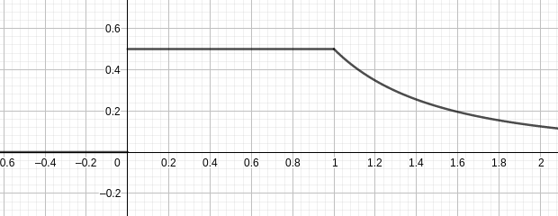

# 概率统计第九次作业

## 201300035 方盛俊

第九次作业: 117页: 28,30,32,34,35; 86页:13,14,15; 87页:20; 88页:29.

## 28.

$\displaystyle E(X)=\int_{-\infty}^{+\infty}\mathrm{d}x\int_{-\infty}^{+\infty}xf(x,y)\mathrm{d}y=\int_{0}^{2\pi}\mathrm{d}\theta\int_{0}^{1}\rho\cos\theta\cdot \rho\mathrm{d}\rho=\int_{0}^{2\pi}\cos\theta\mathrm{d}\theta\int_{0}^{1}\rho^{2}\mathrm{d}\rho=0$

$\displaystyle E(Y)=\int_{-\infty}^{+\infty}\mathrm{d}x\int_{-\infty}^{+\infty}yf(x,y)\mathrm{d}y=\int_{0}^{2\pi}\mathrm{d}\theta\int_{0}^{1}\rho\sin\theta\cdot \rho\mathrm{d}\rho=\int_{0}^{2\pi}\sin\theta\mathrm{d}\theta\int_{0}^{1}\rho^{2}\mathrm{d}\rho=0$

$\displaystyle E(XY)=\int_{-\infty}^{+\infty}\mathrm{d}x\int_{-\infty}^{+\infty}xyf(x,y)\mathrm{d}y=\int_{0}^{2\pi}\mathrm{d}\theta\int_{0}^{1}\rho^{2}\sin\theta\cos\theta\cdot \rho\mathrm{d}\rho=\int_{0}^{2\pi}\sin\theta\cos\theta\mathrm{d}\theta\int_{0}^{1}\rho^{3}\mathrm{d}\rho=0$

因此 $E(XY)=E(X)E(Y)$, 即 $X$ 和 $Y$ 是不相关的.

$\displaystyle f_{x}(x)=\int_{-\infty}^{+\infty}f(x,y)\mathrm{d}y=\int_{-\sqrt{1-x^{2}}}^{+\sqrt{1-x^{2}}}\frac{1}{\pi}\mathrm{d}y=\frac{2 }{\pi}\sqrt{1 - x^{2}}$, $-1\leqslant x\leqslant 1$

$\displaystyle f_{y}(y)=\int_{-\infty}^{+\infty}f(x,y)\mathrm{d}x=\frac{2 }{\pi}\sqrt{1 - y^{2}}$, $-1\leqslant y\leqslant 1$

显然我们可以看出 $f(x,y)\neq f_{x}(x)f_{y}(y)$, 即 $X$ 和 $Y$ 不是互相独立的.

## 30.

$\because \rho_{XY}=0$

$\therefore E(XY)=E(X)E(Y)$

$\because E(X)=P(A), E(Y)=P(B), E(XY)=P(AB)$

$\therefore P(AB)=P(A)P(B)$

$\therefore A, B$ 是相互独立的

$\therefore X, Y$ 是相互独立的

## 32.

$\displaystyle E(X)=\int_{0}^{2}\mathrm{d}x\int_{0}^{2}x\cdot \frac{1}{8}(x+y)\mathrm{d}y=\int_{0}^{2}\frac{x \left(x + 1\right)}{4}\mathrm{d}x=\frac{7}{6}$

$\displaystyle E(Y)=\frac{7}{6}$

$\displaystyle E(XY)=\int_{0}^{2}\mathrm{d}x\int_{0}^{2}xy\cdot \frac{1}{8}(x+y)\mathrm{d}y=\int_{0}^{2}\frac{x \left(3 x + 4\right)}{12}\mathrm{d}x=\frac{4}{3}$

$\displaystyle E(X^{2})=\int_{0}^{2}\mathrm{d}x\int_{0}^{2}x^{2}\cdot \frac{1}{8}(x+y)\mathrm{d}y=\int_{0}^{2}\frac{x^{2} \left(x + 1\right)}{4}\mathrm{d}x=\frac{5}{3}$

$\displaystyle E(Y^{2})=\frac{5}{3}$

$\displaystyle \mathrm{Cov}(X,Y)=E(XY)-E(X)E(Y)=\frac{4}{3}-\frac{7}{6}\times \frac{7}{6}=- \frac{1}{36}$

$\displaystyle \rho_{XY}=\frac{\mathrm{Cov}(X,Y)}{\sqrt{\mathrm{Var}(X)}\sqrt{\mathrm{Var}(Y)}}=\frac{-\frac{1}{36}}{(\sqrt{\frac{5}{3}-\frac{7}{6}\times \frac{7}{6}})^{2}}=- \frac{1}{11}$

$\displaystyle D(X+Y)=\mathrm{Var}(X)+\mathrm{Var}(Y)+2\mathrm{Cov}(X,Y)=2\times (\frac{5}{3}-\frac{7}{6}\times \frac{7}{6})+2\times (-\frac{1}{36})=\frac{5}{9}$

## 34.

**(1)**

$\because D(X)=E(X^{2})-E(X)^{2}=E(X^{2})=4$

$\quad D(Y)=E(Y^{2})-E(Y)^{2}=E(Y^{2})=16$

$\quad \displaystyle \rho_{XY}=\frac{\mathrm{Cov}(X,Y)}{\sqrt{D(X)}\sqrt{D(Y)}}=\frac{E(XY)-E(X)E(Y)}{\sqrt{4}\cdot \sqrt{16}}=\frac{E(XY)}{8}=-0.5$

$\therefore E(XY)=-4$

$\therefore \displaystyle E(W)=a^{2}E(X^{2})+6aE(XY)+9E(Y^{2})=4a^{2}-24a+144$

$\therefore \displaystyle a=-\frac{-24}{2\times 4}=3$ 时有最小值 $E(W)=4\times 3^{2}-24\times 3+144=108$

**(2)**

$
\begin{aligned}
\therefore \mathrm{Cov}(W,V)
&=E(WV)-E(W)E(V) \\
&=E[(X-aY)(X+aY)]-E(X-aY)E(X+aY) \\
&=E(X^{2}-a^{2}Y^{2})-(E(X)-aE(Y))(E(X)+aE(Y)) \\
&=[E(X^{2})-E(X)^{2}]-a^{2}[E(Y^{2})-E(Y)^{2}] \\
&=\sigma_{X}^{2}-a^{2}\sigma_{Y}^{2} \\
&=0 \\
\end{aligned}
$

$\because W, V$ 也是正态分布, 它们不相关.

$\therefore W, V$ 互相独立.

## 35.

$\therefore \mu=\begin{pmatrix} \mu_{x} \\ \mu_{x} \\\end{pmatrix}=\begin{pmatrix} 0 \\ 0 \\\end{pmatrix}, \Sigma=\begin{pmatrix} \sigma_{x}^{2} & \rho_{XY}\sigma_{x}\sigma_{y} \\ \rho_{XY}\sigma_{x}\sigma_{y} & \sigma_{y}^{2} \\\end{pmatrix}=\begin{pmatrix} 3 & -\frac{\sqrt{3}}{2} \\ -\frac{\sqrt{3}}{2} & 4 \\\end{pmatrix}$

$\therefore \displaystyle f(x,y)=\frac{1}{2\pi\sqrt{1-(-\frac{1}{4})^{2}}\sqrt{3}\cdot 2}\exp\left( -\frac{1}{2(1-\frac{1}{16})}\left[ \frac{x^{2}}{3}+\frac{y^{2}}{4}-\frac{2\cdot (-\frac{1}{4})xy}{2\sqrt{3}} \right]  \right)=\frac{1}{3 \sqrt{5} \pi}\exp\left( -\frac{8}{15}\left( \frac{x^{2}}{3}+\frac{y^{2}}{4}+ \frac{\sqrt{3} x y}{12} \right)  \right)$

## 13.

**(1)**

$\because \displaystyle \int_{-1}^{1}\mathrm{d}x\int_{x^{2}}^{1}cx^{2}y\mathrm{d}y=c\int_{-1}^{1}x^{2}(\frac{1}{2} - \frac{x^{4}}{2})\mathrm{d}x=\frac{4c}{21}=1$

$\therefore \displaystyle c=\frac{21}{4}$

$\therefore \displaystyle f_{Y}(y)=\int_{-\sqrt{y}}^{\sqrt{y}}cx^{2}y\mathrm{d}x=\frac{2}{3}cy^{\frac{5}{2}}$

$\therefore \displaystyle f_{X|Y}(x|y)=\frac{f(x,y)}{f_{Y}(y)}=\frac{x^{2}y}{\frac{2}{3}y^{\frac{5}{2}}}=\frac{3}{2}x^{2}y^{-\frac{3}{2}}$

$\therefore \displaystyle f_{X|Y}(x|y=\frac{1}{2})=\frac{3}{2}x^{2}\cdot (\frac{1}{2})^{-\frac{3}{2}}=3 \sqrt{2}x^{2}, x^{2}\leqslant \frac{1}{2}$

**(2)**

$\therefore \displaystyle f_{X}(x)=\int_{x^{2}}^{1}cx^{2}y\mathrm{d}y=\frac{1}{2}cx^{2}(1-x^{4})$

$\therefore \displaystyle f_{Y|X}(y|x)=\frac{f(x,y)}{f_{X}(x)}=\frac{x^{2}y}{\frac{1}{2}x^{2}(1-x^{4})}=-\frac{2y}{x^{4}-1}$

$\therefore \displaystyle f_{Y|X}(y|x=\frac{1}{3})=-\frac{2y}{(\frac{1}{3})^{4}-1}=\frac{81}{40}y, \frac{1}{9}\leqslant y\leqslant 1$

$\therefore \displaystyle f_{Y|X}(y|x=\frac{1}{2})=-\frac{2y}{(\frac{1}{2})^{4}-1}=\frac{32}{15}y, \frac{1}{4}\leqslant y\leqslant 1$

**(3)**

$\therefore \displaystyle P(Y\geqslant \frac{1}{4}|X=\frac{1}{2})=\int_{\frac{1}{4}}^{1}\frac{32}{15}y\mathrm{d}y=1$

$\therefore \displaystyle P(Y\geqslant \frac{3}{4}|X=\frac{1}{2})=\int_{\frac{3}{4}}^{1}\frac{32}{15}y\mathrm{d}y=\frac{7}{15}$

## 14.

$\because \displaystyle f_{X}(x)=\int_{-x}^{x}1\mathrm{d}y=2x$

$\therefore \displaystyle f_{Y|X}(y|x)=\frac{f(x,y)}{f_{X}(x)}=\frac{1}{2x}$

$\therefore \displaystyle f_{Y|X}(y|x)=\begin{cases} \displaystyle \frac{1}{2x}, & |y|<x, 0<x<1 \\ 0, & \text{otherwise} \end{cases}$

$\because \displaystyle f_{Y}(y)=\begin{cases} \displaystyle \int_{y}^{1}1\mathrm{d}x=1-y, & 0<y<1 \\ \displaystyle \int_{-y}^{1}1\mathrm{d}x=1+y, & -1<y\leqslant 0 \\ 0, & \text{otherwise} \end{cases}$

$\therefore \displaystyle f_{X|Y}(x|y)=\frac{f(x,y)}{f_{Y}(y)}=\begin{cases} \displaystyle \frac{1}{1-y}, & 0<y<1, |y|<x, 0<x<1 \\ \displaystyle \frac{1}{1+y}, & -1<y<0, |y|<x, 0<x<1 \\ 0, & \text{otherwise} \end{cases}$

## 15.

**(1)**

$\because X\sim U(0,1)$

$\therefore f_{X}(x)=\begin{cases} 1, & 0<x<1 \\ 0, & \text{otherwise} \end{cases}$

$\therefore f(x,y)=f_{Y|X}(y|x)f_{X}(x)=\begin{cases} x, & 0<y<\displaystyle \frac{1}{x}, 0<x<1 \\ 0, & \text{otherwise} \end{cases}$

**(2)**

$\therefore \displaystyle f_{Y}(y)=\begin{cases} \displaystyle \int_{0}^{\frac{1}{y}}x\mathrm{d}x=\frac{1}{2 y^{2}}, &y\geqslant 1 \\ \displaystyle \int_{0}^{1}x\mathrm{d}x=\frac{1}{2}, & 0<y<1 \\ 0, & \text{otherwise} \end{cases}$

**(3)**

$\displaystyle P(X>Y)=\int_{0}^{1}\mathrm{d}y\int_{y}^{1}x\mathrm{d}x=\int_{0}^{1}(\frac{1}{2} - \frac{y^{2}}{2})\mathrm{d}y=\frac{1}{3}$

## 20.

**(1)**

$\therefore \displaystyle f(x,y)=f_{X}(x)f_{Y}(y)=\begin{cases} \lambda\mu e^{-\lambda x}e^{-\mu y}, & x>0, y>0 \\ 0, & \text{otherwise} \end{cases}$

$\therefore \displaystyle f_{X|Y}(x|y)=\frac{f(x,y)}{f_{Y}(y)}=\begin{cases} \lambda e^{-\lambda x}, & x>0, y>0 \\ 0, & \text{otherwise} \end{cases}$

**(2)**

$\therefore \displaystyle P(X\leqslant Y)=\int_{0}^{+\infty}\mathrm{d}y\int_{0}^{y}\lambda\mu e^{-\lambda x}e^{-\mu y}\mathrm{d}x=\int_{0}^{+\infty}\mu e^{-\mu y}(1-e^{-\lambda y})\mathrm{d}y=\int_{0}^{+\infty}\mu e^{-\mu y}\mathrm{d}y-\int_{0}^{+\infty}\mu e^{-(\mu+\lambda) y}\mathrm{d}y=1-\frac{\mu}{\lambda + \mu}=\frac{\lambda}{\lambda+\mu}$

$\therefore \displaystyle P(X>Y)=\frac{\mu}{\lambda+\mu}$

分布律为

| $Z$ | $0$                       | $1$                           |
| --- | ------------------------- | ----------------------------- |
| $P$ | $\frac{\mu}{\lambda+\mu}$ | $\frac{\lambda}{\lambda+\mu}$ |

分布函数为

$\displaystyle F_{Z}(z)=\begin{cases} 0, & z<0 \\ \displaystyle \frac{\mu}{\lambda+\mu}, & 0\leqslant z<1 \\ 1, & z\geqslant 1 \end{cases}$

## 29.

**(1)**

$\because \displaystyle 1=\int_{0}^{1}\mathrm{d}x\int_{0}^{+\infty}be^{-(x+y)}\mathrm{d}y=b\int_{0}^{1}e^{-x}\mathrm{d}x\int_{0}^{+\infty}e^{-y}\mathrm{d}y=b(1 - e^{-1})$

$\therefore \displaystyle b=\frac{1}{1 - e^{-1}}$

**(2)**

$\displaystyle \therefore f_{X}(x)=\int_{0}^{+\infty}\frac{1}{1-e^{-1}}e^{-(x+y)}\mathrm{d}y=\frac{e^{-x}}{1-e^{-1}}, 0<x<1$

$\displaystyle \quad f_{Y}(y)=\int_{0}^{1}\frac{1}{1-e^{-1}}e^{-(x+y)}\mathrm{d}x=e^{- y}, 0<y<+\infty$

**(3)**

$\therefore f(x,y)=f_{X}(x)f_{Y}(y)$

$\therefore X,Y$ 相互独立.

$\because \displaystyle F_{X}(x)=\int_{0}^{x}\frac{e^{-x}}{1-e^{-1}}\mathrm{d}x=\frac{1}{1-e^{-1}}\int_{0}^{x}e^{-x}\mathrm{d}x=\frac{1 - e^{- x}}{1-e^{-1}}, 0<x<1$

$\quad \displaystyle F_{Y}(y)=\int_{0}^{y}e^{-y}\mathrm{d}y=1 - e^{- y}, y>0$

$\therefore \displaystyle F_{U}(u)=F_{X}(u)F_{Y}(u)=\frac{(1-e^{-u})^{2}}{1-e^{-1}}, 0<u<1$

$\therefore \displaystyle F_{U}(u)=\begin{cases} 0, & u\leqslant 0 \\  \displaystyle \frac{(1-e^{-u})^{2}}{1-e^{-1}}, & 0<u<1 \\ 1-e^{-u}, & u\geqslant 1 \end{cases}$

