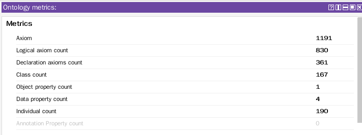
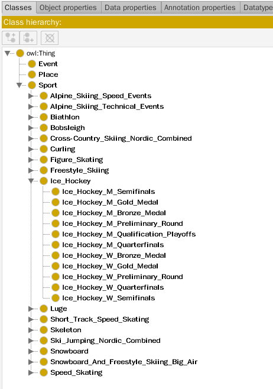
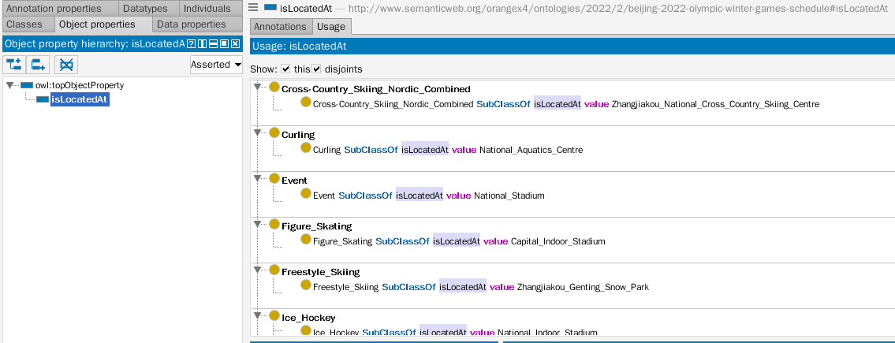
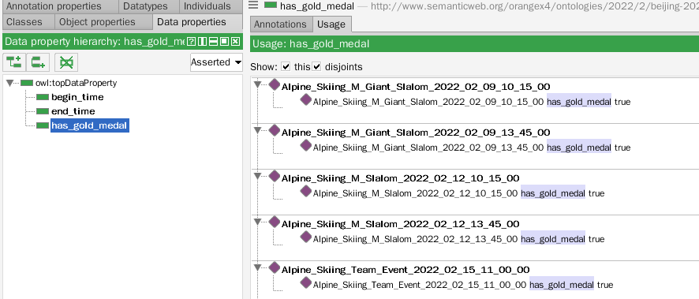

# Assignment 1

## 201300035 方盛俊

## Question 1. Basic Understanding of KR and Ontologies

A logic-based ontology is specified in formal logic langugages, which are decidable and reasonable. With a domain of interest based on a fixed vocabulary, the knowledge can be represented by limited words and then be decided and reasoned in formal logic syntax. For example, we can use syllogism to reason more knowledge. If we intepret the domain and concepts as a set and elements in the set, we can compute the KR model with set theory in semantics. We can also interpret some logic words as set operations, such as union, intersection and subset, which are also computational.


## Question 2. Expressivity & Computability

**Sentence:** "What is your name?"

The sentence is a special question sentence, and it is unable to be modelled in the formal languages.

**My opinion:** It is a trade-off. If a logic-based KR language is designed as expressive as possible, it will loss some useful properties, such as completeness, soundness and decidability. For example, zeroth-order logic is decidable, but the first-order logic is undecidable. Natural language is as expressive as possible in any circumstances, but it is not a computational model. So I don't agree to the belief in the question.


## Question 3. Manchester Syntax

**(1)**

Timo is a Cow.

**(2)**

Fido is not a dog.

**(3)**

Owning a Cow is not enough to recognize a Person as a LivestockOwner.

**(4)**

Zero.


## Question 4. ALC Extensions & FOL

**(1)**

**Sentence: Every Chinese couple have at most 3 children.**

**Concept names:** $\text{ChineseCouple}$

**Role names:** $\text{hasChild}$

**Inclusions:**

- $\text{ChineseCouple } \sqsubseteq (\le 3 \text{ hasChild.}\top)$

**Sentence: ML is a course taught by SFM who is a professor working at NJU.**

**Concept names:** $\text{Professor}$, $\text{Course}$

**Role names:** $\text{teach}$, $\text{workAt}$

**Nominals:** $\text{ML}$, $\text{SFM}$, $\text{NJU}$

**Inclusions:**

- $\{ \text{ML} \} \sqsubseteq \text{ Course } \sqcap (\exists \text{ teach}^{-}.\{ \text{SFM} \})$
- $\{ \text{SFM} \} \sqsubseteq \text{ Professor } \sqcap (\exists \text{ workAt}.\{ \text{NJU} \})$

**Sentence: NJU is a university whose members are a school or a department.**

**Concept names:** $\text{University}$, $\text{School}$, $\text{Department}$

**Role names:** $\text{hasMember}$

**Nominals:** $\text{NJU}$

**Inclusions:**

- $\{ \text{NJU} \} \sqsubseteq \text{University } \sqcap (\exists \text{ hasMember}.\top) \sqcap (\forall \text{ hasMember}.(\text{School}\sqcup \text{Department}))$

**Sentence: NJU has at least 30,000 students.**

**Concept names:** $\text{Student}$

**Role names:** $\text{has}$

**Nominals:** $\text{NJU}$

**Inclusions:**

- $\{ \text{NJU} \} \sqsubseteq (\ge 30,000 \text{ has}.\text{Student})$

**Sentence: All members of AI School are undergraduates, graduates, or teachers.**

**Concept names:** $\text{Undergraduate}$, $\text{Graduate}$, $\text{Teacher}$

**Role names:** $\text{memberOf}$

**Nominals:** $\text{AI School}$

**Inclusions:**

- $(\exists \text{ memberOf}.\{ \text{AI School} \}) \sqsubseteq \text{Undergraduate} \sqcup \text{Graduate} \sqcup \text{Teacher}$

**Sentence: The domain of the relation "citizenOf" consists of countries.**

**Concept names:** $\text{Country}$

**Role names:** $\text{citizenOf}$

**Inclusions:**

- $(\exists \text{ citizenOf}.\top) \sqsubseteq \text{Country}$

**(2)**

**Sentence: All members of AI School are undergraduates, graduates, or teachers.**

- $\forall x(\text{memberOf}(x, \text{AI School}) \to \text{Undergraduate}(x) \lor \text{Graduate}(x) \lor \text{Teacher}(x))$

**Sentence: The domain of the relation "citizenOf" consists of countries.**

- $\forall x(\exists y(\text{memberOf}(x, y)) \to \text{Country}(x))$


## Question 5. DL Semantics

**(1)**

**Statement:** There is an ontology that has no model at all.

**Prove:**

Ontology: $\top \sqsubseteq \bot$

If the domain $\Delta^{\mathcal{I}}$ is not an empty set, there is no model that satisfies $\top \sqsubseteq \bot$ because $\Delta^{\mathcal{I}} \not \subseteq \empty$.

So there is an ontology that has no model at all.

**(2)**

**Statement:** There is an ontology that has only finite models.

**Disprove:**

Assume that there is an ontology that has only finite models, and one of the models is $\mathcal{I}=(\Delta^{\mathcal{I}}, \cdot ^{\mathcal{I}})$.

Let $\{ x \} \subseteq \Delta^{\mathcal{I}}$, we can create a fresh element $x'$ and then replace the original $x$ with the new one $x'$. So the new model is $\mathcal{I}'=({\Delta^{\mathcal{I}}}', {\cdot ^{\mathcal{I}}}')$, in which ${\Delta^{\mathcal{I}}}'=(\Delta^{\mathcal{I}} \setminus \{ x \})\cup \{ x' \}$ and so as ${\cdot ^{\mathcal{I}}}'$.

The process can be executed infinite times with infinite fresh elements so that the ontology has infinite models. So there is no ontology that has only finite models. 

**(3)**

**Statement:** Every ontology has either no model or infnite many models.

**Prove:**

With the proof of (1) and disproof of (2), we can know that every ontology has either no model or infnite many models.

**(4)**

**Statement:** A satisfiable class must always have a non-empty interpretation.

**Prove:**

By the definition of satisfiable class, a satisfiable class $C$ with respect to $\mathcal{T}$ exists a model $\mathcal{I}$ of $\mathcal{T}$ and some $d \in \Delta^{\mathcal{I}}$ with $d \in C^{\mathcal{I}}$.

Because model $\mathcal{I}$ is also an interpretation, so a satisfiable class must always have a non-empty interpretation.

**(5)**

**Statement:** An unsatisfiable class may have a non-empty interpretation in some model.

**Disprove:**

If there is an unsatisfiable class have a non-empty interpretation in some model, it also satisfy the definition of satisfiable class, which is that a satisfiable class $C$ with respect to $\mathcal{T}$ exists a model $\mathcal{I}$ of $\mathcal{T}$ and some $d \in \Delta^{\mathcal{I}}$ with $d \in C^{\mathcal{I}}$.

So there is no unsatisfiable class having a non-empty interpretation in some model.

**(6)**

**Statement:** An unsatisfiable class will be a subclass of any other class.

**Prove:**

With proof of (5), we can know that an unsatisfiable class is interpreted as an empty set, so the class will be a subclass of any other class.


## Question 6. Interpretation as Graph

- $(\lnot A)^{\mathcal{I}} = \{ f, h, i \}$
- $(\exists r.(A \sqcup B))^{\mathcal{I}} = \{ d, f \}$
- $(\exists s.\exists s.\lnot A)^{\mathcal{I}} = \{ d, e \}$
- $(\lnot A \sqcap \lnot B)^{\mathcal{I}} = \{ f, h, i \}$
- $(\forall r.(A \sqcup B))^{\mathcal{I}} = \{ d, f, g, h, i \}$
- $(\le 1s.\top)^{\mathcal{I}} = \{ e, f, g, h, i \}$


## Question 7. DL Semantics

**(1)**

- $(Q \sqcap {\ge 2r.P})^{\mathcal{I}} = \empty$
- $(\forall r.Q)^{\mathcal{I}} = \{ b, c, d, e \}$
- $(\lnot \exists r.Q)^{\mathcal{I}} = \{ b, c, e \}$
- $(\forall r.\top \sqcap \exists r^{-}.P)^{\mathcal{I}} = \{ b, d, e \}$
- $(\exists r^{-}.\bot)^{\mathcal{I}} = \empty$

**(2)**

- $(A \sqcap B)^{\mathcal{I}} = \empty$ 或 $A \sqcap B = \bot$
- $(\exists r.B)^{\mathcal{I}} = \{ 1, 2 \}$ 或 $\exists r.B = A$
- $(\exists r.(A \sqcap B))^{\mathcal{I}} = \empty$ 或 $\exists r.(A \sqcap B) = \bot$
- $\top^{\mathcal{I}} = \{ 1, 2, 3, 4, 5, 6 \}$ 或 $\top = A \sqcup B$
- $(A \sqcap \exists r.B)^{\mathcal{I}} = \{ 1, 2 \}$ 或 $A \sqcap \exists r.B = A$
- $\mathcal{I} \models A \equiv \exists r.B: \text{True}$
- $\mathcal{I} \models A \cap B \sqsubseteq \top: \text{True}$
- $\mathcal{I} \models \exists r.A \sqsubseteq A \sqcap B: \text{True}$
- $\mathcal{I} \models \top \sqsubseteq B: \text{False}$
- $\mathcal{I} \models B \sqsubseteq \exists r.A: \text{False}$


## Question 8. DL Semantics

**Statement:** if $C \sqsubseteq D$ holds, then $\exists r.C \sqsubseteq \exists r.D$ holds.

**Prove:**

If $C \sqsubseteq D$ holds, we can know that $C^{\mathcal{I}} \subseteq D^{\mathcal{I}}$ holds for all models of $C \sqsubseteq D$ because of soundness.

To prove $\exists r.C \sqsubseteq \exists r.D$, we only need to prove $(\exists r.C)^{\mathcal{I}} \subseteq (\exists r.D)^{\mathcal{I}}$ because of completeness.

$
\begin{aligned}
(\exists r.C)^{\mathcal{I}} &= \{ x \in \Delta^{\mathcal{I}} | \text{ exists } y \in  \Delta^{\mathcal{I}} \text{ such that } (x, y) \in r^{\mathcal{I}} \text{ and } y \in C^{\mathcal{I}} \} \\
&\subseteq \{ x \in \Delta^{\mathcal{I}} | \text{ exists } y \in  \Delta^{\mathcal{I}} \text{ such that } (x, y) \in r^{\mathcal{I}} \text{ and } y \in C^{\mathcal{I}} \} \\
&\quad\, \cup \{ x \in \Delta^{\mathcal{I}} | \text{ exists } y \in  \Delta^{\mathcal{I}} \text{ such that } (x, y) \in r^{\mathcal{I}} \text{ and } y \in (D^{\mathcal{I}} \setminus C^{\mathcal{I}}) \} \\
&= \{ x \in \Delta^{\mathcal{I}} | \text{ exists } y \in  \Delta^{\mathcal{I}} \text{ such that } (x, y) \in r^{\mathcal{I}} \text{ and } (y \in C^{\mathcal{I}} \text{ or } y \in (D^{\mathcal{I}} \setminus C^{\mathcal{I}})) \} \\
&= \{ x \in \Delta^{\mathcal{I}} | \text{ exists } y \in  \Delta^{\mathcal{I}} \text{ such that } (x, y) \in r^{\mathcal{I}} \text{ and } y \in D^{\mathcal{I}} \} \\
&= (\exists r.D)^{\mathcal{I}}
\end{aligned}
$

So if $C \sqsubseteq D$ holds, then $\exists r.C \sqsubseteq \exists r.D$ holds.

**Statement:** $\exists r.C$ is equivalent to $\le 1r.\top$.

**Disprove:**

Let $\Delta^{\mathcal{I}} = \{ a, b \}, C^{\mathcal{I}} = \{ a \}, r^{\mathcal{I}} = \{ (a, b) \}$

So $(\exists r.C)^{\mathcal{I}} = \empty$ and $\le 1r.\top = \{ a, b \}$, we can know that $(\exists r.C)^{\mathcal{I}} \neq (\le 1r.\top)^{\mathcal{I}}$

By the counterexample, $\exists r.C$ is not equivalent to $\le 1r.\top$ because of completeness.

**Statement:** $\le 0r.\top$ is equivalent to $\forall r.\bot$.

**Prove:**

For any models,

$
\begin{aligned}
(\le 0r.\top)^{\mathcal{I}} &= \{ x \in \Delta^{\mathcal{I}} | \left| \{ y \in \Delta^{\mathcal{I}} | (x, y) \in r^{\mathcal{I}} \text{ and } y \in \top^{\mathcal{I}} \} \right| \le 0  \} \\
&= \{ x \in \Delta^{\mathcal{I}} | \{ y \in \Delta^{\mathcal{I}} | (x, y) \in r^{\mathcal{I}} \text{ and } y \in \Delta^{\mathcal{I}} \} = \empty  \} \\
&= \{ x \in \Delta^{\mathcal{I}} | \{ y \in \Delta^{\mathcal{I}} | (x, y) \in r^{\mathcal{I}} \} = \empty  \} \\
&= \{ x \in \Delta^{\mathcal{I}} | \text{ there is no } (x, y) \in r^{I} \}
\end{aligned}
$

$
\begin{aligned}
(\forall r.\bot)^{\mathcal{I}} &= \{ x \in \Delta^{\mathcal{I}} | \text{ for all } y \in \Delta^{\mathcal{I}} \text{ with } (x, y) \in r^{\mathcal{I}} \text{ we have } y \in \bot^{\mathcal{I}} \} \\
&= \{ x \in \Delta^{\mathcal{I}} | \text{ for all } y \in \Delta^{\mathcal{I}} \text{ with } (x, y) \in r^{\mathcal{I}} \text{ we have } y \in \empty \} \\
&= \{ x \in \Delta^{\mathcal{I}} | \text{ there is no } (x, y) \in r^{I} \}
\end{aligned}
$

So $(\le 0r.\top)^{\mathcal{I}} = (\forall r.\bot)^{\mathcal{I}}$ for any models.

And we can know that $\le 0r.\top$ is equivalent to $\forall r.\bot$ because of completeness.

**Statement:** $\forall r(A \sqcup B)$ is equivalent to $(\forall r.A) \sqcup (\forall r.B)$.

**Disprove:**

Let $\Delta^{\mathcal{I}} = \{ a, b, c \}, A^{\mathcal{I}} = \{ a \}, B^{\mathcal{I}} = \{ b \}, r^{\mathcal{I}} = \{ (c, a), (c, b) \}$

So $(\forall r.(A \sqcup B))^{\mathcal{I}} = \{ a, b, c \}, ((\forall r.A) \sqcup (\forall r.B))^{\mathcal{I}} = \{ a, b \}$, we can know that $(\forall r.(A \sqcup B))^{\mathcal{I}} \neq ((\forall r.A) \sqcup (\forall r.B))^{\mathcal{I}}$

By the counterexample, $\forall r(A \sqcup B)$ is not equivalent to $(\forall r.A) \sqcup (\forall r.B)$ because of completeness.

**Statment:** $\exists r.(A \sqcup B)$ is equivalent to $(\exists r.A) \sqcup (\exists r.B)$.

**Prove:**

To prove that $\exists r.(A \sqcup B)$ is equivalent to $(\exists r.A) \sqcup (\exists r.B)$, which is that $\empty \models \exists r.(A \sqcup B) \sqsubseteq (\exists r.A) \sqcup (\exists r.B)$ and $\empty \models (\exists r.A) \sqcup (\exists r.B) \sqsubseteq \exists r.(A \sqcup B)$, we can prove that $(\exists r.(A \sqcup B)) \sqcap \lnot ((\exists r.A) \sqcup (\exists r.B))$ is not satisfiable and $\lnot (\exists r.(A \sqcup B)) \sqcap ((\exists r.A) \sqcup (\exists r.B))$ is not satisfiable, too.

$\lnot ((\exists r.A) \sqcup (\exists r.B)) \equiv \lnot (\exists r.A) \sqcap \lnot (\exists r.B) \equiv (\forall  r.\lnot A) \sqcap (\forall  r.\lnot B)$

Prove $(\exists r.(A \sqcup B)) \sqcap (\forall  r.\lnot A) \sqcap (\forall  r.\lnot B)$ is not satisfiable:

$
\begin{aligned}
& (1) & & & & x: (\exists r.(A \sqcup B)) \sqcap (\forall  r.\lnot A) \sqcap (\forall  r.\lnot B) \\
& (2) & & \text{ from } (1) & & x: \exists r.(A \sqcup B) \\
& (3) & & \text{ from } (1) & & x: \forall  r.\lnot A \\
& (4) & & \text{ from } (1) & & x: \forall  r.\lnot B \\
& (5) & & \text{ from } (2) & & (x, y): r \text{ and } y: A \sqcup B \text{ for fresh } y \\
& (6) & & \text{ from } (3) \text{ \& } (5) & & y: \lnot A \\
& (7) & & \text{ from } (4) \text{ \& } (5) & & y: \lnot B \\
& (8.1) & & \text{ from } (5) \text{ \& } (6) & & \text{contradiction: } y: A \text{ and } y: \lnot A \\
& (8.2) & & \text{ from } (5) \text{ \& } (7) & & \text{contradiction: } y: B \text{ and } y: \lnot B \\
\end{aligned}
$

$\lnot (\exists r.(A \sqcup B)) \equiv \forall r.\lnot (A \sqcup B) \equiv \forall r.(\lnot A \sqcap \lnot B)$

Prove $(\forall r.(\lnot A \sqcap \lnot B)) \sqcap ((\exists r.A) \sqcup (\exists r.B))$ is not satisfiable:

$
\begin{aligned}
& (1) & & & & x: (\forall r.(\lnot A \sqcap \lnot B)) \sqcap ((\exists r.A) \sqcup (\exists r.B)) \\
& (2) & & \text{ from } (1) & & x: \forall r.(\lnot A \sqcap \lnot B) \\
& (3) & & \text{ from } (1) & & x: (\exists r.A) \sqcup (\exists r.B) \\
& (4.1) & & \text{ from } (3) & & x: \exists r.A \\
& (5.1) & & \text{ from } (4.1) & & (x, y): r \text{ and } y: A \text{ for fresh } y  \\
& (6.1) & & \text{ from } (2) \text{ \& } (5.1) & & y: \lnot A \sqcap \lnot B  \\
& (7.1) & & \text{ from } (5.1) \text{ \& } (6.1) & & \text{contradiction: } y: \lnot A \text{ and } y: A \\
& (4.2) & & \text{ from } (3) & & x: \exists r.B \\
& (5.2) & & \text{ from } (4.2) & & (x, y): r \text{ and } y: B \text{ for fresh } y  \\
& (6.2) & & \text{ from } (2) \text{ \& } (5.2) & & y: \lnot A \sqcap \lnot B  \\
& (7.2) & & \text{ from } (5.2) \text{ \& } (6.2) & & \text{contradiction: } y: \lnot B \text{ and } y: B \\
\end{aligned}
$

So $\exists r.(A \sqcup B)$ is equivalent to $(\exists r.A) \sqcup (\exists r.B)$.


## Question 9. DL Semantics

Let $\Delta^{\mathcal{I}} = \{ a, b, c \}, \text{Person}^{\mathcal{I}} = \{ a, b, c \}, \text{Parent}^{\mathcal{I}} = \{ a, b \}, \text{Mother}^{\mathcal{I}} = \{ a \}, \text{hasChild}^{\mathcal{I}} = \{ (a, c), (b, c) \}$

$(\exists \text{ hasChild}.\text{Person})^{\mathcal{I}} = \{ a, b \}$ so $\text{Parent}^{\mathcal{I}} \subseteq (\exists \text{ hasChild}.\text{Person})^{\mathcal{I}}$, and then $\text{Parent} \sqsubseteq \exists \text{ hasChild}.\text{Person}$. We also have $\text{Mother} \sqsubseteq \text{Parent}$. So there are that $\mathcal{I} \models \mathcal{T}$.

And $\{ a, b \} \not \subseteq \{ a \}$ so that $\mathcal{I} \not \models \text{Parent} \sqsubseteq \text{Mother}$.


## Question 10. DL Semantics

**(1)**

Prove that $X \sqsubseteq _{\mathcal{T}} Y$ if and only if $X \sqcap \lnot Y$ is not satisfiable with respect to $\mathcal{T}$.

$\Rightarrow$:

We have that $X \sqsubseteq _{\mathcal{T}} Y$, so $X^{\mathcal{I}} \subseteq Y^{\mathcal{I}}$ for every model of $\mathcal{T}$.

So $X^{\mathcal{I}} \cap \lnot Y^{\mathcal{I}} = \empty$ for every model of $\mathcal{T}$. There is no model with some $d \in \Delta^{\mathcal{I}}$ and $d \in C^{\mathcal{I}}$.

And we can know that $X \sqcap \lnot Y$ is not satisfibale with respect to $\mathcal{T}$.

$\Leftarrow$:

We have that $X \sqcap \lnot Y$ is not satisfibale with respect to $\mathcal{T}$, so there is no model with some $d \in \Delta^{\mathcal{I}}$ and $d \in C^{\mathcal{I}}$.

So $X^{\mathcal{I}} \cap \lnot Y^{\mathcal{I}} = \empty$ for every model of $\mathcal{T}$.

And we can know that $X^{\mathcal{I}} \subseteq Y^{\mathcal{I}}$ for every model of $\mathcal{T}$, so $X \sqsubseteq _{\mathcal{T}} Y$.

**(2)**

With the conclusion of (1), we can assign $Y \equiv \bot$, so we can know that $X \sqsubseteq _{\mathcal{T}} \bot$ if and only if $X$ is not satisfiable with respect to $\mathcal{T}$.

By property the inverse and negative proposition, we can know that $X$ is satisfiable with respect to $\mathcal{T}$ if and only if $X \not \sqsubseteq \bot$.


## Question 11. Bisimulation

**(1)**

**Show that:** if $(\mathcal{I}_{1}, d_1) \sim (\mathcal{I}_{2}, d_2)$, then the following holds al $\mathcal{ALC}$ concepts $C: d_1 \in C^{\mathcal{I}_{1}}$ if and only if $d_2 \in C^{\mathcal{I}_{2}}$.

Assume that $C = A$. Then $d_1 \in A^{\mathcal{I}_{1}}$ if and only if $d_2 \in A^{\mathcal{I}_{2}}$ is an immediate consequence of $d_1 \otimes d_2$.

Assume that $C = D \sqcap E$. Then $d_1 \in (D \sqcap E)^{\mathcal{I}_{1}}$

if and only if $d_1 \in D^{\mathcal{I}_{1}}$ and $d_1 \in E^{\mathcal{I}_{1}}$ (semantics of conjunction)

if and only if $d_2 \in D^{\mathcal{I}_{2}}$ and $d_2 \in E^{\mathcal{I}_{2}}$ (induction hypothesis)

if and only if $d_2 \in (D \sqcap E)^{\mathcal{I}_{2}}$ (semantics of conjunction)

Assume that $C = D \sqcup E$. Then $d_1 \in (D \sqcup E)^{\mathcal{I}_{1}}$

if and only if $d_1 \in D^{\mathcal{I}_{1}}$ or $d_1 \in E^{\mathcal{I}_{1}}$ (semantics of union)

if and only if $d_2 \in D^{\mathcal{I}_{2}}$ or $d_2 \in E^{\mathcal{I}_{2}}$ (induction hypothesis)

if and only if $d_2 \in (D \sqcup E)^{\mathcal{I}_{2}}$ (semantics of union)

Assume that $C = \lnot D$. Then $d_1 \in (\lnot D)^{\mathcal{I}_{1}}$

if and only if $d_1 \not\in D^{\mathcal{I}_{1}}$ (semantics of negation)

if and only if $d_2 \not\in D^{\mathcal{I}_{2}}$ (induction hypothesis and converse-negative proposition)

if and only if $d_2 \in (\lnot D)^{\mathcal{I}_{2}}$ (semantics of negation)


## Question 12. Make the acquaintance of Protege

**(1)**

**Question:** What is the axiom count and what is the logical axiom count? Why does it differ?

**Answer:** The axiom count is 801 and the logical axiom count is 322. Because there are some axioms that are not logical, such as declaration axioms and annotation assertions. Declaration axioms are declarations of some names like "Class: American". Annotation assertions are some labels and comments. Logical axioms are some axioms that are able to be used in reasoning, like "Pizza SubClassOf Food".

**(2)**

**use nominals:**

- Country EquivalentTo DomainThing and ({ America, England, France, Germany, Italy })

**use negations:**

- VegetarianPizza EquivalentTo Pizza and (not (hasTopping some SeafoodTopping)) and (not (hasTopping some MeatTopping))
- NonVegetarianPizza EquivalentTo Pizza and (not VegetarianPizza)

**declare a sub-property of an object property:**

- hasBase SubPropertyOf: hasIngredient
- isBaseOf SubPropertyOf: isIngredientOf
- hasTopping SubPropertyOf: hasIngredient
- isToppingOf SubPropertyOf: isIngredientOf

**declare an inverse property:**

- hasBase InverseOf isBaseOf
- hasTopping InverseOf isToppingOf
- hasIngredient InverseOf isIngredientOf

**(3)**

Because IceCream is equivalent to Nothing. The property hasTopping has a domain of Pizza. This means that the reasoner can infer that all individuals using the hasTopping property must be of type Pizza. Because of the restriction "IceCream SubClassOf hasTopping some FruitTopping" on this class, all members of IceCream must use the hasTopping property, and therefore must also be members of Pizza. However, Pizza and IceCream are disjoint, so this causes an inconsistency. If they were not disjoint, IceCream would be inferred to be a subclass of Pizza.

**(4)**

The inferred superclass for class "CajunSpiceTopping" is "SpicyTopping".

The inferred superclass for class "SloppyGiuseppe" is "CheesyPizza", "InterestingPizza", "MeatyPizza", "SpicyPizza" and "SpicyPizzaEquivalent".

**(5)**

If we make the object property "hasIngredient" functional, there is an error "Internal reasoner error (See the logs for more info)."

It is because the object property "hasIngredient" it not functional. A kind of food may have different ingredient.


## Question 13. Develop your first ontology with Protege



I have produced a hierarchy of sports items.



I add places as object properties and individuals.



I add begin times and end times as data properties.


I add gold medal informatiom as data properties.



I write a script `script.py` to convert raw strings to OWL individuals.

```python
def date(day: str, interval: str):
    begin_time, end_time = interval.split('-')
    return {
        'begin_time': '2022-02-' + day + 'T' + begin_time + ':00',
        'end_time': '2022-02-' + day + 'T' + end_time + ':00',
        'suffix': '2022_02_' + day + '_' + begin_time.replace(':', '_', -1) + '_00',
    }

def replace(s):
    s = s.replace(' *', '', -1)
    s = s.replace(' **', '', -1)
    s = s.replace('*', '', -1)
    s = s.replace('.', '', -1)
    s = s.replace('/', '', -1)
    s = s.replace('&', 'and', -1)
    s = s.replace('\r\n', ' ', -1)
    s = s.replace('-', '_', -1)
    s = s.replace(' + ', '_', -1)
    s = s.replace('+', '_', -1)
    s = s.replace('  ', ' ', -1)
    s = s.replace(' ', '_', -1)
    return s

def convert(day: str, s: str):
    lines = s.split('\n')
    has_gold_medal = (lines[-2] == 'has_gold_medal')
    if has_gold_medal:
        lines = lines[:-2]
    type = ''
    times = []
    for line in lines:
        if line != '':
            if line[0] not in '0123456789':
                type += replace(line) + '_'
            else:
                times.append(date(day, line))
    type = type[:-1]
    result = ''
    for time in times:
        if has_gold_medal:
            result += f'''\n
    <!-- http://www.semanticweb.org/orangex4/ontologies/2022/2/beijing-2022-olympic-winter-games-schedule#{type}_{time['suffix']} -->

    <owl:NamedIndividual rdf:about="http://www.semanticweb.org/orangex4/ontologies/2022/2/beijing-2022-olympic-winter-games-schedule#{type}_{time['suffix']}">
        <rdf:type rdf:resource="http://www.semanticweb.org/orangex4/ontologies/2022/2/beijing-2022-olympic-winter-games-schedule#{type}"/>
        <begin_time rdf:datatype="http://www.w3.org/2001/XMLSchema#dateTime">{time['begin_time']}</begin_time>
        <end_time rdf:datatype="http://www.w3.org/2001/XMLSchema#dateTime">{time['end_time']}</end_time>
        <has_gold_medal rdf:datatype="http://www.w3.org/2001/XMLSchema#boolean">true</has_gold_medal>
    </owl:NamedIndividual>\n'''
        else:
            result += f'''\n
    <!-- http://www.semanticweb.org/orangex4/ontologies/2022/2/beijing-2022-olympic-winter-games-schedule#{type}_{time['suffix']} -->

    <owl:NamedIndividual rdf:about="http://www.semanticweb.org/orangex4/ontologies/2022/2/beijing-2022-olympic-winter-games-schedule#{type}_{time['suffix']}">
        <rdf:type rdf:resource="http://www.semanticweb.org/orangex4/ontologies/2022/2/beijing-2022-olympic-winter-games-schedule#{type}"/>
        <begin_time rdf:datatype="http://www.w3.org/2001/XMLSchema#dateTime">{time['begin_time']}</begin_time>
        <end_time rdf:datatype="http://www.w3.org/2001/XMLSchema#dateTime">{time['end_time']}</end_time>
    </owl:NamedIndividual>\n'''
    return result
```

