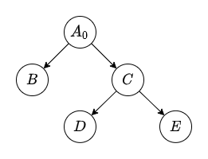
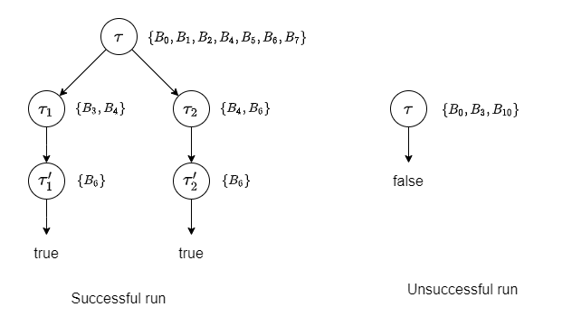
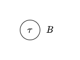
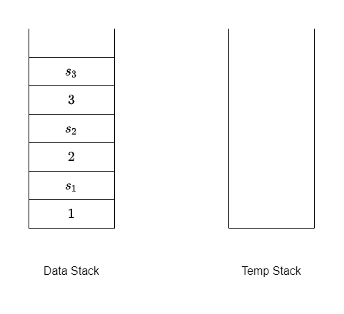
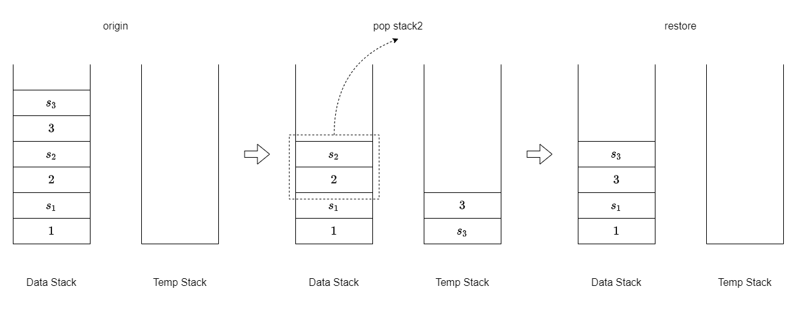

# Assignment 3

## 201300035 方盛俊

## Question 1. Termination

Let $C$ be the original $\mathcal{ALC}$-concept. If there is a rule that can be applied, so there is a subconcept $\lnot D$ of $C$, and $D$ is not a concept name. Let $C'$ be the $\mathcal{ALC}$-concept after rule application.

- Assumed $\lnot D = \lnot (E \sqcap F)$, then $M(\lnot (E \sqcap F)) = \{ \#(E \sqcap F) \} \cup M(E) \cup M(F)$ and $M(\lnot \lnot \lnot E \sqcup \lnot \lnot \lnot F) = \{ \#(\lnot \lnot E), \#(\lnot E), \#E, \#(\lnot \lnot F), \#(\lnot F), \#F \} \cup M(E) \cup M(F)$. So $M(C') = (M(C) \setminus M(\lnot D)) \cup M(\lnot \lnot \lnot E \sqcup \lnot \lnot \lnot F) = (M(C) \setminus \{ \#(E \sqcap F) \}) \cup \{ \#(\lnot \lnot E), \#(\lnot E), \#E, \#(\lnot \lnot F), \#(\lnot F), \#F \}$. So there is a big number $\#(E \sqcap F)$ was converted to some small numbers like $\#(\lnot \lnot E)$.
- Assumed $\lnot D = \lnot (E \sqcup F)$, the proof is same with $\lnot (E \sqcap F)$. So there is a big number $\#(E \sqcup F)$ was converted to some small numbers like $\#(\lnot \lnot E)$.
- Assumed $\lnot D = \lnot \lnot E$, so $M(C') = (M(C) \setminus M(\lnot \lnot E)) \cup M(E) = M(C) \setminus \{ \#\lnot E, \#E \}$. So there are two number $\#\lnot E$ and $\#E$ were erased.
- Assumed $\lnot D = \lnot (\exists r.E)$, then $M(\lnot (\exists r.E)) = \{ \#(\exists r.E) \} \cup M(E)$ and $M(\forall r.\lnot E) = \{ \#E \} \cup M(E)$. So $M(C') = (M(C) \setminus M(\lnot (\exists r.E))) \cup M(\forall r.\lnot E) = (M(C) \setminus \{ \#(\exists r.E) \}) \cup \{ \#E \}$. So there is a big number $\#(\exists r.E)$ was converted to a small number $\#E$.
- Assumed $\lnot D = \lnot (\forall r.E)$, the proof is same with $\lnot (\exists r.E)$. So there is a big number $\#(\forall  r.E)$ was converted to a small number $\#E$.

With above proof, we can know that either a big number was converted to some small numbers or some numbers were erased. So the multiset $M(C')$ is decreasing continuously, until the elements of $M(C')$ are all zero and the number of zeros is minimal. The procedure of transformations is limited because the numbers are limited.

So it is terminable.

## Question 2. Normal form

**(a)**

**$\Rightarrow:$**

We replace $A \equiv C$ with $A \sqsubseteq C$ and $C \sqsubseteq A$ and then get $\mathcal{T}'$. We can know $\mathcal{T}$ and $\mathcal{T}'$ is equivalent.

Because $\mathcal{T}^{\sqsubseteq} \subseteq \mathcal{T}'$, so every model of $\mathcal{T}'$ is also model of $\mathcal{T}^{\sqsubseteq}$.

Thus every model of $\mathcal{T}$ is also model of $\mathcal{T}^{\sqsubseteq}$.

So if every concept name is satisfiable w.r.t. $\mathcal{T}$, then it is satisfiable w.r.t. $\mathcal{T}^{\sqsubseteq}$.

**$\Leftarrow:$**

Assume the concept name $A_0$ is satisfiable w.r.t. $\mathcal{T}^{\sqsubseteq}$, so there is a model $\mathcal{I}$ of $\mathcal{T}^{\sqsubseteq}$.

We need to construct a new model $\mathcal{J}$ from $\mathcal{I}$ to satisfy $A_0$ and $\mathcal{T}$.

Because $\mathcal{T}$ is a acyclic TBox in NNF, so we can use a tree-like structure i.e. DAG to represent the $T^{\sqsubseteq}$. For example, DAG of $\mathcal{T}^{\sqsubseteq} = \{ A_0 \sqsubseteq B \sqcup C, C \sqsubseteq D \sqcap \lnot E \}$ is like

and sinks $B, D, E$ are primitive concept names.

Intuitively, we expand $C^{\mathcal{I}}$ to fit $D^{\mathcal{I}} * E^{\mathcal{I}}$ by assigning $C^{\mathcal{I}'} = D^{\mathcal{I}} * E^{\mathcal{I}}$ from sinks to sources. And finally get the new model $\mathcal{J}$ of $\mathcal{T}$.

Definitively, for any inclusion $A \sqsubseteq C$, all concept names occuring in $C$ are the child nodes of $A$ node.

Let the $\mathcal{T}^{\sqsubseteq}$ be the form of $\{ A_i \sqsubseteq C_i \}$, without loss of generality and because $\mathcal{T}$ is acyclic, we can assume that the indices $\cdot_{i}$ are such that, if $A_i$ directly uses $A_j$, then $j < i$.

We define the following series of interpretations $\mathcal{I}_i$ as modifications of $\mathcal{I}$:

for each $i$, we set

- $\Delta^{\mathcal{I}_i} = \Delta^{\mathcal{I}}$
- $r^{\mathcal{I}_i} = r^{\mathcal{I}}$ for all role names in $\mathcal{T^{\sqsubseteq}}$, and
- $A^{\mathcal{I}_i} = A^{\mathcal{I}}$ for all primitive concept names in $\mathcal{T}^{\sqsubseteq}$, and

we fix the interpretation of defined concepts as follows:

- $A_1^{\mathcal{I}_1} = C_1^{\mathcal{I}}, A_j^{\mathcal{I}_1} = A_j^{\mathcal{I}}$ for all $j > 1$,
- $A_1^{\mathcal{I}_2} = A_1^{\mathcal{I}_1}, A_2^{\mathcal{I}_2} = C_2^{\mathcal{I}_1}, A_j^{\mathcal{I}_2} = A_j^{\mathcal{I}_1}$ for all $j > 2$,
- ...
- $A_1^{\mathcal{I}_k} = A_1^{\mathcal{I}_{k-1}}, A_2^{\mathcal{I}_k} = A_2^{\mathcal{I}_{k-1}}, \cdots, A_k^{\mathcal{I}_k} = C_k^{\mathcal{I}_{k-1}}$.

Now we prove that $\mathcal{I}_i$ is a model of $\mathcal{T}_i = \{ A_n \equiv C_n, A_m \sqsubseteq C_m \}$, where $1 \le n \le i$ and $i < m \le k$.

Let $\mathcal{T}_0 = \mathcal{T}^{\sqsubseteq}, \mathcal{I}_{0} = \mathcal{I}$, then we use induction to prove $\mathcal{I}_i$ is a model of $\mathcal{T}_i$, $0 \le i \le k$.

Basis: $\mathcal{I}_0$ is a model of $\mathcal{T}_0$.

Induction hypothesis: $\mathcal{I}_{i-1}$ is a model of $\mathcal{T}_{i-1}$.

Induction steps: we will prove $\mathcal{I}_{i}$ is a model of $\mathcal{T}_{i}$.

So we need to prove that $\mathcal{I}_i$ is a model of $\mathcal{T}_i = \{ A_n \equiv C_n, A_m \sqsubseteq C_m \}$, where $1 \le n \le i$ and $i < m \le k$.

We prove $\mathcal{I}_i$ is a model of $A_j \equiv C_j$, $1 \le j \le i$ firstly.

For $1 \le j < i$, $\mathcal{I}_i$ is a model of $A_j \equiv C_j$, because $\mathcal{I}_{i-1}$ is model of $\mathcal{T}_{i-1}$ by induction hypothesis and $A_j^{\mathcal{I}_i} = A_j^{\mathcal{I}_{i-1}}$.

For $j = i$, $\mathcal{I}_{i}$ is a model of $A_i \equiv C_i$, because we define $A_i^{\mathcal{I}_i} = C_i^{\mathcal{I}_{i-1}}$ and $A_i$ didn't directly use $A_i$ itself by acylicity of $\mathcal{T}_i$.

Then we need to prove $\mathcal{I}_i$ is also model of $\{ A_j \sqsubseteq C_j \}, j > i$.

If $C_j$ doesn't directly use $A_i$, the expansion of $A_i$ doesn't affect $A_j \sqsubseteq C_j$ obviously.

If $C_j$ directly uses $A_i$, we need to prove $C_j^{\mathcal{I_{i-1}}} \subseteq C_j^{\mathcal{I}_i}$, so that $A_j^{\mathcal{I}_i} \subseteq C_j^{\mathcal{I_i}}$ because of $A_j^{\mathcal{I}_i} \subseteq C_j^{\mathcal{I}_{i-1}} \subseteq C_j^{\mathcal{I_i}}$, where there is $A_j^{\mathcal{I}_i} \subseteq C_j^{\mathcal{I}_{i-1}}$ because $A_j^{\mathcal{I}_i} = A_j^{\mathcal{I}_{i-1}}$ and induction hypothesis.

We know $A_i^{\mathcal{I}_{i-1}} \subseteq A_i^{\mathcal{I}_i}$ because of $A_i^{\mathcal{I}_{i-1}} \subseteq C_{i}^{\mathcal{I}_{i-1}} = A_i^{\mathcal{I}_i}$

Because $C_j$ directly use $A_i$, so there is a subconcept $C$ of $C_j$ and

- Assume $C = A_i \sqcap D$, so $C^{\mathcal{I}} = A_i^{\mathcal{I}} \cap D^{\mathcal{I}} \subseteq A_i^{\mathcal{I}_i} \cap D^{\mathcal{I}_i} = C^{\mathcal{I}_i}$, i. e. $C^{\mathcal{I}} \subseteq C^{\mathcal{I}_i}$. It is same with case $C = D \sqcap A_i$.
- Assume $C = A_i \sqcup D$, so $C^{\mathcal{I}} = A_i^{\mathcal{I}} \cup D^{\mathcal{I}} \subseteq A_i^{\mathcal{I}_i} \cup D^{\mathcal{I}_i} = C^{\mathcal{I}_i}$, i. e. $C^{\mathcal{I}} \subseteq C^{\mathcal{I}_i}$. It is same with case $C = D \sqcup A_i$.
- Assume $C = \exists r.A_i$, so $C^{\mathcal{I}} = \exists r.A_i^{\mathcal{I}} \subseteq \exists r.A^{\mathcal{I}_i} = C^{\mathcal{I}_i}$, i. e. $C^{\mathcal{I}} \subseteq C^{\mathcal{I}_i}$.
- Assume $C = \forall r.A_i$, so $C^{\mathcal{I}} = \forall r.A_i^{\mathcal{I}} \subseteq \forall r.A^{\mathcal{I}_i} = C^{\mathcal{I}_i}$, i. e. $C^{\mathcal{I}} \subseteq C^{\mathcal{I}_i}$.

Because of NNF, there is no form $C = \lnot A_i$, as $A_i$ is not a primitive concept name.

Using the same induction procedure by replacing $A_i$ with $C$, we can know that $C_j^{\mathcal{I}_{i-1}} \subseteq C_j^{\mathcal{I}_i}$ finally, so that $A_j^{\mathcal{I}_i} \subseteq C_j^{\mathcal{I}_i}$ because of $A_j^{\mathcal{I}_i} \subseteq C_j^{\mathcal{I}_{i-1}} \subseteq C_j^{\mathcal{I}_i}$.

By the above proof with induction, we can know that $\mathcal{I}_i$ is a model of $\mathcal{T}_i = \{ A_n \equiv C_n, A_m \sqsubseteq C_m \}$, where $0 \le n \le i$ and $i < m \le k$.

So we can know $\mathcal{J} = \mathcal{I}_k$ is a model of $\{ A_i \equiv C_i \}$ i.e. $\mathcal{T}$.

Because for any concept name $A_0$, we have $A_0^{\mathcal{I}} \subseteq A_0^{\mathcal{I}_k}$ by the induction procedure, and $A_0^{\mathcal{I}}$ is not empty set as $A_0$ is satisfiable w.r.t. $\mathcal{T}^{\sqsubseteq}$, so $A_0^{\mathcal{I}_k}$ is also a non-empty set.

So concept name $A_0$ is also satisfiable w.r.t. $\mathcal{T}$.

**(b)**

Let $\mathcal{T} = \{ A \equiv C \sqcap \lnot B, B \equiv P, C \equiv P \}$, and so $\mathcal{T}^{\sqsubseteq} = \{ A \sqsubseteq C \sqcap \lnot B, B \sqsubseteq P, C \sqsubseteq P \}$.

We can know $A^{\mathcal{I}} = (C \sqcap \lnot B)^{\mathcal{I}} = C^{\mathcal{I}} \cap (\Delta^{\mathcal{I}} \setminus B^{\mathcal{I}}) = P^{\mathcal{I}} \cap (\Delta^{\mathcal{I}} \setminus P^{\mathcal{I}}) = \empty$ for any model $\mathcal{I}$ of $\mathcal{T}$. So concept name $\mathcal{A}$ is not satisfiable w.r.t. $\mathcal{T}$.

Let $\Delta^{\mathcal{I}} = \{ a \}, A^{\mathcal{I}} = \{ a \}, C^{\mathcal{I}} = \{ a \}, B^{\mathcal{I}} = \empty, P^{\mathcal{I}} = \{ a \}$, and it satisfies $T^{\sqsubseteq}$, because $A^{\mathcal{I}} \subseteq C^{\mathcal{I}} \cap (\Delta^{\mathcal{I}} \setminus B^{\mathcal{I}})$, $B^{\mathcal{I}} \subseteq P^{\mathcal{I}}$ and $C^{\mathcal{I}} \subseteq P^{\mathcal{I}}$. So concept name $\mathcal{A}$ is satisfiable w.r.t. $\mathcal{T}^{\sqsubseteq}$.

This conclusion doesn't hold for the acyclic TBox $\{ A \equiv C \sqcap \lnot B, B \equiv P, C \equiv P \}$.

## Question 3. ALC-Worlds algorithm

**(a) Successful run**

**$\mathcal{ALC}$-$\mathrm{worlds}(B_0, \mathcal{T})$:**

$\operatorname{rd}(B_0) = 0, \operatorname{rd}(B_1) = 1, \operatorname{rd}(B_2) = 2, \operatorname{rd}(B_3) = 0, \operatorname{rd}(B_4) = 1, \operatorname{rd}(B_5) = 2, \operatorname{rd}(B_6) = 0, \operatorname{rd}(B_7) = 2, \operatorname{rd}(B_8) = 2, \operatorname{rd}(B_9) = 1, \operatorname{rd}(B_{10}) = 0$

$i = \operatorname{rd}(B_0) = \max(1, \max(1, 2)) = 2$

$\tau = \{ B_0, B_1, B_2, B_4, B_5, B_6, B_7 \}$

**recurse$(\tau, 2, \mathcal{T})$:**

$\tau$ is a type for $\mathcal{T}$.

for $B_1 \in \tau$ with $B_1 \equiv \exists r.B_3$ do:

$S = \{ B_3 \} \cup \{ B_4 \} = \{ B_3, B_4 \}$

$\tau_1 = \{ B_3, B_4 \}$

recurse$(\tau_1, 1, \mathcal{T})$:

$S = \{ B_6 \} \cup \empty, \tau_1' = \{ B_6 \}$

recurse$(\tau_1', 0, \mathcal{T})$ return true

for $B_4 \in \tau$ with $B_4 \equiv \exists r.B_6$ do:

$S = \{ B_6 \} \cup \{ B_4 \} = \{ B_4, B_6 \}$

$\tau_2 = \{ B_4, B_6 \}$

recurse$(\tau_2, 1, \mathcal{T})$:

$S = \{ B_6 \} \cup \empty, \tau_2' = \{ B_6 \}$

recurse$(\tau_2', 0, \mathcal{T})$ return true

**(b) Unsuccessful run**

**$\mathcal{ALC}$-$\mathrm{worlds}(B_0, \mathcal{T})$:**

$i = \operatorname{rd}(B_0) = \max(1, \max(1, 2)) = 2$

$\tau = \{ B_0, B_3, B_{10} \}$

**recurse$(\tau, 1, \mathcal{T})$:**

$\tau$ is not a type for $\mathcal{T}$ because $B_3 \in \tau, B_{10} \in \tau$ but $B_3 \equiv P$ and $B \equiv \lnot P$

then return false

**(c) result**

Because there is a successful run, the algorithm return a positive result.

## Question 4. ALC-Elim algorithm

**(a)**

$C_{\mathcal{T}}$ = (((¬B⊔∃r.B)⊓B)⊓(∃r.¬B⊔∃r.B))

$\operatorname{sub}(\mathcal{T})$ = {(¬B⊔∃r.B), ∃r.¬B, B, ∃r.B, (∃r.¬B⊔∃r.B), ¬B, ((¬B⊔∃r.B)⊓B), (((¬B⊔∃r.B)⊓B)⊓(∃r.¬B⊔∃r.B))}

$i$ = 2.

There is 2 types in $\Gamma_0$.

$\Gamma_0$ = [{(¬B⊔∃r.B), B, ∃r.B, (∃r.¬B⊔∃r.B), ((¬B⊔∃r.B)⊓B), (((¬B⊔∃r.B)⊓B)⊓(∃r.¬B⊔∃r.B))}, {(¬B⊔∃r.B), ∃r.¬B, B, ∃r.B, (∃r.¬B⊔∃r.B), ((¬B⊔∃r.B)⊓B), (((¬B⊔∃r.B)⊓B)⊓(∃r.¬B⊔∃r.B))}]

$\Gamma_1$ = [{(¬B⊔∃r.B), B, ∃r.B, (∃r.¬B⊔∃r.B), ((¬B⊔∃r.B)⊓B), (((¬B⊔∃r.B)⊓B)⊓(∃r.¬B⊔∃r.B))}]

$\Gamma_2$ = [{(¬B⊔∃r.B), B, ∃r.B, (∃r.¬B⊔∃r.B), ((¬B⊔∃r.B)⊓B), (((¬B⊔∃r.B)⊓B)⊓(∃r.¬B⊔∃r.B))}]

$\tau$ = {(∃r.¬B⊔∃r.B), B, (((¬B⊔∃r.B)⊓B)⊓(∃r.¬B⊔∃r.B)), ((¬B⊔∃r.B)⊓B), ∃r.B, (¬B⊔∃r.B)}

So $B$ is satisfiable. The satisfying model is

**(2)**

We replace $∀r.∀r.¬B$ with $C \sqsubseteq ∀r.∀r.¬B$.

$C_{\mathcal{T}}$ = ((((¬C⊔∀r.∀r.¬B)⊓(A⊔B))⊓(¬A⊔¬B))⊓∃r.¬A)

$\operatorname{sub}(\mathcal{T})$ = {(¬A⊔¬B), ¬A, (¬C⊔∀r.∀r.¬B), ∀r.∀r.¬B, C, A, ∃r.¬A, ((((¬C⊔∀r.∀r.¬B)⊓(A⊔B))⊓(¬A⊔¬B))⊓∃r.¬A), ¬B, B, (A⊔B), ¬C, ((¬C⊔∀r.∀r.¬B)⊓(A⊔B)), ∀r.¬B, (((¬C⊔∀r.∀r.¬B)⊓(A⊔B))⊓(¬A⊔¬B))}

$i$ = 3.

There is 16 types in $\Gamma_0$.

$\Gamma_0$ = [{(¬A⊔¬B), ¬A, (¬C⊔∀r.∀r.¬B), ∀r.∀r.¬B, ∃r.¬A, ((((¬C⊔∀r.∀r.¬B)⊓(A⊔B))⊓(¬A⊔¬B))⊓∃r.¬A), B, ((¬C⊔∀r.∀r.¬B)⊓(A⊔B)), (A⊔B), (((¬C⊔∀r.∀r.¬B)⊓(A⊔B))⊓(¬A⊔¬B))}, {(¬A⊔¬B), ¬A, (¬C⊔∀r.∀r.¬B), ∃r.¬A, ((((¬C⊔∀r.∀r.¬B)⊓(A⊔B))⊓(¬A⊔¬B))⊓∃r.¬A), B, ¬C, ((¬C⊔∀r.∀r.¬B)⊓(A⊔B)), (A⊔B), (((¬C⊔∀r.∀r.¬B)⊓(A⊔B))⊓(¬A⊔¬B))}, {(¬A⊔¬B), (¬C⊔∀r.∀r.¬B), A, ∃r.¬A, ∀r.∀r.¬B, ((((¬C⊔∀r.∀r.¬B)⊓(A⊔B))⊓(¬A⊔¬B))⊓∃r.¬A), ¬B, ((¬C⊔∀r.∀r.¬B)⊓(A⊔B)), (A⊔B), (((¬C⊔∀r.∀r.¬B)⊓(A⊔B))⊓(¬A⊔¬B))}, {(¬A⊔¬B), (¬C⊔∀r.∀r.¬B), A, ∃r.¬A, ((((¬C⊔∀r.∀r.¬B)⊓(A⊔B))⊓(¬A⊔¬B))⊓∃r.¬A), ¬B, ¬C, ((¬C⊔∀r.∀r.¬B)⊓(A⊔B)), (A⊔B), (((¬C⊔∀r.∀r.¬B)⊓(A⊔B))⊓(¬A⊔¬B))}, {(¬A⊔¬B), ¬A, (¬C⊔∀r.∀r.¬B), ∀r.∀r.¬B, C, ∃r.¬A, ((((¬C⊔∀r.∀r.¬B)⊓(A⊔B))⊓(¬A⊔¬B))⊓∃r.¬A), B, ((¬C⊔∀r.∀r.¬B)⊓(A⊔B)), (A⊔B), (((¬C⊔∀r.∀r.¬B)⊓(A⊔B))⊓(¬A⊔¬B))}, {(¬A⊔¬B), ¬A, (¬C⊔∀r.∀r.¬B), ∀r.∀r.¬B, ∃r.¬A, ((((¬C⊔∀r.∀r.¬B)⊓(A⊔B))⊓(¬A⊔¬B))⊓∃r.¬A), B, ¬C, ((¬C⊔∀r.∀r.¬B)⊓(A⊔B)), (A⊔B), (((¬C⊔∀r.∀r.¬B)⊓(A⊔B))⊓(¬A⊔¬B))}, {(¬A⊔¬B), ¬A, (¬C⊔∀r.∀r.¬B), ∀r.∀r.¬B, ∃r.¬A, ((((¬C⊔∀r.∀r.¬B)⊓(A⊔B))⊓(¬A⊔¬B))⊓∃r.¬A), B, ∀r.¬B, ((¬C⊔∀r.∀r.¬B)⊓(A⊔B)), (A⊔B), (((¬C⊔∀r.∀r.¬B)⊓(A⊔B))⊓(¬A⊔¬B))}, {(¬A⊔¬B), ¬A, (¬C⊔∀r.∀r.¬B), ∃r.¬A, ((((¬C⊔∀r.∀r.¬B)⊓(A⊔B))⊓(¬A⊔¬B))⊓∃r.¬A), B, ∀r.¬B, ¬C, ((¬C⊔∀r.∀r.¬B)⊓(A⊔B)), (A⊔B), (((¬C⊔∀r.∀r.¬B)⊓(A⊔B))⊓(¬A⊔¬B))}, {(¬A⊔¬B), (¬C⊔∀r.∀r.¬B), A, C, ∀r.∀r.¬B, ∃r.¬A, ((((¬C⊔∀r.∀r.¬B)⊓(A⊔B))⊓(¬A⊔¬B))⊓∃r.¬A), ¬B, ((¬C⊔∀r.∀r.¬B)⊓(A⊔B)), (A⊔B), (((¬C⊔∀r.∀r.¬B)⊓(A⊔B))⊓(¬A⊔¬B))}, {(¬A⊔¬B), (¬C⊔∀r.∀r.¬B), A, ∃r.¬A, ∀r.∀r.¬B, ((((¬C⊔∀r.∀r.¬B)⊓(A⊔B))⊓(¬A⊔¬B))⊓∃r.¬A), ¬B, ¬C, ((¬C⊔∀r.∀r.¬B)⊓(A⊔B)), (A⊔B), (((¬C⊔∀r.∀r.¬B)⊓(A⊔B))⊓(¬A⊔¬B))}, {(¬A⊔¬B), (¬C⊔∀r.∀r.¬B), A, ∃r.¬A, ∀r.∀r.¬B, ((((¬C⊔∀r.∀r.¬B)⊓(A⊔B))⊓(¬A⊔¬B))⊓∃r.¬A), ¬B, ∀r.¬B, ((¬C⊔∀r.∀r.¬B)⊓(A⊔B)), (A⊔B), (((¬C⊔∀r.∀r.¬B)⊓(A⊔B))⊓(¬A⊔¬B))}, {(¬A⊔¬B), (¬C⊔∀r.∀r.¬B), A, ∃r.¬A, ((((¬C⊔∀r.∀r.¬B)⊓(A⊔B))⊓(¬A⊔¬B))⊓∃r.¬A), ¬B, ∀r.¬B, ¬C, ((¬C⊔∀r.∀r.¬B)⊓(A⊔B)), (A⊔B), (((¬C⊔∀r.∀r.¬B)⊓(A⊔B))⊓(¬A⊔¬B))}, {(¬A⊔¬B), ¬A, (¬C⊔∀r.∀r.¬B), ∀r.∀r.¬B, C, ∃r.¬A, ((((¬C⊔∀r.∀r.¬B)⊓(A⊔B))⊓(¬A⊔¬B))⊓∃r.¬A), B, ∀r.¬B, ((¬C⊔∀r.∀r.¬B)⊓(A⊔B)), (A⊔B), (((¬C⊔∀r.∀r.¬B)⊓(A⊔B))⊓(¬A⊔¬B))}, {(¬A⊔¬B), ¬A, (¬C⊔∀r.∀r.¬B), ∀r.∀r.¬B, ∃r.¬A, ((((¬C⊔∀r.∀r.¬B)⊓(A⊔B))⊓(¬A⊔¬B))⊓∃r.¬A), B, ∀r.¬B, ¬C, ((¬C⊔∀r.∀r.¬B)⊓(A⊔B)), (A⊔B), (((¬C⊔∀r.∀r.¬B)⊓(A⊔B))⊓(¬A⊔¬B))}, {(¬A⊔¬B), (¬C⊔∀r.∀r.¬B), A, C, ∀r.∀r.¬B, ∃r.¬A, ((((¬C⊔∀r.∀r.¬B)⊓(A⊔B))⊓(¬A⊔¬B))⊓∃r.¬A), ¬B, ∀r.¬B, ((¬C⊔∀r.∀r.¬B)⊓(A⊔B)), (A⊔B), (((¬C⊔∀r.∀r.¬B)⊓(A⊔B))⊓(¬A⊔¬B))}, {(¬A⊔¬B), (¬C⊔∀r.∀r.¬B), A, ∃r.¬A, ∀r.∀r.¬B, ((((¬C⊔∀r.∀r.¬B)⊓(A⊔B))⊓(¬A⊔¬B))⊓∃r.¬A), ¬B, ∀r.¬B, ¬C, ((¬C⊔∀r.∀r.¬B)⊓(A⊔B)), (A⊔B), (((¬C⊔∀r.∀r.¬B)⊓(A⊔B))⊓(¬A⊔¬B))}]

$\Gamma_1$ = [{(¬A⊔¬B), ¬A, (¬C⊔∀r.∀r.¬B), ∀r.∀r.¬B, ∃r.¬A, ((((¬C⊔∀r.∀r.¬B)⊓(A⊔B))⊓(¬A⊔¬B))⊓∃r.¬A), B, ((¬C⊔∀r.∀r.¬B)⊓(A⊔B)), (A⊔B), (((¬C⊔∀r.∀r.¬B)⊓(A⊔B))⊓(¬A⊔¬B))}, {(¬A⊔¬B), ¬A, (¬C⊔∀r.∀r.¬B), ∃r.¬A, ((((¬C⊔∀r.∀r.¬B)⊓(A⊔B))⊓(¬A⊔¬B))⊓∃r.¬A), B, ¬C, ((¬C⊔∀r.∀r.¬B)⊓(A⊔B)), (A⊔B), (((¬C⊔∀r.∀r.¬B)⊓(A⊔B))⊓(¬A⊔¬B))}, {(¬A⊔¬B), (¬C⊔∀r.∀r.¬B), A, ∃r.¬A, ∀r.∀r.¬B, ((((¬C⊔∀r.∀r.¬B)⊓(A⊔B))⊓(¬A⊔¬B))⊓∃r.¬A), ¬B, ((¬C⊔∀r.∀r.¬B)⊓(A⊔B)), (A⊔B), (((¬C⊔∀r.∀r.¬B)⊓(A⊔B))⊓(¬A⊔¬B))}, {(¬A⊔¬B), (¬C⊔∀r.∀r.¬B), A, ∃r.¬A, ((((¬C⊔∀r.∀r.¬B)⊓(A⊔B))⊓(¬A⊔¬B))⊓∃r.¬A), ¬B, ¬C, ((¬C⊔∀r.∀r.¬B)⊓(A⊔B)), (A⊔B), (((¬C⊔∀r.∀r.¬B)⊓(A⊔B))⊓(¬A⊔¬B))}, {(¬A⊔¬B), ¬A, (¬C⊔∀r.∀r.¬B), ∀r.∀r.¬B, C, ∃r.¬A, ((((¬C⊔∀r.∀r.¬B)⊓(A⊔B))⊓(¬A⊔¬B))⊓∃r.¬A), B, ((¬C⊔∀r.∀r.¬B)⊓(A⊔B)), (A⊔B), (((¬C⊔∀r.∀r.¬B)⊓(A⊔B))⊓(¬A⊔¬B))}, {(¬A⊔¬B), ¬A, (¬C⊔∀r.∀r.¬B), ∀r.∀r.¬B, ∃r.¬A, ((((¬C⊔∀r.∀r.¬B)⊓(A⊔B))⊓(¬A⊔¬B))⊓∃r.¬A), B, ¬C, ((¬C⊔∀r.∀r.¬B)⊓(A⊔B)), (A⊔B), (((¬C⊔∀r.∀r.¬B)⊓(A⊔B))⊓(¬A⊔¬B))}, {(¬A⊔¬B), (¬C⊔∀r.∀r.¬B), A, C, ∀r.∀r.¬B, ∃r.¬A, ((((¬C⊔∀r.∀r.¬B)⊓(A⊔B))⊓(¬A⊔¬B))⊓∃r.¬A), ¬B, ((¬C⊔∀r.∀r.¬B)⊓(A⊔B)), (A⊔B), (((¬C⊔∀r.∀r.¬B)⊓(A⊔B))⊓(¬A⊔¬B))}, {(¬A⊔¬B), (¬C⊔∀r.∀r.¬B), A, ∃r.¬A, ∀r.∀r.¬B, ((((¬C⊔∀r.∀r.¬B)⊓(A⊔B))⊓(¬A⊔¬B))⊓∃r.¬A), ¬B, ¬C, ((¬C⊔∀r.∀r.¬B)⊓(A⊔B)), (A⊔B), (((¬C⊔∀r.∀r.¬B)⊓(A⊔B))⊓(¬A⊔¬B))}]

$\Gamma_2$ = [{(¬A⊔¬B), ¬A, (¬C⊔∀r.∀r.¬B), ∃r.¬A, ((((¬C⊔∀r.∀r.¬B)⊓(A⊔B))⊓(¬A⊔¬B))⊓∃r.¬A), B, ¬C, ((¬C⊔∀r.∀r.¬B)⊓(A⊔B)), (A⊔B), (((¬C⊔∀r.∀r.¬B)⊓(A⊔B))⊓(¬A⊔¬B))}, {(¬A⊔¬B), (¬C⊔∀r.∀r.¬B), A, ∃r.¬A, ((((¬C⊔∀r.∀r.¬B)⊓(A⊔B))⊓(¬A⊔¬B))⊓∃r.¬A), ¬B, ¬C, ((¬C⊔∀r.∀r.¬B)⊓(A⊔B)), (A⊔B), (((¬C⊔∀r.∀r.¬B)⊓(A⊔B))⊓(¬A⊔¬B))}]

$\Gamma_3$ = [{(¬A⊔¬B), ¬A, (¬C⊔∀r.∀r.¬B), ∃r.¬A, ((((¬C⊔∀r.∀r.¬B)⊓(A⊔B))⊓(¬A⊔¬B))⊓∃r.¬A), B, ¬C, ((¬C⊔∀r.∀r.¬B)⊓(A⊔B)), (A⊔B), (((¬C⊔∀r.∀r.¬B)⊓(A⊔B))⊓(¬A⊔¬B))}, {(¬A⊔¬B), (¬C⊔∀r.∀r.¬B), A, ∃r.¬A, ((((¬C⊔∀r.∀r.¬B)⊓(A⊔B))⊓(¬A⊔¬B))⊓∃r.¬A), ¬B, ¬C, ((¬C⊔∀r.∀r.¬B)⊓(A⊔B)), (A⊔B), (((¬C⊔∀r.∀r.¬B)⊓(A⊔B))⊓(¬A⊔¬B))}]

There is no $\tau \in \Gamma_3$ that $C \in \tau$.

So $C$ i.e. $∀r.∀r.¬B$ is unsatisfiable.

## Question 5. Finite Boolean games

**(a)**

We calculate the truth table:

| $q_1$ | $q_2$ | $q_3$ | $q_4$ | $((q_1 ∧ q_3) → ¬q_2) ∧ (¬q_1 → q_1) ∧ (¬q_2 → (q_3 ∨ q_4))$ |
|---|---|---|---|---|
| 0 | 0 | 0 | 0 | 0 |
| 0 | 0 | 0 | 1 | 0 |
| 0 | 0 | 1 | 0 | 0 |
| 0 | 0 | 1 | 1 | 0 |
| 0 | 1 | 0 | 0 | 0 |
| 0 | 1 | 0 | 1 | 0 |
| 0 | 1 | 1 | 0 | 0 |
| 0 | 1 | 1 | 1 | 0 |
| 1 | 0 | 0 | 0 | 0 |
| 1 | 0 | 0 | 1 | 1 |
| 1 | 0 | 1 | 0 | 1 |
| 1 | 0 | 1 | 1 | 1 |
| 1 | 1 | 0 | 0 | 1 |
| 1 | 1 | 0 | 1 | 1 |
| 1 | 1 | 1 | 0 | 0 |
| 1 | 1 | 1 | 1 | 0 |

So there is a winning strategy:

**(b)**

We calculate the truth table:

| $q_1$ | $q_2$ | $q_3$ | $q_4$ | $(q_1 ∨ ¬q_2) ∧ (q_2 ∨ q_3) ∧ (¬q_3 ∨ ¬q_4) ∧ (¬q_1 ∨ ¬q_2 ∨ q_3 ∨ q_4)$ |
|---|---|---|---|---|
| 0 | 0 | 0 | 0 | 0 |
| 0 | 0 | 0 | 1 | 0 |
| 0 | 0 | 1 | 0 | 1 |
| 0 | 0 | 1 | 1 | 0 |
| 0 | 1 | 0 | 0 | 0 |
| 0 | 1 | 0 | 1 | 0 |
| 0 | 1 | 1 | 0 | 0 |
| 0 | 1 | 1 | 1 | 0 |
| 1 | 0 | 0 | 0 | 0 |
| 1 | 0 | 0 | 1 | 0 |
| 1 | 0 | 1 | 0 | 1 |
| 1 | 0 | 1 | 1 | 0 |
| 1 | 1 | 0 | 0 | 0 |
| 1 | 1 | 0 | 1 | 1 |
| 1 | 1 | 1 | 0 | 1 |
| 1 | 1 | 1 | 1 | 0 |

If we assign $q_1 = 0$, there is only one word $t = 0010$ that satisfies $\varphi$.

If we assign $q_2 = 1$, there are three words $t_1 = 1010$, $t_2 = 1101$, $t_3 = 1110$ that satisfy $\varphi$. The number of words is less than 4 so the leaves of any tree of strategy are not all true for $\varphi$.

So Player 1 doesn't have a winning strategy.

## Question 6. Infinite Boolean games

**(a)**

There is a winning strategy for Player 1, so Player 2 has no winning strategy.

In spite of any operations of Player 2, we can assign $x_2 = \text{True}$ and $x_3 = \text{True}$ in the previous two turn of Player 1.

After assigning, $y_1 = \text{False}$ or $y_2 = \text{False}$, otherwise $(\lnot (x_1 \lor x_4) \land y_1 \land y_2) = \text{True}$ and Player 1 wins.

If $y_1 = \text{False}$, we can let $x_1 = \text{True}$ and then $(x_1 \land x_2 \land \lnot y_1) = \text{True}$, so Player 1 wins.

If $y_2 = \text{False}$, we can let $x_4 = \text{True}$ and then $(x_3 \land x_4 \land \lnot y_2) = \text{True}$, so Player 1 wins.

So Player 2 has no winning strategy.

**(b)**

| $x_1$ | $x_2$ | $y_1$ | $y_2$ | $\phi$ |
|---|---|---|---|---|
| 0 | 0 | 0 | 0 | 0 |
| 0 | 0 | 0 | 1 | 0 |
| 0 | 0 | 1 | 0 | 0 |
| 0 | 0 | 1 | 1 | 0 |
| 0 | 1 | 0 | 0 | 0 |
| 0 | 1 | 0 | 1 | 1 |
| 0 | 1 | 1 | 0 | 0 |
| 0 | 1 | 1 | 1 | 0 |
| 1 | 0 | 0 | 0 | 0 |
| 1 | 0 | 0 | 1 | 1 |
| 1 | 0 | 1 | 0 | 1 |
| 1 | 0 | 1 | 1 | 0 |
| 1 | 1 | 0 | 0 | 0 |
| 1 | 1 | 0 | 1 | 0 |
| 1 | 1 | 1 | 0 | 0 |
| 1 | 1 | 1 | 1 | 0 |

We calculate the truth table and we find that when $y_1 = 0$ and $y_2 = 0$, $\phi$ is impossible to be true.

Player 2 doesn't need to do any thing, i.e. doesn't flip any variances in all its turns, then wins the infinite Boolean game.

So Player 2 has a winning strategy.

## Question 7. Infinite Boolean games

**(a)**

It is still EXPTIME-hard.

Just swap all trues and falses in the game and it will be the original infinite boolean game, vice versa. So the modified infinite boolean game and original infinite boolean game can be transformed into each other, they are equivalent.

**(b)**

It is still EXPTIME-hard.

Let Player 2 starts its turn and there are $|\Gamma_2| + 1$ result configurations $(1, t_{i})$ and the game can be converted to $|\Gamma_2| + 1$ original boolean games with initial configurations $(1, t_{i})$, vice versa.

So the modified infinite boolean game and original infinite boolean game can be transformed into each other, they are equivalent.

**(c)**

It is not EXPTIME-hard.

If the initial configuration satisfies formula $\phi$ or its a $\Gamma_1$-variation satisfies $\phi$, then Player 1 wins.

If the initial configuration and $\Gamma_1$-variation doesn't satisfy formula $\phi$, then Player 2 wins. Because Player 2 can re-flip the variable that Player 1 fliped to make sure that configuration to be same with initial configuration.

So we just need to verify all truth values of the initial configuration and its $\Gamma_1$-variation, and the problem can be solved in PTIME. Thus it is not EXPTIME-hard.

## Question 8. Complexity of concept satisfiability in ALC extensions

We first prove that concept satisfiability in $\mathcal{ALC}^{u}$ without TBoxes is EXPTIME-hard.

We reduce satisfiability of $\mathcal{ALC}$ concepts with respect to general TBoxes. Let $C$ be an $\mathcal{ALC}$ concept and $\mathcal{T}$ a general $\mathcal{ALC}$ TBox. Construct an $\mathcal{ALC}^{u}$ concept

$D = C \sqcap \forall u.(\underset{E \sqsubseteq F \in \mathcal{T}}{\Large \sqcap} \lnot E \sqcup F)$

Then $C$ is satisfiable with respect to $\mathcal{T}$ if and only if $D$ is satisfiable.

**$\Rightarrow:$**

Let $\mathcal{I}$ be a model of $C$ and $\mathcal{T}$, and let $d_0 \in C^{\mathcal{I}}$. Because $E^{\mathcal{I}} \subseteq F^{\mathcal{I}}$ for all $E \sqsubseteq F \in \mathcal{T}$, there is that $\Delta^{\mathcal{I}} \subseteq (\lnot E \sqcup F)^{\mathcal{I}}$, and then $d_0 \in (\forall u.(\underset{E \sqsubseteq F \in \mathcal{T}}{\Large \sqcap} \lnot E \sqcup F))^{\mathcal{I}} = (\forall u.\top)^{\mathcal{I}} = \Delta^{\mathcal{I}}$.

So $\mathcal{I}$ is also a model of $D$ and $D$ is satisfiable.

**$\Leftarrow:$**

Let $\mathcal{I}$ be a model of $D$, and $d_0 \in \Delta^{\mathcal{I}}$.

For any $d \in \Delta^{\mathcal{I}}$, because $(d_0, d) \in u^{\mathcal{I}}$, there are $d \in (\underset{E \sqsubseteq F \in \mathcal{T}}{\Large \sqcap} \lnot E \sqcup F)^{\mathcal{I}}$ i.e. $d \in (\lnot E \sqcup F)^{\mathcal{I}}$ for any $E \sqsubseteq F \in \mathcal{T}$.

So for any $d \in E^{\mathcal{I}}$ and $E \sqsubseteq F \in \mathcal{T}$, there is $d \in F^{\mathcal{I}}$ because $d \in (\lnot E \sqcup F)^{\mathcal{I}}$.

So $\mathcal{I}$ is also a model of $C$ and $C$ is satisfiable.

Because satisfiability of $\mathcal{ALC}$ concepts with respect to general TBoxes is EXPTIME-complete, so concept satisfiability in $\mathcal{ALC}^{u}$ without TBoxes is EXPTIME-hard.

Now we prove that concept satisfiability in $\mathcal{ALC}^{u}$ without TBoxes is EXPTIME problem, because it have a EXPTIME upper bound.

We modify the $ALC$-Elim algorithm to $ALC^{u}$-Elim algorithm.

It is not necessary to modify the definition of type. We only need to modify the definition of "bad" of a type.

Let $\Gamma$ be a set of types and $\tau \in \Gamma$. Then $\tau$ is bad in $\Gamma$

if there exists an $\exists r.C \in \tau$ such that the set $S = {C} \cup \{ D| \forall r.D \in \tau \}$ is no subset of any type in $\Gamma$, where $r$ is a normal role and it is not $u$;

or if there exist an $\exists u.D \in \tau$ such that $\{ D \}$ is no subset of any type in $\Gamma$;

or if there exist an $\forall u.D \in \tau$ and there a type $\tau' \in \Gamma$ with $D \not \in \tau'$.

And we perform the $ALU^{u}$-Elim algorithm like $ALU$-Elim algorithm.

Now we prove that there a model $\mathcal{I}$, where $\Delta^{\mathcal{I}} = \Gamma_i, A^{\mathcal{I}} = \{ \tau \in \Gamma_i | A \in \tau \}, r^{\mathcal{I}} = \{ (\tau, \tau') \in \Gamma_i \times \Gamma_i | \forall r.C \in \tau \text{ implies } C \in \tau' \}$.

We only do the cases $C = \exists u.D$ and $C = \forall u.D$ explicitly.

- Let $\exists u.D \in \tau$. Since $\tau$ has not been eliminated from $\Gamma_i$, it is not bad. Thus, there is a $\tau' \in \Gamma$, such that $\{ D \} \subseteq \tau'$. Because we have $(\tau'', \tau') \in u^{\mathcal{I}}$ for any type $\tau''$, we obtain $\tau'' \in (\exists r.D)^{\mathcal{I}}$ by the semantics, and it also includes $\tau \in (\exists r.D)^{\mathcal{I}}$.
- Let $\forall u.D \in \tau$. Since $\tau$ has not been eliminated from $\Gamma_i$, it is not bad. Thus, there is $D \in \tau'$ for all type $\tau'$, we obtain $\tau' \in D^{\mathcal{I}}$ and $\tau' \in (\forall u.D)^{\mathcal{I}}$ by the semantics, and it also include $\tau \in D$ and $\tau \in (\forall u.D)^{\mathcal{I}}$.

Then we prove if there is a model $\mathcal{I}$, the algorithm returns "true". 

For any $d \in \Delta^{\mathcal{I}}$, set $\operatorname{tp}(d) = \{ C \in \operatorname{sub}(\mathcal{T}) | d \in C^{\mathcal{I}} \}$, $\Psi = \{ \operatorname{tp}(d) | d \in \Delta^{\mathcal{I}} \}$ and $\Gamma_0, \Gamma_1, \cdots, \Gamma_{k}$ are the sequence of type sets computed by algorithm. It is possible to prove by induction on $i$ that no type from $\Psi$ is ever eliminated from any set $\Gamma_i$, for $i \le k$. So the algorithm return "true".

So it is EXPTIME problem. Thus concept satisfiability in $\mathcal{ALC}^{u}$ without TBoxes is EXPTIME-complete.

## Question 9. Tree model property in ALC extensions

Let $\mathcal{T} = \{ \exists \lnot r.\top \sqsubseteq \bot \}$.

Therefore $r^{\mathcal{I}} = \Delta^{\mathcal{I}} \times \Delta^{\mathcal{I}}$ for any model of $\mathcal{T}$, and there is no such root node $r$ such that $r$ has no any parent.

So $ALC^{\lnot}$ does not have the tree model property.

## Question 11 (with 1 bonus mark). Pushdown automata

**(a)**

Let $B = \{ 0^{k}1^{k}2^{k} | k \ge 0 \}$. We will show that $B$ isn't a CFL so that it can't be recognized by 1-PDAs. And then we will show that $B$ can be recognized by 2-PDAs.

Assumed that $B$ is a CFL.

By the CFL pumping lemma, it gives a $p$ so that (i) $uv^{i}xy^{i}z \in A$ for all $i \ge 0$, (ii) $vy \neq \varepsilon$ and (iii) $|vxy| \le p$.

We let $s = 0^{p}1^{p}2^{p} \in B$.

Condition (iii) implies that $vxy$ does not overlap tree kinds of number $1, 2$ and $3$, just one or two kinds of the tree kinds of number, like $0, 1$ or $1, 2$.

Therefore, in $uv^{2}xy^{2}z$, there are $0$s, $1$s and $2$s with unequal length. So $uv^{2}xy^{2}z \not \in B$ violating Condition (i).

Thus $B$ is not a CFL, it can not be recognized by 1-PDAs.

Now we prove that $B$ can be recognized by 2-PDAs.

1. Read 0s from input, push onto stack1 until read 1.
2. Read 1s from input, push onto stack2 until read 2.
3. Read 2s from input, while poping 0s from stack1 and poping 1s from stack2.
4. Enter accept state if stack is empty.

So $B$ can be recognized by 2-PDAs.

Thus 2-PDAs are more powerful than 1-PDAs.

**(b)**

We use two stacks to simulate three stacks.

For any 3-PDA with $Q, \Sigma, \Gamma, \delta, q_0, F$, we define a new 2-PDA to simulate it.

Let stack1 be the data stack and stack2 be the temporary stack. Define $\Gamma' = \Gamma \cup \{ s_1, s_2, s_3 \}$, where $s_1$, $s_2$ and $s_3$ are label elements to identify in which stack elements of data stack are.

For example, we sequentially push $1$ to stack1, push $2$ to stack2, and push $3$ to stack3.

Then the data stack will be like:

If we need to pop a element of stack2, we pop all elements without label $s_2$ from top of data stack, and push them into temp stack. Until we read a label element $s_2$ and then pop its data element $2$, then restore all elements in temp stack into data stack.

So we use two stacks to simulate three stacks. And thus any 3-PDA can be simulate by a 2-PDA.

Besides, any 2-PDA can be simulate by a 3-PDA by assigning stack3 empty.

So that 3-PDAs are not more powerful than 2-PDAs.

## Question 12 (with 1 bonus mark). Turing machine

Define a TM that decides $L = \{ m \in \{ 0, 1 \}^{*} | |m|_{0} = |m|_{1} \}$.

We use TM simulate a stack.

1. Head write a element "s" in left end.
2. Read input and assumed the input is "0". If the current element head read is "s" or "0", move right and write "0". If the current element head read is "1", write "˽" and move left.
3. Read input and assumed the input is "1". If the current element head read is "s" or "1", move right and write "1". If the current element head read is "0", write "˽" and move left.
4. Repeat 2. and 3. until there is no more input. Accept $L$ if there is only "s" in the tape, else reject.

## Question 13 (with 1 bonus mark). Decidability

The language $A$ is one of $\{ 0 \}$ or $\{ 1 \}$, so it is finite and decidable. We can give two Turing machines, and one recognizes $\{ 0 \}$ while other one recognizes $\{ 1 \}$, one of which is $A$'s decider.