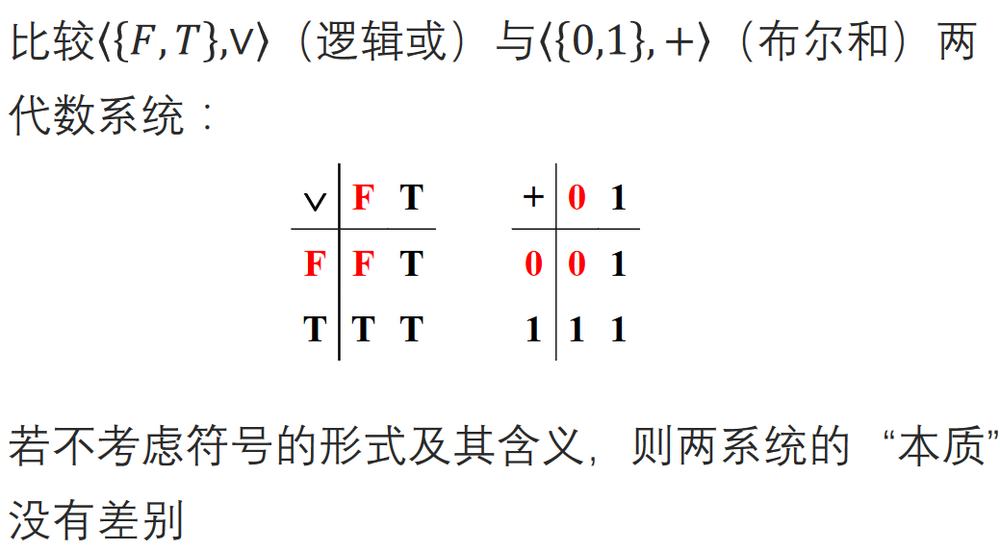

# 代数系统引论

# 运算的函数定义

$函数f:A^n\to B称为(从A到B的)n元运算,$
$主要讨论二元运算.$

$有限集合上的𝑚元运算的个数是确定的$

# 运算的封闭性

$对于运算f:A^n\to B, 若B\subseteq A, 则称该运算再集合A上封闭({\rm closeness})$

# 代数系统

* 给定1个非空集合(其元素可以是任何对象)
* 给定1个或者若干个运算(以下主要讨论存在1个二元运算的情况)
* 运算对上述集合封闭

$记法: \langle S,\circ\rangle$

$例如: \langle\mathbb{Z}, +\rangle$

# 结合性 (associativity)

$集合𝐴上的运算\circ具有结合性定义为$

$\forall x,y,z\in A, (x\circ y)\circ z = x\circ (y\circ z)$

# 交换性 (commutativity)

$集合𝐴上的运算\circ具有交换性定义为$

$\forall x,y\in A, x\circ y=y\circ x$

# 分配性 (distributivity)

$分配性涉及两个不同的运算$

$集合𝐴上的运算\circ 对*满足分配性定义为$

$\forall x,y,z\in A, x\circ (y * z) = (x\circ y)*(x\circ z)$

# 单位元 (identity element)

$对于实数集ℝ上的普通乘法(⋅), 实数1满足对任意实数𝑥∈ℝ,$
$有1⋅𝑥=𝑥⋅1$

$元素𝑒是代数系统\langle 𝑆,\circ\rangle的单位元当且仅当$
$∀𝑥∈𝑆,𝑒\circ 𝑥=𝑥\circ 𝑒=𝑥$
$单位元可记为𝟏_S, 或简记为𝟏 (读作幺)$

$n代数系统不一定有单位元$

## 左单位元和右单位元

$e_L称为系统的左单位元(或左幺)当且仅当$
$∀𝑥∈𝑆,𝑒_L\circ 𝑥=𝑥$

$e_R称为系统的右单位元(或右幺)当且仅当$
$∀𝑥∈𝑆,x\circ e_R=𝑥$

$推论: 左幺和右幺不一定存在也不一定唯一$

# 逆元 (inverse element)

$只对存在单位元的代数系统讨论逆元$

$给定系统𝑆中的元素𝑥,$
$若存在𝑆中的元素𝑥′, 满足𝑥'∘𝑥=𝟏_S, 则称𝑥′是𝑥的左逆元$
$若存在𝑥′′, 满足𝑥∘𝑥''=𝟏_S, 则称𝑥′′是𝑥的右逆元$

$给定系统𝑆中的元素𝑥, 如果存在𝑆中的元素𝑥^∗, 满足𝑥∘𝑥^∗=𝑥^∗∘𝑥=𝟏_S, 则称𝑥^∗是𝑥的逆元, 一般记为𝒙^{-1}$

$逆元既是左逆元, 又是右逆元$

$如果𝑦是𝑥的逆元, 则𝑥也是𝑦的逆元$

## 进一步讨论

$若给定元素存在左逆和右逆, 则两者必定相等且唯一$

$若每个元素均有左逆，则左逆即右逆，且逆元唯一$

# 零元

$元素𝑡是代数系统\langle 𝑆,\circ\rangle的零元当且仅当∀𝑥∈𝑆,𝑡∘𝑥=𝑥∘𝑡=𝑡$

$零元可记为𝟎_S，或简记为0$

$一个代数系统不一定存在零元$

$对于实数, 乘法存在零元, 加法不存在零元$

# 相似的系统

# 同构与同构映射

$代数系统\langle 𝑆_1,\circ\rangle与\langle 𝑆_2,*\rangle同构(isomorphism)(记为S_1\simeq S_2)$

$当且仅当存在双射函数f:S_1\to S_2, 满足$

$\forall x,y\in S_1, f(s\circ y)=f(x)*f(y)$

$其中双射函数f称作同构映射$

$同构关系是等价关系$

# 同态与同态映射

$代数系统\langle 𝑆_1,\circ\rangle与\langle 𝑆_2,*\rangle同态(homomorphism)(记为S_1\sim S_2)$

$当且仅当存在函数f:S_1\to S_2, 满足$

$\forall x,y\in S_1, f(s\circ y)=f(x)*f(y)$

$其中函数f称作同态映射$

$若f是满射函数, 则称两系统满同态$
