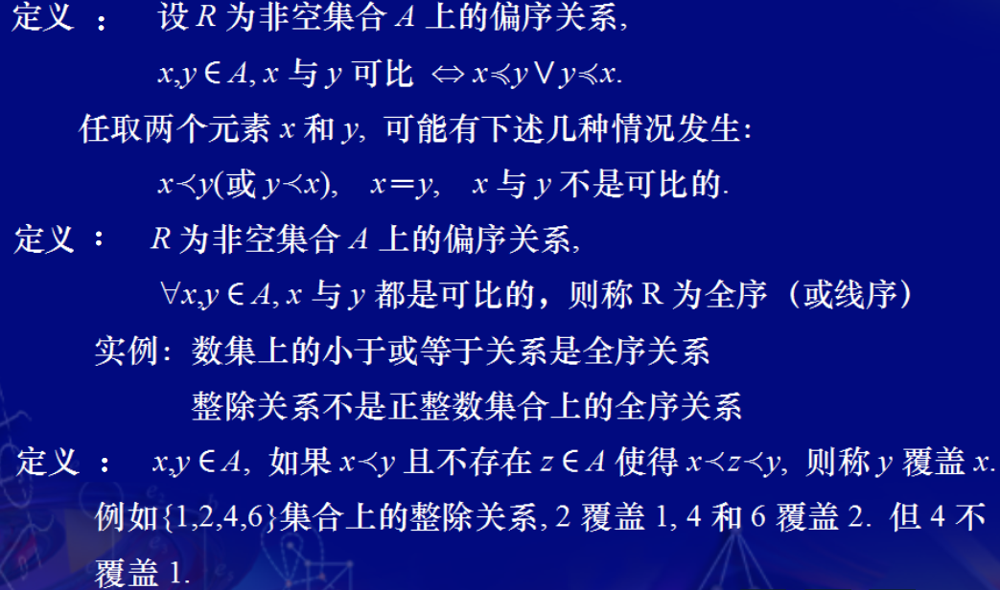
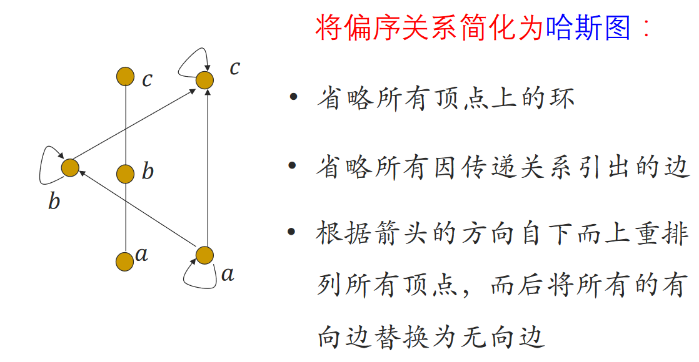
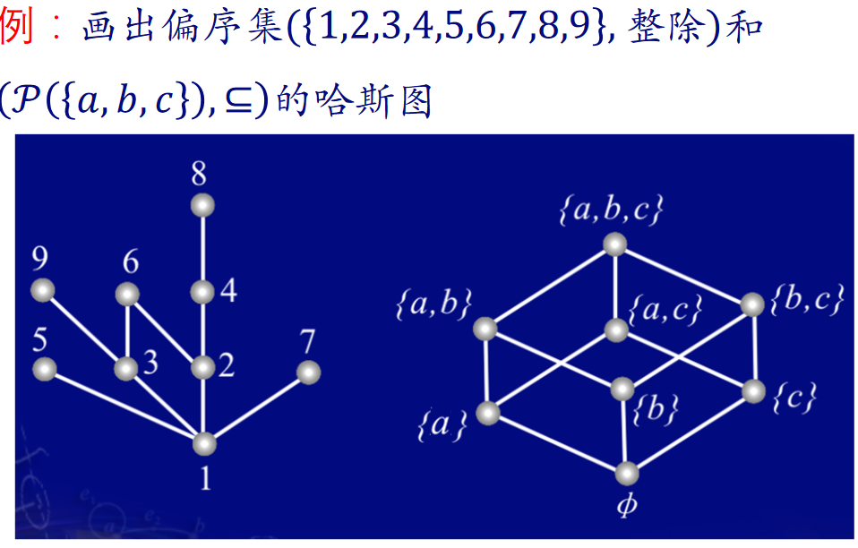
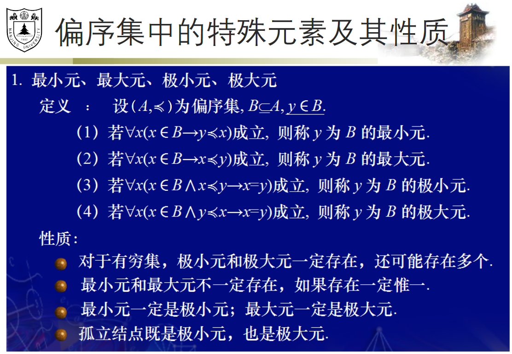
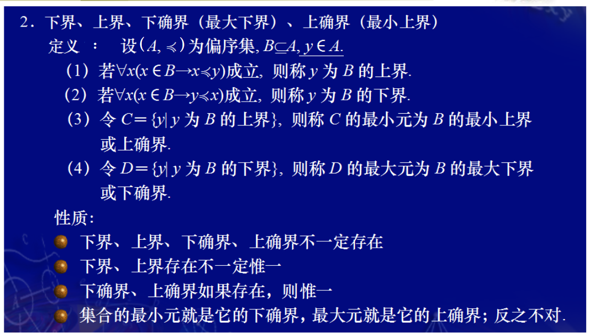
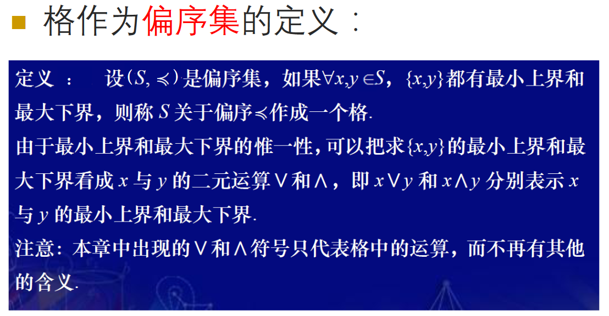
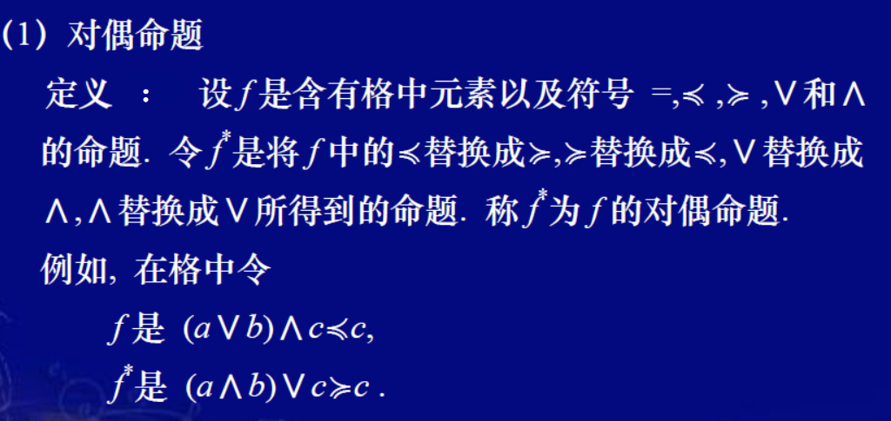

# 偏序与偏序格

群反映对称的关系, 格反映序的关系

# 偏序关系

$非空集合𝐴上的自反, 反对称和传递的关系称为𝐴上的偏序关系,记为: \preceq$
$n设\preceq为偏序关系，若(𝑎,𝑏)\in\preceq, 则记为𝑎\preceq 𝑏,$
$读作"𝑎小于或等于𝑏"$

## 相关定义

# 偏序集

$集合𝐴和𝐴上的偏序关系≼一起称为偏序集$(partially ordered set, poset)$,记作(𝐴,≼)$

# 哈斯图

$类似幂集的包含关系的哈斯图, 是一个立方体$
$但是是一维, 二维, 三维乃至多维的立方体$

# 偏序集中特殊元素的性质

# 格

格(lattice)作为一个代数系统可以通过两种方式进行定义:

* (1)通过偏序集与偏序关系定义
* (2)通过普通集合与特殊运算定义

# 格的对偶原理

